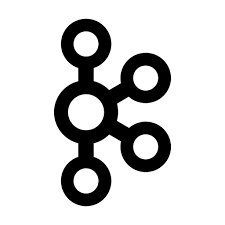

<!-- 
 -->

  <h3>开发基础</h3>
  <a href="/开发基础/GO/Go编程入门/1程序源代码基本元素介绍.html#编程和程序代码元素.html">
  
  

GO

  </a>
  <a>
  
  

PHP

  </a>
  <a href="/开发基础/面向对象需求分析与UML建模/2可视化建模技术.html">
  
  

面向对象需求分析与UML建模

  </a>
  <a href="/开发基础/开发环境与工具/VSCode/如何配置VSCode+hyperf+yasd+docker+单元测试.html">
  
  

开发环境与工具

  </a>

  <h3>数据库</h3>
  <a href="/数据库/Mysql/1视图-触发器-存储过程.html">
  
  

Mysql

  </a>
  <a href="/数据库/Elasticsearch/1Elasticsearch概述.html">
  
  

Elasticsearch

  </a>
  <a href="/数据库/Mongodb/1基本操作之CRUD.html">
  
  

Mongodb

  </a>
  <a href="/数据库/Redis/1安装.html">
  
  

Redis

  </a>

  <h3>消息队列</h3>
  <a href="https://pulsar.apache.org/docs/zh-CN/next/concepts-messaging/">
  
  

Pulsar

  </a>
  <a href="/消息队列/Kafka/1概述">
  
  

Kafka

  </a>

  <h3>系统组件与架构设计</h3>
  <a href="/系统组件与架构设计/K8S/1kubernetes 概述.html">
  
  

K8S

  </a>
  <a href="/系统组件与架构设计/Nginx/1概述.html">
  
  

Nginx

  </a>
  <!-- <a>
  
  

微服务架构

  </a> -->

<!-- 

  <h3>其它分类文章</h3>
  <a>
  
  

开发工具

  </a>

 -->

<!-- 
<h1>
文章导航
</h1>
 -->

