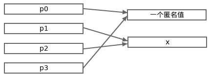

# 指针

虽然Go吸收融合了很多其语言中的各种特性，但是Go主要被归入C语言家族。其中一个重要的原因就是Go和C一样，也支持指针。 当然Go中的指针相比C指针有很多限制。本篇文章将介绍指针相关的各种概念和Go指针相关的各种细节。

## 内存地址

一个内存地址表示操作系统管理的整个内存中的一个偏移量（相对于从整个内存的起始，以字节计数）。

通常地，一个内存地址用一个操作系统原生字（native word）来存储。 一个原生字在32位操作系统上占4个字节，在64位操作系统上占8个字节。 所以，32位操作系统上的理论最大支持内存容量为4GB（1GB == 230字节），64位操作系统上的理论最大支持内存容量为264Byte，即16EB（EB：艾字节，1EB == 1024PB, 1PB == 1024TB, 1TB == 1024GB）。

内存地址的字面形式常用整数的十六进制字面量来表示，比如 `0x1234CDEF` 。

以后我们常简称内存地址为地址。

## 值的地址

一个值的地址是指此值的直接部分占据的内存的起始地址。在Go中，每个值都包含一个直接部分，但有些值可能还包含一个或多个间接部分，[下下篇](https://gfw.go101.org/article/type-system-overview.html#value-part)文章将对此详述。

## 什么是指针？

指针是Go中的一种类型分类（kind）。一个指针是某个指针类型的一个值。一个指针可以存储一个内存地址。 事实上，我们经常称一个指针为一个内存地址，或者称一个内存地址为一个指针。

通常地，一个指针中存储的内存地址为另外一个值的地址。和C指针不一样，为了安全起见，Go指针有很多限制，详见下面的章节。

## 指针类型和值

在Go中，一个非定义指针类型的字面形式为 `*T` ，其中 `T` 为一个任意类型。类型 `T` 称为指针类型 `*T` 的基类型（base type）。 如果一个指针类型的基类型为 `T` ，则我们可以称此指针类型为一个 `T` 指针类型。

虽然我们可以声明定义指针类型，但是一般不推荐这么做。非定义指针类型的可读性更高。

如果一个指针类型的[底层类型](https://gfw.go101.org/article/type-system-overview.html#underlying-type)是 `*T` ，则它的基类型为 `T` 。

如果两个非定义指针类型的基类型为同一类型，则这两个非定义指针类型亦为同一类型。

一些指针类型的例子：

``` go
*int  // 一个基类型为int的非定义指针类型。
**int // 一个多级非定义指针类型，它的基类型为*int。

type Ptr *int // Ptr是一个定义的指针类型，它的基类型为int。
type PP *Ptr  // PP是一个定义的多级指针类型，它的基类型为Ptr。
```

指针类型的零值的字面量使用预声明的 `nil` 来表示。一个nil指针（常称为空指针）中不存储任何地址。

如果一个指针类型的基类型为 `T` ，则此指针类型的值只能存储类型为 `T` 的值的地址。

## 关于引用（reference）这个术语

在《Go语言101》中，术语“引用”暗示着一个关系。比如，如果一个指针中存储着另外一个值的地址，则我们可以说此指针值引用着另外一个值；同时另外一个值当前至少有一个引用。 本书对此术语的使用和Go白皮书是一致的。

当一个指针引用着另外一个值，我们也常说此指针指向另外一个值。

## 如何获取一个指针值？

有两种方式来得到一个指针值：

1. 我们可以用内置函数`new`来为任何类型的值开辟一块内存并将此内存块的起始地址做为此值的地址返回。 假设`T`是任一类型，则函数调用`new(T)`返回一个类型为`*T`的指针值。 存储在返回指针值所表示的地址处的值（可被看作是一个匿名变量）为`T`的零值。
2. 我们也可以使用前置取地址操作符`&`来获取一个可寻址的值的地址。 对于一个类型为`T`的可寻址的值`t`，我们可以用`&t`来取得它的地址。`&t`的类型为`*T`。

一般说来，一个可寻址的值是指被放置在内存中某固定位置处的一个值（但放置在某固定位置处的一个值并非一定是可寻址的）。 目前，我们只需知道所有变量都是可以寻址的；但是所有常量、函数返回值和强制转换结果都是不可寻址的。 当一个变量被声明的时候，Go运行时将为此变量开辟一段内存。此内存的起始地址即为此变量的地址。

更多可被（或不可被）寻址的值将在以后的文章中逐渐提及。 如果你已经对Go比较熟悉，你可以阅读[此条总结](https://gfw.go101.org/article/summaries.html#not-addressable)来了解在Go中哪些值可以或不可以被寻址。

下一节中的例子将展示如何获取一些值的地址。

## 指针（地址）解引用

我们可以使用前置解引用操作符 `*` 来访问存储在一个指针所表示的地址处的值（即此指针所引用着的值）。 比如，对于基类型为 `T` 的指针类型的一个指针值 `p` ，我们可以用 `*p` 来表示地址 `p` 处的值。 此值的类型为 `T` 。 `*p` 称为指针 `p` 的解引用。解引用是取地址的逆过程。

解引用一个nil指针将产生一个[恐慌](https://gfw.go101.org/article/control-flows-more.html#panic-recover)。

下面这个例子展示了如何取地址和解引用。

``` go
package main

import "fmt"

func main() {
	p0 := new(int)   // p0指向一个int类型的零值
	fmt.Println(p0)  // （打印出一个十六进制形式的地址）
	fmt.Println(*p0) // 0

	x := *p0              // x是p0所引用的值的一个复制。
	p1, p2 := &x, &x      // p1和p2中都存储着x的地址。
	                      // x、*p1和*p2表示着同一个int值。
	fmt.Println(p1 == p2) // true
	fmt.Println(p0 == p1) // false
	p3 := &*p0            // <=> p3 := &(*p0)
	                      // <=> p3 := p0
	                      // p3和p0中存储的地址是一样的。
	fmt.Println(p0 == p3) // true
	*p0, *p1 = 123, 789
	fmt.Println(*p2, x, *p3) // 789 789 123

	fmt.Printf("%T, %T \n", *p0, x) // int, int
	fmt.Printf("%T, %T \n", p0, p1) // *int, *int
}
```

下面这张图描绘了上面这个例子中各个值之间的关系。



## 我们为什么需要指针？

让我们先看一个例子：

``` go
package main

import "fmt"

func double(x int) {
	x += x
}

func main() {
	var a = 3
	double(a)
	fmt.Println(a) // 3
}
```

我们本期望上例中的 `double` 函数将变量 `a` 的值放大为原来的两倍，但是事实证明我们的期望没有得到实现。 为什么呢？因为在Go中，所有的赋值（包括函数调用传参）过程都是一个值复制过程。 所以在上面的 `double` 函数体内修改的是变量 `a` 的一个副本，而没有修改变量 `a` 本身。

当然我们可以让 `double` 函数返回输入参数的两倍数，但是此方法并非适用于所有场合。 下面这个例子通过将输入参数的类型改为一个指针类型来达到同样的目的。

``` go
package main

import "fmt"

func double(x *int) {
	*x += *x
	x = nil // 此行仅为讲解目的
}

func main() {
	var a = 3
	double(&a)
	fmt.Println(a) // 6
	p := &a
	double(p)
	fmt.Println(a, p == nil) // 12 false
}
```

从上例可以看出，通过将 `double` 函数的输入参数的类型改为 `*int` ，传入的实参 `&a` 和它在此函数体内的一个副本 `x` 都引用着变量 `a` 。 所以对 `*x` 的修改等价于对 `*p` （也就是变量 `a` ）的修改。 换句话说，新版本的 `double` 函数内的操作可以反映到此函数外了。

当然，在此函数体内对传入的指针实参的修改 `x = nil` 依旧不能反映到函数外，因为此修改发生在此指针的一个副本上。 所以在 `double` 函数调用之后，局部变量 `p` 的值并没有被修改为 `nil` 。

简而言之，指针提供了一种间接的途径来访问和修改一些值。 虽然很多语言中没有指针这个概念，但是指针被隐藏其它概念之中。

## 在Go中返回一个局部变量的地址是安全的

和C不一样，Go是支持垃圾回收的，所以一个函数返回其内声明的局部变量的地址是绝对安全的。比如：

``` go
func newInt() *int {
	a := 3
	return &a
}
```

## Go指针的一些限制

为了安全起见，Go指针在使用上相对于C指针有很多限制。 通过施加这些限制，Go指针保留了C指针的好处，同时也避免了C指针的危险性。

### Go指针不支持算术运算

在Go中，指针是不能参与算术运算的。比如，对于一个指针 `p` ， 运算 `p++` 和 `p-2` 都是非法的。

如果 `p` 为一个指向一个数值类型值的指针， `*p++` 将被编译器认为是合法的并且等价于 `(*p)++` 。 换句话说，解引用操作符 `*` 的优先级都高于自增 `++` 和自减 `--` 操作符。

例子：

``` go
package main

import "fmt"

func main() {
	a := int64(5)
	p := &a

	// 下面这两行编译不通过。
	/*
	p++
	p = (&a) + 8
	*/

	*p++
	fmt.Println(*p, a)   // 6 6
	fmt.Println(p == &a) // true

	*&a++
	*&*&a++
	**&p++
	*&*p++
	fmt.Println(*p, a) // 10 10
}
```

### 一个指针类型的值不能被随意转换为另一个指针类型

在Go中，只有如下某个条件被满足的情况下，一个类型为 `T1` 的指针值才能被显式转换为另一个指针类型 `T2` ：

1. 类型`T1`和`T2`的底层类型必须一致（忽略结构体字段的标签）。 特别地，如果类型`T1`和`T2`中只要有一个是[非定义类型](https://gfw.go101.org/article/type-system-overview.html#non-defined-type)并且它们的底层类型一致（考虑结构体字段的标签），则此转换可以是隐式的。 关于结构体，请参阅[下一篇文章](https://gfw.go101.org/article/struct.html)。
2. 类型`T1`和`T2`都为非定义类型并且它们的基类型的底层类型一致（忽略结构体字段的标签）。

比如，

``` go
type MyInt int64
type Ta    *int64
type Tb    *MyInt
```

对于上面所示的这些指针类型，下面的事实成立：

1. 类型`*int64`的值可以被隐式转换到类型`Ta`，反之亦然（因为它们的底层类型均为`*int64`）。
2. 类型 `*MyInt`的值可以被隐式转换到类型`Tb`，反之亦然（因为它们的底层类型均为`*MyInt`）。
3. 类型`*MyInt`的值可以被显式转换为类型`*int64`，反之亦然（因为它们都是非定义的并且它们的基类型的底层类型均为`int64`）。
4. 类型`Ta`的值不能直接被转换为类型`Tb`，即使是显式转换也是不行的。 但是，通过上述三条事实，通过三层显式转换`Tb((*MyInt)((*int64)(ta)))`，一个类型为`Ta`的值`ta`可以被间接地转换为类型`Tb`。

这些指针类型的任何值都无法被转换到类型 `*uint64` 。

### 一个指针值不能和其它任一指针类型的值进行比较

Go指针值是支持（使用比较运算符 `==` 和 `!=` ）比较的。 但是，两个指针只有在下列任一条件被满足的时候才可以比较：

1. 这两个指针的类型相同。
2. 其中一个指针可以被隐式转换为另一个指针的类型。换句话说，这两个指针的类型的底层类型必须一致并且其中一个指针类型为非定义的（考虑结构体字段的标签）。
3. 其中一个并且只有一个指针用类型不确定的`nil`标识符表示。

例子：

``` go
package main

func main() {
	type MyInt int64
	type Ta    *int64
	type Tb    *MyInt

	// 4个不同类型的指针：
	var pa0 Ta
	var pa1 *int64
	var pb0 Tb
	var pb1 *MyInt

	// 下面这6行编译没问题。它们的比较结果都为true。
	_ = pa0 == pa1
	_ = pb0 == pb1
	_ = pa0 == nil
	_ = pa1 == nil
	_ = pb0 == nil
	_ = pb1 == nil

	// 下面这三行编译不通过。
	/*
	_ = pa0 == pb0
	_ = pa1 == pb1
	_ = pa0 == Tb(nil)
	*/
}
```

### 一个指针值不能被赋值给其它任意类型的指针值

一个指针值可以被赋值给另一个指针值的条件和这两个指针值可以比较的条件（见上一小节）是一致的。

## 上述Go指针的限制是可以被打破的

[ `unsafe` 标准库包](https://gfw.go101.org/article/unsafe.html)中提供的非类型安全指针（ `unsafe. Pointer` ）机制可以被用来打破上述Go指针的安全限制。 `unsafe. Pointer` 类型类似于C语言中的 `void*` 。 但是，通常地，非类型安全指针机制不推荐在Go日常编程中使用。
