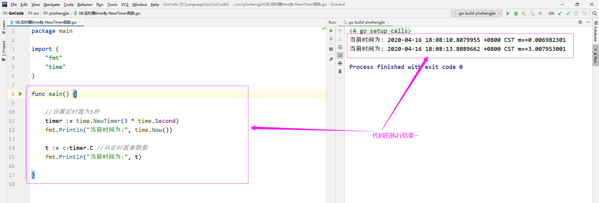
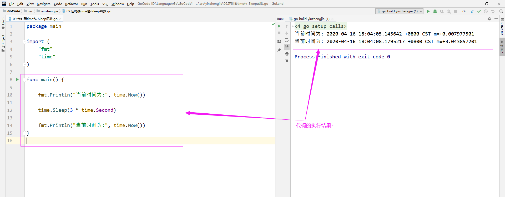
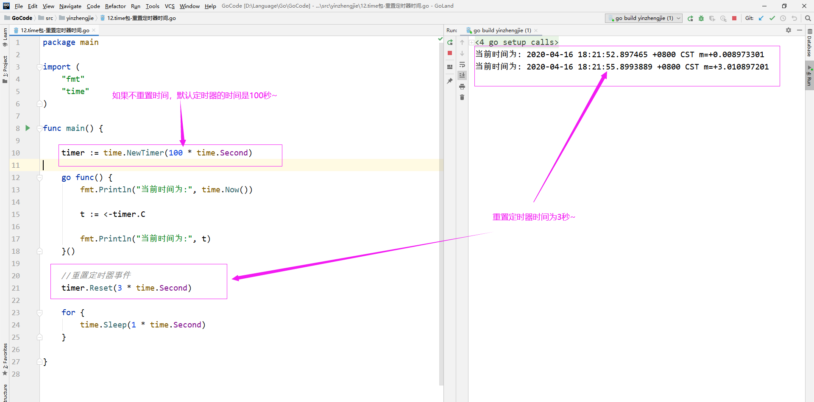
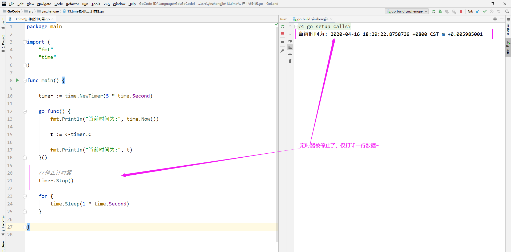
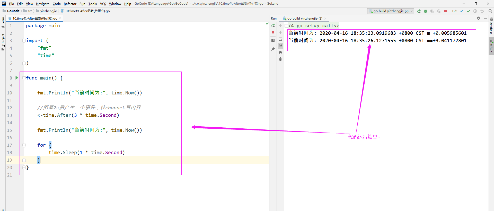
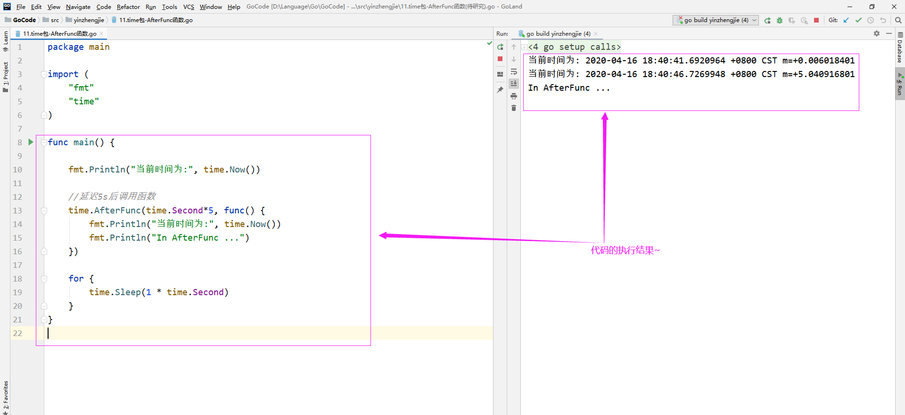

# 基础-Golang的time. NewTimer单次定时器使用案例

## 通过NewTimer函数定义定时器

[](javascript:void(0); )

``` 

package main

import (
    "fmt"
    "time"
)

func main() {

    //设置定时器为3秒
    timer := time.NewTimer(3 * time.Second)
    fmt.Println("当前时间为:", time.Now())

    t := <-timer.C //从定时器拿数据
    fmt.Println("当前时间为:", t)
}
```

[](javascript:void(0); )



 

## Sleep函数(阻塞程序运行)

[](javascript:void(0); )

``` 

package main

import (
    "fmt"
    "time"
)

func main() {

    fmt.Println("当前时间为:", time.Now())

    time.Sleep(3 * time.Second)

    fmt.Println("当前时间为:", time.Now())
}
```

[](javascript:void(0); )



 

## 重置定时器时间

[](javascript:void(0); )

``` 

package main

import (
    "fmt"
    "time"
)

func main() {

    timer := time.NewTimer(100 * time.Second)

    go func() {
        fmt.Println("当前时间为:", time.Now())

        t := <-timer.C

        fmt.Println("当前时间为:", t)
    }()

    //重置定时器时间
    timer.Reset(3 * time.Second)

    for {
        time.Sleep(1 * time.Second)
    }

}
```

[](javascript:void(0); )



 

## 停止计时器

[](javascript:void(0); )

``` 

package main

import (
    "fmt"
    "time"
)

func main() {

    timer := time.NewTimer(5 * time.Second)

    go func() {
        fmt.Println("当前时间为:", time.Now())

        t := <-timer.C

        fmt.Println("当前时间为:", t)
    }()

    //停止计时器
    timer.Stop()

    for {
        time.Sleep(1 * time.Second)
    }

}
```

[](javascript:void(0); )



 

## After函数实现延迟功能

[](javascript:void(0); )

``` 

package main

import (
    "fmt"
    "time"
)

func main() {

    fmt.Println("当前时间为:", time.Now())

    //阻塞2s后产生一个事件，往channel写内容
    <-time.After(3 * time.Second)

    fmt.Println("当前时间为:", time.Now())

    for {
        time.Sleep(1 * time.Second)
    }
}
```

[](javascript:void(0); )



 

## AfterFunc函数

[](javascript:void(0); )

``` 

package main

import (
    "fmt"
    "time"
)

func main() {

    fmt.Println("当前时间为:", time.Now())

    //延迟5s后调用函数
    time.AfterFunc(time.Second*5, func() {
        fmt.Println("当前时间为:", time.Now())
        fmt.Println("In AfterFunc ...")
    })

    for {
        time.Sleep(1 * time.Second)
    }
}
```

[](javascript:void(0); )


