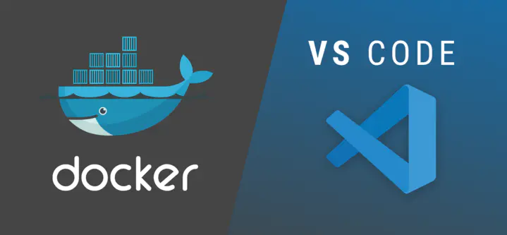
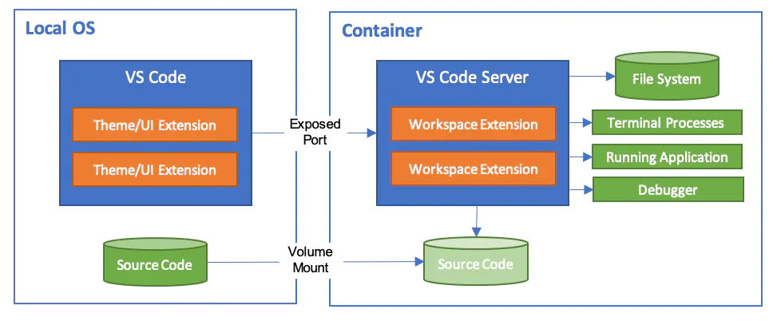
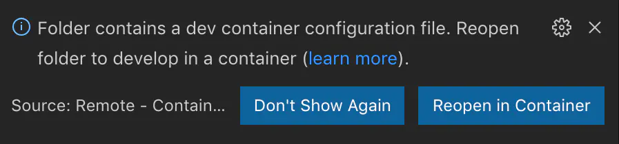
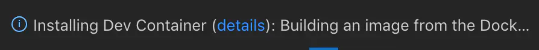
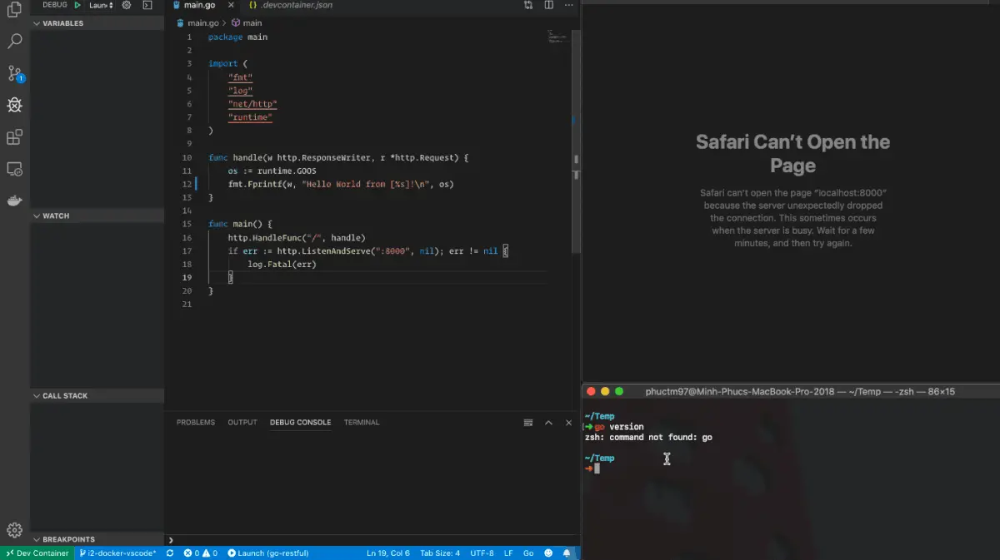
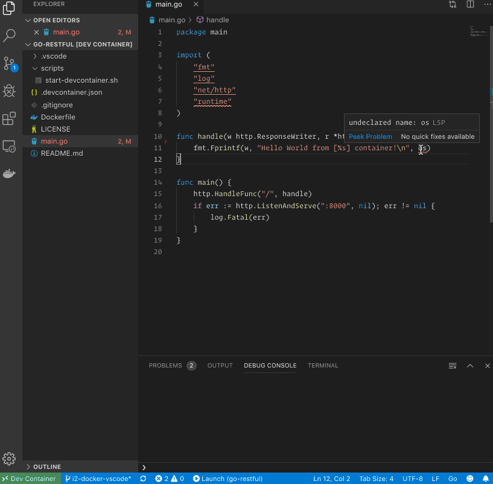
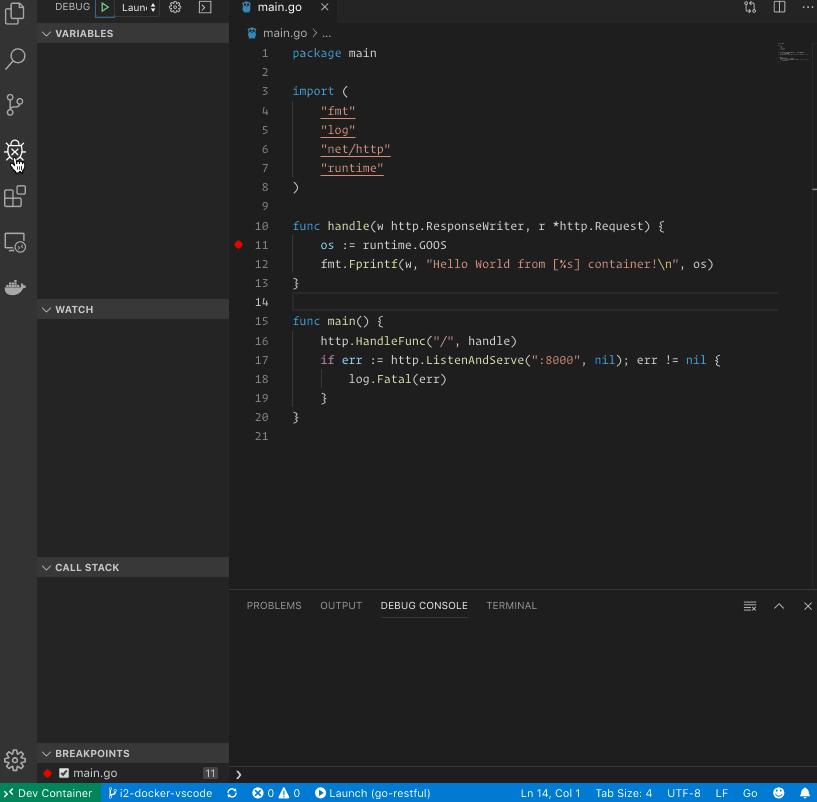
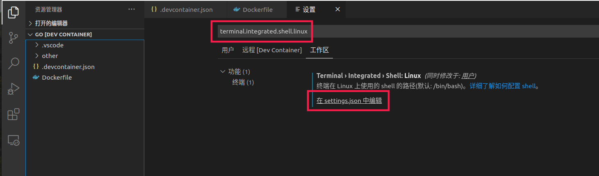
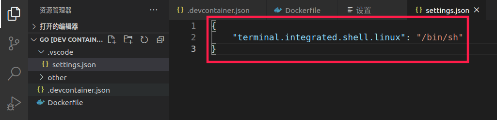

# Docker和VS Code的Go开发环境



# 注意事项

当我研究这个目标的解决方案时，我有点担心，因为它很大程度上依赖于代码编辑器/ IDE的供应商在容器内工作。幸运的是，有两个受欢迎的编辑器支持这一点：GoLand和VS Code。

GoLand支持看起来非常成熟，因为它已经存在了一段时间（源自IntelliJ）。但是，此功能仅适用于购买的版本。

VS Code Remote-Containers扩展程序刚刚发布，因此它没有GoLand那么成熟。尽管如此，该扩展程序是由Microsoft（非开源）正式开发和维护的，并计划在很多未来的服务中用作Web伴侣IDE或云IDE - 因此它非常有前途。在撰写本文时，功能集看起来也足以启动。我们来看看VS Code吧。

显然，我们可以直接在容器中使用Vim并在其中安装很棒的插件。然而，这将是我的最后一次考虑，因为我不仅为我而且为我的团队（以及你的团队）设置了这个，而且Vim的学习曲线对于大多数开发人员而言非常沉重。

------

# VS Code远程容器

## 概念

VS Code Remote-Containers是一个扩展，可以帮助开发人员正常使用他们的VSC ode UI，但所有命令和操作都在容器内传播和执行。它实际上就像你是TeamViewer进入容器并在其中使用VS Code。



VS Code的实现非常强大且抽象，大多数扩展仍然可以正常工作。

有了这个概念，我们可以将环境容纳在几乎所有类型的开发中，而不仅仅是Go。

## 详细

安装[VS Code Remote-Containers](https://links.jianshu.com/go?to=https%3A%2F%2Fmarketplace.visualstudio.com%2Fitems%3FitemName%3Dms-vscode-remote.remote-containers)扩展。

`Dockerfile` 使用运行和调试应用程序所需的包和工具来编写定义图像。

`.devcontainer.json` 在工作区根目录（旁边 `.vscode` ）创建一个引用 `Dockerfile` 。

``` json
{
   "dockerFile": "Dockerfile",
   "extensions": [ 
      "ms-vscode.go" 
   ]
}
```

`.devcontainer.json` 使用VS Code 打开包含文件的文件夹。VS Code将自动检测它并要求您以容器模式打开项目。



然后，VSCode将根据您 `Dockerfile` （仅在第一次）构建您的图像，并将设置一些额外的必需包，以便它可以容器化地工作。



完成此过程后，您现在可以正常使用VS Code，并且所有内容都实际在容器内运行。



像上面的例子一样，我甚至没有 `go` 在本地机器上运行，但我仍然可以从我的VS代码执行Go代码，并且可以从Safari访问服务器。一切都在容器内完成。

------

# 实现

按照上面提到的概念和配方，我创建了一个 `Dockerfile` 。

go dockerfile官网：https://github.com/docker-library/golang

``` csharp
#
# NOTE: THIS DOCKERFILE IS GENERATED VIA "apply-templates.sh"
#
# PLEASE DO NOT EDIT IT DIRECTLY.
#

FROM alpine:3.13

RUN apk add --no-cache \
		ca-certificates

# set up nsswitch.conf for Go's "netgo" implementation
# - https://github.com/golang/go/blob/go1.9.1/src/net/conf.go#L194-L275
# - docker run --rm debian:stretch grep '^hosts:' /etc/nsswitch.conf
RUN [ ! -e /etc/nsswitch.conf ] && echo 'hosts: files dns' > /etc/nsswitch.conf

ENV PATH /usr/local/go/bin:$PATH

ENV GOLANG_VERSION 1.16rc1

RUN set -eux; \
	apk add --no-cache --virtual .build-deps \
		bash \
		gcc \
		gnupg \
		go \
		musl-dev \
		openssl \
	; \
	export \
# set GOROOT_BOOTSTRAP such that we can actually build Go
		GOROOT_BOOTSTRAP="$(go env GOROOT)" \
# ... and set "cross-building" related vars to the installed system's values so that we create a build targeting the proper arch
# (for example, if our build host is GOARCH=amd64, but our build env/image is GOARCH=386, our build needs GOARCH=386)
		GOOS="$(go env GOOS)" \
		GOARCH="$(go env GOARCH)" \
		GOHOSTOS="$(go env GOHOSTOS)" \
		GOHOSTARCH="$(go env GOHOSTARCH)" \
	; \
# also explicitly set GO386 and GOARM if appropriate
# https://github.com/docker-library/golang/issues/184
	apkArch="$(apk --print-arch)"; \
	case "$apkArch" in \
		armhf) export GOARM='6' ;; \
		armv7) export GOARM='7' ;; \
		x86) export GO386='softfloat' ;; \
	esac; \
	\
# https://github.com/golang/go/issues/38536#issuecomment-616897960
	url='https://storage.googleapis.com/golang/go1.16rc1.src.tar.gz'; \
	sha256='6a33569f9d0d21db31614086cc2a4f0fbc683b41c1c53fb512a1341ce5763ff5'; \
	\
	wget -O go.tgz.asc "$url.asc"; \
	wget -O go.tgz "$url"; \
	echo "$sha256 *go.tgz" | sha256sum -c -; \
	\
# https://github.com/golang/go/issues/14739#issuecomment-324767697
	export GNUPGHOME="$(mktemp -d)"; \
# https://www.google.com/linuxrepositories/
	gpg --batch --keyserver ha.pool.sks-keyservers.net --recv-keys 'EB4C 1BFD 4F04 2F6D DDCC EC91 7721 F63B D38B 4796'; \
	gpg --batch --verify go.tgz.asc go.tgz; \
	gpgconf --kill all; \
	rm -rf "$GNUPGHOME" go.tgz.asc; \
	\
	tar -C /usr/local -xzf go.tgz; \
	rm go.tgz; \
	\
	goEnv="$(go env | sed -rn -e '/^GO(OS|ARCH|ARM|386)=/s//export \0/p')"; \
	eval "$goEnv"; \
	[ -n "$GOOS" ]; \
	[ -n "$GOARCH" ]; \
	( \
		cd /usr/local/go/src; \
		./make.bash; \
	); \
	\
	apk del --no-network .build-deps; \
	\
# pre-compile the standard library, just like the official binary release tarballs do
	go install std; \
# go install: -race is only supported on linux/amd64, linux/ppc64le, linux/arm64, freebsd/amd64, netbsd/amd64, darwin/amd64 and windows/amd64
#	go install -race std; \
	\
# remove a few intermediate / bootstrapping files the official binary release tarballs do not contain
	rm -rf \
		/usr/local/go/pkg/*/cmd \
		/usr/local/go/pkg/bootstrap \
		/usr/local/go/pkg/obj \
		/usr/local/go/pkg/tool/*/api \
		/usr/local/go/pkg/tool/*/go_bootstrap \
		/usr/local/go/src/cmd/dist/dist \
	; \
	\
	go version

ENV GOPATH /go
ENV PATH $GOPATH/bin:$PATH
RUN mkdir -p "$GOPATH/src" "$GOPATH/bin" && chmod -R 777 "$GOPATH"
WORKDIR $GOPATH
```

图像基于官方 `golang` 图像，因此可以 `go` 正常支持。然后我安装了Go VS Code扩展所需的一些工具，以便能够实现IntelliSense，linting和调试功能。

然后我写了一个 `.devcontainer.json` 文件。

``` json
{
    "dockerFile": "Dockerfile",
    "appPort": [
        "8000:8000"
    ],
    "runArgs": [
        "-v",
        "/home/colin/project/learn/go101:/go/src",
    ],
    "extensions": [
        "ms-vscode.go"
    ],
    "workspaceFolder":"/go",
    "settings": {
        "terminal.integrated.shell.linux": "/bin/sh"
    },
}
```

它只是引用我的 `Dockerfile` 并列出了VS Code应该安装到附加容器中的所有扩展。它还设置从本地计算机到容器的端口映射，反之亦然，这样我就可以直接从浏览器测试我的应用程序。

------

# 结果

我能够编写具有所有IntelliSense功能的代码，例如自动完成，自动导入，代码导航等。



我能够在本地计算机上安装Go运行时运行应用程序。感谢端口映射，我还可以从Safari测试我的应用程序。


我能够使用Go V SCode扩展支持的强大调试功能。



------

# 注意

本文选用alpine系统做演示，如果出现默认终端/bin/bash 不存在，按下图修改



``` 

terminal.integrated.shell.linux
```



``` 

{
     "terminal.integrated.shell.linux": "/bin/sh"
}
```

# 限制

我几乎拥有我需要的一切; 但是，仍然有一些限制，我觉得有点烦人：

* 我必须解决一些问题才能使用VS Code git push命令，因为它需要我的SSH凭据绑定到容器
* 我不能使用VS Code git commit命令GPG签署我的提交，因为它需要相当多的工作才能将GPG命令从容器转发到主机

------

# 总结

尽管仍然存在一些局限性，但我能够解决[这里](https://links.jianshu.com/go?to=https%3A%2F%2Fgithub.com%2Fthe-evengers%2Fgo-restful%2Fprojects%2F1%23card-26142625)定义的史诗[，](https://links.jianshu.com/go?to=https%3A%2F%2Fgithub.com%2Fthe-evengers%2Fgo-restful%2Fprojects%2F1%23card-26142625)并拥有一个具有本地质量开发经验的全时集装箱化开发环境。

感谢微软的这一救命功能!
