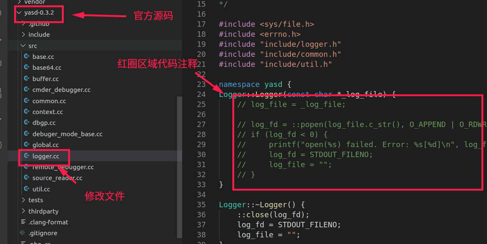
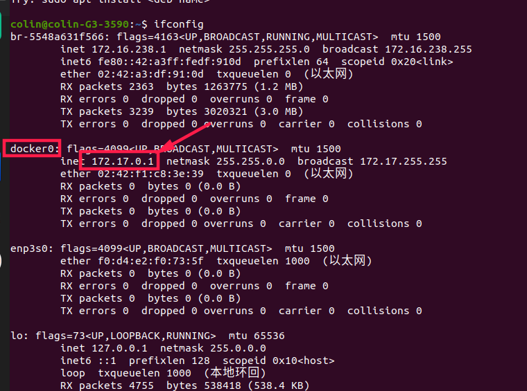
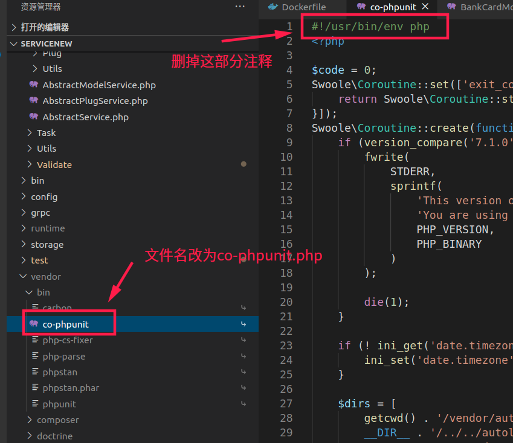
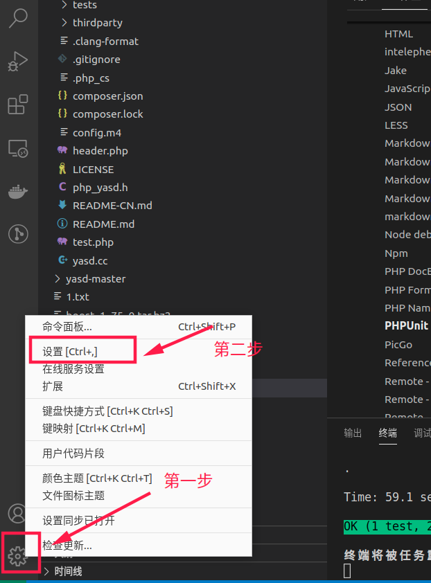
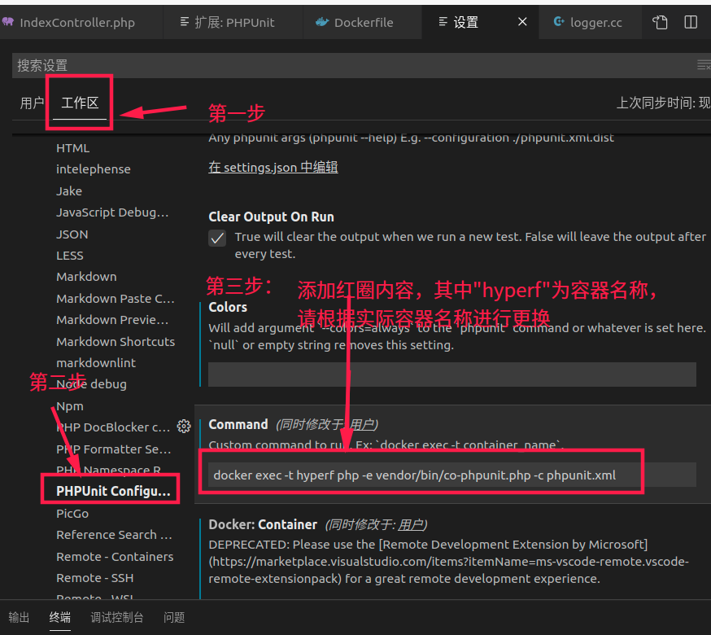
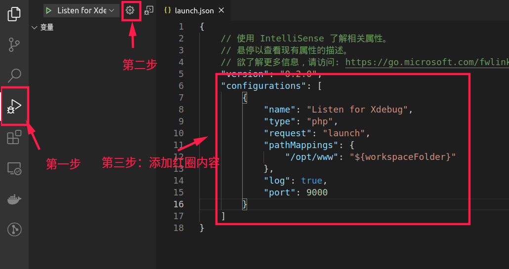
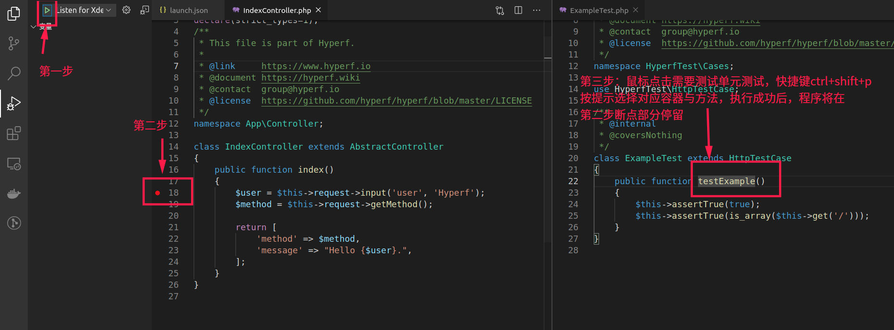
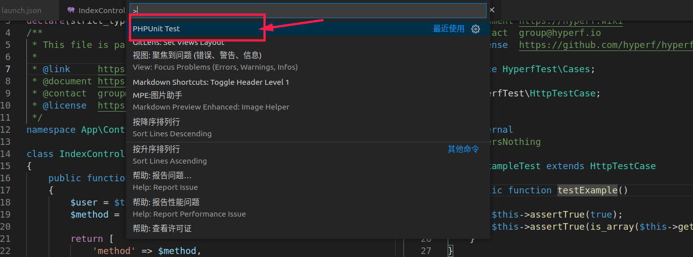
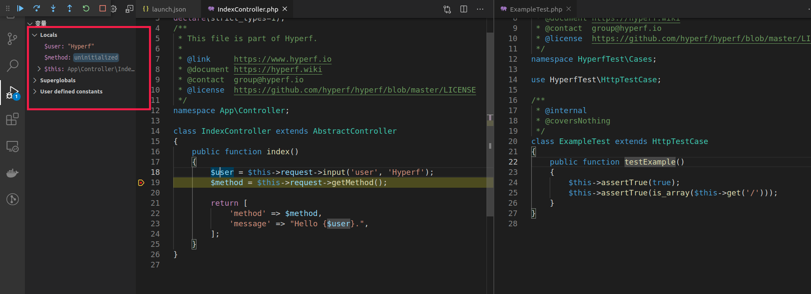

# 如何配置VSCode+hyperf+yasd+docker+单元测试

## 前言

`swoole` 新的断点调试工具 `yasd` 可以完美支持协程进行断点，提高开发调试效率。避免php传统调试方法 `var_dump(),echo` 这种代码入侵性强，调试效率低的方式

### yasd

本文中使用docker容器系统为alpine，在改系统编译yasd会报错，所以需要修改下

PS: 小编已上传修改后的源码到 `github` : https://github.com/1206589598Colin/yasd

### docker

本文使用的是hyperf官方的Dockerfile文件，安装yasd的安装进行修改

完整Dockerfile：

``` yaml
# Default Dockerfile
#
# @link     https://www.hyperf.io
# @document https://hyperf.wiki
# @contact  group@hyperf.io
# @license  https://github.com/hyperf-cloud/hyperf/blob/master/LICENSE

FROM hyperf/hyperf:7.4-alpine-v3.11-cli
LABEL maintainer="Hyperf Developers <group@hyperf.io>" version="1.0" license="MIT" app.name="Hyperf"

##
# ---------- env settings ----------
##
# --build-arg timezone=Asia/Shanghai
ARG timezone

ENV TIMEZONE=${timezone:-"Asia/Shanghai"} \
    COMPOSER_VERSION=1.10.10 \
    APP_ENV=prod \
    SCAN_CACHEABLE=(true)

# update
RUN set -ex \
    # install composer
    && wget -nv -O /usr/local/bin/composer https://github.com/composer/composer/releases/download/${COMPOSER_VERSION}/composer.phar \
    && chmod u+x /usr/local/bin/composer \
    # php info
    && php -v \
    && php -m \
    # ---------- clear works ----------
    && rm -rf /var/cache/apk/* /tmp/* /usr/share/man \
    && echo -e "\033[42;37m Build Completed :).\033[0m\n"

ENV PHPIZE_DEPS="autoconf dpkg-dev dpkg file g++ gcc libc-dev make php7-dev php7-pear pkgconf re2c pcre-dev pcre2-dev zlib-dev libtool automake" \
    YASD_VERSION=0.3.2 \
    REMOTE_HOST=172.17.0.1
    
# update
RUN set -ex \
    && apk update \
    && apk add --no-cache libstdc++ openssl git bash \
    && apk add --no-cache $PHPIZE_DEPS libaio-dev openssl-dev \
    && ln -s /usr/bin/phpize7 /usr/local/bin/phpize \
    && ln -s /usr/bin/php-config7 /usr/local/bin/php-config \
    && apk add --no-cache boost-dev \
    && wget -P /usr/local/src https://github.com/1206589598Colin/yasd/archive/${YASD_VERSION}.tar.gz \
    && cd /usr/local/src \
    && tar -xzf ${YASD_VERSION}.tar.gz \
    && cd /usr/local/src/yasd-${YASD_VERSION} \
    && phpize --clean && phpize && ./configure && make clean && make && make install \
    && touch /etc/php7/conf.d/20_yasd.ini \
    && echo -e "zend_extension=yasd\nyasd.debug_mode=remote\nyasd.remote_host=${REMOTE_HOST}\nyasd.remote_port=9000" > /etc/php7/conf.d/20_yasd.ini \
    && rm -rf /usr/local/src/*

WORKDIR /opt/www

# Composer Cache
# COPY ./composer.* /opt/www/
# RUN composer install --no-dev --no-scripts

COPY . /opt/www
RUN composer install --no-dev -o && php bin/hyperf.php

EXPOSE 9501

ENTRYPOINT ["php", "/opt/www/bin/hyperf.php", "start"]

```

修改部分

``` 

ENV PHPIZE_DEPS="autoconf dpkg-dev dpkg file g++ gcc libc-dev make php7-dev php7-pear pkgconf re2c pcre-dev pcre2-dev zlib-dev libtool automake" \
    YASD_VERSION=0.3.2 \
    REMOTE_HOST=172.17.0.1
    
# update
RUN set -ex \
    && apk update \
    && apk add --no-cache libstdc++ openssl git bash \
    && apk add --no-cache $PHPIZE_DEPS libaio-dev openssl-dev \
    && ln -s /usr/bin/phpize7 /usr/local/bin/phpize \
    && ln -s /usr/bin/php-config7 /usr/local/bin/php-config \
    && apk add --no-cache boost-dev \
    && wget -P /usr/local/src https://github.com/1206589598Colin/yasd/archive/${YASD_VERSION}.tar.gz \
    && cd /usr/local/src \
    && tar -xzf ${YASD_VERSION}.tar.gz \
    && cd /usr/local/src/yasd-${YASD_VERSION} \
    && phpize --clean && phpize && ./configure && make clean && make && make install \
    && touch /etc/php7/conf.d/20_yasd.ini \
    && echo -e "zend_extension=yasd\nyasd.debug_mode=remote\nyasd.remote_host=${REMOTE_HOST}\nyasd.remote_port=9000" > /etc/php7/conf.d/20_yasd.ini \
    && rm -rf /usr/local/src/*
```

注意点：

* REMOTE_HOST为宿主机docker的ip地址，查看方式



### hyperf



### vs code

所需安装插件： `PHPUnit` ， `PHP Debug` ， `docker`

配置：

命令： `docker exec -t hyperf php -e vendor/bin/co-phpunit.php -c phpunit.xml`



配置调试文件： `launch.json`



**launch.json**

``` json
{
    "version": "0.2.0",
    "configurations": [
        {
            "name": "Listen for Xdebug",
            "type": "php",
            "request": "launch",
            "pathMappings": {
                "/opt/www": "${workspaceFolder}"
            },
            "log": true,
            "port": 9000
        }
    ]
}

```

### 结尾

配置到这里恭喜你，已经大功告成, 让我们来试一下吧


第三步注意点：ctrl+shift+p后上方出现弹出，请选择 `phpunit Test`



执行结果：

