# UML 2概念模型

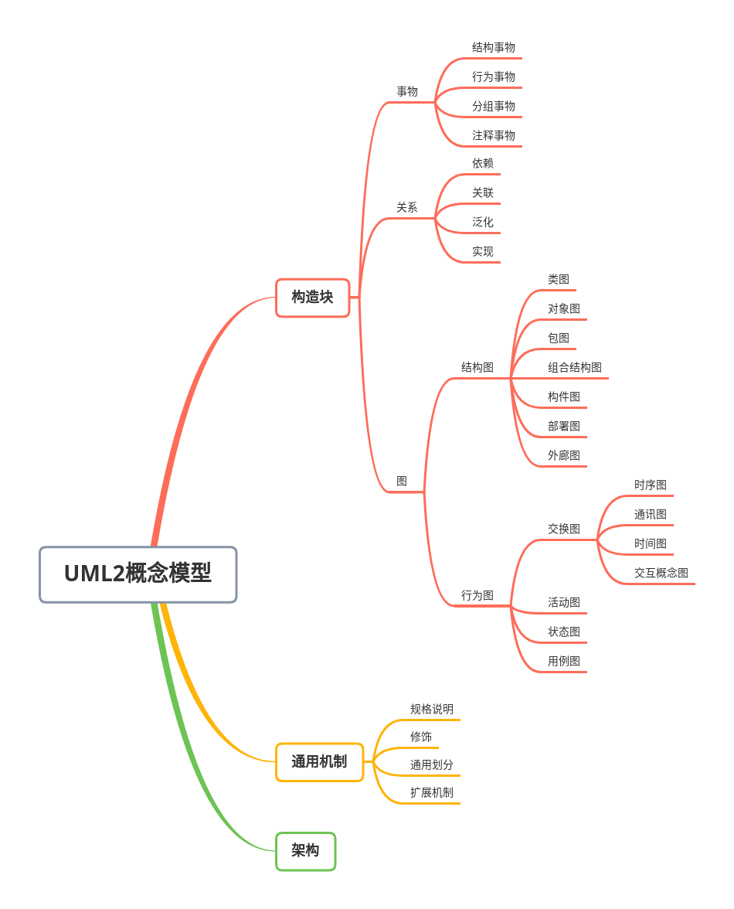

## 组成部分

 UML概念模型主要由三部分组成

 * `基本的构造块`

 * `运用于这些构造块的通用机制`

 * `组织UML视图的架构`

### 构造块

构造块是指UML的基本建模元素，包括一下

* `事物`是对模型中核心要素的抽象
* `关系`把事物紧密联系在一起
* `图`是由很多相互关联的事物组成的

#### 事物

* `结构事物` 它们通常是模型的静态部分，用于描述概念元素或物理元素。常见的结构事物包括类、接口、用例、协作、构件、工件、节点等。

* `行为事物` 代表了跨越时间和空间的行为。常见的行为事物包括交互、状态机、活动等

* `分组事物` 用于将模型元素组织在一起。主要的分组事物是包，还有其他的诸如子系统、层等基于包的扩展事物。

* `注释事物` 用来描述、说明和标注模型的任何元素，所有的UML图形元素均可以用注解来说明。

#### 关系

* `依赖` 其中一个事物（独立事物）发生变化会影响另一个事物（依赖事物）的语义。依赖关系的箭头表明了依赖的方向，即没有箭头端的事物依赖于有箭头端的事物

* `关联` 表明两个事物之间存在着明确的、稳定的语义联系。默认情况下关联的方向是双向的，也就是说，两个关联的事物之间互相依赖。如果要标注单方向的依赖，则需要在关联的一端标注箭头

* `泛化` 是一种特殊—一般关系，特殊元素（子元素）的对象可替代一般元素（父元素）的对象

* `实现`是两个事物之间的一种契约关系，其中的一个事物（箭头指向的事物）描述了另一个事物必须实现的契约。在两种位置会遇到实现关系：一种是在接口和实现它们的类或构件之间；另一种是在用例和实现它们的协作之间。

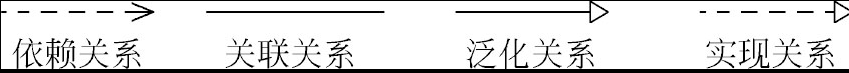

#### 图

* 模型是所有事物和关系的知识库，创建模型有助于描述正在设计的软件系统的所需行为
* UML 2.5 共14种图（详情看应用UML 2建模）

### 通用机制

* `规格说明`：文本维度的模型描述。
* `修饰`：描述建模元素的细节信息。
* `通用划分`：建模时对事物的划分方法。
* `扩展机制`：用于扩展UML建模元素，包括构造型、约束和标记值3类机制。

## “4+1”架构模型

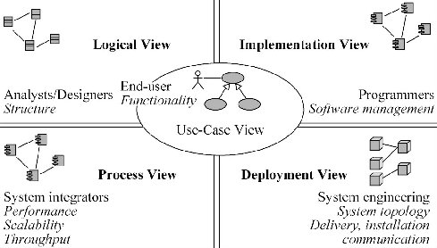

 `基本概念`

* 共提供了5个视图来组织UML模型
* 每个视图面向不同的用户，提供不同的UML模型，以实现不同的建模目标。

 `组成部分`

* `用例视图` 建模过程的起点和依据，面向最终用户，描述系统的功能性需求。所有其他视图都是从用例视图派生而来的，该视图把系统的基本需求捕获为用例并提供构造其他视图的基础。

* `逻辑视图` 面向系统分析和设计人员，描述软件结构。它来自功能需求，用于描述问题域的结构。作为类和对象的集合，它的重点是展示对象和类是如何组成系统、实现所需系统行为。

* `进程视图` 面向系统集成人员，描述系统性能、可伸缩性、吞吐量等信息。其目标是为我们系统中的可执行线程和进程建模，使它们作为活动类。事实上，它是逻辑视图面向进程的变体，包含所有相同的工件。

* `实现视图` 面向编码人员，描述系统的组装和配置管理。其目标是对组成基于系统的物理代码的文件和构件进行建模。

* `部署视图` 面向系统工程师，描述系统的拓扑结构、分布、移交、安装等信息。建模的目标是把组件物理地部署到一组物理的、可计算的节点（如计算机）上。

## 应用UML 2建模

UML 2提供了两类（结构图和行为图）14种图形用于系统建模。

* `类图`：描述类、接口、协作及它们之间的关系。
* `对象图`：描述对象及对象之间的关系。
* `包图`：描述包及包之间的相互依赖关系。
* `组合结构图`：描述系统某一部分（组合结构）的内部结构。
* `构件图`：描述构件及其相互依赖关系。
* `部署图`：展示构件在各节点上的部署。
* `外廓图`：展示构造型、元类等扩展机制的结构。
* `时序图`：展示对象之间消息的交互，强调消息执行顺序的交互图。
* `通信图`：展示对象之间消息的交互，强调对象协作的交互图。
* `时间图`：展示对象之间消息的交互，强调真实时间信息的交互图。
* `交互概览图`：展示交互图之间的执行顺序。
* `活动图`：描述事物执行的控制流或数据流。
* `状态机图`：描述对象所经历的状态转移。
* `用例图`：描述一组用例、参与者及它们之间的相互关系。

### 图书馆管理系统的原始需求如下所示

* 该系统是一个基于Web的计算机应用系统。
* `读者`可以`查询图书信息`及`借阅信息`。
* `读者`可以通过系统`预约所需的图书`。
* `图书馆工作人员`利用该系统完成`读者的借书`、`还书`业务。
* `图书馆工作人员`可以对`图书信息`、`读者信息`等进行维护。
* 对于到期的图书，系统会`自动向读者发送催还信息`。
* `管理员`会`定期进行系统维护`。

### 用例图

`用例图` 是被称为参与者的外部用户所能观察到的系统功能的模型图，其主要功能如下所示。

* 列出系统中的用例和参与者。

* 显示哪个参与者参与了哪个用例的执行工作。

用例图中的核心概念包括以下几个。

* `用例`：系统中的一个功能单元，可以被描述为参与者与系统之间的一次交互作用。
* `参与者`：通过系统边界与系统进行有意义交互的外部实体。
* `泛化`：参与者与参与者之间的关系。
* `关联`：用例与参与者之间的关系。
* `扩展、包含、泛化`：用例之间的关系。

用例图的推荐使用场合：包括 `业务建模` 、 `需求获取` 和 `定义` 等场合。

**用例图中的主要建模元素**

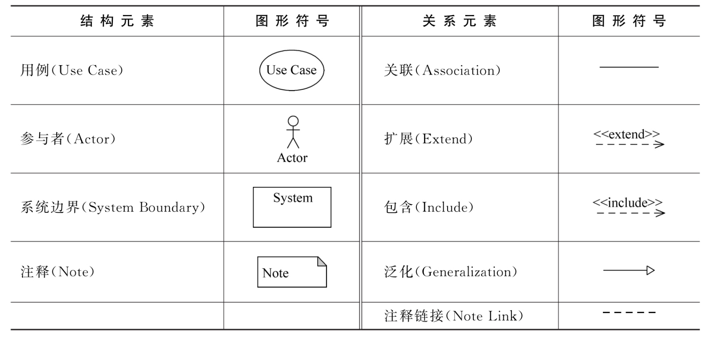


**
用例图
**

### 活动图

用例文档描述了用例的业务流程，有些用例的流程比较复杂（如存在分支、循环等复杂结构），只用文本描述这个流程并不直观，且不利于用户之间的沟通。此时，开发人员可以采用活动图来描述该用例内部的执行流程。

`活动图` 是一种动态行为图，将业务流程或其他计算的结构展示为内部一步步的控制流和数据流，主要用于描述 `某一方法` 、 `机制` 或用 `例的内部行为` 。活动图中的核心概念包括以下几个。

* `活动、组合活动` ：表示某个内部的控制逻辑。
* `对象、对象流` ：与活动相关的数据对象。
* `转移、分支` ：控制活动之间的先后顺序。
* `并发、同步` ：支持活动间的并发和同步。
* `分区：描述` 活动的不同参与者。

活动图的推荐使用场合：包括 `业务建模` 、 `需求` 、 `类设计` 等场合。

**活动图建模元素：**
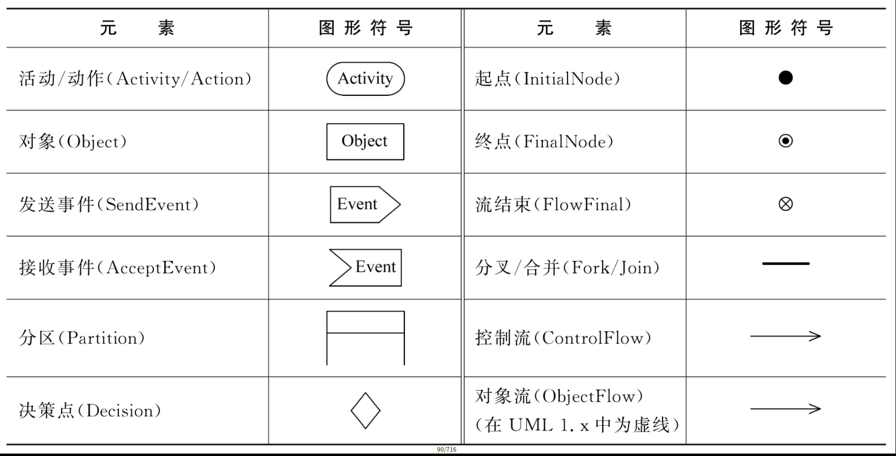


### 类图、对象图、包图和组合结构图

描述完需求后，本小节对系统进行分析和设计。
UML提供了4种静态结构图来描述系统。

* `类图`是软件的蓝图，用于详细描述系统内各个对象的相关类，以及这些类之间的静态关系；
* `对象图`用于表示在某一时刻，类的对象的静态结构和行为；
* `包图`用于展现由模型本身分解而成的组织单元（包）及它们的依赖关系；
* `组合结构图`用于描述系统中某一部分（组合结构）的内部结构，包括该部分与系统其他部分的交互点。

静态结构图中的核心概念包括以下几个。

* `类图`：类、接口、依赖、关联、泛化、实现。
* `对象图`：对象、链接、多重性。
* `包图`：包（框架、层、子系统）、依赖。
* `组合结构图`：组合结构、部件、端口、角色绑定。

静态结构图的推荐使用场合：包括 `业务建模` 、 `分析` 、 `设计` 、 `实现` 等场合。
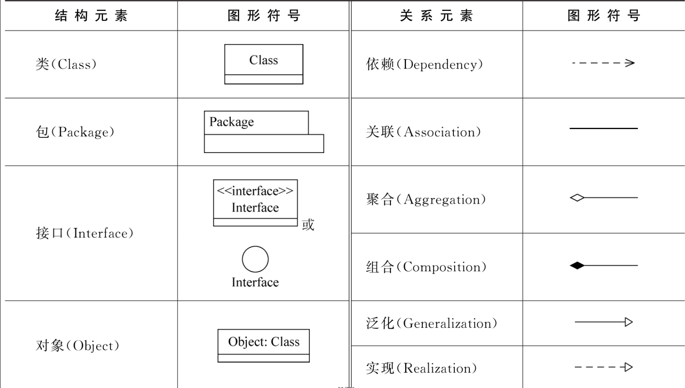
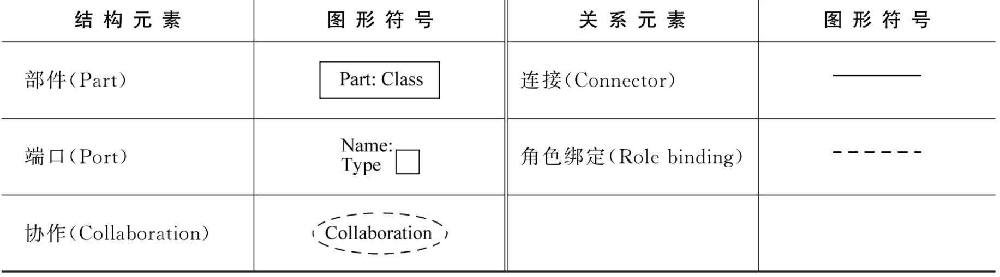

对于图书馆管理系统，通过类图可以反映该系统内部的静态结构特征（类和类之间的关系）。图所示的类图就展示了图书类（Book）、借阅信息类（BorrowInfo）、读者类（Reader）之间的静态关系。其中，图书分为不同的类别（Catalog），如科技书（TechBook）、文学书（LitBook）、新书（NewBook），而读者分为学生（Student）和教职工（Faculty）。
对象图则用于展示某一时刻对象之间的关系。图所示的对象图展示了一名教职工（thbin）的个人借阅信息（myInfo），他一共借了4本书：一本新书（book1）、两本科技书（book2、book3）和一本文学书（book4）。
包图展示了软件系统的分层结构。在图书馆管理系统中，如图左半部分所示，系统高层分为3层，其中界面层负责用户交互；数据访问层负责访问底层信息；业务逻辑层负责协调界面层和数据访问层间的访问逻辑。此外，对于数据访问层内部，又可以采用分包的方式进行逻辑划分，如图2-19右半部分所示，分为借阅包、读者包、图书包。


### 时序图

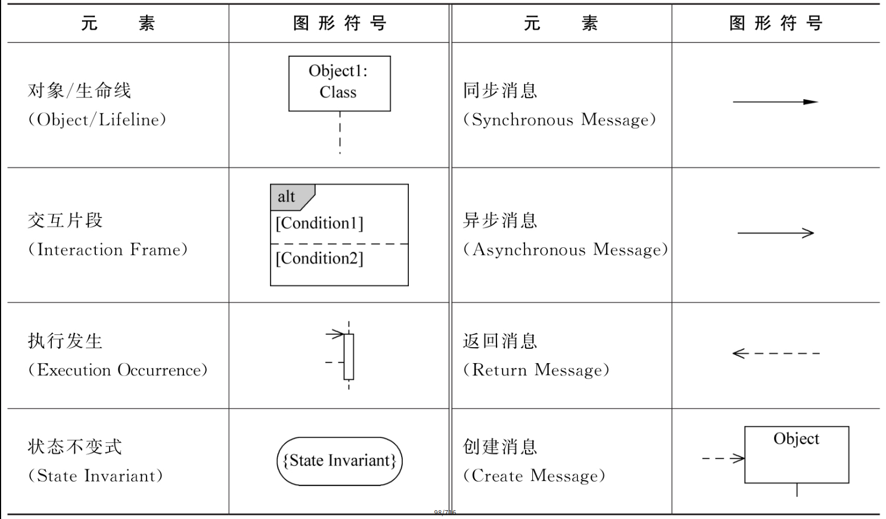


### 通信图

在展示对象交互图时，时序图侧重描述交互的先后顺序，而交互对象之间的关系并不能体现出来，通信图则是从另外一个视角来描述对象交互的交互图。

通信图中的核心概念包括以下几个:

* `对象`、`协作角色`。
* `协作`、`交互`、`消息`。

通信图的推荐使用场合： `包括用例分析` 、 `用例设计` 等场合。
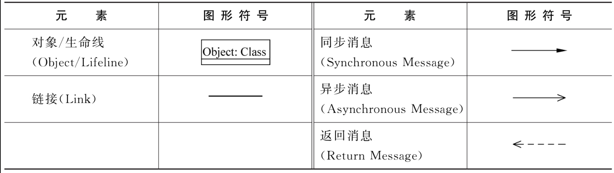
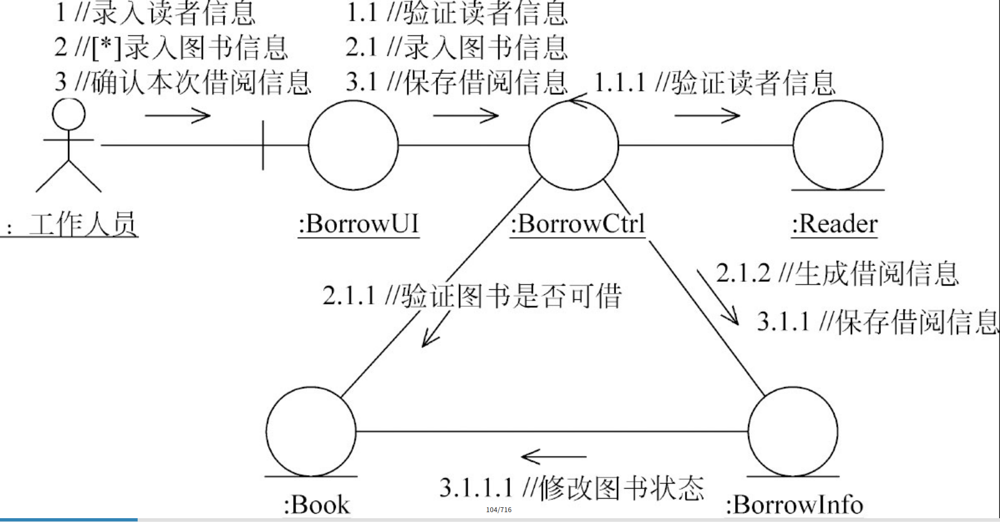

### 时间图

对于一些特定的系统（如实时系统），有时候真实的时间信息非常重要（如某个消息在发送出去后，在1s之内必须返回），UML 2引入了新的时间图来描述时间信息。
时间图（Timing Diagram）是一种交互图，用于展现消息跨越不同对象或角色时真实的时间信息，可描述单个或多个对象状态变化的时间点及维持特定状态的时间段。此外，时序图作为表示交互的主要手段，也可以在其中增加时间约束来表明对象状态变化的时间点及维持特定状态的时间段。时间图中的核心概念包括以下几个。

* 时间约束、持续时间约束、生命线
* 状态、条件、事件。

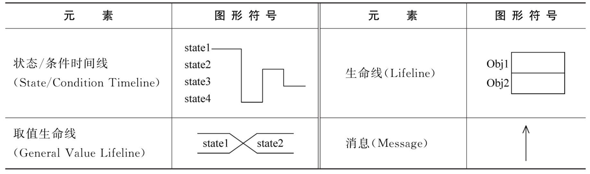

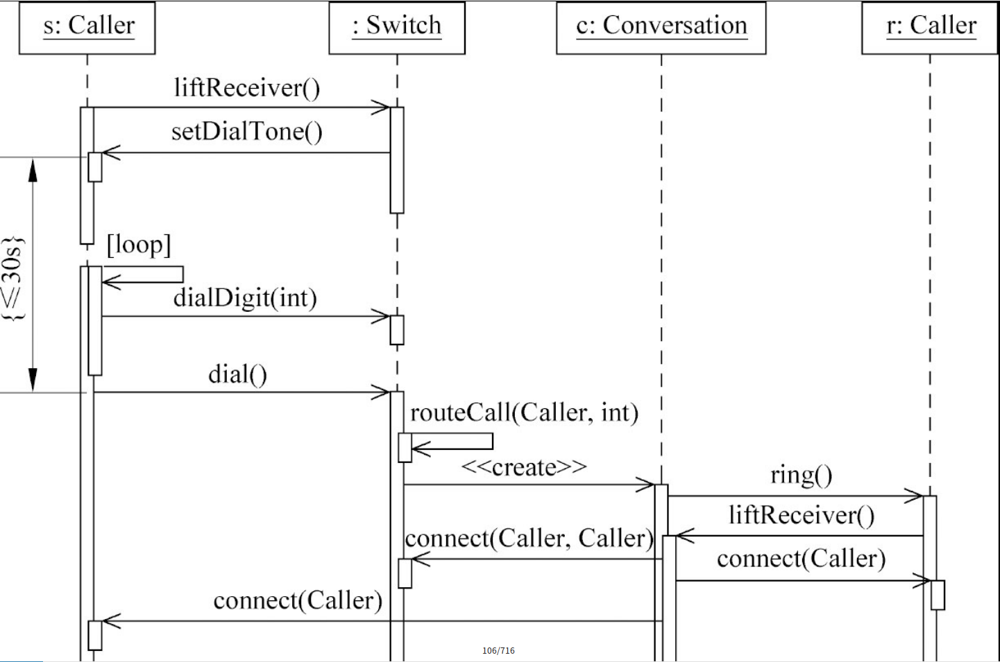

### 状态机图

时序图和通信图都是交互图的一种，它们侧重于描述对象之间的交互过程。然而，有时候对象本身也是很复杂的，它可能涉及不同的状态和行为，此时需要通过状态机图来表示。
状态机图（State Machine Diagram），就是UML 1.x中的状态图（Statechart Diagram），利用状态和事件描述对象本身的行为。它是一种非常重要的行为图，强调事件导致的对象状态的变化。状态机图中的主要概念包括以下几个。

* `状态`、`初态`、`终态`。
* `事件`、`转移`、`动作`。
* `并发状态机`。

状态机图的推荐使用场合： `包括类设计场合`

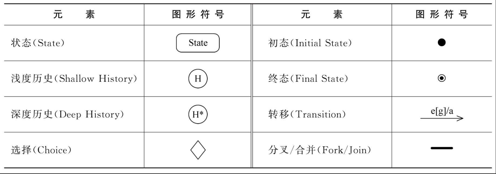

UML中的动态图主要可以分为交互图和行为图两大类，它们都是非常有价值且容易混淆的，此处简单总结几种动态图的使用方法。它们的共同点有以下几个。

描述系统中单个或多个事物动态行为特性。

* `交互图`（时序图、通信图、交互概览图、时间图）侧重描述事物间的交互过程。
* `行为图`（活动图、状态机图）侧重描述事物本身的行为特征。

它们的区别主要体现在每种图形的侧重点不同。

* `交互图`（时序图、通信图）：适合描述单个用例中多个对象之间的协作行为。
* `交互概览图`：用于描述复杂用例多个时序图间的控制流程。
* `时间图`：用于描述时间受控的单个或多个对象间状态交互。
* `状态机图`：适合描述跨越多个用例的单个对象的行为如何影响该对象的状态。
* `活动图`：适合描述多个对象跨越多个用例时的总貌。

### 构件图和部署图

`构件图` 将封装类作为构件，描述在系统实现环境中的软件构件和它们之间的关系。构件图中的主要概念包括以下几个。

* `构件`、`工件`、`接口`（所供接口、所需接口）。
* `装配连接`、`委托连接`、`依赖`。

构件图的推荐使用场合包括系统设计、实现、部署等。

**构件图中的主要建模元素**
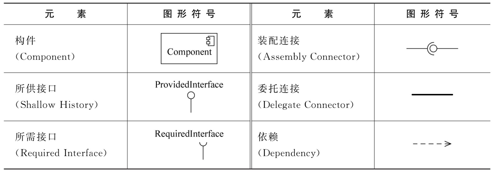

**图书馆管理系统构件图**
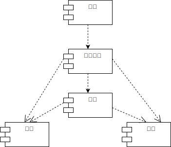

`部署图` 描述系统所需的硬件环境的物理结构，以及软件资源在硬件环境中的部署方案。部署图中的主要概念包括以下几个。

* `节点`、`工件`、`部署规范`。
* `连接`、`依赖`。

部署图的推荐使用场合：包括 `系统设计` 、 `实施` 、 `部署` 等场合。

**部署图中的主要建模元素**
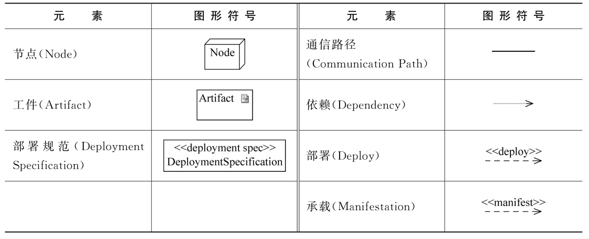

该系统共有4类不同的节点。其中读者客户端面向普通读者提供查询、预约等功能；工作人员前置机面向工作人员用于实现具体的借书、还书业务；后台数据库用于运行系统数据库环境；管理员后台用于帮助管理员实现各种系统维护功能

**图书馆管理系统部署图**

## 练习

### 选择题

1．模型是（　　）。

* A．现实世界的简化
* B．现实世界的图形化描述
* C．现实世界的具体化描述
* D．现实世界的封装

2．下列关于UML的论述，错误的是（　　）

* A．将几个面向对象方法统一起来
* B．可作为与软件开发人员之间的通用语言
* C．可作为一种指导软件开发的通用过程
* D．可用于通用领域，也可用于嵌入式领域

3．UML中的“统一”体现在很多方面，下列选项（　　）不是UML统一的内容。

* A．开发生命周期
* B．软件开发过程
* C．应用领域
* D．实现语言和平台

4．和UML 1.x相比，UML 2进行了比较大的改动，对于普通用户来说，主要的改动体现在对一些图进行了调整。下列4个选项中，（　　）是UML 2新增的用于描述静态结构的图。

* A．类图
* B．交互概览图
* C．时间图
* D．组合结构图

1. A

1. C

1. B

1. D

### 简单题

1．通过建模技术，可以达到哪些目标？

> 1. 可视化：模型有助于按照所需的样式可视化系统
> 2. 描述：模型能够描述系统的结构和行为
> 3. 构造：模型提供构造系统的模版提高质量，减少成本
> 4. 文档化：模型可以文档化设计决策

2．在系统建模过程中，需要遵循哪些基本原则？

> 1. 选择合适的模型
> 2. 模型具有不同的精准度
> 3. 最好的模型是与现实相联系
> 4. 需要从多个视角创建不同的模型，单一的模型是不够的

3．在哪些情况下，适合使用UML进行系统建模？

> 1. 项目采用的OO方法论
> 2. 提高项目开发人员之间的交流效率，准确抓准问题的本质
> 3. 系统的规模和设计都比较复杂，需要用图形抽象的表达复杂的概念，增强设计的灵活性、可持续性、可读性、可理解性，以便暴露深层次的设计问题、降低开发风险
> 4. 需要记录已成功项目、产品的公共设计方案，在开发新项目时可以参考、复用过去设计，以节省投入，提高开发效率和整体成功率
> 5. 有必要采用一套通用的图形语言和符号体系描述组织的业务流程和软件需求，促进业务人员、软件开发人员之间一致、高效地交流

4．UML的语法结构使用什么方式来定义，如何定义？

> 1. UML语法结构采用UML元模型来定义
> 2. 主要是采用UML类图描述各元素的抽象语法，采用约束机制和自然语言（文本）来描述模型定义

5．UML的语义结构主要包含什么内容？

> UML 语言结构主要包括两类语义域
>
> 1. 结构语义定义了, 在建模中关于个体的UML结构化模型元素的含义，这个含义可能是某个特定的时间点是正确的，也称为静态定义
> 2. 行为语义定义了在建模域中, 关于个体如何随着时间变化而做出不同行为的UML行为模型元素，也称为动态语义

6．UML中的事物之间主要存在哪些基本关系？

> UML中的事物主要有4类基本关系
> 1. 依赖是两个事物之间的弱语义关系，表明两个事物之间存在着一种使用关系，其中一个事物发生会影响到另一个事物的语义
> 2. 关联是一种强语义联系的结构关系，表明两个事物之间存在这明确的、稳定的语义联系
> 3. 泛化是一种特殊/一般的关系，特殊元素（子元素）的替代一般元素（父元素）的对象
> 4. 实现的两个事物是之间的一种契约关系，其中的一个事物（箭头指向的事物）描述了另一个事物必须实现的契约

7．什么是构造型，UML中如何利用构造型进行扩展？

> 构造型是UML的一种扩展机制，其作用是基于已有的建模元素扩展新的建模元素，可用于所有的模型元素，构造型的使用非常简单，只需要通过为已有的元素设定一个构造型标记，以及相应的属性即可，也可以通过图标的方式区分不同的构造型

8．什么是外廓，如何利用外廓图扩展UML模型？

> 1. 外廊是基于UML元素的子集为特定领域定义了UML的一个特定版本，即定义了一组对UML已有模型的扩展和限定机制，以用于某个特定领域。这些扩展和限定机制包括：预定义的构造型、标记值、约束、和基类
> 2. 外廊是一种用于描述UML扩展机制的结构图，通过外廊图可以定义外廊包，以及特定的构造型，使用的元类、构造型和元类之间的扩展关系等内容，从而完成一系列的扩展

9．什么是UML架构中的视图，和UML图有什么区别和联系？

> 1. 视图可以理解为系统在某个视角的模型，每个视图面向不同的用户，提供不同的UML模型，以实现不同的建模目标
> 2. UML图是特定的UML模型，视图由不同的UML图组成，根据视图所面向的用户和建模目标，选择不同的UML图进行建模
