# 业务建模

> 软件开发的最终目标是为了满足业务需求，以帮助用户解决业务中的问题。早期的软件开发方法并没有充分意识到业务的重要性，而随着RUP中将业务建模作为软件开发的第一个工作流，业务建模的重要性也日益被人们所认识；良好的业务建模可以为软件的成功开发奠定坚实的基础。UML主要用于软件系统的分析和设计，但是其强大的扩展机制使得利用UML进行业务建模成为可能。本章从基本的业务建模概念入手，重点介绍利用UML进行业务建模的全过程。

**学习目标**

> 业务建模是项目的起源，是描述项目开发的依据，还是后续需求建模的基础。掌握利用用例技术进行业务建模的方法和实践过程，并对从业务模型转换到系统模型的过程有一定的了解。

**主要内容**

* UML与软件工程过程的区别和联系。
* 业务建模的基本概念：`业务参与者`、`业务用例`、`业务工人`、`业务实体`和`业务用例实现`。
* 基于用例技术的业务建模方法和实践：`业务用例图`和`业务活动图`。
* 从业务模型到系统模型的映射。

## UML分析设计过程

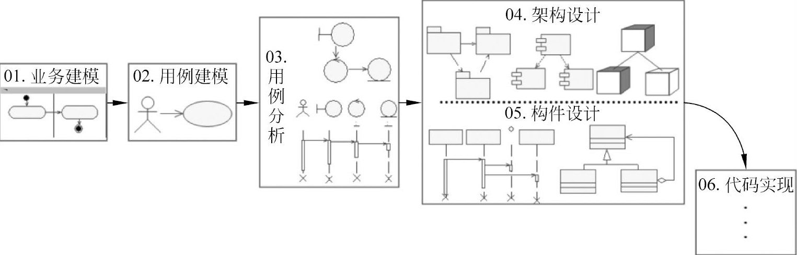

* `业务建模`：采用软件建模方法分析和理解待开发的业务，描述业务流程；其目标是认识业务本质，该业务本质是后续用例建模的基础。
* `用例建模`：采用UML用例建模技术描述软件需求，该需求模型将为后续用例分析提供输入。此
* `用例分析`：采用UML用例分析技术分析软件需求，建立软件系统的分析模型。
* `架构设计`：在系统的全局范围内，以分析模型为基础，设计系统的架构。
* `构件设计`：根据架构设计的成果，将分析模型细化，设计系统构件的实现细节。
* `代码实现`：将系统构件映射到目标语言上。

## 不同阶段建议使用不同模型

* `业务阶段`，采用扩展的业务用例模型进行业务建模，采用活动模型进行业务流程的细化。
* `用例建模阶段`，采用用例模型进行需求建模，采用用例文档来详述需求。
* `用例分析阶段`，采用扩展的类模型表示静态关系，采用交互模型表示动态交互。
* `设计阶段`则采用包、构件、部署等模型表示软件架构，采用静态类图、动态交互图、状态模型来进行详细的类设计。
* `代码实现阶段`，则根据设计类图、设计交互图生成代码。

## 业务建模基础

> 在进行软件系统开发之前或者同时要 `力图了解业务领域` ，而这个过程就是业务建模所要达到的目标。

业务建模是一种建模方法的集合，目的是对 `现有业务进行分析和理解` ，从而建立相应的业务模型。这一过程不仅有助于开发人员理解业务本质，而且这些模型将作为后续软件系统模型的输入。具体的工作包括对 `业务流程建模` 、对 `业务组织建模` 、 `改进业务流程` 、 `领域建模` 等方面。

业务建模的基本思想是使用软件建模技术来描述 `企业管理` 和 `业务所涉及的对象和要素` ，以及它们的 `属性` 、 `行为` 和 `彼此关系` 。

业务建模只是辅助环节, 当开发人员对所要处理的业务非常熟悉，而且业务本身没有改进的必要时，就没有必要进行业务建模。

业务建模的主要任务就是：拟定目标组织对新系统的远景，并根据该远景来定义业务模型中组织的过程、角色和职责。而该业务模型包括 `业务用例模型` 和 `业务对象模型` 。

## 业务用例模型

业务用例模型是说明业务预期功能的模型，是业务建模阶段的核心模型，用于确定组织的各个角色和可交付工件。

实施：

* `识别业务参与者`
* `识别业务用例`
* `描述业务用例`

### 识别业务参与者

识别业务参与者的关键在于明确业务边界：业务参与者是在业务边界之外的、与业务进行交互的人或组织。

业务参与者可以是与业务进行交互的任何个人、组织、公司或计算机，我们可以从以下类别中查找参与者。

* `客户`：接受目标业务所提供服务的客户，这是最常见的一类业务参与者。例如在银行业务中，储户接受银行所提供的存款、取款等服务，他们即为银行业务的业务参与者。
* `供应商`：为目标业务提供资源和服务的第三方组织。例如在银行业务中，为银行提供安保服务的保安公司。
* `合作伙伴`：与目标业务存在各种合作关系的第三方组织。
* `潜在客户`：目前还没有接受业务所提供的服务、但将来可能会接受服务的用户，业务可能需要面向这类用户提供一些“市场”方面的服务，以将潜在客户发展为最终客户。
* `政府`：目标业务可能会受到地方政府或法律、政策等约束，这些约束将会对业务本身造成影响，此时这些约束也可能会成为业务参与者。
* `在业务中未建模部分的人或组织`：业务建模可以针对整个业务，也可以只针对某部分关键业务，当那些没有建模的部分与已建模部分之间存在交互时，它们也会成为目标业务模型的业务参与者。

`业务参与者的命名` : 业务参与者应该有一个能反映其在业务中所承担角色的名称。

### 评判本阶段是否成功地完成

* `所有业务参与者都已找到`
* `每个业务参与者都代表了某个业务外的实体`，即是对业务外的某些对象进行建模。
* `每个人类业务参与者都代表一个角色`
* `每个业务参与者都至少要涉及一个业务用例`
* `一个特定的业务参与者不会以多种完全不同的方式与业务进行交互`。如果某个业务参与者以多种完全不同的方式进行交互，那么很可能需要将该业务参与者按照角色进行分解，定义多个不同的业务参与者，让每个业务参与者只代表一种不同的角色。
* `每个业务参与者都有一个明确的名称和简要的说明`

### 识别业务用例

业务用例展示了业务的外部视图，它确定了业务为了向业务参与者交付期望结果，需要执行什么流程；

识别业务用例方法：

* `业务参与者的角度`来考虑，即业务参与者通过业务用例从业务中获取价值。考虑“业务为客户提供哪些主要服务”，这是一种从外到内的识别思。

* `业务流程内部封装业务用例`，业务内部的各类活动和流程，分析活动的目标，从而确定这些活动是为外部业务参与者提供怎样的服务，这些服务即可表示为业务用例。

### 漏其他方面的业务用例

例如：一些支撑性业务流程背后的业务用例

* `内部人员的发展与维护` 如组织公司员工参与各种活动、培训等。
* `业务内部IT的开发与维护` 如公司内部与当前业务相关的其他信息系统。
* `办公室的设立与维护`
* `安全性`
* `法律活动`

还有一些具有管理特征的流程也可以用业务用例来表示，尽管有时这些流程对于信息系统不具有重要的意义。

* `为拥有者与投资者开发并提供有关业务的信息`。
* `设定长期的预算目标`。
* `协调业务中的其他用例，并确定其优先级`。
* `在业务中创建新的流程`。
* `监测业务中的流程`。

`业务用例命名` , 一般为动宾结构。例如在银行业务中，将业务用例“取款”与其业务参与者“储户”连接起来，则构成了“储户取款”这一银行的关键业务。

### 识别业务用例过程是否成功完成。

* `业务用例是否完整`，是否有与其关联的业务参与者，并为该业务参与者提供有价值服务。
* `业务用例的名称是否简单明了`，并且对于所有的业务相关人员（如用户、业务团队、第三方人员等）而言都易于理解。

## 利用活动图描述业务用例

**业务用例的详细说明**

* `文档`。按照相关文档模板（如RUP中的“业务用例规约”）的要求，编写业务用例的详细文档，通过文档阐述业务流程。
* `UML模型`。利用UML模型来详细描述业务用例的业务流程。在UML 2提供的模型中，活动图和顺序图都可以用于描述业务流程。

活动图可以用于以下几个场合。

* `描述业务用例或系统用例`，实现对业务流程、工作流和系统处理流程的建模。
* `描述算法`，实现对系统内部类方法的建模。
* `对复杂信息系统建模`，以确定系统处理信息的层次关系和流程。

#### 动作节点

`动作节点` 是活动图最基本的元素，一个动作表示一个原子的操作，是最小的行为单位，不可再分解，是一种可执行节点。

各种动作节点的示例
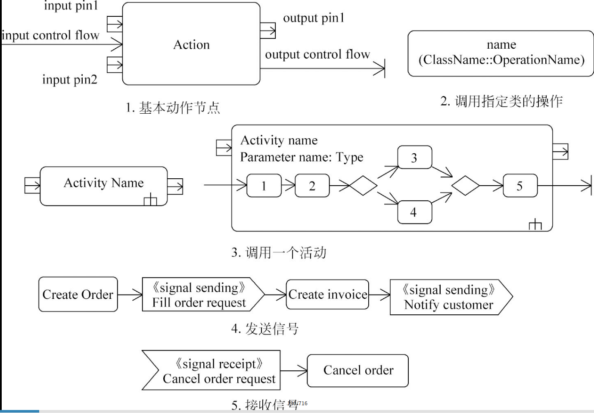

#### 控制节点

`控制节点` 是一种特殊的活动节点，用于在动作节点或对象节点之间协调流程，表示某一种控制动作。

**起点、终点和流结束节点**

* `起点` 代表活动图的开始
* `终点` 表示整个活动图的结束，可以存在多个终点，表示活动图有不同的结束路径。
* `流结束节点` 表示活动图中某个控制流的结束

示例中包含1个起点（最左边的实心圆圈）、2个终点（右下角的两个实心圆圈外套空心圆圈）和1个流结束节点（右上角的空心圆圈里面有一个叉）。


**决策和合并**

* `决策节点` 用于实现控制流的选择，有一个输入流和多个输出流，在多个输出流上设置不同的事件或条件，按照设定的逻辑选择不同的输出流，而且活动的每一次执行都只能选择一个输出流。
* `合并节点` 与决策节点对应，将决策节点分出的多个可选流合并起来，有多个输入流和一个输出流，活动的每一次执行都是从一个输入流进入合并节点，再转换为输出流。

通过这两个节点可以实现对条件分支的建模（if、switch结构均可）。

决策和合并

PS: 与传统的流程图类似，活动图中的决策节点也是用菱形框建模。然而，不同于流程图中直接将判定条件写在菱形框里面，活动图中的菱形框只是作为一个控制节点，表明需要进行分支决策)

**分叉和汇合**

分叉和汇合用来对并发执行和同步控制行为进行建模


#### 对象节点

`对象节点` 用于定义活动图中与动作相关的数据对象，其本质上是一个对象实例或一组同类型的实例，可以指定对象的 `名称` 、 `类型` 、 `状态`  `等各种特征信息` 。对于一组对象实例的节点还可以设置一个上界，以限制节点允许驻留实例的最大数量，同时可以设定实例的排序方式等细节。

图中的“name”对象，其类型为“type”，可以处于两个不同的状态（state1和state2）（在中括号中描述），同时这个对象实例最多可存储10个对象，对象排序方式为先进先出（FIFO）（在大括号中，通过约束机制进行限定）。


* `引脚` 对象节点还可以以一种简化的方式表示，一种特殊的对象节点

左边的图采用普通对象和对象流表示，而右边的图则采用对象引脚和对象流的方式表示。
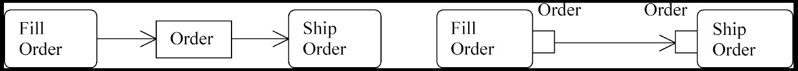

#### 活动边

`活动边` 是活动图中各类节点间的有向连接，从一个源节点指向一个目标节点。根据连接的节点类型不同，可以分为：

* `控制流` 用来连接两个动作或控制节点，前一个节点动作执行完成后，通过控制流进入下一个动作。`控制流不传递对象或数据，只传递控制令牌`，源节点所有令牌都将会传递给目标节点。
* `对象流` 连接一个动作节点和一个对象节点（或直接连接两个对象引脚），`用来传递对象或数据`，表示源动作“生产”对象，或由目标动作“消费”对象。

对于活动边而言，还可以为其设定 `执行条件` 、 `关联动作` 和 `权重` 等信息

* `守卫条件` 通过中括号在活动边上设置两个不同的守卫条件, 只有该守卫条件为真时才能通过该活动边进入下一个动作
* `权重` 转移发生时输入对象的最小数量（常量或表达式），默认为输入全部对象

活动边的权重:


#### 活动分组

* `活动分区` 用于识别具有相同特性的一组动作，这些动作被放入相同的区间。

在业务模型或需求中，往往按照组织机构的单位或系统角色进行分区，一个单位被放入相同的区间位或角色负责分区中所有节点的行为。
在设计模型中，可以按照不同的类（或构件）进行分区，一个类（或构件）负责执行该分区中所有节点的行为。

**食客吃饭业务流程的活动图**


## 业务对象模型

 **业务对象模型**

* 从业务人员内部的观点定义了业务用例
* 该模型为产生预期效果确定了业务人员及他们处理和使用的对象（“业务类和对象”）之间应该具有的静态和动态关系。
* 它注重业务中承担的角色及其当前职责。将这些模型类的对象组合在一起可以执行所有的业务用例。

业务对象模型的核心元素包括以下几个

* `业务工人`：表示在业务内部承担一系列职责的人。注意其和业务参与者的区别，业务参与者是在业务外面与业务进行交互的角色，而业务工人则在业务内部。

* `业务实体` ：表示业务内部使用或产生的可交付工件、资源和事件。与业务工人相同，业务实体也在业务内部；而不同的是，业务工人一般是人类角色，而业务实体则是业务内部所访问和操纵的事物，如饭店业务中厨师所做的菜肴。

* `业务用例实现`：显示了协作的业务工人和业务实体如何执行某个工作流程。这一部分是对描述业务用例工作的进一步细化，从实现角度来展示业务用例如何得到满足。开发人员可以使用以下几类图来记录业务用例实现。

* 类图显示参与的业务工人和业务实体之间的静态结构。
* 活动图中的泳道用于显示业务工人的职责，而对象流用于显示如何在工作流程中使用业务实体。
* 顺序图描述业务工人和业务参与者之间交互的详细情况，并显示如何在业务用例执行过程中访问业务实体

业务对象模型主要分为两个部分： `静态模型` 和 `动态模型`

## 业务建模实践

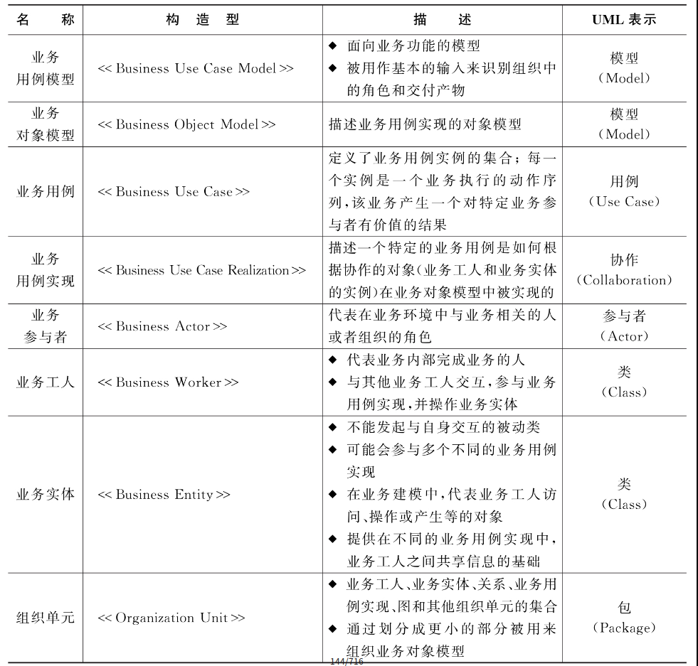

按照UML “4+1”视图的要求，业务用例模型建立在用例视图中，而业务对象模型则建立在逻辑视图中

具体建模过程：

* 在 `用例视图` 中建立 `业务用例模型包` ，在此包的主视图中绘制 `业务用例图` ，而为了描述每一个业务用例，则需要在状态活动模型中绘制活动图；
* 在 `逻辑视图` 中建立`业务对象模型包`，在此包的主视图中绘制展示`业务对象静态关系的类图`。

## 旅店业务建模案例

某旅店可对外开放 `50 个双人间` 和 `20个单人间` ，房间费用视情况、按季节调整，但 `周一到周五提供半价折扣（周末全价）` 。 `旅客 可以直接入住房间（如果有空房），也可提前预订` ； `入住和预订都需要登记个人信息` 。旅客 `提前预订房间时，需提交一定的订金` ；在 `入住时间24小时之前` ，旅客可以 `取消预订房间，并退回所有订金` ，而 `24小时以内则不退还订金` 。 `旅客入住时先预交一笔住宿费用` ， `待退房时，再对住宿费用进行结算` 。此外，为了考查旅店的业务情况，服务员每月为经理提供房间的预定情况和入住情况的详细信息。



业务用例模型和业务对象模型分别从不同的角度来描述业务本质。

* 业务用例模型关注业务对外所提供的价值，
* 业务对象模型则关注业务内部的实现机制。

在业务建模过程中，需要把这两类模型结合起来，才能够有效地完成业务建模过程。

## 从业务模型到系统模型

* 对于业务用例模型中每个将被系统实现的业务用例，在用例视图中确定一个系统用例或用例包来实现该业务（也有可能作为一个单独的系统来实现该业务）。

* 为需要支持自动化业务确定相应的用例。

* 对于业务对象模型中的业务实体，可以在系统模型中定义对应的实体类。

* 在软件架构中定义专用层来实现复杂的业务逻辑。

 `业务模型和系统模型之间可能存在的对应关系`

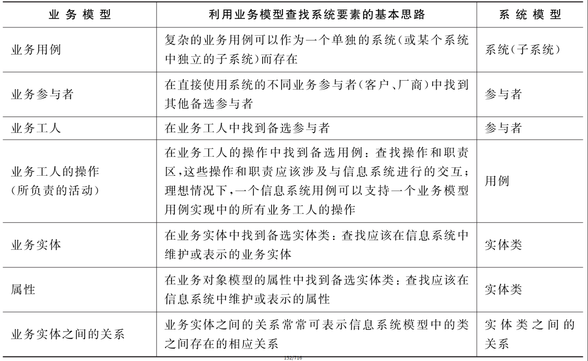

## 练习

### 选择题

1．下列有关业务建模的概念和方法的论述中，错误的是（　A　）。

* A．业务建模是软件开发的必备环节
* B．可以采用用例技术进行业务建模
* C．可以通过活动图详细描述业务流程
* D．业务模型可以映射到系统模型

2．下列有关业务模型的相关概念中，错误的是（　C　）。

* A．业务参与者在业务之外
* B．业务工人在业务内部
* C．业务用例为业务工人提供价值
* D．业务实体在业务内部

3．下列关于活动图的论述中，错误的是（　A　）。

* A．可以包括多个起点
* B．分区用来表示该分区内的活动是由谁负责的
* C．活动可以简单，可以复杂
* D．可以使用活动图描述业务用例流程

4．下列选项中，（　B　）不会出现在活动图中。

* A．活动
* B．用例
* C．对象
* D．分叉

5．业务模型中的业务实体，在系统模型中最有可能成为（　D　）。

* A．系统用例
* B．参与者
* C．控制类
* D．实体类

6．以某海鲜酒家为研究对象，下列选项中，（　A　）是业务工人。

* A．服务员
* B．菜单
* C．食客
* D．菜

7．以某医院为研究对象，下列业务用例图中，正确的是（　B　）。

* A．可以包括多个起点
* B．分区用来表示该分区内的活动是由谁负责的
* C．活动可以简单，可以复杂
* D．可以使用活动图描述业务用例流程

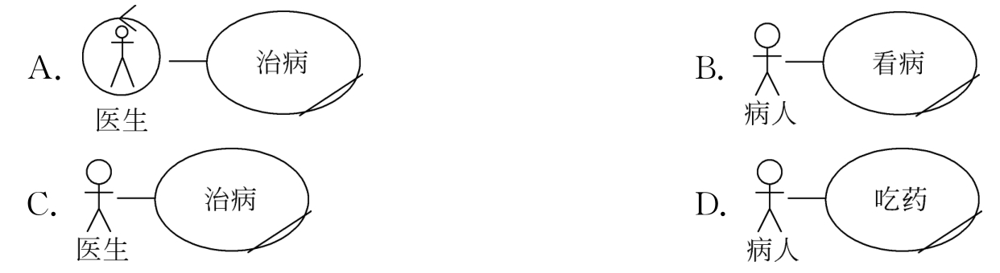

## 简答题

1．本书讨论的UML分析设计过程主要包括哪几个阶段？

> 主要包括6个阶段
> 1. 业务建模：采用软件建模方法分析和理解待开发的业务，描述业务流程；其目标是认识业务本质，该业务本质是后续用例建模的基础。
> 2. 用例建模：采用UML用例建模技术描述软件需求，该需求模型将为后续用例分析提供输入。
> 3. 用例分析：采用UML用例分析技术分析软件需求，建立软件系统的分析模型。
> 4. 架构设计：在系统的全局范围内，以分析模型为基础，设计系统的架构。
> 5. 构件设计：根据架构设计的结果，将分析模型细化，设计系统构件的实现细节
> 6. 代码实现：将系统构件映射到目标语言上。

2．什么是业务建模，软件开发过程中为什么要进行业务建模？

> 1. 业务建模是一种建模方法的集合，目的是对现有业务进行分析和理解，从而建立相应的业务模型。
> 2. 业务建模有助于理解业务领域中描述的事物是如何与软件领域中的事物相关系的，从而建立业务模型和系统之间的对应关系，以保证系统建模是能够满足业务需求的。

3．什么是业务用例模型，业务用例模型主要包括哪些内容？

> 1. 业务用例模型是说明业务预期功能的模型，是业务建模阶段的核心模型，用于确定组织的各个角色和可交付工件。
> 2. 业务用例模型由业务用例和业务参与者构成，主要目的是说明客户和合作伙伴是如何开展业务的。

4．什么是业务参与者，如何识别业务参与者？

> 1. 业务参与者代表了与业务有关的角色，此角色由业务环境中的某个人或物扮演。
> 2. 识别业务参与者的关键在于明确业务的边界：业务参与者是在业务边界之外的、与业务进行交互的人或组织，它接受业务所提供的服务，并关注业务所产生的结果。
> 3. 在实际业务模型过程中，业务参与者可以是业务进行交互的任何个人、组织、公司或计算机，可以从以下类别中查找参与者：客户、供应商、合作伙伴、潜在客户、政府、业务中为建模部分的个人和组织。

5．什么是业务用例，如何识别业务用例？

> 1. 业务用例展示了业务的外部视图，它确定了业务为了向业务参与者交付期望结果，需要执行什么流程：同时还确定了，在执行业务用例时，业务与业务参与者之间需要进行哪些交互。
> 2. 为了能够有效地识别主要的业务用例，可以从业务参与者的角度来考虑，既业务参与者通过业务用例从业务中获取价值。
> 3. 还可以从业务流程内进行封装业务用例，研究业务内部的各类活动和流程，分析活动的目标，从而确定这些活动是为了外部业务参与者提供怎样的服务，这些服务即可表示为业务用例。
> 4. 此外，还需要注意的是不要遗漏其他方面的业务用例，如一些支撑性业务流程（包括不直接是客户受益的活动）背后的业务用例。

6．活动图中的动作节点在什么条件下可以执行，有哪些种类的动作节点？

> 1. 当动作节点所有的对象和控制流的前提条件都满足时，才创建动作的一次执行。
> 2. 根据动作执行所涉及的功能不同，可以划分为不同类别的动作，包括基本功能、行为调用、通讯动作和对象处理等不同类型的动作节点

7．什么是活动图中的控制节点，通过哪类控制节点可以进行并发行为建模？

> 1. 控制节点是一种特殊的活动节点，用于在动作节点和对象节点之间协调的流程，表示某一种控制动作
> 2. 根据分叉和汇合这两个控制节点可以对并发和同步控制行为进行建模。

8．活动图中的对象节点有哪两种表示方式，有何不同？

> 1. 有标准的对象节点和引脚两种表示方式
> 2. 标准的对象节点独立存在，而引脚则依附与动作节点，表示该动作的输入参数或输出值，是一种简化的表示方式，也可以转换为标准对象节点进行建模。

9．活动图中的边可以设定哪些执行参数？

> 1. 可以为活动边设定条件，关联动作和权重等信息。
> 2. 执行条件为真时才能通过该活动边进入下一个动作关联的动作
> 3. 关联动作表示在进入下一个动作节点之前需要提前执行的动作
> 4. 权重规定了转移发生时输入对象的最小数目（常量或表达式），缺省为全部输入对象

10．什么是活动分区，一般什么情况下对活动进行分区？

> 1. 活动分区用于识别具有相同特性的一组动作，这些动作被放入相同的区间
> 2. 可以使用不同的分区规则进行分区，并没有严格的规则。
> 3. 在业务建模或需求中，往往按照组织机构的单位或系统角色进行分区，一个单位或角色负责分区中所有节点的行为。而在设计模型中，可以按照不同的类（或构件）进行分区，一个类（或构件）负责执行该分区中所有的节点的行为

11．什么是业务对象模型，业务对象模型主要包括哪些内容？

> 1. 业务对象模型从业务人员内部的观点定义了业务用例，该模型确定了业务人员以及他们处理和使用的对象（“业务类和对象”）之间应该具有的静态和动态关系。
> 2. 业务对象模型主要包括：业务工人、业务实体和业务用例实现等内容。

12．业务模型和系统模型之间有什么区别和联系？

> 1. 业务模式建模当前业务现状，而系统模型则描述系统中业务实现模式
> 2. 业务模型可以为系统模型中的用例视图和逻辑视图提供输入，还可以为系统架构提供一些重要的架构机制

## 应用题

1．某公司接待访客的流程如下所述。
（1）公司接待室的使用由专门的管理员来管理，申请人首先进行预约申请。管理员确认是否有空余的接待室，如果有，则预约该接待室；如果没有，则预约不成功。预约结束后，管理员告知申请人预约结果。
（2）预约成功后，申请人告知公司前台预约和来访信息，由公司前台负责登记来访者姓名、时间和使用的接待室等来访信息。
（3）如果取消预约，则申请人分别与管理员和公司前台进行联系，由管理员取消接待室的预约，公司前台删除已登记的来访信息。
根据该业务流程描述，完成的活动图如图3-19所示，请补充完善图中（1）~（12）的内容。
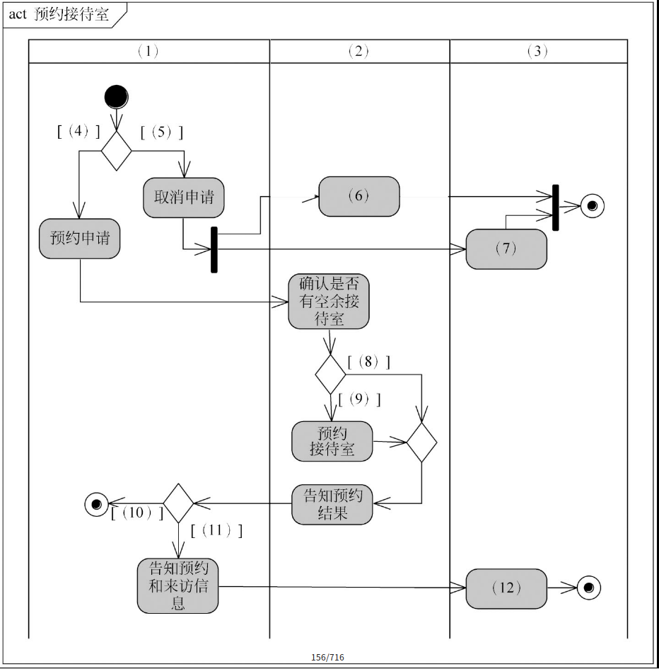

答：

> (1). 申请人
> (2). 管理员
> (3). 前台
> (4). 需要预约
> (5). 需要取消预约
> (6). 取消接待室预约
> (7). 删除已登记的来访信息  
> (8). 没有空余接待室
> (9). 有空余接待室
> (10). 预约不成功
> (11). 预约成功
> (12). 登记来访信息

2．某公司的图书采购申请业务描述如下。
（1）申请人制作购书申请单，然后交给项目经理进行审查。
（2）项目经理审查是否所有图书都需要购买，如果有不需要购买的图书，则通知申请人修改申请；如果所购图书金额超过2000元，则需要部门经理审批，否则直接提交采购部门。
（3）部门经理批准后提交采购部门进行采购，如果不批准，则通知申请人不能进行采购。
请根据该业务流程描述，绘制该业务的活动图。

