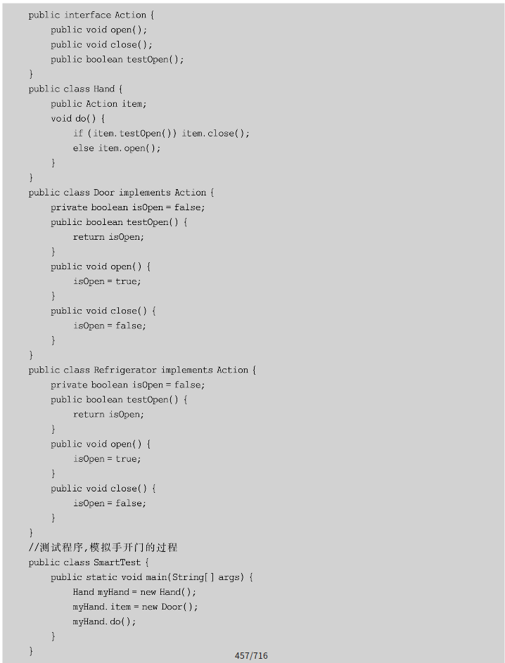
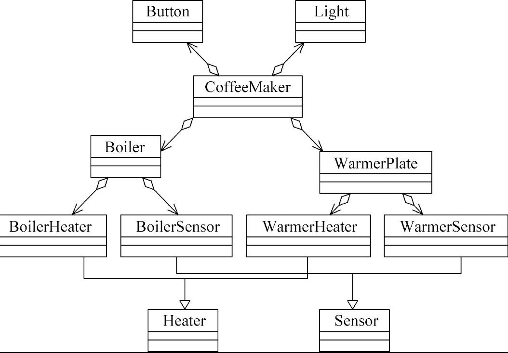
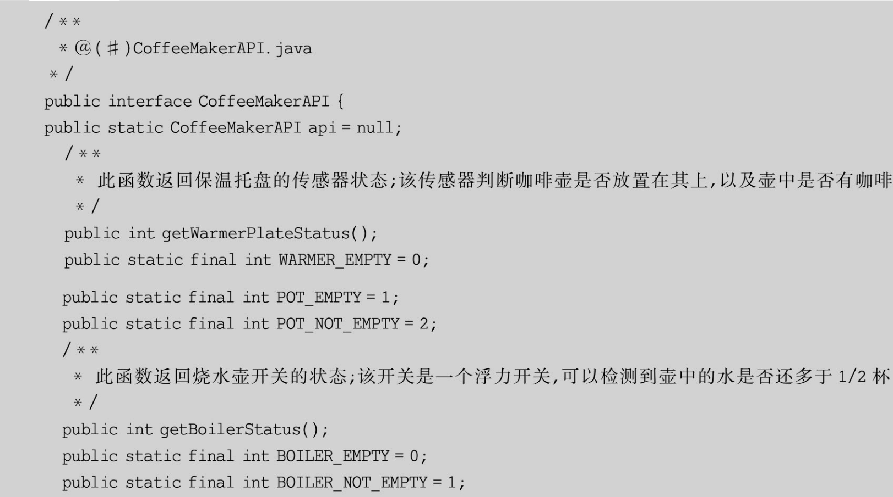
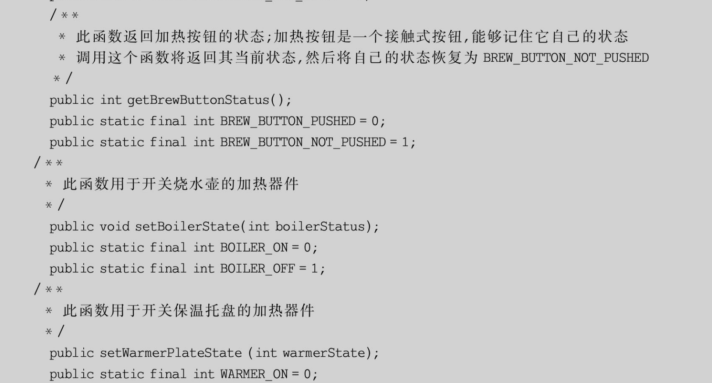
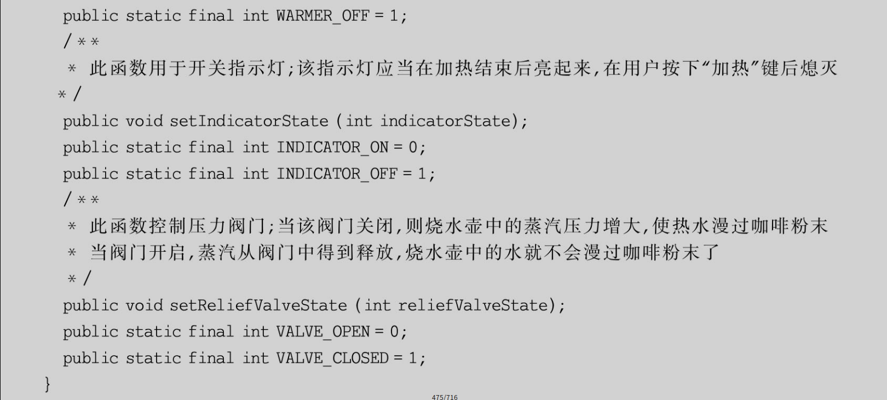
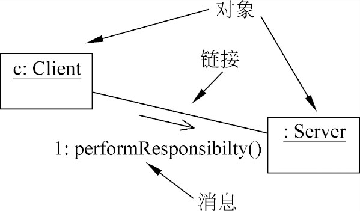
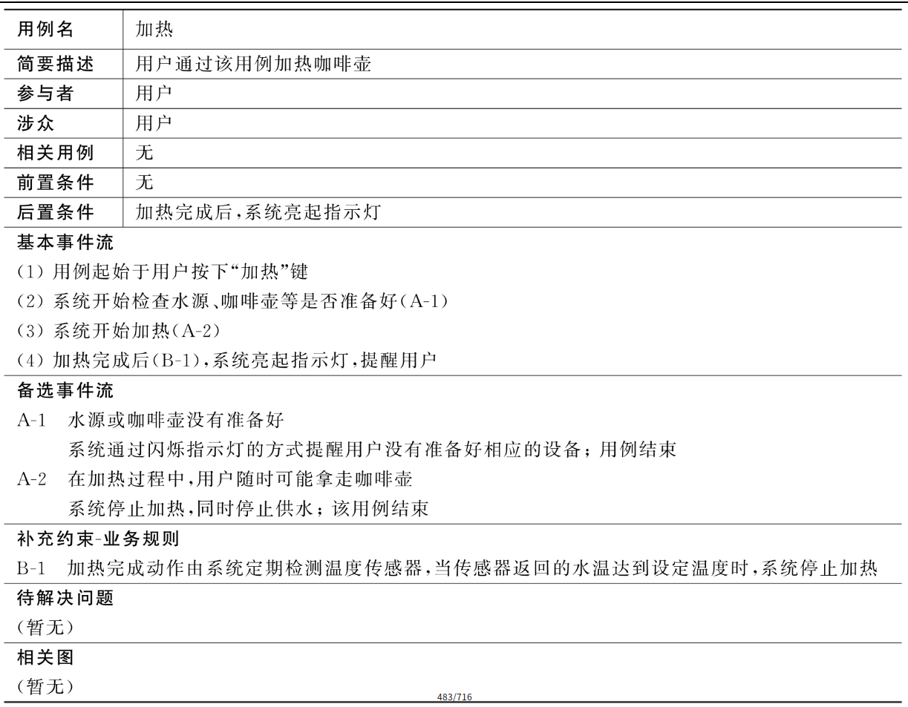
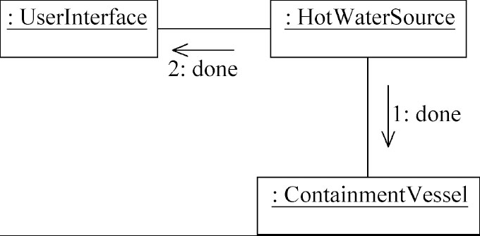
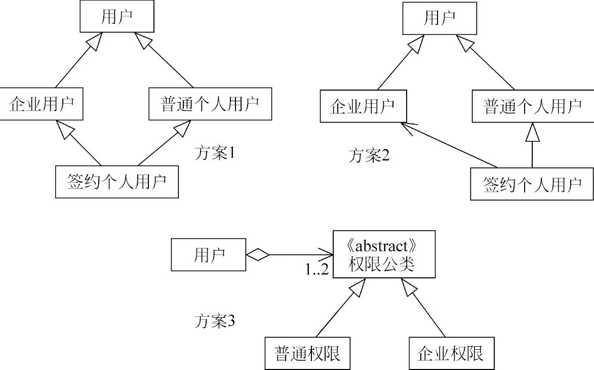

# 面向对象的设计原则

## 本章目标

主要内容:

* 了解设计质量和设计原则的基本概念。

* 掌握Liskov替换原则和泛化关系的设计策略。

* 掌握开放—封闭原则的基本思想和应用技巧。

* 理解单一职责原则和接口隔离原则。

* 掌握依赖倒置原则的基本思想和应用技巧。

## 设计需要原则

### 从问题开始

泛化是面向对象技术中常用的一种关系。在软件设计过程中，设计人员经常会使用这种关系来设计类的继承层次结构。

### 设计质量和设计原则

“编写一段能工作的、灵巧的代码是一回事；而设计一段能支持某个长久业务的代码则完全是另一回事”，这就是设计的魅力。高质量的设计将是软件系统长期稳定运行的根本保障，是软件系统走向成功的关键所在。

#### 设计质量

种设计的“臭味”主要包括以下几个方面。

* 僵硬性：刚性，难以扩展。即指难以对软件进行改动，即使是简单的改动也会造成对系统其他很多部分的连锁修改。
* 脆弱性：易碎，难以修改。即指在进行一个改动时，程序的许多地方就可能出现问题，而这些新问题有可能、甚至与改动的地方没有任何关联。

* 牢固性：无法分解成可移植的组件。即指设计中虽然包含了对其他系统有用的部分，却很难把这部分从系统中分离。

* 黏滞性：包括设计的黏滞性和环境的黏滞性。设计的黏滞性使修改设计代价高昂，简单的修改可能就会破坏已有的设计方案。而环境的黏滞性则意味着开发环境迟钝、低效，如编译时间过长、版本管理混乱等问题。

* 不必要的复杂性：设计中包含了当前没有用的组成部分。一些过度的设计方案可能从来不会被使用，反而使软件变得更加复杂，并难以理解。

* 不必要的重复性：设计中包含了重复的结构，而这些重复的结构本可以通过复用的方式进行统一管理。这种不必要的重复被形象地称为“Ctrl C+Ctrl V”，即复制已有的设计方案，并将其粘贴到新的功能中。这种不必要的重复会使系统的修改变得困难。

* 晦涩性：不透明，很难看清设计者的真实意图。设计人员最初对所做出的设计方案非常熟悉，但随着时间的推移，晦涩的设计方案将会使设计人员很难再有效地理解设计成果。因此，设计人员必须站在使用者的角度，设计出易理解的代码。

**5个更复杂的、典型的面向对象设计原则**

* Liskov替换原则

* 开放—封闭原则

* 单一职责原则

* 接口隔离原则

* 依赖倒置原则

## Liskov替换原则（LSP）

* 子类型必须能够替换它们的基类型

* 子类型不能添加任何基类型没有的附加约束

**契约式设计**

契约主要分为两类：

* 类定义不变式，对于该类的所有对象，不变式一直为真；
* 类的方法声明前置条件和后置条件

### 从实现继承到接口继承

大多数面向对象的初学者在接触泛化时，对其作用的认识更倾向于通过继承实现代码复用。而事实上，在面向对象技术中，可以 `通过泛化建立对象系统的抽象层次` ，从而实现多态调用才是泛化所要达到的根本目的；也正是因为这种机制的存在才使得对象系统具有更好的可扩展性。
为了有效地支持多态调用，就 `必须要求泛化中的基类和派生类之间具有可替换性` ，这样才可以通过基类接口正确地调用派生类的实现，这种可替换性就是LSP所揭示的内容。

在大多数面向对象的编程语言中，泛化和可替换性并不是等同的。设计者在应用泛化时往往忽略了可替换性的要求，通过泛化来复用代码。这种用于复用代码的泛化称为实现继承。

* 实现继承

实现继承中派生类继承基类的特性，并在需要时允许用新的实现来覆盖基类中的特性。这种覆盖可能是在基类原有实现的基础上添加新的功能，也可能直接替换为新的实现。这种覆盖破坏了基类已有的实现，因此也失去了类间的可替换性，是一种很危险的继承机制。x

* 接口继承

与实现继承对应的就是接口继承。在这种继承层次中，派生类继承基类的属性和操作声明，并为这些操作声明提供实现；而基类一般通过抽象类或接口来声明，并不为派生类提供实现。在这种继承层次中，由于派生了只涉及契约部分的继承，因此在类间是可替换的，是一种安全的继承机制。这种继承正是面向对象编程中所提到的“针对接口编程”的思想。

## 开放—封闭原则

什么样的设计才能应对需求的变更，且可以保持相对稳定呢？这就是开放—封闭原则

### 基本思路

“开放”和“封闭”这两个互相矛盾的术语分别用于实现不同的目标。

* 软件模块对于扩展是开放的：模块的行为可以扩展，当应用的需求改变时，可以对模块进行扩展，以满足新的需求。
* 软件模块对于修改是封闭的：对模块行为扩展时，不必改动模块的源代码或二进制代码。

### 应用分析

实现开放—封闭的核心思想就是对抽象编程，而不对具体编程，因为抽象相对稳定。让类依赖于固定的抽象，所以对修改就是封闭的。而通过面向对象的继承和多态机制，可以实现对抽象体的继承，通过覆写其方法来改变固有行为，实现新的扩展方法，所以对于扩展就是开放的。这是实现开放—封闭原则的基本思路。

对于违反这一原则的类，必须进行重构来改善；重构的基本思想就是封装变化，将经常发生变化的状态和行为封装成一个抽象类（或接口），外部模块将依赖于这个相对固定的抽象体，从而实现对修改的封闭。

### 运用OCP消除设计“臭味”

## 单一职责原则

对于单个类而言，最核心的工作就是其职责分配过程。单一职责原则就是指导类的职责分配的最基本原则。

### 基本思路

内聚性是一个模块的组成元素之间的相关性。模块设计应遵循高内聚的设计原则。其中功能内聚是内聚度最高的一种内聚形式，是指模块内所有元素共同完成一个功能，缺一不可，模块不能再被分割。对于类设计来说，单个类也应保持高内聚，即达到功能内聚。单一职责原则即描述了这一设计要求：“对一个类而言，应该只有一类功能相关的职责。”

### 接口隔离原则

SRP约束了类职责的内聚性，而对于另一类抽象体——“接口”的设计也有相应的内聚性要求，这就是接口隔离原则
在针对接口的编程中，接口的设计质量将直接影响系统的设计质量。要设计出内聚的、职责单一的接口也是必须遵循的原则。接口隔离原则即描述了这项设计要求：“ `使用多个专门的接口比使用单一的总接口要好。` ”

一个接口代表一个角色

因此在对接口进行设计时，应当遵循ISP，设计小的多个专用的接口，而不是单一的“肥”接口

ISP使得接口的职责明确，有利于系统的维护。向客户端提供public接口是一种承诺，应尽量减少这种承诺；而将接口隔离出来，这有利于降低设计成本

## 依赖倒置原则

在这种依赖层次中，高层业务逻辑是建立在底层模块基础之上的，其“过分”地依赖于底层模块意味着很难得到有效的复用。底层模块的修改将直接影响到其上层的各类应用模块，从而散发“脆弱性”的“臭味”。依赖倒置原则（DIP）为这种依赖层次的设计提供了一种新思路。

DIP基本思路就是要逆转传统的依赖方向，使高层模块不再依赖底层模块，从而建立一种更合理的依赖层次。

* “高层模块不应该依赖于底层模块，两者都应该依赖于抽象。”
* “抽象不应该依赖于细节，细节应依赖于抽象。

利用这些抽象将高层模块（如一个类的调用者）与具体的被操作者（如一个具体类）隔离开，从而使具体类在发生变化时不至于对调用者产生影响。

抽象层可以由底层去定义并公开接口，但这样当底层接口改变时，高层同样会受到牵连。因此，更好的方案是由客户（即高层模块）来定义，而底层则去实现这些接口

规则：

* 任何变量都不应该持有一个指向具体类的指针或者引用。
* 任何类都不应该从具体类派生（始于抽象，来自具体）。
* 任何方法都不应该修改它的任何基类中的、已经实现的方法。

### 运用DIP进行设计

DIP描述了软件设计中一种最理想的状态，当然在实际项目中“一切依赖止于抽象”的目标并不是那么容易达到的，其设计难度更大。因此，对于大规模应用系统而言，一般考虑的是在系统易变的部分遵循DIP进行设计，而其他相对稳定的部分则可能会违背DIP。

**案例描述**

问题来自某型号的咖啡机，现需要为其设计一个嵌入式系统以控制咖啡机的整个工作过程。咖啡机的工作过程如下所示。
Mark IV咖啡机最多可以一次煮好12杯咖啡。使用者首先将滤网（Filter）放入滤网支架（Filter Holder）中，将咖啡粉末放入滤网内，将滤网支架滑入托座中。然后向烧水壶（Boiler）内加入最多12杯冷水，按下“加热”（Brew）键，水被加热至沸腾。蒸汽压力将迫使水漫过咖啡粉末，咖啡通过滤网的过滤，流入咖啡壶（Pot）中。咖啡壶放在保温托盘（Warmer Plate）上，从而可以在一段时间内保持温度。只当壶中有咖啡时，保温托盘才处于工作状态。如果将壶从保温托盘上拿开，水流将立刻停止，这样煮沸的咖啡就不会溢出到保温托盘上。
很快，硬件厂商已经将咖啡机制造出来了，但没有软件系统的控制咖啡机显然无法正常工作，为此软件团队需要按时完成对控制系统的研发工作。为了使软件工程师能够了解咖啡机的基本构成，硬件厂商针对每个可控制的硬件设备给出了详细的说明，主要包括以下这些设备。

* 用于烧水壶的加热部件，它可以被开启和关闭。
* 保温托盘的加热部件，它可以被开启和关闭。
* 保温托盘上的传感器，它有3个状态：warmerEmpty、potEmpty和potNotEmpty。
* 烧水壶中的传感器，它有两个状态：boilerEmpty和boilerNotEmpty。
* “加热”键，这个键指示加热过程。它上面有一个小指示灯，当加热过程结束后，这个灯亮起来。
* 一个压力阀门，当它开启时，烧水壶中的压力降低，由于压力下降，则经过滤网的水流立刻停止。该阀门可以处于“开启”和“关闭”状态。

当然，硬件厂商同时还提供了这些设备的应用程序接口（Application Programming Interface, API），软件工程师可以通过这些接口来操作硬件，这些接口的定义存放在CoffeeMakerAPI.java文件中，其主要内容如下所示。

* 泡泡类

所谓“泡泡”，是指那些表面上看起来很漂亮、内部却空无一物的事物；显然，这样的事物在现实中也是没有任何作用的。“泡泡类”就是指那些表面上是一个封装得很好、但没有带来任何好处的类。

该类的存在似乎只是让代码变得简洁好看一些。但实际上，它只不过是简单地将两个API封装为类的两个操作，并没有通过这种封装带来诸如抽象、信息隐藏等其他的面向对象的本质特征。

* 无用的抽象

所定义的两个抽象基类Heater和Sensor，这样的结构看起来很合理，但这种抽象有必要吗？正如前面所提到的，抽象的目的是支持多态调用，而在该系统结构中针对加热器、传感器这样的部件并没有多态的必要。这就意味着这两个抽象类是不可能被使用的，也就没有存在的价值。

* 上帝类

包含了系统中几乎所有控制逻辑和业务规则的类称为“上帝类”

### 抽象：透过现象看本质

抽象是对事物本质特征的描述，因此对系统进行抽象的过程就是透过现象看本质的过程，通过对本质特征的描述，从而建立稳定的系统结构。对系统而言，其本质特征就是系统之所以存在的根本，换句话说，就是系统所要解决的根本问题。

### 通信图

与顺序图一样， `通信图` 也是用来描述对象之间的交互过程的。但与顺序图强调消息的时间顺序不同，通信图则更侧重于描述参与交互的对象之间的链接关系。

通信图

* 当按照时间顺序对控制流建模时更偏向于使用顺序图；
* 而当按照对象间组织关系对控制流建模时则更偏向于使用通信图。

顺序图和通信图的对比

### 满足DIP的设计

“用户按下‘加热’键”的交互过程

“加热完成”的交互过程

这是一个非常理想的结构：责任被合理分配，各对象之间的消息平衡，没有泡泡类，没有上帝类，对象之间共同协作完成各类行为。这也是一个满足DIP的方案，因为它们都是抽象的，它们之间的依赖显然也都是建立在抽象之上的。

最后，总结一下实现DIP的基本思路：通过抽象提取业务本质，并建立一个稳定的结构描述这个本质；对于具体业务规则的处理是在这个本质的基础上进行的扩展；而技术、工具、意识形态等的发展可能使业务规则不断变化，但本质不变，DIP可帮助我们轻松适应这些变更。

## 练习

### 选择题

1．下列选项中，（　C　）是顺序图具备而通信图不具备的功能。

* A．描述对象间消息传递的顺序
* B．显示交互对象间的关
* C．显示交互时对象的执行发生
* D．描述用例事件流的实现场景

2．下列选项中，（　B　）是通信图具备而顺序图不具备的功能。

* A．描述对象间消息传递的顺序
* B．显示交互对象间的关系
* C．显示交互时对象的执行发生
* D．描述用例实现的交互场景

3．面向对象的设计原则是指导我们进行面向对象设计的基本思想，如果违背了这些原则，则设计模型可能会存在很严重的问题；现发现在一个已有的设计模型中，有一些使用父类正常运行的方法，在使用子类时无法运行，这种现象可能是因为我们违背了（　A　）设计原则。

* A．LSP
* B．OCP
* C．SRP
* D．DIP

### 简答题

1．什么是设计质量，如何评价设计质量？

> 设计的目标是按照需求的约定去描述软件系统，因此设计质量是设计满足需求的程度，也就是达到了FURPS+所约定的需求指标的情况
> 评价设计质量就是评价设计对需求的满足程度，包括功能性和非功能性的评价，高质量的设计在满足功能需求的基础上，应该具有高可用性、高可靠性、高性能和高支持性等特征。此外，还可以通过“设计的臭味”来识别糟糕的设计方案。设计的臭味主要体现在以下几个方面：
> 1. 僵硬性：刚性，难以扩展
> 2. 脆弱性：易碎，难以修改
> 3. 牢固性：无法分解成可移植的组件
> 4. 粘滞性
> 5. 不必要的复杂性
> 6. 不必要的重复
> 7. 晦涩性

2．什么是面向对象的设计原则，它和设计质量有什么联系？

> 面向对象的设计原则是指导面向对象设计的基本思想，是评价面向对象设计的价值观体现，也是构造高质量软件的出发点

3．什么是Liskov替换原则，该原则有什么作用？

> Liskov 替换原则是由 Liskov 提出来的针对继承层次设计时所要遵循的原则，该原则指

出：若对每个类型 S 的对象 o1，都存在一个类型 T 的对象 o2，使得在所有针对 T 编写的程
序 P 中，用 o1替换 o2 后，程序 P 的行为不变，则 S 是 T 的子类型。
该原则用于指导继承层次的设计，它要求在任何情况下，子类型与基类都是可以互换的，
那么该继承的使用就是合适的，否则就可能出现问题

4．什么是开放—封闭原则，该原则与Liskov替换原则有什么联系？

> 开发-封闭原则是指模块应该即是开放的又是封闭的，软件模块对于扩展是开放的：模块的行为可以扩展，当应用需求改变时，可以对模块进行扩展，以满足新的需求。而软件模块对于修改是封闭的：对模块行为扩展时，不必改动模块的源代码或二进制文件
> LSP是OCP成为可能的主要原则之一，正是子类的可替换性才使得使用基类型的模块在无需修改的情况下，就可以扩展。通过定义抽象类基类来建立软件系统的基本结构，在此结构上，只需要通过扩展相应的派生类即可应对需求变更或新的需求

5．什么是单一职责原则，什么时候使用该原则？

> 单一职责原则是指“对一个类而言，应该只有一类功能相关的职责”，该职责主要用于类的职责分配，如果一个类承担过多的职责，那么就会有多个引起变化的原因，从而造成类内部的频繁变化。类设计是应该遵从SRP，建立高内聚的类

6．什么是接口隔离原则，什么时候使用该原则？

> 接口隔离原则是指“使用多个专门的接口比使用单一的总接口要好”，更具体来说，就是一个类对另一个类的依赖性应当是建立在最小的接口上的。该原则指导在接口设计，一个接口应该简单地代表一个角色，而不是多个角色。如果系统涉及到多个角色的话，那么每一个角色都应该由一个特定的接口代表

7．什么是依赖倒置原则，在该原则中如何理解抽象层的设计？

> 依赖倒置原则是指“高层模块不应该依赖与低层模块，二者都应该依赖于抽象；抽象不应该依赖与细节，细节依赖与抽象”
> 抽象是对事物本质特征的描述，因此对系统进行抽象的过程就是透过现象看本质的过程，通过对本质特征的描述从而建立稳定的系统结构。在职责分配的过程中，需要对职责进行一定的抽象，在抽象层次上去理解和分配职责

### 应用题

1．在设计某在线电子商务系统时，发现系统需要同时处理3类用户：企业用户、普通个人用户和签约个人用户。其中签约个人用户是特殊的普通个人用户，在拥有普通个人用户权限的基础上，又拥有类似企业用户的权限，如有一定的信用等级，并根据信用等级可以享受团购优惠、先购物后付款等服务。针对这3类用户，提出了3种设计方案，如下图所示。请从面向对象技术的相关理论（抽象、封装、继承、多态等）、设计原则（LSP、OCP、DIP等）、实现技术和相关应用背景等方面，讨论这3种方案各自的优缺点。

> 1. 主要要点：

> 方案 1：采用多重继承，实现起来比较简单，但需要编程语言支持，可能存在访问的二
> 义性，且不易扩展。
> 方案 2：采用单继承加关联的方式，实现相对比较复杂，且与业务模式不一致，不易扩
> 展和修改。
> 方案 3：单独抽象出权限分类的抽象接口，符合 LSP 设计原则，灵活可替代。
