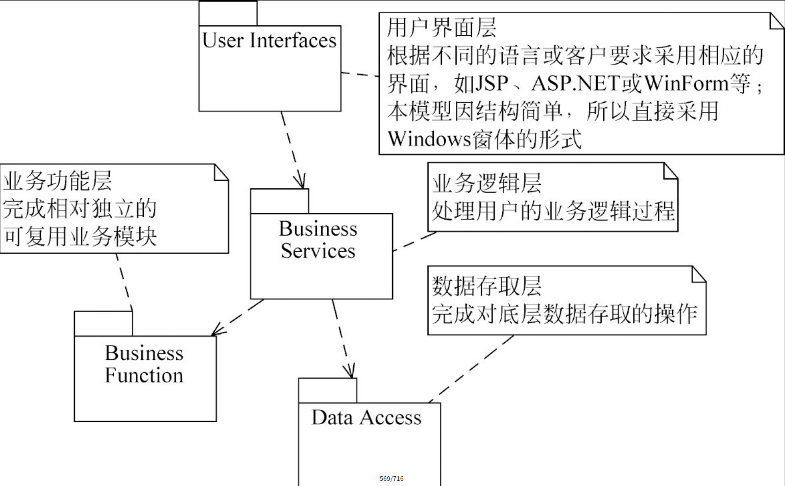
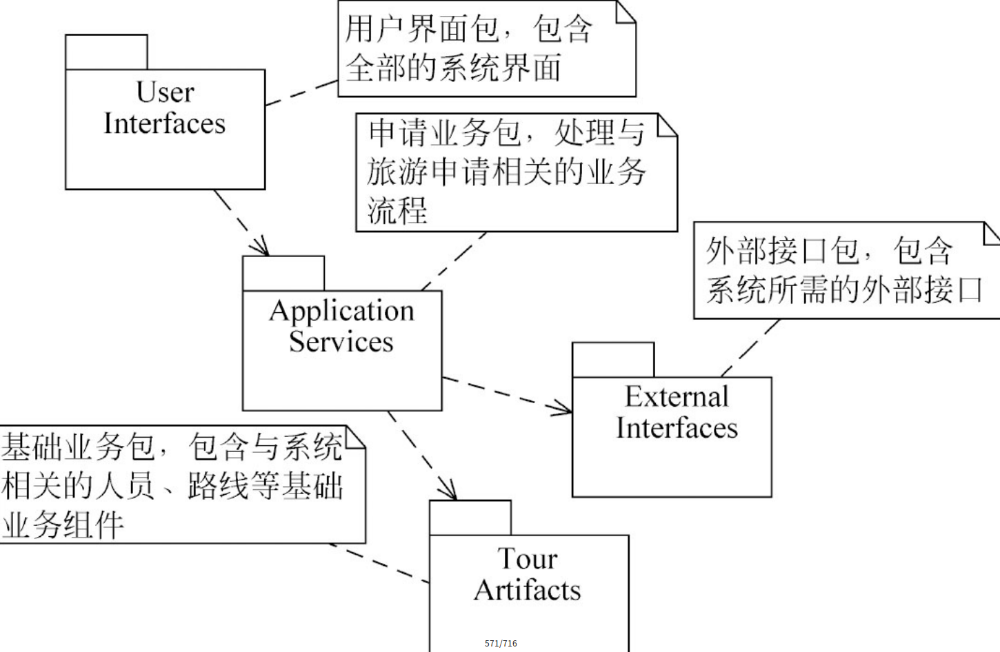
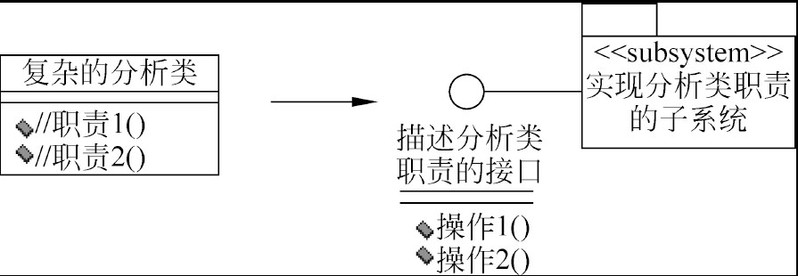
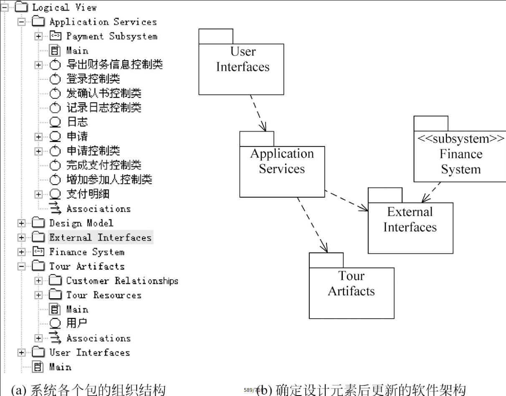
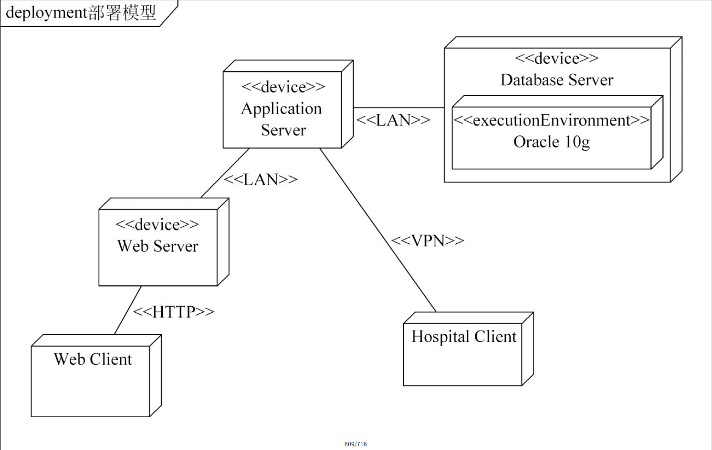
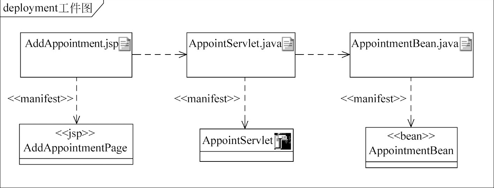
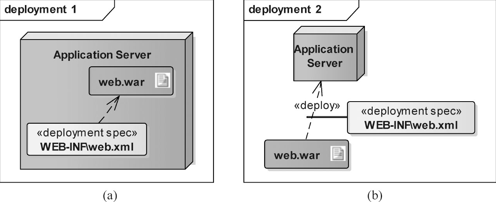
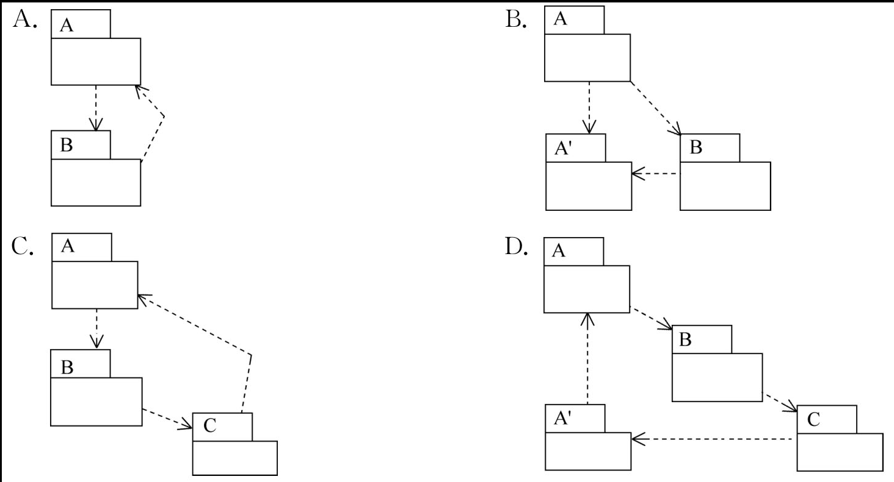
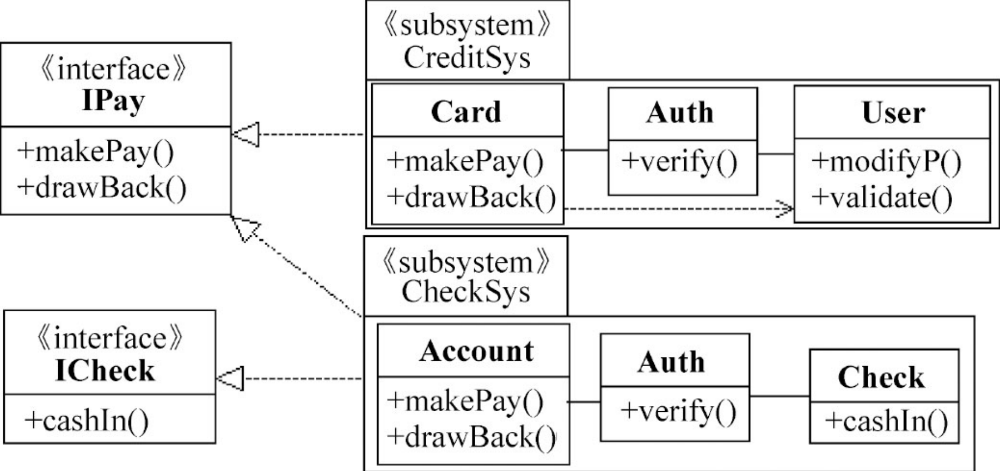

# 架构设计

## 本章目标

在面向对象的系统中，架构扮演着至关重要的角色，各类设计元素按照架构的约束和规则构成系统各个组成成分，从而满足系统需求。
本章将首先介绍架构设计的基本概念和设计过程，然后详细介绍架构设计的各项内容，包括 `定义设计元素` 、 `处理设计机制` 、 `定义实现架构` 及 `部署架构` ；

重点关注设计元素和设计机制相关内容。主要内容

* 了解分析与设计的联系和区别。
* 掌握利用包图进行架构设计的基本概念和方法。
* 理解从分析类中确定设计元素的基本方法。
* 理解从相关分析机制中确定适当的设计机制的基本策略。
* 了解进程视图的基本概念和建模方法。
* 了解部署视图的基本概念和建模方法。

## 过渡到设计

设计是把分析模型转换为设计模型的过程，这个过程可分解为两个相对独立的阶段

* `架构设计` ，架构设计师根据项目的设计目标和相关的设计原则，对系统进行合理分解，形成不同的系统层次和各类构件，并对其中的核心元素和架构机制进行定义。

* `构件设计`，构件设计师利用架构设计提供的设计元素和架构机制，利用特定的实现技术来完成各类构件的详细设计方案，从而为实现提供输入。

### 理解设计

软件设计至少需要包括3个部分的内容：

* 描述系统如何分解和组织构件的架构
* 架构内各构件间的接口
* 各个具体构件的实现细节

根据出发点和策略不同，有3种不同类型的设计策略：

* `D-设计` 是一种对系统进行分解的设计策略，它从系统的需求入手，将系统分解为各个构件片，再对各个构件片进行内部设计以满足系统需求。
* `FP-设计` 是一种探求一定范围的通用性的设计策略，它一般不是从特定的需求入手，而是去探求问题的本质特征。
* `I-设计` 是基于概念化原型进行系统分析和设计，从而定义系统以满足所发现的需求。

### 从分析到设计

## 架构设计基础

对于小规模软件系统来说，通过类可以很方便地组织整个应用系统。然而，随着系统规模和复杂度的增加，类的数量会越来越多，仅仅使用类很难有效地组织和规划系统开发活动。因此，需要更大粒度的组织单元对系统进行组织，这就是“包”；而在“包”这一层的设计活动就是架构设计。

### 架构

架构是一个系统的组织结构，包括系统分解成的各个部分、它们的连接性、交互机制和指导系统设计的相关规则。具有合理架构的系统，将使对系统的理解、测试、维护和扩展变得很容易。在当今以构件化、复用技术为主流的系统开发中，架构的作用更加重要。

* `确定核心元素`：在架构的中高层，以分析类为出发点，确定相应的核心设计元素，这些设计元素将作为构件设计的基本输入。
* `引入外围元素`：在架构的中低层，以分析机制为出发点，确定满足分析类要求的设计机制，并将相关的内容引入设计模型。
* `优化组织结构`：按照高内聚、低耦合等设计原则，整理并逐渐充实架构的层次和内容，以建立特定系统的合理架构。
* `定义设计后的组织结构`：除了考虑系统设计时的组织结构，架构设计还应该考虑设计完成后系统实现、运行及部署等阶段的组织结构。

### 包图

#### 包

在UML中，包是一种将模型元素分组的机制。它是一个容器，用来包含其他的UML元素。与此同时，包为其内部元素提供了名称空间，外界需要通过包的名称来访问其内部的元素。此外，还可以将包作为一个配置管理单元，以用于管理软件的开发和发布。

#### 依赖关系

### 包设计原则

对设计元素打包是架构设计的基本内容，通过对打包后的元素进行管理，可以在较高层次上描述软件的组织结构。基本的分包策略主要从两个方面考虑。

* 职责相似：将一组职责相似，但以不同方式实现的类归为一组有意义的包。
* 协作关系：包含了各种不同类型的类，它们之间通过相互协作实现一个意义重大的职责。这种分包的基本思路就是将功能相关的类打包在一起，以提高包的内聚度，并降低包间的耦合。

### 6个相关的包设计原则

* `复用发布等价原则`, 复用的粒度就是发布的粒度
* `共同复用原则` 包中的所有类应该是共同复用的；如果复用了包中的一个类，那么就要复用包中的所有类
* `共同封闭原则` 包中的所有类对于同一类变化应该是共同封闭的，即一个变化若对一个包产生影响，则将对该包中的所有类产生影响，而对其他包没有影响
* `无环依赖原则` 包图中的依赖关系不允许存在环
* `稳定依赖原则` 朝着稳定的方向进行依赖
* `稳定抽象原则` 包的抽象程度应该和其稳定程度一致

### 利用包图设计架构

在架构设计的具体实施过程中，初期的架构依赖于分析阶段所考虑的包进行。在此基础上，针对分析阶段所定义的备选架构中的各类包，可能会从以下几个方面发生改变。

* 追加分析阶段所没有考虑到的与实现环境相关的细节，从而添加新的设计包。
* 利用现有的第三方中间件或平台提供的功能来实现的包，将被替换为接口和相应的子系统。
* 针对系统中的变化点，运用相应的设计原则和策略进行抽象，从而构成新的抽象包（或接口和子系统）。
* 考虑部署环境时，如果需要将某个包的内容部署到多个不同的节点，则将与部署环境相匹配，将包分割成若干子包。
* 在包与包之间发现了通用的部分，从而将通用部分单独作为包来封装。

## 确定设计元素

### 从分析类到设计元素

设计元素是指能够直接用于指导实现（编码）的模型元素。针对不同的设计问题和设计目标，可以定义各种不同类型的设计元素。主要的设计元素有以下几个。

* `设计类`：代表一组精确定义的职责集，可以直接用于实现。
* `子系统`：代表一组复杂操作的职责集，这些操作最终由其内部的子系统或类来实现。
* `接口`：代表一组由某个类或子系统所提供职责的抽象声明。
* `主动类`：代表系统内的控制线程。

设计类与子系统可以将相关的职责封装到不同的单元，从而对各个单元进行相对独立的开发。设计类负责实现不可分的相关职责集，而子系统属于复合构件，由设计类或其他子系统组成。子系统常用于将开发团队的工作产品表示为完整的单一功能单元，这种单元既可用作控制与配置管理单元，又可用作逻辑设计元素。

* `事件`：代表了系统必须响应的内部或外部激励。
* `信号`：代表在系统内部传送某些类型的事件时所使用的异步机制。

### 确定事件和信号

事件是对一个在时间和空间上占有一定位置的有意义的发生行为的规约。信号也是一种事件，表示在实例间进行通信的异步消息的规约。事件可以是内部事件或外部事件。外部事件是系统和参与者之间传送的事件，而内部事件则是系统内对象之间传送的事件。

UML 2中包括4种不同的事件类型，即 `信号` 、 `调用` 、 `时间` 和 `状态迁移` 。

* 信号事件是一种特殊的事件，主要产生于系统内部，用来在系统中的不同并行元素之间进行异步通信。

* 调用事件表示对象接收到一个操作的调用。与信号不同，这类事件一般是同步的。
* 时间事件用来表示由时间相关因素触发而产生的推移事件。
* 状态迁移事件主要通过分析对象的状态机模型来确定，并映射到相应的类模型和交互模型中

### 组织设计类

设计类是设计模型中最基本，也是最主要的 `构成单位` 。其他的设计元素也都是在设计类的基础上定义出来的。例如接口是对设计类行为的抽象，子系统则是对若干个行为内聚的设计类的封装，而信号和事件也依赖于特定的设计类。架构设计期间需要描述初始的设计类，并建立合理的组织方式来管理这些设计类

#### 获取初始的设计类

初始的设计类主要来自分析模型中的分析类。一般来说，在设计的初期，可以直接把分析类映射到设计类中，这也是面向对象分析设计的特点，即设计是分析的自然延续，设计类直接来自分析类。不过由于设计期间会重新进行架构的设计，而且不同的系统其架构差别很大， `为此来自分析阶段的备选架构所提供的构造型（即边界、控制、实体）在设计中不再重要` ，而可以按照设计的要求定义更合适的构造型。

一般来说，分析类和设计元素之间是一种多对多的映射关系，并没有严格的规则去描述这个映射过程。
一个分析类可能成为设计模型中的如下元素之一。

* 一个简单的设计类。
* 一个类的一部分，即被合并到另一个设计类中。
* 同一个类派生而来的一组类。
* 一组功能相关的类（如一个包），即分解成几个设计类。
* 一个子系统，子系统的抽取参见第8.3.4小节。
* 一个关系，即分析类的信息不需要在设计模型中单独表示，只需要通过类之间的关系即可描述。
* 分析类之间的一个关系可以成为设计模型中的一个类，如分析模型中的关联类，以及设计期间新增加的关联类。
* 一个分析类的部分可能被硬件或第三方构件所实现，而不需要在设计模型中建模。
* 以上情况的任何组合。

#### 打包设计类

设计期间将更多地按照协作关系进行打包，从而降低包之间的耦合度；即考虑设计类之间的功能相关性，尽可能将功能相关的类打包在一起。可以从以下的角度来确定两个类在功能上是否相关。

* 如果某个边界类的功能是显示特定的实体类，它就可能在功能上与该实体类相关。
* 如果两个类与同一个参与者进行交互，或受到对同一个参与者更改的影响。
* 一个类的行为和（或）结构的变化使得另一个类也必须做出相应的变化。
* 一个类的删除影响其他类。
* 两个类的对象进行大量的消息交互，或者以一种复杂的方式相互通信。
* 两个类之间存在某些关系。
* 一个类创建另一个类的实例。

“旅店预订系统”初始打包策略

“旅游申请系统”初始架构

### 确定子系统和接口

设计类是设计中最基础和核心的组件，然而，在充分考虑设计质量的基础上，单个设计类的功能是非常单一的（参见单一类职责原则，需要考虑类的内聚性），一个简单的业务可能都需要多个类来完成。而在架构设计期间，不可能、也不应该在设计类的细节上花费过多的时间，需要更多地关注那些高层的设计问题和一些可复用的基础组件。为此，还需要其他的抽象机制来封装这些业务问题，这个机制就是子系统和接口。

#### 子系统和接口

子系统（Subsystem）本质上是一种特殊的包（采用构造型subsystem扩展包的语义），这种包是完全封装的，其内部元素并不对外公开。它实现一个或多个接口所定义的行为，外界通过接口来获取所需的服务。

接口和子系统、类之间的实现关系

接口的“棒棒糖”表示法

#### 抽取子系统

抽取子系统的根本出发点是封装性，即子系统内部的元素应该可以很好地封装在一起，并对外提供统一的访问接口，从而通过这种封装实现可替换性。总的来说，可以从以下几个角度抽取子系统。

* 如果某个协作中的各个类只是在相互之间进行交互，并且可生成一组定义明确的结果，就应将该协作和它的类封装在一个子系统中。
* 如果某个协作可由（或将由）单独的设计团队来独立开发（也可理解为相对独立），应通过子系统进行封装，并对外提供统一的访问接口，从而使子系统中的内容和协作被一个或多个接口完全隔离起来，子系统客户只能依赖于接口。这样，子系统的设计人员就完全脱离了外部依赖关系。虽然设计人员（或设计团队）需要指定接口的实现方式，但他们可以充分自由地更改子系统的内部设计，而不会影响外部依赖关系。
* 如果某个协作的行为具有很大的不确定性而影响整个系统的稳定性，则可以考虑将这类可变的行为封装为独立的子系统，从而将不稳定性限制在子系统内部，保证整个系统的稳定性。
* 如果某个协作的行为需要第三方实现（外包给第三方）、采购成熟的组件或需要外部系统实现等，都可以在设计期间利用子系统来封装，并明确其接口来实现与系统的互联互通。

从具体的分析类角度来考虑，可能将子系统的分析类主要分为3类。

第一类是提供复杂服务的类，这些分析类由于所封装的业务功能较为复杂，很难通过单一的设计类来实现，此时为了保证封装性，在设计期间可以将该分析类分解为相应的接口和子系统。

复杂的分析类转换为设计中的接口和子系统

#### 定义子系统接口

将类的行为封装到子系统后，有关这些行为的实现将在子系统设计期间完成（参见第9.2节），而架构设计期间主要关注外部行为，即接口以及所提供的行为，这些行为通过定义子系统的接口和其所包含的操作来描述。主要通过以下几个步骤定义子系统接口。

* 为子系统确定备选接口集

一个子系统并不是只能实现一个接口，它可以实现多个接口。因此，设计期间需要考虑有

* 寻找接口间的相似点

从确定的备选接口集中，寻找相似的名称、职责或操作。如果几个接口中存在相同的操作，则重新分解接口的要素，并抽取共同的操作来形成新的接口。同时，应充分考虑已有的接口，在可能的情况下复用这些接口。

* 定义接口间的依赖关系

接口操作的参数与返回值都有特定的数据类型，这些数据类型可能是简单数据类型（如整数、字符等），也可能是自定义的类或接口，此时该接口将依赖于这些数据类型。通过定义接口间的依赖关系，可以明确地描述系统接口间的耦合，这些耦合对系统的稳定性有非常重要的影响（因为一般接口都在系统高层，全局可见）。很多情况下，为了降低接口与系统其他设计元素间的耦合度，接口的参数和返回值也应该采用接口或抽象类，而不是具体类（即面向接口的编程思想，遵循依赖倒置原则）。

* 将接口映射到子系统

一旦确定了接口，就应创建子系统与它所实现的接口之间的实现关系。从子系统到接口的实现关系表明，子系统内部存在一个或多个实现接口操作的元素。在子系统设计期间（参见第9.2节），将会明确定义这些子系统到接口的实现，并由子系统设计人员来指定子系统中实现接口操作的具体元素。只有子系统设计人员才关注并能观察到这些操作的具体实现，而子系统的客户只能观察子系统到接口的实现。

* 定义接口所指定的行为

接口没有实现，但很多情况下，接口针对实现有一定的限制条件或约束，而且接口内的操作也可能存在一些制约关系，例如要求按照某种特定的顺序对接口调用操作（诸如，数据库访问接口要求必须执行打开数据库连接的操作，然后才能调用其他操作）。此时，必须明确定义这些约束规则，可以采用某种约束语言（如对象约束语言）、编程语言或文本说明等方式来描述。这些约束规则对子系统设计人员和接口客户均可见，从而保证接口子系统设计人员能够按照约束实现相关的操作，而接口客户也能够正确地操作接口。

* 将接口打包

接口属于系统架构层，架构设计师对接口的更改往往在架构方面具有重要意义。为了能够有效地管理，应将接口分成独立的一个或多个包，这些包由架构设计师维护。当然，如果每个接口都由单个子系统来实现，则可以将接口放置在子系统的层面。如果接口由多个子系统来实现，则应将其放置在系统顶层架构的一个单独的包中。这样，就可以独立于子系统本身来对接口进行管理和控制。

### 确定复用机会

第一类可复用的元素来自待开发系统内部。
第二类可复用的元素来自待开发系统外部。

* `寻找已提供的相似接口，并重新定义可复用接口`。将已确定的每个接口与现有子系统或构件所提供的接口进行比较，通过分析相似的行为和返回值，同时还要考虑参数，针对这些相似的接口，重新定义新的接口。
* `修改新确定的接口以与原有接口匹配`。在重新定义新的接口过程中，可能并不与原有的接口完全一致，此时应该考虑进行适当的调整以保持与现有接口的吻合程度。这些调整可能包括调整或添加新接口操作的参数、将操作拆分到不同的接口中。
* `去掉与新接口完全匹配的原有接口，实现接口的复用`。在进行简化和操作拆分后，如果出现与现有接口准确匹配的情况，则应删除原有接口而使用新定义的可复用接口。
* `修改子系统与接口之间的映射，将其映射到可复用接口上`。查看现有构件和备选子系统集，对子系统进行要素拆分，以便尽可能地使用现有构件满足系统的必需行为。在将子系统映射到构件时，应考虑与子系统相关的设计机制。有时候，虽然操作的签名完全匹配，但性能或安全需求可能会使构件无法复用。

### 更新软件架构

大型软件系统一般先采用分层的架构，并在分层的基础上进行适当的分包

在架构分析中引入基本的分层架构，在架构设计时再结合应用的特点进行适当的调整和细分——可以合并简单的层，因为太多的分层将增加系统实现的难度，降低系统性能；

更新后设计包的组织和软件架构

## 引入设计机制

设计元素来自分析类，而分析类则主要关注功能需求，重点在考虑如何描述业务需求。设计期间除了通过确定设计元素来关注业务，还需要充分考虑系统的非功能需求和各种实现技术的应用，这就是架构机制所要解决的问题。在分析阶段以分析机制的形式对这些架构层的问题进行了记录，设计阶段则需要给出具体的设计方案来解决问题，这就是设计机制。

### 从分析机制到设计机制

对于分布机制，如果决定采用RMI来实现远程方法调用，就需要明确定义相应的访问接口和方式。这个过程就是确定设计机制。

### 确定设计机制

确定设计机制以每一个设计机制为出发点，引入具体的实现机制，对其实现细节进行详细的描述，包括详细定义其设计方案的原理和应用细节，以便在类设计阶段能够直接进行应用。类似于设计模式的定义，在定义设计机制时，也需要给出每个设计机制的具体的静态和动态结构。

**引入实现技术所需的构件包**

* 第一种方法是手工添加：按照包的结构和相应类、接口的定义，手动将它们添加到当前设计模型中，即绘制描述这些内部类的类图和接口的类图。这种方法最简单，但效率较低，而且容易出错，不推荐使用。
* 第二种方法是利用逆向工程工具(5)：通过逆向工程工具根据源代码逆向获得这些组件的设计模型，并将其添加到当前设计模型中。这种方法非常有效，其缺点是需要组件的源代码，而且需要强有力的逆向工程工具。
* 第三种方法是利用建模工具所提供的向导功能：很多建模工具在新建项目时提供了丰富的向导功能，可以选择将特定开发环境相关的类库导入到新建模型中。

**添加新包以描述架构机制**

在描述架构机制的实现过程中，需要绘制各类UML模型。而这些模型只是描述一个通用问题的解决方案，并不针对某个具体的用例，是作为一种特定的模式被表示并在构件设计中被应用到特定的用例实现中。

**添加为描述架构机制所需的设计元素**

每种架构机制的实现都会涉及不同的设计元素，为此需要把这些设计元素添加进来。同样，由于并不是针对具体的用例，因此，此处所谓的设计元素也是一个通用的占位符，并在构件设计时替换为具体的设计元素。

**描述架构机制的静态结构**
引入所需的角色类后，下一步就是对这些类进行详细定义，主要是类的操作和关系的定义。结合架构机制所要解决的问题需求，抽取并定义所需的操作和类之间的关系，并在类图中体现，这个过程可结合第5步的场景建模中的动态模型同步完成，即根据动态模型的情况定义类所需的操作和类间的关系。

**描述架构机制的典型应用场景**

不同的架构机制有不同的应用场景，可以采用UML交互图对架构机制的各种典型应用场景进行建模。
对于持久化机制，首先需要建模初始化行为，通过该行为获得数据库连接对象。

## 定义运行时架构

运行时架构是指系统在运行期间的组织结构。对于软件系统而言，其运行期间表现为操作系统中的进程和线程，因此运行时架构的建模将重点关注系统进程和线程的组织方式，以及设计元素在它们中如何进行调度。

### 描述并发需求

在分析并发需求前，首先解释并发（Concurrency）和并行（Parallel）这两个既相似又不同的概念。

* `并发`是指事件在系统中同时发生的趋势，这些事件之间并没有先后顺序，互不影响，但并不一定同时发生；
* `并行`则是指事件在系统中同一时刻同时发生，它具有并发的含义。

从实现来说，并发往往代表一个处理器同时处理多个任务；而并行则一般要求多个处理器或多核处理器同时处理多个不同的任务。

### 进程和线程建模

进程（Process）是操作系统中的重量级并行执行单元，在自己的空间中独立地运行，为系统提供独立的控制流程。而线程（Thread）则提供轻量级的控制流，它没有独立的运行空间，在所属进程的执行环境和地址空间中运行。

### 分配设计元素

每个进程都提供了特定的服务，这些特定的服务是由之前所提取的设计元素来实现的，同样这些设计元素也必须运行在特定的进程或线程中才能提供相应的服务。为此，需要将这些设计元素部署到相应的进程或线程中，这就是分配设计元素的过程。
将设计元素分配到进程中需要考虑系统的性能和并发需求、分布需求和对并发执行的支持程度，以及冗余和可用性需求等因素，同时还需要从设计元素自身的自主性、从属性、持久性和分布性等架构机制来考虑。在具体的分配过程中，可以同时采用两种不同的策略，即从内到外和从外到内。

* `从内到外`：是指从系统的内部结构入手，彼此密切协作，并且必须将在同一控制线程中执行的元素组合起来放在同一个进程中执行，同时拆分那些不互相影响的元素，从而提炼出不同的进程。重复这些步骤，直到进程达到最小数量，并能提供必需的、分布的和有效的资源利用。
* `从外到内`：是指从系统的外部激励入手，定义独立的控制线程来处理每个激励，定义独立的服务器控制线程来提供各项服务；同时考虑数据完整性、序列化等约束条件，将此初始的控制线程集精简至执行环境所能支持的数量。

### 描述系统部署

在架构分析中，分布被确定为一个分析机制，用来指出哪些类需要支持分布式访问。而在架构设计阶段，就需要描述与分布相关的设计细节，主要的工作包括以下内容。

* `选择并设计系统的分布式结构`：结合通用的分布模式，设计目标系统的分布式结构。
* `在物理节点间部署系统功能`：利用UML部署模型（即“4+1”视图中的部署视图）描述设计元素、进程、工件等在物理节点上的部署情况。
* `设计并实现分布机制`：针对分布机制，描述其相应的设计和实现机制。

### 分布模式

### 部署建模

**节点**
节点（Node）是部署模型中最基本的建模元素，表示物理运行时的计算资源，客户或服务器端的服务都需要运行在这些节点上。在UML中节点表示为一个立方体。

**工件**
工件反映了类、子系统等设计元素的物理存在形式，用来对各种文件进行建模。在UML中工件表示为一个矩形框，可用构造型(artifact)来说明，也可用右上角的文件图标来表示。工件可以是源代码、文档、脚本文件、二进制文件、数据库表、可发布软件等各种形式的文件。为此，可以通过构造型来区分不同类型的文件，如(file)表示一般性的文件；(document)表示一般性文档；(source)表示源代码文件；(executable)表示可执行文件；(jar)表示可执行的java包等。

**部署和部署规范**

系统最终需要部署在运行的客户或服务器环境中才能发挥作用，这个部署过程采用部署关系描述。部署（Deploy）是一种特殊的依赖关系，表示一件工件被部署到一个目标节点上。在部署图中，还可以将工件放在节点符号内或直接将名称罗列在节点内来表示工件和节点间的部署关系。而对于节点来说，一个节点可以有一组部署，每个部署都可确定一组被部署的工件。当然，部署一个系统不仅需要复制文件，还需要配置执行环境，这就需要用到部署规范。

### 定义分布机制

## 练习

### 选择题

1．下列有关需求、分析和设计这3个概念的论述中，错误的是（　D　）。

* A．需求是从用户视角描述用户问题
* B．分析是从开发团队视角描述用户问题
* C．设计是从开发团队视角解决用户问题
* D．需求在问题域，分析和设计则都在技术域

2．下列有关UML包图的论述中，正确的是（　D　）。

* A．只有类才可以被包含在包中
* B．包中不能包含其他包
* C．包之间可以存在泛化关系
* D．可以通过添加构造型将包表示为子系统

3．下列选项中，（　C　）不是设计元素。

* A．实体类
* B．设计类
* C．子系统
* D．接口

4．下列有关接口和实现关系的论述中，错误的是（  B  ）。

* A．接口是操作的集合
* B．接口主要用于支持代码的复用
* C．可以利用具体类来实现接口
* D．可以利用子系统来实现接口

5．关于泛化关系和实现关系的区别，下列论述错误的是（　A　）。

* A．实现关系容易支持多态性，而泛化关系则很难支持多态性
* B．泛化关系是类与类之间的关系，而实现关系则是设计元素与接口之间的关系
* C．泛化关系可以用于重用实现，而实现关系只能重用行为的规约
* D．泛化关系中父类可以提供缺省实现，而实现关系中接口不提供任何实现

6．与包相比，子系统具有更丰富的语义，它能够通过接口对外提供行为。下列4个选项中，（　A　）是包和子系统都具有的特点。

* A．一种分组机制
* B．对外提供行为
* C．完全封装实现细节
* D．容易被替换

7．在设计阶段的用例实现过程中，封装子系统交互带来的好处不包括（　D　）。

* A．简化交互图，减少混乱
* B．支持并行开发
* C．容易变更和替换
* D．降低开发成本

8．子系统的职责是指（　B　）。

* A．子系统内部元素的所有操作集合
* B．子系统接口的操作集合
* C．子系统代理类的操作集合
* D．不能直接建模，需要单独描述

9．关于接口和子系统的关系，下列说法错误的是（　D　）。

* A．子系统可以实现接口所描述的行为
* B．相同的接口可以有多个不同的子系统来实现
* C．一个子系统可以实现多个不同的接口
* D．实现相同接口的不同子系统，其对外体现的行为不一定相同

10．有关构架机制的概念，下列说法错误的是（　C　）。

* A．构架机制一般关注系统的非功能需求
* B．构架机制可分为分析机制、设计机制和实现机制
* C．设计机制是运用特定的实现技术来编码实现相应的分析机制
* D．设计模式也是一种设计机制

11．有关进程建模的概念，下列说法错误的是（　A　）。

* A．所有的系统都必须进行进程建模
* B．可使用类图进行进程建模
* C．进程和进程之间可以定义依赖关系
* D．进程和线程之间可以定义组合关系

12．已知类A有到类B的关联关系，类A运行于进程processA中，而类B运行于进程processB中，则进程processA和进程processB之间应该存在（　A　）关系。

* A．依赖
* B．关联
* C．组合
* D．条件不足，无法确定

13．关于部署图，下面说法正确的是（　C　）。

* A．任何系统都需要进行部署视图建模
* B．部署图可用来描述目标程序结构和关系
* C．部署图可用来描述系统的硬件结构
* D．部署图和构件图同构，只是表现方式不同

14．在进行系统构架设计时，一个最重要的原则就是避免包之间的循环依赖。下列4个选项中，（　B　）构架包图不存在循环依赖。

15．现要将下面的类图分割成3个包，下列选项中最合适的两个分割点是（　C　）。

* A．（a）和（d）
* B．（b）和（d）
* C．（d）和（f）
* D．（d）和（h）

16．下图展示了两个接口IPay和ICheck及相关子系统CreditSys和CheckSys的静态结构。根据该图，完成下列第（1）~（2）题。

（1）对于外界来说，上图中两个子系统所表现出来的职责（　C　）。

* A．完全相同
* B．不同，CreditSys比CheckSys多
* C．不同，CheckSys比CreditSys多
* D．无法确定，因为子系统内部实现细节未知

（2）某一外部类C，需访问上图中CheckSys子系统内Auth类的verify（）操作，则最佳访问方式是（　D　）。

* A．直接通过Auth类访问
* B．通过接口IPay访问
* C．通过接口ICheck访问
* D．Auth封装在子系统内部，其操作目前无法访问

### 简答题

1．面向对象的分析和设计有什么区别和联系？

> 在面向对象的方法论中，设计是分析的自然延续，是对分析模型的进一步细化。与分析一样，设计活动也是针对UML静态和动态模型开展，作为设计成果的设计模型的表现形式与分析模型类似。
> 但分析和设计的出发点和关注点不同，这两个活动在具体开展过程中存在这很大的差别，这种差别体现在其目标不同，分析的目标是明确了做什么，而设计则讨论怎么做问题。具体来说，分析重点关注系统的业务问题本身，在不考虑实现技术的基础上有效地确定了将要构建的内容；而设计则关注系统的技术和实现细节，重点考虑采用何种技术、何种平台来实现分析建模

2．什么是包，有哪些包设计原则？

> 包是一种将模型元素分组的机制，它是一个容器，用来包含其它的UML元素；与此同时，包还为其内部元素提供了名字空间、外界需要通过包的名字来访问其内部的元素
> 包设计原则包括复用发布等价原则、共用复用原则、共同封闭原则、无环依赖原则、稳定依赖原则和稳定抽象原则等

3．包之间的依赖关系是意味着什么，除了普通的依赖，还可以定义哪些关系？

> 包之间的依赖关系包含两层含义：
> * 其一是被依赖包的改变将影响到依赖包；
> * 其二则是依赖包不能够独立的复用，因为它依赖与被依赖包
> 除了普通的依赖关系，可以通过构造型进一步扩展不同的依赖关系，如合并、导入和访问等

4．什么是设计元素，面向对象设计中有哪些设计元素？

> 设计元素是指能够直接用于指导实现（编码）的模型元素，主要的设计元素有：设计类、子系统、接口、主动类、事件和信号等

5．什么是子系统，它和包有什么区别和联系？

> 子系统本质是一种特殊的包，这种包是完全封装的，其内部元素并不对外公开；它实现一个或多个接口定义的行为，外界通过接口来获取所需的服务
> 子系统的接口提供了一个封装层，从而是外部模型元素看不到子系统内部设计；这一概念用于将它和“普通”
>  
>  
>  
>  
>  
>  
>  
>  
>  
>  
>  
>  
>  
>  
>  
>  
>  

6．什么是接口，接口和相应的子系统之间是什么关系？
7．如何进行软件架构设计，架构设计时需要考虑哪些方面的问题？
8．什么是设计机制，它和分析机制、实现机制有什么区别和联系？
9．什么情况下需要设计系统的运行时架构，如何设计运行时架构？
10．有哪些典型的分布模式，利用什么UML模型描述系统部署？
