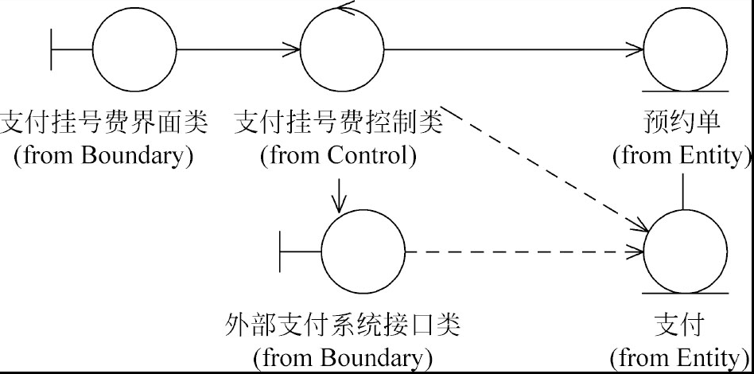
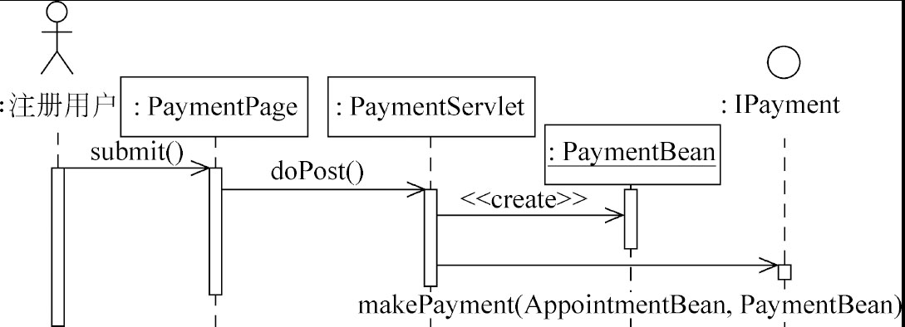
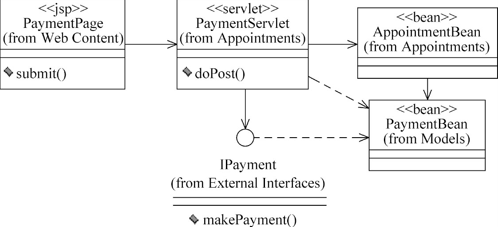
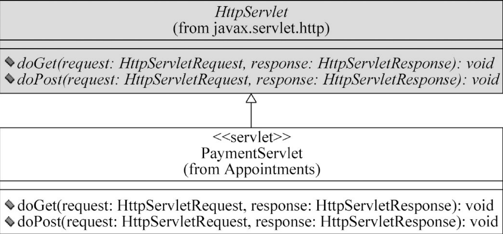
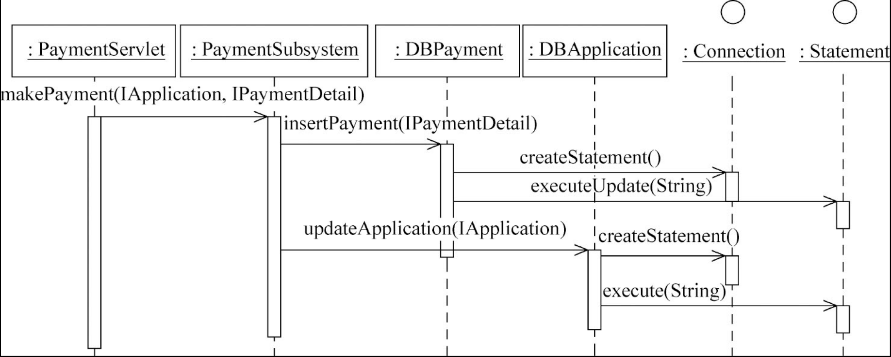
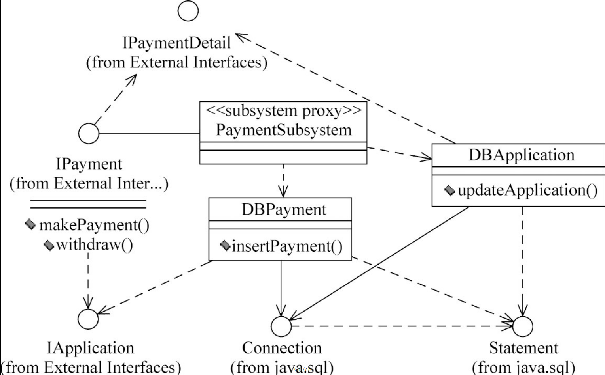
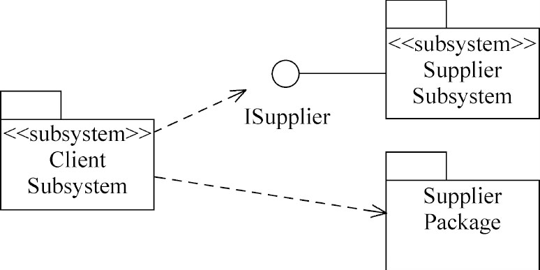
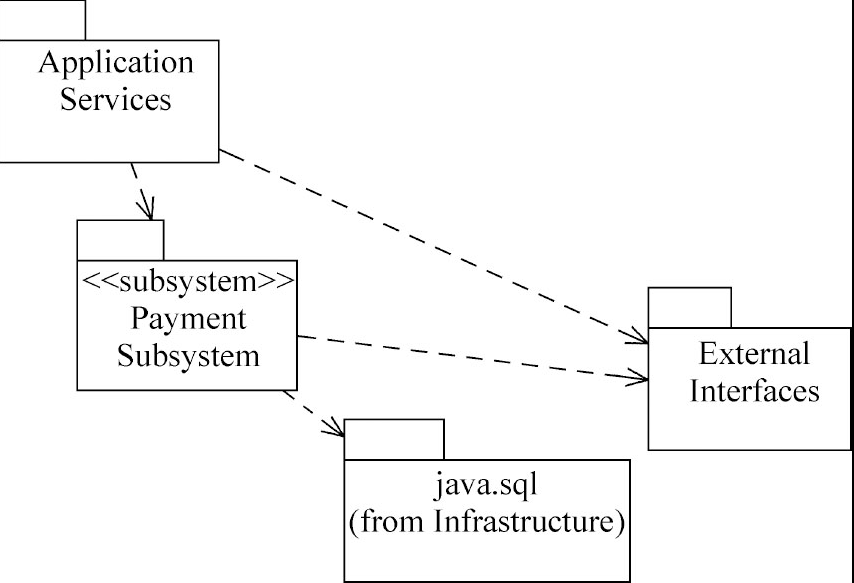
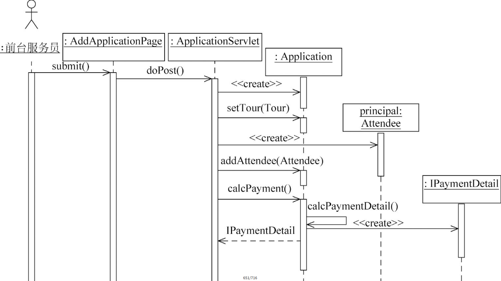
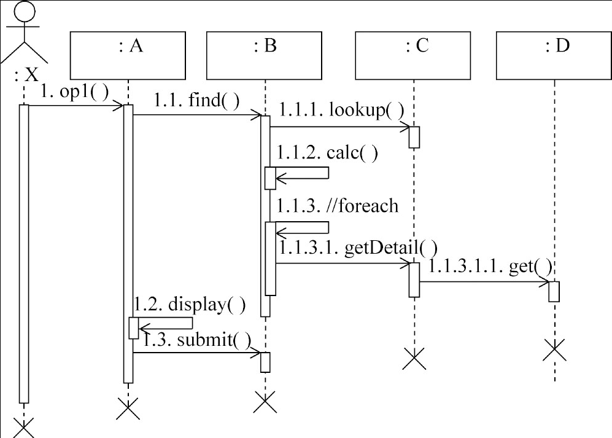

# 构件设计

架构建立了系统的核心结构和关键要素，而系统内部各组成成分的实现细节则需进一步细化，包括设计机制的实际应用、设计元素的细化等内容，这个过程就是构件设计。

## 本章目标

主要内容

* 掌握用例设计的基本过程和方法。

* 理解子系统设计的基本方法。

* 掌握设计类的定义、关系的使用方法。

* 掌握利用状态机图设计类对象的状态迁移的方法。

* 了解面向对象系统中对象模型和关系模型的映射及访问方法。

## 用例设计

用例设计是用例分析的延续，通过利用架构设计提供的素材（设计元素和设计机制等），在不同的局部，将分析的结果用设计元素加以替换和实现。遵循用例驱动的思想，通过将设计决策应用到分析所形成的用例实现模型中，从而获得设计所需的用例实现模型，并进而得到用于实现阶段的子系统、类的详细定义。用例设计过程主要包括以下活动。

* 引入设计元素和设计机制，改进交互图，描述设计对象间的交互。
* 针对复杂的交互图，引入子系统封装交互，简化交互图。
* 细化用例实现的事件流，为消息添加与实现相关的细节。
* 从全局角度评价、完善设计类和子系统，提高设计质量。

### 从用例分析到用例设计

在用例设计中改进交互图时，主要考虑两个方面的问题。

* 利用架构设计中所定义的设计元素取代分析类，重新确定参与交互的对象。然后，利用这些对象重新绘制交互图，并遵循相应的设计原则和模式，完成职责分配过程。
* 递增地并入适用的架构机制。引入所需的设计机制和设计模式，调整和完善交互图。

### 引入设计元素

在用例设计中，设计类可以直接取代对应的分析类。而设计子系统由于是包的概念，不能直接放在交互图中，可以采用两种方式来描述。

* 接口：可以代表任何实现该接口的模型元素（具体类或子系统），但同时由于接口没有任何实现，因此不能从接口的生命线上发出任何消息。

* 特定子系统的代理类：为每个子系统定义一个代理类，代表特定的子系统，该代理类可以发送和接收消息。

**支付挂号费-用例实现（分析）的VOPC类图**

在架构设计阶段，从该用例实现所给出的分析类入手，分别确定相应的设计元素。

* 支付挂号费界面类：采用Web页面的方式，对应一个用户页面类PaymentPage，并用构造型(jsp)说明采用JSP页面。
* 支付挂号费控制类：采用Servlet技术实现分布式访问，定义为PaymentServlet类，采用构造型(servlet)标记。
* 预约单实体类和支付实体类：对应相应的实体对象，分别定义为AppointmentBean和PaymentBean，采用构造型(Bean)标记。
* 外部支付系统接口类：在设计中映射为接口和子系统，分别定义IPayment接口和PaymentSubsystem子系统。

从分析类到设计子系统和接口

支付挂号费—用例实现（设计）的基本场景顺序图

支付挂号费—用例实现（设计）的VOPC类图

### 使用架构机制

PaymentServlet类的层次结构

### 利用子系统封装交互

利用子系统封装交互示意图

* 子流在不同的用例实现中重复出现。也就是说，相同（或相似）的消息发送给相同（或相似）的对象，产生相同的最终结果。
* 子流只在一个用例实现中出现，但期望在后期的迭代或者在后续相似系统中扩展/复用。
* 子流只在一个用例实现中出现，相对比较复杂但很容易被封装，它需要独立的人或者团队单独设计并实现，并且有明确的输入和输出。在这种情况下，复杂行为通常要求相关人员具备专业的技术或领域知识，因此适合将其封装在子系统中独立设计实现。
* 被封装在单独的构件中实现的子流，例如某些业务确定采用第三方构件来实现

### 细化并完善用例实现

通过交互图中的消息可以有效地描述操作的调用，但很难有效地描述有关操作的调用和实现细节。设计人员需要将这些细节通过注释、约束等方式添加到交互图中，这些细节包括操作调用的条件（可能包括前置条件、后置条件等）、操作内部实现行为的说明及一些实时性、存储要求等非功能需求。

与用例分析过程相同，在完成各个用例实现的设计方案后，还需要从系统的全局角度对用例实现进行评估和完善，以保证设计元素在全局上的一致性和完整性。可以从几个方面评价设计元素，包括元素的名称应能体现元素的功能，对相似的模型元素进行合并，使用继承来抽象模型元素，保持模型元素和事件流一致等方面。

## 子系统设计

在架构设计过程中，将复杂业务封装成独立的子系统和相应的接口，并对接口进行了定义。然而，并没有对这些接口是如何实现的细节做进一步描述，这些实现在子系统内部完成，这就是子系统设计的工作。

* 将子系统行为分配给子系统元素：一个子系统对外提供的行为完全由其接口进行描述，因此接口操作的集合代表了子系统的职责。子系统设计的第一步就是针对接口所描述的每一个操作进行设计，通过交互图将操作的职责分配给子系统内部的设计元素。
* 描述子系统内部的设计元素：在交互图的基础上，定义每个设计元素的结构和关系，完成子系统内部设计模型。
* 定义子系统间的依赖关系：分析子系统与外部设计元素之间的依赖关系，明确子系统之间的耦合，以便于子系统的复用。

### 分配子系统职责

子系统的外部行为是通过它所实现的接口定义的。当子系统实现了某个接口时，它就会保证支持该接口定义的每一个操作。而这些操作的实现需要子系统内部的设计元素来完成，这就可能涉及内部设计元素之间的交互。

支付子系统支付操作的顺序图

### 描述子系统内部结构

通过分配子系统的职责，可以发现并定义一些新的设计元素，这些设计元素位于子系统的内部。此外，还会用到一些外部的设计元素，这些设计元素都需要进一步的定义和描述。可以通过一个或多个类图来描述这些设计元素及它们之间的关系，从而定义子系统的内部结构。

支付子系统内部结构类图

### 定义子系统间的关系

子系统与子系统、包之间的依赖关系

支付子系统外部依赖关系图

### 子系统与构件

子系统为设计模型提供了一种封装机制，通过子系统可以有效地提高系统设计模型的抽象程度，降低系统的耦合。但正如前面所介绍的，UML并没有提供子系统建模的直接支持，本书采用构造型(subsystem)对UML包扩展的方式来表示子系统，这也是被大多数建模人员所熟悉并认可的一种方法。

### 设计类

设计类是设计模型的基本构造块，是指已经完成了详细的规格说明，从而能够被直接实现的类。与分析类来源于问题域、描述待解决问题的需求相比，设计类则来自两个方面。

* 问题域：通过对分析类的精化而得到的设计类。精化的过程包括添加实现的细节，或将高层次的分析类分解成多个设计类。
* 解域：来自实现环境，提供了能够实现系统的技术工具。如Java类库、第三方通用控件库、框架库等。

一个设计类的规格说明应至少包括完整的属性集合和操作集合。属性的定义包括详细说明的名称、类型、可见性、一些默认值等内容，而操作的定义则应包括操作的完整签名，即操作的名称、参数名称、参数类型、参数默认值、返回类型等内容。此外，针对类的关系、操作的实现及类对象内部状态的变化也需要进行进一步说明。这些就是类设计的工作，有关这些定义过程的细节将在后面的章节中一一介绍。

此外，定义设计类时，还需要从设计质量的角度出发去评价设计类是否合适，并注意一些设计原则和模式的应用，如封装、高内聚、低耦合、单一类职责原则等。

### 创建初始设计类

设计类来自分析类。因此在创建设计类时，首先应充分考虑分析类的构造型，针对边界、控制、实体这3类不同的类分别进行考虑，再引入可用的架构机制、设计模式等设计概念以得到初始的设计类。

1．边界类的设计策略

在分析模型中，边界类分为用户界面和系统接口。其中系统接口在架构设计时一般定义为子系统和接口来实现，并通过子系统设计来完成其内部设计流程。因此，此处主要考虑用户界面类的设计策略。

在分析阶段，通过为每对参与者和用例定义一个边界类的方法，从而找到最低限度的边界类。而在设计期间，需要研究具体的、与用户交互的场景，设计满足要求的最终用户界面。界面类的设计往往依赖项目可用的用户界面开发工具。目前大多数界面设计工具都提供了自动创建实现用户界面所必需的支持类的能力，这样我们便无须考虑过多类设计问题，而更多的应是从界面元素的布局等人机工程学方面去考虑问题。

用例设计期间构建的交互模型为界面设计提供了基本的输入，参与者对界面类的操作对应具体的界面元素的操作，每一次交互都应当有相应的界面元素或独立的表单来进行响应。除了界面自身布局的设计外，还需要考虑不同界面切换的设计方案。由于设计界面的细化，界面数量会变得很多，因此界面之间如何实现有效地切换和数据共享也是用户界面设计必须要考虑的问题。

2．实体类的设计策略

由于实体类本身职责的明确，所以大多数实体类都可以直接作为初始的设计类存在。不过由于实体类往往具有持久性架构机制，因此该架构机制的应用及数据库的一些设计原则也会影响到实体类的设计方案。此外，性能方面的要求也可能导致对实体类进行重构。图9-14描述了将某个实体类重构为3个设计类的示例，该例有助于理解实体类的设计策略。

3．控制类的设计策略
控制类的设计首先需要明确该控制类是否有必要存在，有些控制类只是简单地将边界类的消息转发给实体类，这种不含任何业务逻辑或处理流程的控制类就没有存在的必要。反之，当出现下列情况时，控制类就可能作为真正的设计类而存在。

* 封装非常重要的控制流行为，需要进行合理的流程控制。
* 封装的行为很可能变化，需要应对这些变化。
* 必须跨越多个进程或处理器进行分布式访问和处理。
* 封装的行为需要一些事务处理等其他应用逻辑。

### 定义操作

在确定初始的设计类后，就需要对这些设计类的细节进行逐一描述。结合用例设计和子系统设计的成果

**操作**

`操作` 是类的行为特征，它描述了该类对于特定请求做出应答的规范。

* 可见性是指该操作可以被外界访问的程度。

操作名是一个标识符，其命名方式应符合相应的编程语言命名规范。一个好的操作名应该从使用者的角度命名，操作的名称与交互图中消息的名称应一致。

* 小括号内为参数表，操作可以没有参数，也可以包括多个参数，用逗号分隔，每个参数又可以分别定义参数名、参数方向、参数类型、多重性、默认值等内容。

参数方向表示对应的形式参数的方向，有3个不同的取值：in代表输入参数，意味着该操作的方法实现中只读取该参数而不能修改它；out代表输出参数，没有输入值，操作的方法实现中不会读取它，但会改变它的值，操作调用完成后外界即可使用该参数；inout表示该参数同时可以读写，即操作的方法实现中可以读取它的值，也可以修改它，最终值对调用方可用。参数方向可以省略，默认情况下参数的方向为in。
参数类型应当是实现语言所支持的类型或设计模型中的类类型。参数的多重性代表该参数实例的个数，一个参数可以是单个的对象（多重性为1），也可能是一个对象的集合（多重性为∗），默认的多重性为1。参数的默认值应当是对应类型的值对象。

* 操作的返回类型也应当是实现语言所支持的类型或设计模型中的类类型，其多重性的含义与参数的多重性相同。

**发现操作**

录入申请信息用例设计

### 定义方法

### 状态建模

01. 状态机图

状态机（State Machine）是一种行为，说明对象在生命周期内响应事件所经历的状态变化过程及对事件的响应。状态机图（State Machine Diagram）是描述状态机的一种图，是由状态和转移组成的有向图。

**状态**

`状态` 描述了对象的生命周期中所处的某种条件或状况；在此期间对象将满足某些条件、执行某些活动或等待某些事件的发生。在UML中，状态表示为一个圆角矩形，矩形内的文字代表状态的名称。除了名称外，对于复杂状态，还可以进一步描述其内部结构，这些内部结构可能包括以下内容。

* `入口动作`：表示进入该状态之前需要自动执行的动作，是在转移发生之后、内部活动之前所要执行的原子操作。用“entry/动作名”的格式表示。
* `出口动作`：表示转出该状态之前需要自动执行的动作，是在内部活动之后、转移发生之前所要执行的原子操作。用“exit/动作名”的格式表示。
* `状态活动`：表示处于当前状态下正在进行的活动，在入口动作之后、出口动作之前执行的活动，在状态内部可以多次执行，也可以被中断。用“do/活动名”的格式表示。
* `内部转移`：相当于普通的转移，但该转移没有目标状态，也不会导致状态的改变。与普通的转移一样，内部转移也可以说明事件、条件、动作等细节。
* `延迟事件`：指在当前状态下暂不处理，将其推迟到该对象的另一个状态下排队处理的事件列表中。用“事件名/defer”的格式表示。
* `子状态机`：在一个状态机中可以引用另一个状态机，被引用的状态机称为子状态机。通过子状态机可以形成状态的嵌套结构。子状态机可以通过独立的状态机图描述，也可以在当前状态机中利用复合状态（Composite State）表示。子状态机可以由一个或多个区间组成，每个区间有一组互斥的子状态和对应的转移。

在状态机中，包括两个特殊的状态：初态和终态。初态表示状态机或子状态的默认开始位置，用一个实心圆”表示；终态表示该状态机或外围状态的执行已经完成，用一个内部包含实心圆的圆圈”表示（图示与活动图的起点和终点相同）。

**转移**
`转移` 是两个状态之间的有向关系，表示对象在某个特定事件发生且满足特定条件时将在第一个状态中执行一定的动作，并进入第二个状态。一个转移由5部分组成。

* `源状态`：即受转移影响的状态。当对象处于源状态，可以激活该转移。
* `事件触发器`：是引起转移发生的事件。当源状态中的对象识别到该事件后，在守卫条件满足的情况下激活转移。
* `守卫条件`：是一个布尔表达式。当事件发生时，检测该布尔表达式的值，如果表达式为真，则激活当前转移；如果没有其他的转移能被该事件触发，则该事件将丢失。
* `动作`：是一个可执行的原子行为，当转移激活后，执行该动作。它可以直接作用于拥有状态机的对象，也可以通过该对象间接作用于可见的其他对象。
* `目标状态`：即转移完成后的活动状态。

02. `状态建模方法`

`状态建模` 可以针对一个完整的系统（或子系统），也可以针对单个类对象或用例（或用例的某个交互片段），其目标是关注在其内部哪些事件导致状态改变及如何改变。在类设计期间，针对那些受状态影响的对象进行状态建模，从而可以描述该对象所能够响应的事件、对这些事件的响应及以往行为对当前行为的影响等方面的问题。状态建模过程需要从以下几个方面展开。

## 练习

### 选择题

1．在分析阶段，建立了类A到类B的单向关联；在用例设计过程中，出于其他原因，将类A封装到子系统S1中，而将类B封装到子系统S2中，此时子系统S1和S2之间（　C　）。

* A．建立从子系统S1到S2的依赖关系
* B．建立从子系统S1到S2的关联关系
* C．建立从子系统S1到S2的接口之间的依赖关系
* D．建立从子系统S1到S2的接口之间的关联关系

2．在进行类设计时，类之间共有5种关系，它们之间的耦合度也各不相同。下列4个选项中，（　C　）的耦合度最高。

* A．关联关系
* B．组合关系
* C．泛化关系
* D．依赖关系

3．当需要描述一个类的对象跨越多个用例所表现出的不同行为时，应该考虑（　C　）。

* A．对象图
* B．顺序图
* C．状态机图
* D．通信图

4．下列类关系中，（　B　）不能在类自身之间建立。

* A．关联关系
* B．依赖关系
* C．聚合关系
* D．组合关系

5．已知类A需要类B提供的服务。下列所描述的4种情况中，（　A　）一般不会把类A和类B之间的关系定义成依赖关系。

* A．类A中存在两个操作都需要访问类B的同一个对象
* B．类A的某个操作内部创建了类B的对象，而其他操作均与类B无关
* C．类A的某个操作的参数是类B的对象，而其他操作均与类B无关
* D．类B是一个全局变量

6．关于关系数据库和面向对象系统之间的差别，下列论述中错误的是（　C　）。

* A．关系数据库集中在数据上，而面向对象系统则集中在行为上
* B．关系数据库直接对外暴露数据，而面向对象系统则封装数据
* C．面向对象系统比关系数据库更先进，更高效
* D．面向对象系统适合处理复杂行为，而关系数据库则适合数据报表系统

7．数据库设计过程就是将对象模型映射成数据模型，下列4个选项均给出了两个术语，其中前一个为对象模型中的术语，后一个为数据模型中的术语，那么（　C　）术语不是对应的。

* A．类、实体
* B．关联、关系
* C．属性、主键
* D．操作、存储过程

8．在下面的状态机图中，描述了两个状态State1和State2之间的转移，该转移上面所描述的4个选项中，（　C　）代表转移发生时需要满足的条件。

9．下图是某系统用例的早期用例实现（设计）的顺序图。
随着设计过程的深入，基于多方面的原因，设计师将类B、C封装成了一个子系统S。在子系统设计阶段，采用顺序图对该子系统的职责find（）进行详细设计，则下列消息不会出现在该顺序图中（选项中采用的是上图中的消息编号）的是（　D　）。

* A．1.1.1
* B．1.1.3.1
* C．1.1.3.1.1
* D．1.3

10．下图是类C的状态模型，其状态的变化主要是受该类的属性x（整数类型）的影响。
当类C的对象c1处于A2状态时，若将x值修改为25，则该对象将转入（　C　）状态。

* A．A1
* B．A2
* C．B1
* D．无法确定

11．根据下面所示的类图，完成第（1）~（4）题。
（1）上图中订单和订单项之间的关系是（　D　）。

* A．依赖关系
* B．关联关系
* C．聚合关系
* D．组合关系

（2）上图中订单和商品之间的关系是（　A　）。

* A．依赖关系
* B．关联关系
* C．聚合关系
* D．组合关系

（3）针对上图中类的关系论述，错误的是（　D　）。

* A．订单项不能脱离订单独立存在
* B．一件商品至少存储在1个仓库中
* C．一个中心仓库可能没有，也可能有多个分仓库
* D．仓库类的自反关联意味着每个仓库对象之间存在着自反链接

（4）在类设计期间，需要将上图中商品和仓库之间的关联类设计为普通的类。下列设计方案中，正确的是（　D　）。

### 简答题

01. 用例设计和用例分析有什么区别和联系？

用例设计是用例分析的延续，通过利用架构设计提供的素材（设计元素和设计机制等），
在不同的局部，将分析的结果用设计元素加以替换和实现。
用例设计所采用的建模方法与用例分析完全相同，主要还是交互图分析动态场景、类图
描述静态结构。但是，其出发点和关注点则完全不同：从出发点上来说，不再使用分析类的
概念分配职责，而是从设计元素、设计机制的角度，结合设计原则和模式（包括 GoF 模式
和职责分配模式等）进行职责分配；从关注点来说，用例设计关注的是职责如何实现而不是
目标类需要提供什么职责，即目标类提供怎样的操作才可以响应这些消息，这意味着发送到
设计类的消息对应设计类的操作，而发送到子系统的消息对应其接口的操作。

02. 什么情况下可以将用例事件流中的交互封装为独立的子系统，封装之后有什么好处？

当出现下列情况时，可以考虑把将交互图中的子流封装成独立的子系统：
 子流在不同的用例实现中重复出现。也就是说，相同（或相似）的消息发送给相同
（或相似）的对象，产生相同的最终结果。
 子流只在一个用例实现中出现，但期望在后期的迭代或者在后续相似系统中扩展或
复用。
 子流只在一个用例实现中出现，相对比较复杂但却很容易被封装，它需要独立人或
21
者团队单独设计并实现，并且有明确的输入和输出。在这种情况下，复杂行为通常
要求具备专门的技术或领域知识，因此适合将其封装在子系统中独立设计实现。
 被封装在单独的构件中实现的子流，比如某些业务确定采用第三方构件来实现
利用子系统封装交互有效地提高了用例实现事件流的抽象级别，从而使得用例实现的结
构相对比较清楚，较少混乱，尤其针对在那些非常复杂的交互而言。同时，这种方式可以在
完成子系统内部设计之前可以创建用例实现，以利于并行开发。此外，封装使得用例实现变
得更加通用，也更容易适应变更，因为子系统是可替换的，只要保持接口不变。

03. 什么是子系统的代理类，子系统的接口和代理类有何区别和联系？

在子系统设计时，为了便于在交互图中描述子系统，可以为每个子系统定义特定的代理
类，其操作即为子系统的职责。与接口不同的是，代理类在子系统内部，对外代表特定的子
系统；而接口在子系统外面，代表所有实现该接口的子系统。

04. 子系统设计主要包括哪些工作？

针对每一个待设计的子系统，需要完成以下三个方面的工作：
（1）将子系统行为分配给子系统元素：一个子系统对外提供的行为完全由其接口进行
描述，因此接口操作的集合代表子系统的职责。子系统设计的第一步就是针对接口所描述的
每一个操作进行设计，通过交互图将操作的职责分配给子系统内部的设计元素。
（2）描述子系统内部的设计元素：在交互图的基础上，定义每个设计元素的结构和关
系，完成子系统内部设计模型。
（3）定义子系统间的依赖关系：分析子系统与外部设计元素之间的依赖关系，明确子
系统之间的耦合，以便于子系统的复用。

05. 在类设计阶段，针对三种分析类的有什么不同的设计策略？

边界类的设计策略：边界类分为用户界面和系统接口，其中系统接口在架构设计时一般
定义为子系统和接口来实现，并通过子系统设计来完成其内部设计流程。而针对用户界面类，
需要研究具体的与用户交互的场景，设计满足要求的最终用户界面。界面类的设计往往依赖
项目可用的用户界面开发工具。目前大多数界面设计工具都提供了自动创建了实现用户界面
所必需的支持类的能力，这样类设计期间并不需要太多的考虑。更多地是从界面元素的布局
等人机工程学方面去考虑问题。
实体类的设计策略：由于实体类本身职责的明确性，大多数实体类都可以直接作为初始
的设计类存在。不过由于实体类往往具有持久性架构机制，因此该架构机制应用以及数据库
的一些设计原则也会影响到实体类的设计方案。此外，性能方面的要求也可能要对实体类进
行重构。
控制类的设计策略：控制类的设计首先需要明确该控制类是否有必要存在，有些控制类
只是简单地将边界类的消息转发给实体类，这种不含任何业务逻辑或处理流程的控制类就没
有存在的必要。当决定保留现有的控制类实现用例行为时，需要结合当前的用例实现和设计
质量方面的考虑，针对现有的控制类进行适当的处理，可以从以下两个方面改进控制类：（1）
提供公共控制类；（2）分解复杂的控制类。

06. 什么是操作和属性的可见性，有哪几种可见性？

可见性是指操作或属性可以被外界访问的程度。UML 规范定义了四种可见性：公有、
私有、保护和包可见性。

07. 什么是类的操作，什么是类的方法，它们有何区别和联系？

操作是类的行为特征，它描述了该类对于特定请求做出应答的规范。
方法是操作的具体实现算法，它描述操作如何实现的流程。
操作描述了类对外提供的接口，是类的外在行为。通过定义操作明确了参数和返回值等
接口细节；而方法则是关注操作内部实现算法的设计。
22

08. 什么情况下需要进行类的状态建模，如何进行状态建模？

在类设计期间，针对那些受状态影响的对象进行状态建模，从而可以描述该对象所能够
响应的事件、对这些事件的响应以及过去对当前行为的影响等方面的问题。
状态建模过程需要从几个方面展开：
 哪些对象有重要的状态，需要进行状态建模；
 针对需要进行状态建模的对象，如何确定该对象可能的状态；并分析状态之间的转
移，完成状态机模型；
 如何将状态模型中的状态和事件信息映射到模型的其它部分

09. 什么是关联的导航性，如何设计导航性？

导航性是指关联的方向，它描述了从源类的任何对象到目标类的一个或多个对象的访问
权限，消息仅能在箭头的方向上传递。
在分析阶段，没有描述导航性则默认为双向的导航。而设计阶段，则应根据需要设计单
方向的导航性。好的面向对象设计的目标是最小化类间的耦合，而使用单方向的导航性可以
降低耦合，在没有导航性的方向上就没有类间的耦合，实现时也不需要额外的支持。此外，
双方向关联难以实现，需要消耗额外的维护成本。这些因素都表明，在设计期间应尽可能采
用单方向的关联。
当类 A 与类 B 关联时，应从类 A（或类 B）对象是否需要知道类 B（或类 A）的对象
入手来分析它们之间的导航性；换个角度来说，即从类 A（或类 B）对象是否向类 B（或类
A）的对象发送消息。

10. 什么是类间的组合关系，和聚合关系有何区别和联系？

组合关系是一种特殊的聚合关系，在整体拥有部分同时，部分不能脱离整体而存在；当
整体不存在时，部分也没有存在的意义。从实现的角度来说，聚合表示一种引用关联，即整
体保存部分的引用，部分本身可以相对独立地存在；而组合则表示一种值关联，整体直接拥
有部分的值，并负责部分的创建和删除。

11. 什么是类间的依赖关系，哪些情况下定义为依赖关系？

依赖是一种使用关系，表示一个类对象使用另外一个类对象的信息和服务，被使用对象
的变化可能会影响到使用对象。
定义为依赖关系的几种情况：参数引用，局部声明引用和全局引用。

12. 类间的泛化关系有什么优点和缺点？

优点：通过使用泛化关系可以实现代码的复用和对多态的支持。
缺点：
 类间可能耦合的最强形式：子类会继承父类的所有的属性、方法和关系。
 类层次中的封装是脆弱的：父类的改动会直接波及所有下层的所有子类。
 在大多数语言中，继承是不能轻易改变：这种泛化关系是在编译时确定的，运行时
是固定的，不能改变。

13. 面向对象的设计中，数据库设计阶段需要考虑哪些问题？

数据库设计主要包括以下几个方面的工作：
 确定设计中需要存储的持久性类：这部分工作在前面的分析和设计中已同步开展，
通过持久化构架机制对持久化类进行了说明。
 设计适当的数据库结构以存储持久化类：数据库设计阶段的核心内容，需要根据已
有的对象模型设计对应的数据模型（实体关系模型）。
 为存储和访问持久化数据定义机制和策略，以满足系统的性能要求：遵循架构设计
中的相关设计机制的所提出的策略，实现数据的存储和访问。

14. 如何将对象模型映射为数据模型？

23
可以利用一定的映射规则从对象模型中直接构造数据模型，从而简化数据建模过程，主
要的规则包括：
映射类和属性：把每个需要持久化的实体类映射成一张表，持久化属性对应表中的字段；
类的对象对应表中的记录。
映射关联关系：类之间的关联关系在数据模型中通过主外键的约束来表达，根据多重性
的不同，有不同的映射规则。
映射泛化关系：数据模型没有提供泛化关系的直接实现机制，可以采用不同的设计方案
来实现泛化关系
