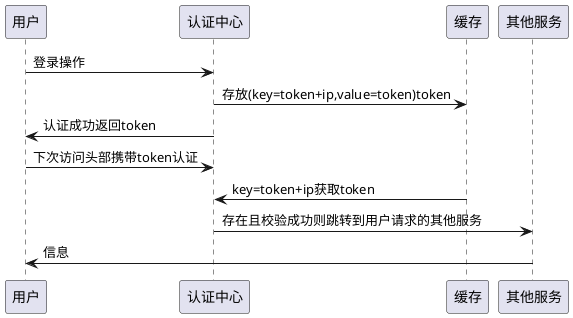

# 时序图

## 简单示例



## 声明参与者

 `关键字participant 声明参与者`

 `也可以使用以下关键字声明参与者，并改变对应参与者的外观`

* `actor`（角色）
* `boundary`（边界）
* `control`（控制）
* `entity`（实体）
* `database`（数据库）
* `collections`（集合）
* `queue`（队列）

``` 

participant participant
actor actor
boundary boundary
control control
entity entity
database database
collections collections
queue queue

participant -> actor : to actor
participant -> boundary: to boundary
participant -> control : to control
participant -> entity : to entity
participant -> database: to database
participant -> collections: to collections
participant -> queue: to queue
```

``` plantuml
participant participant
actor actor
boundary boundary
control control
entity entity
database database
collections collections
queue queue

participant -> actor : to actor
participant -> boundary: to boundary
participant -> control : to control
participant -> entity : to entity
participant -> database: to database
participant -> collections: to collections
participant -> queue: to queue
```

 `关键字 as ,重命名参与者`

 `使用颜色RGB或颜色名称改变actor或参与者背景颜色`

``` 

actor Bob #red
participant Alice
participant "很长很长很长的名字" as L #99FF99

Alice -> Bob : 认证请求
Bob -> Alice : 认证响应
Bob -> L : 记录事物日志
```

``` plantuml
actor Bob #red
participant Alice
participant "很长很长很长的名字" as L #99FF99

Alice -> Bob : 认证请求
Bob -> Alice : 认证响应
Bob -> L : 记录事物日志
```

 `关键字order自定义参与者顺序`

``` 

participant 中间 order 20
participant 最后 order 30
participant 首个 order 10
```

``` plantuml
participant 中间 order 20
participant 最后 order 30
participant 首个 order 10
```

## 在参与者中使用非字母符号

``` 

participant Alice
participant "Bob()" as Bob
participant "This is very\n long" as This

Alice -> Bob : Hello
Bob -> This
This --> Bob : ok
```

``` plantuml
participant Alice
participant "Bob()" as Bob
participant "This is very\n long" as This

Alice -> Bob : Hello
Bob -> This
This --> Bob : ok
```

## 给自己发消息

``` plantuml 
participant Alice
Alice -> Alice : This is a signal to self.\nIt also demonstrates\nmultiline \ntext

``` 

## 文本对齐

 `让响应信息显示在箭头下面`

``` plantuml
skinparam responseMessageBelowArrow true
participant Bob
participant Alice
Bob -> Alice : Hello
Alice --> Bob : ok
```

## 修改箭头样式

 `修改箭头样式方式：`

* 表示一条丢失的消息：末尾加 `x`
* 让箭头只有上半部分或者下半部分：将`<`和`>`替换成`\`或者 `/`
* 细箭头：将箭头标记写两次 (如 `>>` 或 `//`)
* 虚线箭头：用 `--` 替代 `-`
* 箭头末尾加圈：`->o`
* 双向箭头：`<->`

``` 

participant Bob
participant Alice

Bob ->x Alice
Bob -> Alice
Bob ->> Alice
Bob -\ Alice
Bob \\- Alice
Bob //-- Alice

Bob ->o Alice
Bob o\\-- Alice

Bob <-> Alice
Bob <->o Alice
```

``` plantuml
participant Bob
participant Alice

Bob ->x Alice
Bob -> Alice
Bob ->> Alice
Bob -\ Alice
Bob \\- Alice
Bob //-- Alice

Bob ->o Alice
Bob o\\-- Alice

Bob <-> Alice
Bob <->o Alice
```

## 修改箭头颜色

``` 

participant Bob
participant Alice
Bob -[#red]> Alice : hello
Alice -[#0000FF]-> Bob : ok  
```

``` plantuml
participant Bob
participant Alice
Bob -[#red]> Alice : hello
Alice -[#0000FF]-> Bob : ok  
```

## 对消息序列编号

 `关键字autonumber`

``` 

autonumber
Bob -> Alice : Authentication Request
Bob <- Alice : Authentication Response
```

``` plantuml
autonumber
Bob -> Alice : Authentication Request
Bob <- Alice : Authentication Response
```

 `可以指定编号初始值和每次增加的值`

``` 

autonumber
Bob -> Alice : Authentication Request
Bob <- Alice : Authentication Response

autonumber 15
Bob -> Alice : Another authentication Request
Bob <- Alice : Another authentication Response

autonumber 40 10
Bob -> Alice : Yet another authentication Request
Bob <- Alice : Yet another authentication Response
```

``` plantuml
autonumber
Bob -> Alice : Authentication Request
Bob <- Alice : Authentication Response

autonumber 15
Bob -> Alice : Another authentication Request
Bob <- Alice : Another authentication Response

autonumber 40 10
Bob -> Alice : Yet another authentication Request
Bob <- Alice : Yet another authentication Response
```

 `可以在双引号内指定编号的格式，格式是由 Java 的DecimalFormat类实现的： (0 表示数字；# 也表示数字，但默认为0)，也可使用html标签指定格式`

``` plantuml
autonumber "<b>[000]"
Bob -> Alice : Authentication Request
Bob <- Alice : Authentication Response

autonumber 15 "<b>(<u>##</u>)"
Bob -> Alice : Another authentication Request
Bob <- Alice : Another authentication Response

autonumber 40 10 "<font color=red><b>Message 0"
Bob -> Alice : Yet another authentication Request
Bob <- Alice : Yet another authentication Response
```

 `关键字autostart和autostop 表示自动编号开始和结束`

``` 

autonumber 10 10 "<b>[000]"
Bob -> Alice : Authentication Request
Bob <- Alice : Authentication Response

autonumber stop
Bob -> Alice : dummy

autonumber resume "<font color=red><b>Message 0  "
Bob -> Alice : Yet another authentication Request
Bob <- Alice : Yet another authentication Response

autonumber stop
Bob -> Alice : dummy

autonumber resume 1 "<font color=blue><b>Message 0  "
Bob -> Alice : Yet another authentication Request
Bob <- Alice : Yet another authentication Response
```

``` plantuml
autonumber 10 10 "<b>[000]"
Bob -> Alice : Authentication Request
Bob <- Alice : Authentication Response

autonumber stop
Bob -> Alice : dummy

autonumber resume "<font color=red><b>Message 0  "
Bob -> Alice : Yet another authentication Request
Bob <- Alice : Yet another authentication Response

autonumber stop
Bob -> Alice : dummy

autonumber resume 1 "<font color=blue><b>Message 0  "
Bob -> Alice : Yet another authentication Request
Bob <- Alice : Yet another authentication Response
```

## 页面标题, 页眉, 页脚

* 使用`title`关键词增加标题
* 使用`header`关键词增加页眉
* 使用`footer`关键词增加页脚

``` plantuml
title Example Title
header Header
footer Page 1 of 1 

participant Alice 
participant Bob

Alice -> Bob : message1
Alice -> Bob : message2

```

## 分割示意图

`关键字 newpage 用于把一张图分割成多张。
在 newpage 之后添加文字，作为新的示意图的标题。
这样就能很方便地在 Word 中将长图分几页打印。`

``` 

Alice -> Bob : message 1
Alice -> Bob : message 2

newpage

Alice -> Bob : message 3
Alice -> Bob : message 4

newpage A title for the\nlast page

Alice -> Bob : message 5
Alice -> Bob : message 6
```

``` plantuml
Alice -> Bob : message 1
Alice -> Bob : message 2

newpage

Alice -> Bob : message 3
Alice -> Bob : message 4

newpage A title for the\nlast page

Alice -> Bob : message 5
Alice -> Bob : message 6
```

## 组合消息

 `关键词:`

* `alt/else`
* `opt`
* `loop`
* `par`
* `break`
* `critical`
* `group`, 后面紧跟着消息内容

 `示例：`

``` 

participant Alice
participant Bob
participant Log

Alice -> Bob : 认证请求
alt 成功情况
    Bob -> Alice : 认证接受
else 某种失败情况
    Bob -> Alice : 认证失败

    group 我自己的标签
        Alice -> Log :开始记录攻击日志
        loop 1000次
            Alice -> Bob : DNS攻击
        end
        Alice -> Log : 结束记录攻击日志
    end
else 另一种失败
    Bob -> Alice : 请重复
end
```

``` plantuml
participant Alice
participant Bob
participant Log

Alice -> Bob : 认证请求
alt 成功情况
    Bob -> Alice : 认证接受
else 某种失败情况
    Bob -> Alice : 认证失败

    group 我自己的标签
        Alice -> Log :开始记录攻击日志
        loop 1000次
            Alice -> Bob : DNS攻击
        end
        Alice -> Log : 结束记录攻击日志
    end
else 另一种失败
    Bob -> Alice : 请重复
end
```

## 次级分组标签

 `关键字group，在标头处的[]之间显示次级文本和标签`

``` 

participant Alice
participant Bob
participant Log

Alice -> Bob : 认证请求
Bob -> Alice : 认证失败
group 我自己的标签 [我自己的标签2]
    Alice -> Log : 开始记录攻击日志
    loop 1000 次
        Alice -> Bob : DNS攻击
    end
    Alice -> Log : 结束记录攻击日志
end
```

``` plantuml
participant Alice
participant Bob
participant Log

Alice -> Bob : 认证请求
Bob -> Alice : 认证失败
group 我自己的标签 [我自己的标签2]
    Alice -> Log : 开始记录攻击日志
    loop 1000 次
        Alice -> Bob : DNS攻击
    end
    Alice -> Log : 结束记录攻击日志
end
```

## 给消息添加注释

 `关键字：`

* `note left` 消息左边添加注释
* `note right` 消息右边添加注释
* 以 `note left` 或 `note right` 开头，`end note` 结尾，添加多行注释

``` 

participant Alice 
participant Bob

Alice -> Bob : hello 
note left : this is a first note

Bob -> Alice : ok
note right : this is another note

Bob -> Bob : I am thinking
note left 
    a note
    can alse be defined
    on saveral lines
end note

```

``` plantuml
participant Alice 
participant Bob

Alice -> Bob : hello 
note left : this is a first note

Bob -> Alice : ok
note right : this is another note

Bob -> Bob : I am thinking
note left 
    a note
    can alse be defined
    on saveral lines
end note

```

## 其他的注释

 `关键字`

* `note left of` 在节点左边添加关键字
* `note right of` 在节点右边添加关键字
* `note over` 在一个或多个节点之间添加关键字
* `end note` 添加多行注释

 **修改注释[背景色](https://plantuml.com/zh/color)**

``` 

participant Alice 
participant Bob
note left of Alice #aqua
This is displayed
left of Alice.
end note 

note right of Alice : This is displayed right of Alice
note over Alice : This is displayed over Alice
note over Alice, Bob #FFAAAA: This is displayed\n over Bob and Alice.

note over Bob,Alice 
This is yet another
example of 
a long note
end note

```

``` plantuml
participant Alice 
participant Bob
note left of Alice #aqua
This is displayed
left of Alice.
end note 

note right of Alice : This is displayed right of Alice
note over Alice : This is displayed over Alice
note over Alice, Bob #FFAAAA: This is displayed\n over Bob and Alice.

note over Bob,Alice 
This is yet another
example of 
a long note
end note
```

## 改变备注框的形状 [hnote和rnote]

 `关键字`

* `hnote` 代表六边形的备注框
* `rnote` 代表正方形的备注框

``` 

participant caller 
participant server

caller -> server : conReq
hnote over caller : 空闲

server -> caller : conConf
rnote over server
"r"是正边形
"h"是六边形
end note

rnote over server
多
行
文本
end note

hnote over caller
多
行
文本
end note

```

``` plantuml
participant caller 
participant server

caller -> server : conReq
hnote over caller : 空闲

server -> caller : conConf
rnote over server
"r"是正边形
"h"是六边形
end note

rnote over server
多
行
文本
end note

hnote over caller
多
行
文本
end note

```

## 在多个参与者添加备注

 `关键字`

* note across : 备注描述 跨越所有参与者的备注
* note over 参与者start, 参与者end: 备注描述

``` 

participant Alice
participant Bob
participant Charlie

Alice -> Bob : m1
Bob -> Charlie : m2

note over Alice, Charlie : 创建跨越所有参与者的备注的旧方法：\n ""note over //FirstPart, LastPart//"".

note across : 新方法：\n""note across""

Bob -> Alice
hnote across : 跨越所有参与者的备注

```

``` plantuml
participant Alice
participant Bob
participant Charlie

Alice -> Bob : m1
Bob -> Charlie : m2

note over Alice, Charlie : 创建跨越所有参与者的备注的旧方法：\n ""note over //FirstPart, LastPart//"".

note across : 新方法：\n""note across""

Bob -> Alice
hnote across : 跨越所有参与者的备注

```

## 在同一级对齐多个备注 [/]

``` plantuml
participant Alice
participant Bob

note over Alice : Alice的初始状态
/ note over Bob : Bob 的初始状态

Alice ->Bob : hello

```

## Creole和HTML

[可以使用creole格式。](https://plantuml.com/zh/creole)

``` 

participant Alice
participant "The **Famous** Bob" as Bob

Alice -> Bob : hello --there--
... Some ~~long delay~~ ...
Bob -> Alice : ok
note left
  This is **bold**
  This is //italics//
  This is ""monospaced""
  This is --stroked--
  This is __underlined__
  This is ~~waved~~
end note

Alice -> Bob : A //well formatted// message
note right of Alice
 This is <back:cadetblue><size:18>displayed</size></back>
 __left of__ Alice.
end note
note left of Bob
 <u:red>This</u> is <color #118888>displayed</color>
 **<color purple>left of</color> <s:red>Alice</strike> Bob**.
end note
note over Alice, Bob
 <w:#FF33FF>This is hosted</w> by 
end note
```

``` plantuml
participant Alice
participant "The **Famous** Bob" as Bob

Alice -> Bob : hello --there--
... Some ~~long delay~~ ...
Bob -> Alice : ok
note left
  This is **bold**
  This is //italics//
  This is ""monospaced""
  This is --stroked--
  This is __underlined__
  This is ~~waved~~
end note

Alice -> Bob : A //well formatted// message
note right of Alice
 This is <back:cadetblue><size:18>displayed</size></back>
 __left of__ Alice.
end note
note left of Bob
 <u:red>This</u> is <color #118888>displayed</color>
 **<color purple>left of</color> <s:red>Alice</strike> Bob**.
end note
note over Alice, Bob
 <w:#FF33FF>This is hosted</w> by 
end note
```

## 分隔符

 `关键字`

* `==` 将图标分割成多个逻辑步骤

``` 

participant Alice
participant Bob

== 初始化 ==
Alice -> Bob : 认证请求
Bob --> Alice : 认证响应

== 重复 ==
Alice -> Bob : 认证请求
Bob --> Alice : 认证响应
```

``` plantuml
participant Alice
participant Bob

== 初始化 ==
Alice -> Bob : 认证请求
Bob --> Alice : 认证响应

== 重复 ==
Alice -> Bob : 认证请求
Bob --> Alice : 认证响应
```

## 引用

 `关键字`

* `ref over` 实现引用

``` 

participant Alice
actor Bob

ref over Alice, Bob : init 

Alice -> Bob : hello

ref over Bob
This can be on
serveral lines
end ref
```

``` plantuml
participant Alice
actor Bob

ref over Alice, Bob : init 

Alice -> Bob : hello

ref over Bob
This can be on
serveral lines
end ref
```

## 延迟

 `关键字`

* `...` 表示延迟，并且还可以给延迟添加注释

``` 

participant Alice
participant Bob

Alice -> Bob : 认证请求
...

Bob --> Alice : 认证响应
...

Bob -> Alice : 再见！
```

``` plantuml
participant Alice
participant Bob

Alice -> Bob : 认证请求
...

Bob --> Alice : 认证响应
...

Bob -> Alice : 再见！

```

## 空间

 `可以使用 ||| 来增加空间`

 `还可以使用数字指定增加的像素数量`

``` 

Alice -> Bob: message 1
Bob --> Alice: ok
|||
Alice -> Bob: message 2
Bob --> Alice: ok
||45||
Alice -> Bob: message 3
Bob --> Alice: ok
```

``` plantuml
Alice -> Bob: message 1
Bob --> Alice: ok
|||
Alice -> Bob: message 2
Bob --> Alice: ok
||45||
Alice -> Bob: message 3
Bob --> Alice: ok
```

## 生命线的激活与撤销

 `使用关键字activate和deactivate用来表示参与者的生命活动`

 `destroy表示一个参与者的生命线结束`

``` 

participant User
participant A
participant B
participant C

User -> A : Dowork
activate A

A -> B : << createRequest >>
activate B

B -> C : DoWork
activate C

C --> B : WorkDone
destroy C

B --> A : RequestCreated
deactivate B

A -> User : Done
deactivate A

```

``` plantuml
participant User
participant A
participant B
participant C

User -> A : Dowork
activate A

A -> B : << createRequest >>
activate B

B -> C : DoWork
activate C

C --> B : WorkDone
destroy C

B --> A : RequestCreated
deactivate B

A -> User : Done
deactivate A

```

 `使用嵌套的生命线，并且运行给生命线添加颜色。`

``` 

participant User
participant A
participant B

User -> A : DoWork
activate A #FFBBBB

A -> A : Internal call
activate A #DarkSalmon

A -> B : << createRequest >>
activate B

B --> A : RequestCreated
deactivate A
deactivate B

A -> User :Done 
deactivate A

```

``` plantuml
participant User
participant A
participant B

User -> A : DoWork
activate A #FFBBBB

A -> A : Internal call
activate A #DarkSalmon

A -> B : << createRequest >>
activate B

B --> A : RequestCreated
deactivate A
deactivate B

A -> User :Done 
deactivate A

```

 `使用关键字 autoactivate 自动激活，需要配合关键字 return `

``` 

autoactivate on
participant alice
participant bob
participant bill

alice -> bob : hello
bob -> bob : seft call
bill -> bob : hello form thread 2
bob -> george : create
bob --> bill : done in thread 2
bob --> bob : rc
bob -> george !! : delete
bob --> alice : success 

```

``` plantuml 
autoactivate on
participant alice
participant bob
participant bill

alice -> bob : hello
bob -> bob : seft call
bill -> bob #005500 : hello form thread 2
bob -> george : create
bob --> bill : done in thread 2
bob --> bob : rc
bob -> george !! : delete
bob --> alice : success 

``` 

## 返回

 `新命令return可以用于生成一个带有可选文本标签的返回信息。返回的点是导致最近一次激活生命线的点。语法是简单的返回标签，其中标签（如果提供）可以是传统信息中可以接受的任何字符串。`

```

Bob -> Alice : hello
activate Alice
Alice -> Alice : some action
return bye

``` 

```plantuml

Bob -> Alice : hello
activate Alice
Alice -> Alice : some action
return bye

```

## 创建参与者

 `关键字`

* `create` 放在第一次接收到消息之前，以强调本次消息实际上是在创建新的对象。

``` 

participant Bob
participant Alice
participant Other
control String

Bob -> Alice : hello

create Other
Alice -> Other : new 

create String
Alice -> String

note right String : You can also put notes!
Alice -> Bob : ok

```

``` plantuml
participant Bob
participant Alice
participant Other
control String

Bob -> Alice : hello

create Other
Alice -> Other : new 

create String
Alice -> String

note right String : You can also put notes!
Alice -> Bob : ok

```

## 激活、撤销和创建的快捷语法

在指定目标参与者后，可以立即使用以下语法：

* `++` 激活目标（可选择在后面加上[#color](https://plantuml.com/zh/color)）
* `--` 撤销激活源
* `**` 创建目标实例
* `!!` 摧毁目标实例

``` plantuml
participant alice
participant bob
participant bib

alice -> bob ++ : hello
bob -> bob ++ : self call
bob -> bib ++  #005500 : hello
bob -> george ** : create
return done
return rc
bob -> george !! : delete
return success

```

 `在一行上同时激活和撤销`

``` 

participant alice
participant bob
participant charlie 

alice -> bob ++: hello1
bob -> charlie --++ : hello2
charlie --> alice : ok
```

``` plantuml
participant alice
participant bob
participant charlie 

alice -> bob ++: hello1
bob -> charlie --++ : hello2
charlie --> alice : ok
```

## 进入和发出消息

 `如果只想关注部分图示，你可以使用进入和发出箭头`

 `使用方括号[和]表示图示的左、右两侧`

``` 

participant A

[-> A : Dowork
activate A 

A -> A : Internal call
activate A

A ->] : << createRequest >>

A<--] : RequestCreated

[<- A: Done
deactivate A
```

``` plantuml
participant A

[-> A : Dowork
activate A 

A -> A : Internal call
activate A

A ->] : << createRequest >>

A<--] : RequestCreated

[<- A: Done
deactivate A
```

## 缩短的进入信息与发出信息箭头

 `使用? 来显示缩短的箭头`

``` 

participant Alice
participant Bob

?-> Alice : ?->\nshow to actor1
?-> Bob : [->\nfrom start to actor1
[-> Bob : [->\nfrom start to actor2
?-> Bob : ?->\nshort to actor1
Alice ->] : ->]\nfrom actor1 to end
Alice ->? : ->?\nshort from actor1
Alice -> Bob : ->/nfrom actor1 to actor2
```

``` plantuml
participant Alice
participant Bob

?-> Alice : ?->\nshow to actor1
?-> Bob : [->\nfrom start to actor1
[-> Bob : [->\nfrom start to actor2
?-> Bob : ?->\nshort to actor1
Alice ->] : ->]\nfrom actor1 to end
Alice ->? : ->?\nshort from actor1
Alice -> Bob : ->/nfrom actor1 to actor2
```

## 锚定和持续时间

 `使用teoz在图表中添加锚定，从而指定持续时间`

``` plantuml
!pragma teoz true

participant Alice
participant Bob
participant Max

{start} Alice -> Bob : start doing things during duration
Bob -> Max : something
Max -> Bob : somehting else
{end} Bob -> Alice : finish
{start} <-> {end} : some time

```

## 构造类型和圈点

 `可以使用<<和>>给参与者添加构造类型`

 `在构造类型中，你可以使用(X,color)格式的语法添加一个圆圈圈起来的字符`

``` 

participant "Famous Bob" as Bob << Generated >>
participant Alice << (C,#ADD1B2) Testable >>

Bob->Alice: First message
```

``` plantuml
participant "Famous Bob" as Bob << Generated >>
participant Alice << (C,#ADD1B2) Testable >>

Bob->Alice: First message
```

 `默认使用 guillemet 字符来显示构造类型。 你可以使用外观参数 guillemet 来修改显示行`

``` 

skinparam guillemet false
participant "Famous Bob" as Bob << Generated >>
participant Alice << (C,#ADD1B2) Testable >>

Bob->Alice: First message
```

``` plantuml
skinparam guillemet false
participant "Famous Bob" as Bob << Generated >>
participant Alice << (C,#ADD1B2) Testable >>

Bob->Alice: First message
```

## 更多标题信息

你可以在标题中使用[creole](https://plantuml.com/zh/creole)格式。

``` 

title __Simple__ **communication** example

Alice -> Bob: Authentication Request
Bob -> Alice: Authentication Response
```

``` plantuml
title __Simple__ **communication** example

Alice -> Bob: Authentication Request
Bob -> Alice: Authentication Response
```

 `还可以使用关键字title和end title定义多行标题`

``` 

title
 <u>Simple</u> communication example
 on <i>several</i> lines and using <font color=red>html</font>
 This is hosted by 
end title

Alice -> Bob: Authentication Request
Bob -> Alice: Authentication Response
```

``` plantuml
title
 <u>Simple</u> communication example
 on <i>several</i> lines and using <font color=red>html</font>
 This is hosted by 
end title

Alice -> Bob: Authentication Request
Bob -> Alice: Authentication Response
```

## 包裹参与者

可以使用 ` box ` 和 ` end box ` 画一个盒子将参与者包裹起来。

还可以在 ` box ` 关键字之后添加标题或者背景颜色。

``` 

box "Internal Service" #LightBlue
    participant Bob
    participant Alice
end box

participant Other
Bob -> Alice : hello
Alice -> Other : hello
```

``` plantuml

box "Internal Service" #LightBlue
    participant Bob
    participant Alice
end box

participant Other
Bob -> Alice : hello
Alice -> Other : hello

```

## 移除脚注

 `关键字`

 * `hide footbox` 用来移除脚注

``` 

hide footbox
title Footer removed

Alice -> Bob: Authentication Request
Bob --> Alice: Authentication Response
```

``` plantuml
hide footbox
title Footer removed

Alice -> Bob: Authentication Request
Bob --> Alice: Authentication Response
```

## 外观参数

用[skinparam](https://plantuml.com/zh/skinparam)改变字体和颜色。可以在如下场景中使用：

*   在图示的定义中，
*   [在引入的文件中](https://plantuml.com/zh/preprocessing)，
*   在[命令行](https://plantuml.com/zh/command-line)或者[ANT任务](https://plantuml.com/zh/ant-task)提供的配置文件中。

你也可以修改其他渲染元素，如以下示例：

``` 

skinparam sequenceArrowThickness 2
skinparam roundcorner 20
skinparam maxmessagesize 60
skinparam sequenceParticipant underline

actor User
participant "First Class" as A
participant "Second Class" as B
participant "Last Class" as C

User -> A: DoWork
activate A

A -> B: Create Request
activate B

B -> C: DoWork
activate C
C --> B: WorkDone
destroy C

B --> A: Request Created
deactivate B

A --> User: Done
deactivate A
```

``` plantuml
skinparam sequenceArrowThickness 2
skinparam roundcorner 20
skinparam maxmessagesize 60
skinparam sequenceParticipant underline

actor User
participant "First Class" as A
participant "Second Class" as B
participant "Last Class" as C

User -> A: DoWork
activate A

A -> B: Create Request
activate B

B -> C: DoWork
activate C
C --> B: WorkDone
destroy C

B --> A: Request Created
deactivate B

A --> User: Done
deactivate A
```

``` 

skinparam backgroundColor #EEEBDC
skinparam handwritten true

skinparam sequence {
ArrowColor DeepSkyBlue
ActorBorderColor DeepSkyBlue
LifeLineBorderColor blue
LifeLineBackgroundColor #A9DCDF

ParticipantBorderColor DeepSkyBlue
ParticipantBackgroundColor DodgerBlue
ParticipantFontName Impact
ParticipantFontSize 17
ParticipantFontColor #A9DCDF

ActorBackgroundColor aqua
ActorFontColor DeepSkyBlue
ActorFontSize 17
ActorFontName Aapex
}

actor User
participant "First Class" as A
participant "Second Class" as B
participant "Last Class" as C

User -> A: DoWork
activate A

A -> B: Create Request
activate B

B -> C: DoWork
activate C
C --> B: WorkDone
destroy C

B --> A: Request Created
deactivate B

A --> User: Done
deactivate A
```

``` plantuml
skinparam backgroundColor #EEEBDC
skinparam handwritten true

skinparam sequence {
ArrowColor DeepSkyBlue
ActorBorderColor DeepSkyBlue
LifeLineBorderColor blue
LifeLineBackgroundColor #A9DCDF

ParticipantBorderColor DeepSkyBlue
ParticipantBackgroundColor DodgerBlue
ParticipantFontName Impact
ParticipantFontSize 17
ParticipantFontColor #A9DCDF

ActorBackgroundColor aqua
ActorFontColor DeepSkyBlue
ActorFontSize 17
ActorFontName Aapex
}

actor User
participant "First Class" as A
participant "Second Class" as B
participant "Last Class" as C

User -> A: DoWork
activate A

A -> B: Create Request
activate B

B -> C: DoWork
activate C
C --> B: WorkDone
destroy C

B --> A: Request Created
deactivate B

A --> User: Done
deactivate A
```

 `填充区设置`

``` 

skinparam ParticipantPadding 20
skinparam BoxPadding 10

box "Foo1"
participant Alice1
participant Alice2
end box
box "Foo2"
participant Bob1
participant Bob2
end box
Alice1 -> Bob1 : hello
Alice1 -> Out : out
```

``` plantuml
skinparam ParticipantPadding 20
skinparam BoxPadding 10

box "Foo1"
participant Alice1
participant Alice2
end box
box "Foo2"
participant Bob1
participant Bob2
end box
Alice1 -> Bob1 : hello
Alice1 -> Out : out
```

## 附录：箭头类型大全

``` 

participant Alice as a
participant Bob   as b
a ->     b : ""->   ""
a ->>    b : ""->>  ""
a -\     b : ""-\   ""
a -\\    b : ""-\\\\""
a -/     b : ""-/   ""
a -//    b : ""-//  ""
a ->x    b : ""->x  ""
a x->    b : ""x->  ""
a o->    b : ""o->  ""
a ->o    b : ""->o  ""
a o->o   b : ""o->o ""
a <->    b : ""<->  ""
a o<->o  b : ""o<->o""
a x<->x  b : ""x<->x""
a ->>o   b : ""->>o ""
a -\o    b : ""-\o  ""
a -\\o   b : ""-\\\\o""
a -/o    b : ""-/o  ""
a -//o   b : ""-//o ""
a x->o   b : ""x->o ""

```

``` plantuml
participant Alice as a
participant Bob   as b
a ->     b : ""->   ""
a ->>    b : ""->>  ""
a -\     b : ""-\   ""
a -\\    b : ""-\\\\""
a -/     b : ""-/   ""
a -//    b : ""-//  ""
a ->x    b : ""->x  ""
a x->    b : ""x->  ""
a o->    b : ""o->  ""
a ->o    b : ""->o  ""
a o->o   b : ""o->o ""
a <->    b : ""<->  ""
a o<->o  b : ""o<->o""
a x<->x  b : ""x<->x""
a ->>o   b : ""->>o ""
a -\o    b : ""-\o  ""
a -\\o   b : ""-\\\\o""
a -/o    b : ""-/o  ""
a -//o   b : ""-//o ""
a x->o   b : ""x->o ""

```

 `进入信息和发出信息（使用'[', ']'）`

 `进入信息（使用'['）`

``` 

 participant Alice as a
participant Bob   as b
[->      b : ""[->   ""
[->>     b : ""[->>  ""
[-\      b : ""[-\   ""
[-\\     b : ""[-\\\\""
[-/      b : ""[-/   ""
[-//     b : ""[-//  ""
[->x     b : ""[->x  ""
[x->     b : ""[x->  ""
[o->     b : ""[o->  ""
[->o     b : ""[->o  ""
[o->o    b : ""[o->o ""
[<->     b : ""[<->  ""
[o<->o   b : ""[o<->o""
[x<->x   b : ""[x<->x""
[->>o    b : ""[->>o ""
[-\o     b : ""[-\o  ""
[-\\o    b : ""[-\\\\o""
[-/o     b : ""[-/o  ""
[-//o    b : ""[-//o ""
[x->o    b : ""[x->o ""
```

``` plantuml
 participant Alice as a
participant Bob   as b
[->      b : ""[->   ""
[->>     b : ""[->>  ""
[-\      b : ""[-\   ""
[-\\     b : ""[-\\\\""
[-/      b : ""[-/   ""
[-//     b : ""[-//  ""
[->x     b : ""[->x  ""
[x->     b : ""[x->  ""
[o->     b : ""[o->  ""
[->o     b : ""[->o  ""
[o->o    b : ""[o->o ""
[<->     b : ""[<->  ""
[o<->o   b : ""[o<->o""
[x<->x   b : ""[x<->x""
[->>o    b : ""[->>o ""
[-\o     b : ""[-\o  ""
[-\\o    b : ""[-\\\\o""
[-/o     b : ""[-/o  ""
[-//o    b : ""[-//o ""
[x->o    b : ""[x->o ""
```

 `发出信息（使用']'）`

``` 

participant Alice as a
participant Bob   as b
a ->]      : ""->]   ""
a ->>]     : ""->>]  ""
a -\]      : ""-\]   ""
a -\\]     : ""-\\\\]""
a -/]      : ""-/]   ""
a -//]     : ""-//]  ""
a ->x]     : ""->x]  ""
a x->]     : ""x->]  ""
a o->]     : ""o->]  ""
a ->o]     : ""->o]  ""
a o->o]    : ""o->o] ""
a <->]     : ""<->]  ""
a o<->o]   : ""o<->o]""
a x<->x]   : ""x<->x]""
a ->>o]    : ""->>o] ""
a -\o]     : ""-\o]  ""
a -\\o]    : ""-\\\\o]""
a -/o]     : ""-/o]  ""
a -//o]    : ""-//o] ""
a x->o]    : ""x->o] ""
```

``` plantuml
participant Alice as a
participant Bob   as b
a ->]      : ""->]   ""
a ->>]     : ""->>]  ""
a -\]      : ""-\]   ""
a -\\]     : ""-\\\\]""
a -/]      : ""-/]   ""
a -//]     : ""-//]  ""
a ->x]     : ""->x]  ""
a x->]     : ""x->]  ""
a o->]     : ""o->]  ""
a ->o]     : ""->o]  ""
a o->o]    : ""o->o] ""
a <->]     : ""<->]  ""
a o<->o]   : ""o<->o]""
a x<->x]   : ""x<->x]""
a ->>o]    : ""->>o] ""
a -\o]     : ""-\o]  ""
a -\\o]    : ""-\\\\o]""
a -/o]     : ""-/o]  ""
a -//o]    : ""-//o] ""
a x->o]    : ""x->o] ""
```

 `短进入信息和短发出信息（使用'?'）  `

 `短进入信息（使用'?'）`

``` 

participant Alice as a
participant Bob   as b
a ->     b : //Long long label//
?->      b : ""?->   ""
?->>     b : ""?->>  ""
?-\      b : ""?-\   ""
?-\\     b : ""?-\\\\""
?-/      b : ""?-/   ""
?-//     b : ""?-//  ""
?->x     b : ""?->x  ""
?x->     b : ""?x->  ""
?o->     b : ""?o->  ""
?->o     b : ""?->o  ""
?o->o    b : ""?o->o ""
?<->     b : ""?<->  ""
?o<->o   b : ""?o<->o""
?x<->x   b : ""?x<->x""
?->>o    b : ""?->>o ""
?-\o     b : ""?-\o  ""
?-\\o    b : ""?-\\\\o ""
?-/o     b : ""?-/o  ""
?-//o    b : ""?-//o ""
?x->o    b : ""?x->o ""
```

``` plantuml
participant Alice as a
participant Bob   as b
a ->     b : //Long long label//
?->      b : ""?->   ""
?->>     b : ""?->>  ""
?-\      b : ""?-\   ""
?-\\     b : ""?-\\\\""
?-/      b : ""?-/   ""
?-//     b : ""?-//  ""
?->x     b : ""?->x  ""
?x->     b : ""?x->  ""
?o->     b : ""?o->  ""
?->o     b : ""?->o  ""
?o->o    b : ""?o->o ""
?<->     b : ""?<->  ""
?o<->o   b : ""?o<->o""
?x<->x   b : ""?x<->x""
?->>o    b : ""?->>o ""
?-\o     b : ""?-\o  ""
?-\\o    b : ""?-\\\\o ""
?-/o     b : ""?-/o  ""
?-//o    b : ""?-//o ""
?x->o    b : ""?x->o ""
```

 `短发出信息（使用'?'）`

``` 

participant Alice as a
participant Bob   as b
a ->     b : //Long long label//
a ->?      : ""->?   ""
a ->>?     : ""->>?  ""
a -\?      : ""-\?   ""
a -\\?     : ""-\\\\?""
a -/?      : ""-/?   ""
a -//?     : ""-//?  ""
a ->x?     : ""->x?  ""
a x->?     : ""x->?  ""
a o->?     : ""o->?  ""
a ->o?     : ""->o?  ""
a o->o?    : ""o->o? ""
a <->?     : ""<->?  ""
a o<->o?   : ""o<->o?""
a x<->x?   : ""x<->x?""
a ->>o?    : ""->>o? ""
a -\o?     : ""-\o?  ""
a -\\o?    : ""-\\\\o?""
a -/o?     : ""-/o?  ""
a -//o?    : ""-//o? ""
a x->o?    : ""x->o? ""
```

``` plantuml
participant Alice as a
participant Bob   as b
a ->     b : //Long long label//
a ->?      : ""->?   ""
a ->>?     : ""->>?  ""
a -\?      : ""-\?   ""
a -\\?     : ""-\\\\?""
a -/?      : ""-/?   ""
a -//?     : ""-//?  ""
a ->x?     : ""->x?  ""
a x->?     : ""x->?  ""
a o->?     : ""o->?  ""
a ->o?     : ""->o?  ""
a o->o?    : ""o->o? ""
a <->?     : ""<->?  ""
a o<->o?   : ""o<->o?""
a x<->x?   : ""x<->x?""
a ->>o?    : ""->>o? ""
a -\o?     : ""-\o?  ""
a -\\o?    : ""-\\\\o?""
a -/o?     : ""-/o?  ""
a -//o?    : ""-//o? ""
a x->o?    : ""x->o? ""
```

## 隐藏孤立参与者

 `关键字`

* `hide unlinked` 隐藏未被链接到的参与者

``` 

hide unlinked
participant Alice
participant Bob
participant Carol

Alice -> Bob : hello
```

``` plantuml
hide unlinked
participant Alice
participant Bob
participant Carol

Alice -> Bob : hello
```
