# UML建模图实战笔记

## 一、前言

UML：Unified Modeling Language（统一建模语言），使用UML进行建模的作用有哪些：

* 可以更好的理解问题
* 可以及早的发现错误或者被遗漏的点
* 可以更加方便的进行组员之间的沟通
* 支持面向对象软件开发建模，可以更好的描述显示编程的情景。
* 对于复杂的系统来说，如果概要模型做的好，那么整个系统的模型也就很清晰明了。

## 二、 UML介绍

UML 规格定义了两大类UML图：结构图（ structure diagrams ）和行为图（behavior diagrams）

**结构图（ structure diagrams ）**
结构图从不同的抽象和实现程度上描述了一个系统和系统构建的静态结构，并且描述了他们直接是如何关联到一起的。

**行为图（behavior diagrams）**
行为图展示了一个系统中的对象的动态行为，它描述了一个系统中的对象如何随着时间变化而变化。

下面借用下UML2.5官方图说明下UML图分类：

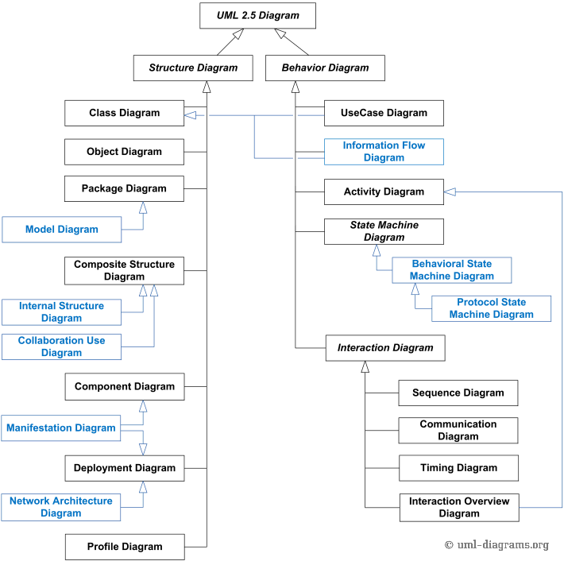

领域模型也叫概念模型，是对现实世界概念类的描述，并非软件对象描述，领域模型不是数据模型。在uml中领域模型被描述为一组没有操作的类图，具体说不是Java里面的软件对象或者具有职责行为的对象。他可以展现领域对象或概念类，概念类之间关联，概念类的属性。
三个要素，类名，属性 ，关联。
任何属性都不表示外键，应该直接使用关联关联到外键所在类。

## 三、用例图

在软件生命周期的整个过程中，用例图是软件需求分析到软件交付的第一步，用例图的主要目的是说明这个软件的使用者是谁，使用者要使用那些功能，以及使用者需要向软件提供什么功能。通过用例视图一来可以让使用者清楚的理解这个软件到底能提供什么功能，是不是满足自己的需求，另外一方面对应开发者来说，可以更好地理解需求，从而能更好的去实现这些需求。

用例图主要有六个元素，分别是：参与者(Actor)、用例(Use Case)、关联关系(Association)、包含关系(Include)、扩展关系(Extend)以及泛化关系(Generalization)。

**参与者（Actor）**
参与者在uml中用下面带有名字的小人来标示，主要表示与您的软件系统交互的人，组织或者外部软件系统。

**用例(Use Case)**
用例在uml中用使用椭圆标示，主要说明你的软件系统的功能，是使用文字描述的形式说明你的系统的功能。

**关联关系(Association)**
在uml中用例图中用箭头来标示，主要描述参与者与用例之间的关系。
 `【箭头指向】：指向用例`

**包含关系（Include）**
在uml中包含关系表示为虚线箭头交<>字样，有时候一个用例很大，那么我们可以把用例分块，把复杂的用例分解为几个小用例来描述
 `【箭头指向】：箭头指向被包含的用例`

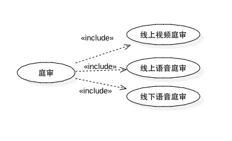

**扩展(Extend)**
在uml中扩展关系表示为虚线箭头加<>字样，扩展是指在基础用例功能的基础上插入新的功能点，新的功能点可以看做是对基础用例的扩展。
 `【箭头指向】：箭头指向基础用例`

**泛化(Inheritance)**
在uml中用例泛化用一个空心三角箭头从子用例指向父用例，泛化就是继承关系，子用例可以使用父亲用例中的属性，行为和关系。
 `【箭头指向】：箭头指向父用例`

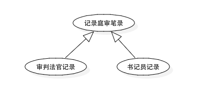

**Include、Extend、Inheritance总结对比**
包含关系强调整体与部分之间关系，也就是说整体的功能是由一个个子用例功能叠加起来的，比如上图庭审功能就包含了线上视频庭审，线上语音庭审，线下语音庭审功能，庭审用例本身是对子功能的汇总标示，具体功能点在子用例实现。

扩展关系则强调是在基础功能的基础上添加新的功能，基础功能本身是提供功能的，基础功能和扩展功能直接是不可见的，但是扩展功能是要在基础功能的某一个条件下才会发生，例如上面基础服务视频庭审已经提供了庭审的功能，现在有加了了扩展的语音识别功能来识别用户说的话为文字。之所以说是扩展功能是因为即便没有语音识别功能，视频庭审功能还是照样可以正常运转，之所以说扩展功能是有条件发生是因为只有开通了语音识别的视频庭审才能回有语音识别的扩展功能

泛化关系则强调复用的关系，也就是说子用例基础了父用例的一部分功能并且自己有新增了或者覆盖了父用例的功能，具体说比如上图视频庭审有个记录笔录的功能，这个本身是个独立的功能点，而书记员和法官都可以复用这个功能并对其定制化。

**一个案例**

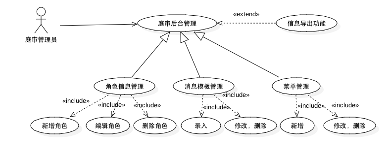

## 四、时序图

时序图建模工具，推荐一个工具 https://www.zenuml.com/

时序图是一种强调消息时序的交互图，他由对象（Object）、消息（Message）、生命线（Lifeline）和Combined Fragments组成，它主要描述系统中对象和对象之间的交互，它将这些交互建模成消息交换。

时序图将交互关系展示成了一个平面二维图，其中纵向标示时间轴，时间沿竖线从上向下进行。横向轴标示了交互中各各个对象。对象的的用生命线表示。消息从一个对象的生命线到另一个对象生命线的箭头表示，箭头以时间顺序在图中从上到下排列，从左到右排列。

**对象（Object）和生命线（Lifeline）**
生命线头上那个方正的框里面存放的就是对象，对象有自己的名字，生命线其实就是从上到下的一个虚线。生命线标示一个对象存在的生命周期，两条生命线中间通过消息连接起来，

**消息（Message）**

消息用于对象间传递信息，对象之间的信息互通就是通过消息，消息按照分类可分为：同步消息（Synchronous Message），异步消息（Asynchronous Message）和返回消息（Return Message） 自关联消息（Self-Message）

* 同步消息：发送消息的对象在发送消息后会挂住，等消息接受对象接受消息返回后才会解除挂住的状态继续自己的工作。
* 异步消息：发送消息的对象在发送消息后会继续自己的工作，而不等消息接受对象接受消息返回。
* 返回消息：标示发送消息后返回的动作
* 自关联消息：一个对象内自调用的情况。

  

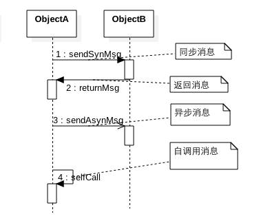

**Combined Fragments**
标示有一定条件的消息发送，

* Alternative fragment（denoted “alt”） 标示 if…then…else
* Option fragment (denoted “opt”) 标示Switch
* Parallel fragment (denoted “par”) 标示同时发生
* Loop fragment(denoted “loop”) 标示for
* Break标示退出循环

***1.loop:***
当没有指定循环边界默认范围为[0, 无穷大]：

如果只指定了一个值，那么默认执行该值次数：

指定了循环边界, 则最少执行最小值值，最多执行最大值次数：

实现dowhile方式，至少执行一次, 如果size<0则退出:

***2. alt:***
条件判断，如果n>0则执行agree函数否者执行reject函数

***3. opt:***
switch，当满足不同条件执行不同方法：

***4. break:***
n=10时候执行save并退出循环

***5. par:***
同时进行，比如多个线程同时执行任务

**一个例子**

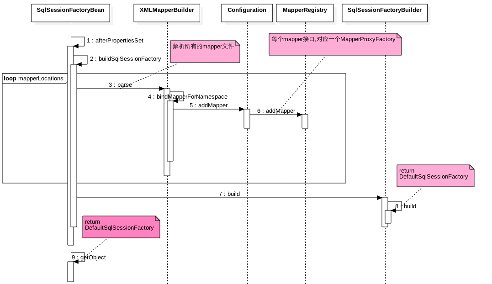

## 五、类图

类图是面向对象系统建模中重要的图，是定义其它图的基础。类图主要是用来展现软件系统中的类、接口以及它们之间的静态结构。

在uml类图中，类之间关系有如下: 泛化（Generalization）, 实现（Realization），关联（Association)，聚合（Aggregation），组合(Composition)，依赖(Dependency)

***5.1. 泛化:***
泛化是继承关系的一种，子类继承父类的所有行为和属性，子类可以新增新的功能或者重写父类功能。
uml中使用带空心三角箭头的实线标示
 `【箭头指向】：箭头指向父类`

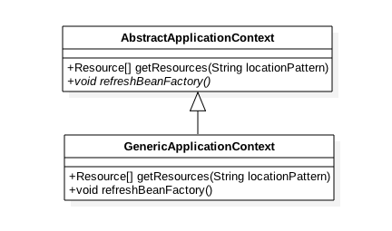

***5.2. 实现:***
实现是接口和类的关系，是指类实现了接口中定义的接口，uml中用带空心三角箭头的虚线
 `【箭头指向】：箭头指向接口类`

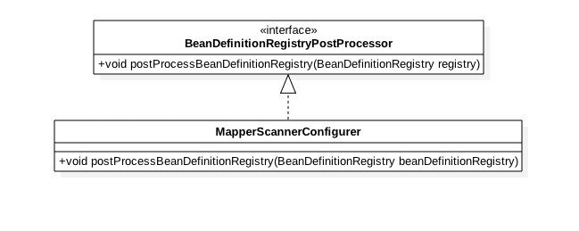

***5.3. 关联:***
在建模过程中必然存在类之间的联系，使类可以感知其他类的行为和属性，关联分为双向和单向关联

* 双向关联（标准）

  对于双向关联来说被关联的两个类可以感知对方的存在
  

  如图在线每端放置一个角色和多重值，对于Route来说我们应该看在bike端的角色和多重值，对于Route来说每个骑行路线对应0个或者多个自行车，0个是因为可能先制定了骑行路线但是还没有找到自行车，多个是因为可以有多个人骑行同一个路线。对于bike来说我们应该看route端的角色和多重值，对于一个bike来说每个自行车对于0个或者多个骑行路线，0个是因为虽然有一个自行车但是我可以不骑行，不指定骑行路线那，多个是因为我一个自行车可以指定多个骑行路线。

上面多重值为0…*, 其实还有其他多重值如下表：

| 表示  | 含义      |
| ----- | --------- |
| 0..1  | 0个或1个  |
| 1     | 只能1个   |
| 0..*  | 0个或多个 |
| *     | 0个或多个 |
| 1..*  | 1个或多个 |
| 3     | 只能3个   |
| 0..5  | 0到5个    |
| 5..15 | 5到15个   |

* 单向关联

  对于一个单向关联来说也是两个类是相关的，但是只有一个类知道这种联系的存在
  

如图对于单向关联表示为一条带有指向已知类的开放箭头实线，单向关联只包含一个角色名和多重值，一个人可以有0个或者多个账户，人可以感知到账户的存在，但是账户却感知不到人的存在。

* 聚合

  聚合是关联关系的一种，聚合主要描述整体与部分直接的关系，聚合有分为基本聚合和组合聚合，

基本聚合：对应基本聚合来说部分类的生命周期独立于 整体类 的生命周期，uml中使用一条从整体类到部分类的实线，并在整体类的关联末端画一个未填充棱形标示：

一个汽车有4个轮子组成，轮子的生命周期不依赖与车的，因为车轮可以独立于车独立存在。

组合聚合: 组合聚合是聚合的一种情况，不同在于部分类的生命周期依赖整体类，uml中使用一条从整体类到部分类的实线，并在整体类的关联末端画一个填充棱形标示：

一个公司有至少一个部门组成，部门要依赖于公司的存在而存在，不会存在一个部门而它不属于某一个公司。

* 自身关联

  自身关联涉及到一个类，是类自己关联自己的情况
  

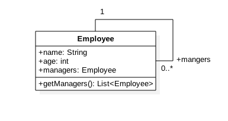

一个雇员可以有0个或者多个管理者，而管理者本身也是雇员的一种。

***5.4. 依赖:***
依赖即一个类的实现需要其他类的协助，通常代码表现为方法参数，局部变量，静态方法调用，util类调用，uml中使用一条箭头的虚线，从依赖方指向被依赖的类

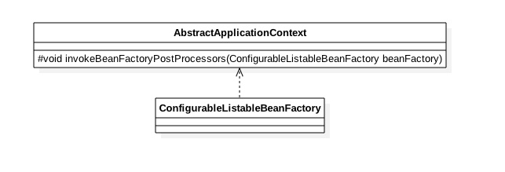

***一个例子***
从UML官方网站搞了个 域模型图

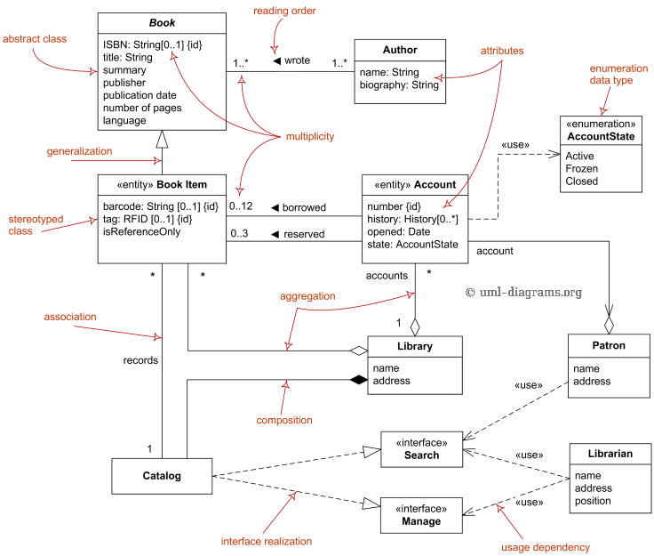

下面围绕类Library类分析下这个图，首先library通过组合方式关联到了Catalog类目类，这说明类目不能独立存在要依赖图书馆存在，所以这里没有使用聚合而使用了组合。另外library通过聚合关联到了Book Item 类和Account账号类，这说明图书馆是有0个或者多个图书和账户组成，这里使用聚合而不是用组合是因为书和账号可以独立于图书馆存在，比如我有学号账号，但是图书馆里面不是必然有你的账号。

下面围绕Catalog分析，类目通过双向关联关联到bookitem，说明一个类目里面可能会有0个或者多个书籍，一个书籍对应着一个类目。另外类目有通过realization实现了search类和manage类的接口，让类目有搜索和管理功能。Search类搜索时候会依赖Patron类图书捐赠人的姓名地址或者Libraian类图书管理员的姓名地址，职位。 图书管理类时候会依赖图书管理员类的信息。

而Patron图书捐赠人有可能是一个学生，学生有自己的账号，所以patron类会聚合到Account.
bookItem类通过泛化继承Book中书的共性部分信息。有通过关联关联到了account, 说明一个账户只能接到0本和最多12本书，最多可以预定3本书。

最后Book类双向关联到Author类，数目一个作者至少写了1本书（严格说应该是0），一本书至少有一个作者编写，
Account账户类有依赖一个AccountState的枚举值的类用来存放账号状态。

## 六、活动图（Activity Diagrams）

活动图是UML中一种行为图，它展示了控制流和对象流，并且强调它们的顺序和条件控制流。
下面换种方法，通过引入uml官方例子同时介绍活动图里面元素。

***6.1 组元介绍***

* 开始(inital)和结束状态(final)

  

  

* 活动(action)：标示动作

  

* 控制流(control flow)：链接活动

  

* 决策(decison): 条件判断

  

* 合并（merge）: 任意一个节点到达该点都继续往下走，不管其他分支

  

* 游泳道（swimlanes）：模型中存在多个对象时候使用比较适合

  分为水平和垂直
  

* 分岔汇合（join）：所有分支都到该点时候才继续往下走，类似CountDownLatch.await后在继续往下走

  

* 分流（fork）：类似fork多个线程执行放入线程池执行。

  

* 接受信号（acceptsignal）

  

***6.2 online shopping例子***

下面拿uml官方online shopping网上购物例子介绍

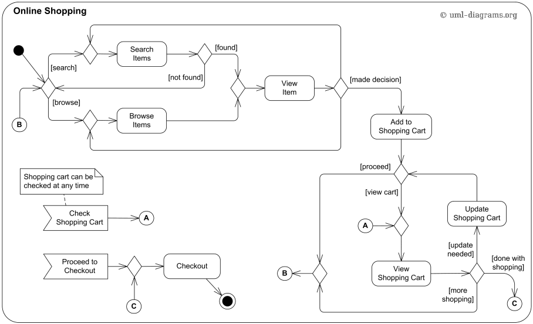

如图左上角黑色圆为活动开始，首先通过decision的条件判断是进行搜索还是浏览，如果是搜索则通过merge节点后搜索商品，然后通过decision节点判断搜到商品则进入在做决定是浏览商品信息还是加入购物车。加入购物车后可以选择进入B继续
搜索其他商品，或者查看购物车内容，然后购物完后，进入C进行付款，然后流程结束。

另外可以随时接受信号去查看进入A查看购物车信息，也可以随时收到信号去checkout商品。

***6.3 Activation of Trial Product例子***
下面拿uml官方Activation of Trial Product激活试用产品例子介绍

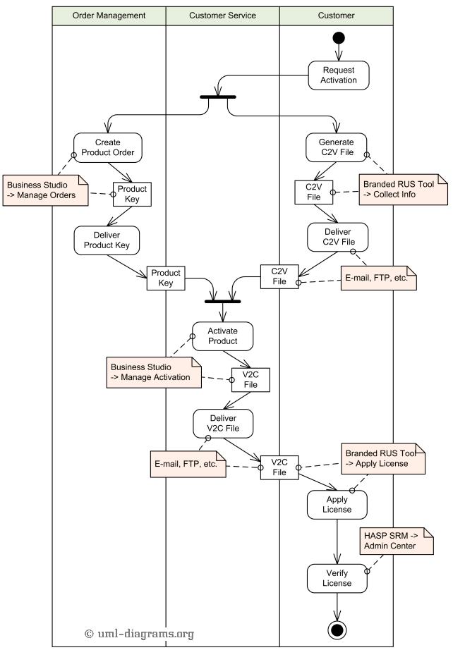

首先这个活动图里面由于模型涉及到了Order Management, Customer Service, Customer三个对象，所以使用了垂直的swimlanes。

首先customer请求激活自己正在使用的试用期产品（估计试用期过了，不能使用了），然后顾客服务对象通过fork开启两个流程，一个流程是让Order Management创建产品订单，一个是让用户产生C2V文件。然后Customer Service在 join 处等待两者完成，这里都完成在拿着产品秘钥和C2v文件去激活产品，通过email等把文件传递给用户，用户拿到文件既可以激活，至此活动结束。

## 七、组件图

组件图是为了展示组元（components），组元提供的接口（provided inerfaces）和需要调用的接口(required interfaces)，端口（ports）之间关系的一种图，组件图是主要被用于基于组件开发时候用来描述SOA系统。

### 元素介绍

* 组元（Component）

  组元是代表一个系统中一个模块的类，并且组元的表现（比如实现）在其所在的环境上下文中是可被替换的，组元有自己的行为，比如对外提供接口和使用其他组件接口，这些接口潜在的是通过端口（ports）暴露或者使用。
  

如图语音识别服务组元对外提供getPort接口供其他组元调用，网上法庭说明自己需要使用getPort接口来实现自己的功能。

* 端口（port）

  端口表述了一个一个类与它所在的环境或者其他类的一个交互点，
  

  如图Accounting组元内部的Customers提供Account服务，而Orders组元则使用Account服务。

* 连接线（Connector）

  连接线是用来连接两个或者多个实例使他们直接能够进行交流协作。主要用来连接两个端口直接的交流
  

### 一个例子

下面分析下uml官方一个例子

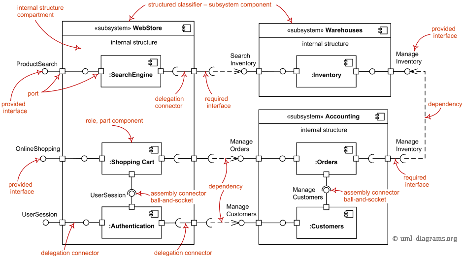

如图在网上商城系统有三个子系统组成：webstore, accounting, warehouses; 
WebStore子系统包含三个组员，搜索引擎，购物车，认证系统。搜索引擎组元通过对外提供了一个ProductSearch接口运行其他组件搜索和查看商品，另外这接口是搜索引擎组件使用库存组件提供的Search Inventory接口来实现。购物车组元则把调用订单组元的的Manage Orders接口的功能封装下自己对外提供了onllineShopping接口，认证组元则允许用户创建账号，登陆或者退出，并且绑定订单到具体用户。

accounting子系统对外提供了Manage Orders 和 Manage Customers接口，并且通过代理连接到子系统内部的Orders和customers组元，。Orders组元调用了Customers组元的Manager customers接口，Customers调用了Accounts组元的Manager Accounts模块。

Warehouses子系统提了Search Inventory and Manage Inventory组件，并且通过依赖方式是要了Accounting子系统的接口服务。

## 八、状态图

状态机图是一种行为图，它通过使用有限的状态转移展示了一个系统中一个模块的一些离散的行为，在UML2.4里面有两种状态机图：行为状态机（behavioral state machine），协议状态机（protocol state machine）。

### 元素介绍

***行为状态（Behavioral State）***

* 简单状态（Simple State）

  简单状态没有子状态机和域，UML中使用带拐点的矩形标示简单状态，并且状态名字写在矩形内部。

* 组合状态（Composite State）

  组合状态被定义为用用子状态或者嵌套状态的状态行为，子状态可以是顺序发生的也可以是并发发生，组合状态里至少有一个域，如下图含有一个域

*__ 起始状态（Initial Pseudostate），终止状态（Final State），（行为转移）Behavioral Transition

------

如图黑色实心为起始状态，末端双环圆为终止状态，中间连接线为行为转移，其中isAuthed为一个guard说明满足该条件才会进行状态转移，然后执行函数auidt。

### 行为状态机（behavioral state machine）

使用有限状态转移表示一个系统中的离散行为的变换，行为被建模为通过一系列转移线连接起来的状态。
一个简单的行为状态机：

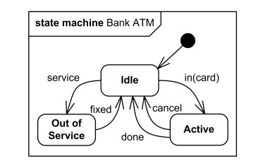

### 协议状态机（Protocol State Machine）

协议状态机是行为状态机的一个子类，是行为状态的扩展，用来描述一个类的生命周期和协议，他描述一个类的哪一个动作可以被哪一个状态下的规定条件下被调用。

### 官方例子

如下图是一个Java线程状态机图（协议状态机图）

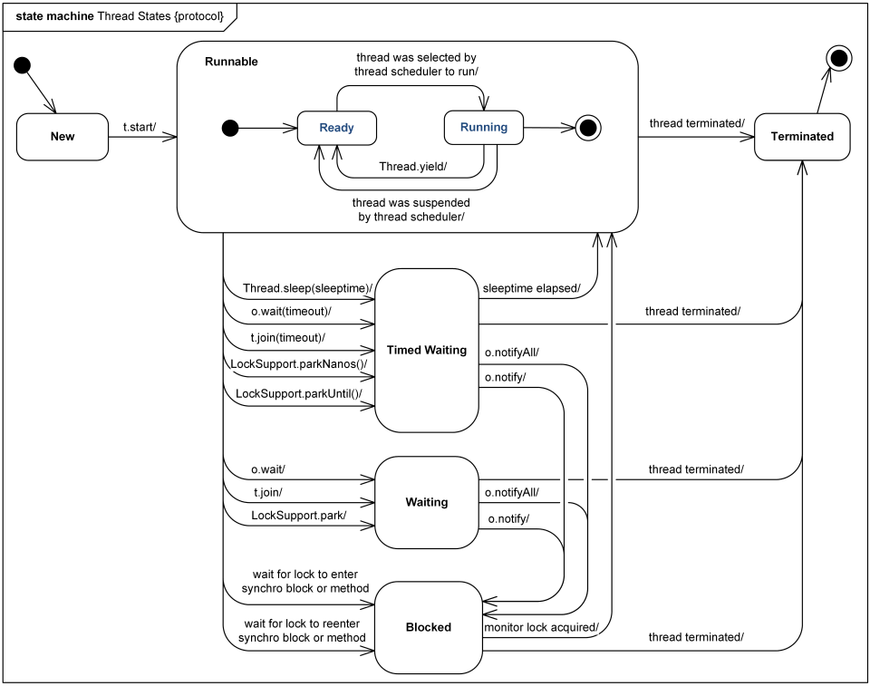

如图 New状态是一个线程被创建但是没有执行start()方法时候状态。
在JVM看来当一个线程在Runnable时候它是在运行，但是在os看来却未必，因为线程可能没有获取到处理器。所以可以考虑把Runnable看为一个内部有两个子状态的组合状态，当一个线程状态进入Runnable时候，首先进入Ready状态（其他资源已经就绪，就差cpu），由线程调度策略决定何时把这个线程从Ready转变为running状态，函数Thread.yield() 则知识线程调度暂定当前线程执行，把线程从running状态转变为Ready状态…

## 九、总结

本文对软件建模中常用建模图使用进行简单介绍，以便用到时候能够快速查阅。

## 十、参考

http://www.uml-diagrams.org/

``` plantuml
@startuml
!include http://172.18.0.4/core.puml
@enduml
```
