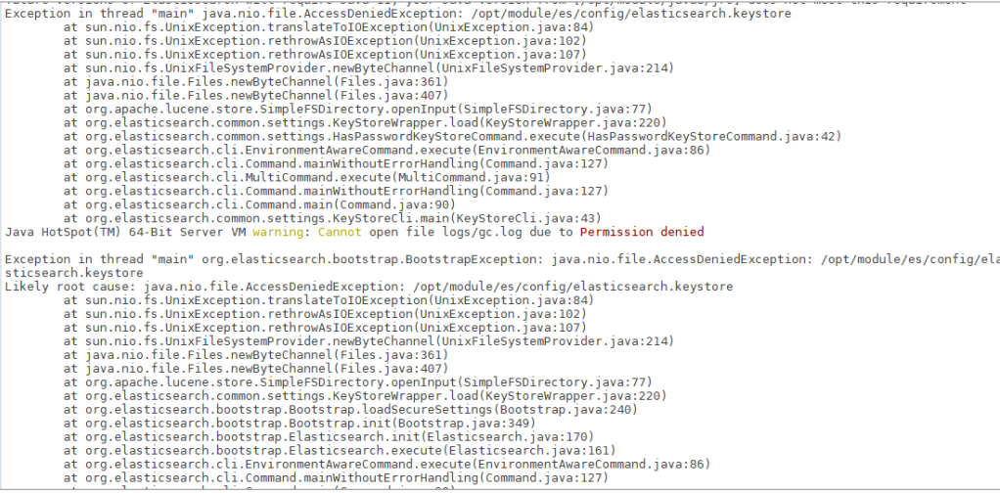
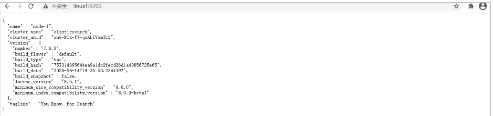

# 集群环境

## 相关概念

### 单机 & 集群

单台 Elasticsearch 服务器提供服务，往往都有最大的负载能力，超过这个阈值，服务器性能就会大大降低甚至不可用，所以生产环境中，一般都是运行在指定服务器集群中。除了负载能力，单点服务器也存在其他问题：

* 单台机器存储容量有限

* 单服务器容易出现单点故障，无法实现高可用

* 单服务的并发处理能力有限

配置服务器集群时，集群中节点数量没有限制，大于等于 2 个节点就可以看做是集群了。一般出于高性能及高可用方面来考虑集群中节点数量都是 3 个以上。

### 集群 Clusterv

一个集群就是由一个或多个服务器节点组织在一起，共同持有整个的数据，并一起提供索引和搜索功能。一个Elasticsearch 集群有一个唯一的名字标识，这个名字默认就是”elasticsearch”。这个名字是重要的，因为一个节点只能通过指定某个集群的名字，来加入这个集群。

### 节点 Node

集群中包含很多服务器，一个节点就是其中的一个服务器。作为集群的一部分，它存储数据，参与集群的索引和搜索功能。
一个节点也是由一个名字来标识的，默认情况下，这个名字是一个随机的漫威漫画角色的名字，这个名字会在启动的时候赋予节点。这个名字对于管理工作来说挺重要的，因为在这个管理过程中，你会去确定网络中的哪些服务器对应于 Elasticsearch 集群中的哪些节点。
一个节点可以通过配置集群名称的方式来加入一个指定的集群。默认情况下，每个节点都会被安排加入到一个叫做“elasticsearch”的集群中，这意味着，如果你在你的网络中启动了若干个节点，并假定它们能够相互发现彼此，它们将会自动地形成并加入到一个叫做“elasticsearch”的集群中。

在一个集群里，只要你想，可以拥有任意多个节点。而且，如果当前你的网络中没有运行任何 Elasticsearch 节点，这时启动一个节点，会默认创建并加入一个叫做“elasticsearch”的集群。

### 测试集群

查看集群状态

* node-1001 节点
* node-1002 节点
* node-1003 节点

向集群中的 node-1001 节点增加索引
向集群中的 node-1002 节点查询索引

## Linux 单机

### 软件下载

软件下载地址：https://www.elastic.co/cn/downloads/past-releases/elasticsearch-7-8-0

### 软件安装

1) 解压软件
将下载的软件解压缩

```json
# 解压缩
tar -zxvf elasticsearch-7.8.0-linux-x86_64.tar.gz -C /opt/module

# 改名
mv elasticsearch-7.8.0 es
```

2) 创建用户
因为安全问题，Elasticsearch 不允许 root 用户直接运行，所以要创建新用户，在 root 用
户中创建新用户

```json
useradd es #新增 es 用户
passwd es #为 es 用户设置密码
userdel -r es #如果错了，可以删除再加
chown -R es:es /opt/module/es #文件夹所有者
```

3) 修改配置文件

修改/opt/module/es/config/elasticsearch.yml 文件

```yaml
# 加入如下配置

cluster.name: elasticsearch
node.name: node-1
network.host: 0.0.0.0
http.port: 9200
cluster.initial_master_nodes: ["node-1"]
```

修改/etc/security/limits.conf 

```yaml
# 在文件末尾中增加下面内容
# 每个进程可以打开的文件数的限制
es soft nofile 65536
es hard nofile 65536
```

修改/etc/security/limits.d/20-nproc.conf

```yaml
# 在文件末尾中增加下面内容

# 每个进程可以打开的文件数的限制
es soft nofile 65536
es hard nofile 65536

# 操作系统级别对每个用户创建的进程数的限制

* hard nproc 4096

# 注：* 带表 Linux 所有用户名称
```

修改/etc/sysctl.conf

```yaml
# 在文件中增加下面内容

# 一个进程可以拥有的 VMA(虚拟内存区域)的数量, 默认值为 65536
vm.max_map_count=655360
```

重新加载
```sh
sysctl -p 
```

### 启动软件

使用 ES 用户启动
```sh
cd /opt/module/es/
#启动
bin/elasticsearch
#后台启动
bin/elasticsearch -d
```
启动时，会动态生成文件，如果文件所属用户不匹配，会发生错误，需要重新进行修改用户
和用户组


关闭防火墙
```sh
#暂时关闭防火墙
systemctl stop firewalld
#永久关闭防火墙
systemctl enable firewalld.service #打开放货抢永久性生效，重启后不会复原
systemctl disable firewalld.service #关闭防火墙，永久性生效，重启后不会复原
```

### 测试软件

浏览器中输入地址：http://linux1:9200/


## Linux 集群

### 软件下载

软件下载地址：https://www.elastic.co/cn/downloads/past-releases/elasticsearch-7-8-0

### 软件安装

1) 解压软件
将下载的软件解压缩


```sh
# 解压缩
tar -zxvf elasticsearch-7.8.0-linux-x86_64.tar.gz -C /opt/module
# 改名
mv elasticsearch-7.8.0 es-cluster
```

将软件分发到其他节点：linux2, linux3

2) 创建用户
因为安全问题，Elasticsearch 不允许 root 用户直接运行，所以要在每个节点中创建新用
户，在 root 用户中创建新用户

```sh
useradd es #新增 es 用户
passwd es #为 es 用户设置密码
userdel -r es #如果错了，可以删除再加
chown -R es:es /opt/module/es-cluster #文件夹所有者
```

3) 修改配置文件
修改/opt/module/es/config/elasticsearch.yml 文件，分发文件

```sh
# 加入如下配置

#集群名称
cluster.name: cluster-es
#节点名称，每个节点的名称不能重复
node.name: node-1
#ip 地址，每个节点的地址不能重复

network.host: linux1
#是不是有资格主节点
node.master: true
node.data: true
http.port: 9200

# head 插件需要这打开这两个配置

http.cors.allow-origin: "*"
http.cors.enabled: true
http.max_content_length: 200mb
#es7.x 之后新增的配置，初始化一个新的集群时需要此配置来选举 master
cluster.initial_master_nodes: ["node-1"]
#es7.x 之后新增的配置，节点发现
discovery.seed_hosts: ["linux1:9300", "linux2:9300", "linux3:9300"]
gateway.recover_after_nodes: 2
network.tcp.keep_alive: true
network.tcp.no_delay: true
transport.tcp.compress: true
#集群内同时启动的数据任务个数，默认是 2 个
cluster.routing.allocation.cluster_concurrent_rebalance: 16
#添加或删除节点及负载均衡时并发恢复的线程个数，默认 4 个
cluster.routing.allocation.node_concurrent_recoveries: 16
#初始化数据恢复时，并发恢复线程的个数，默认 4 个
cluster.routing.allocation.node_initial_primaries_recoveries: 16
修改/etc/security/limits.conf ，分发文件

# 在文件末尾中增加下面内容

es soft nofile 65536
es hard nofile 65536
修改/etc/security/limits.d/20-nproc.conf，分发文件

# 在文件末尾中增加下面内容

es soft nofile 65536
es hard nofile 65536

* hard nproc 4096

# 注：* 带表 Linux 所有用户名称

修改/etc/sysctl.conf

# 在文件中增加下面内容

vm.max_map_count=655360
```

重新加载
```sh
sysctl -p 
```
### 启动软件
分别在不同节点上启动 ES 软件
```sh
cd /opt/module/es-cluster
#启动
bin/elasticsearch
#后台启动
bin/elasticsearch -d
```

### 测试集群
