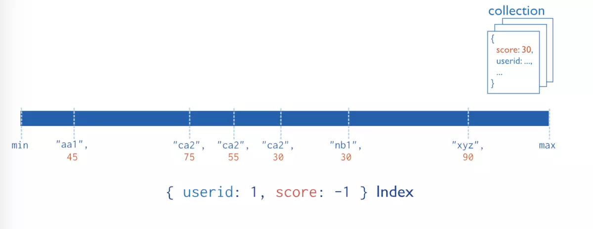

# MongoDB中各种类型的索引

MongoDB 中索引的类型大致包含单键索引、复合索引、多键值索引、地理索引、全文索引、 散列索引等，下面简单介绍各类索引的用法。

## 1、单字段索引

这个是最简单最常用的索引类型，比如我们上边的例子，为id建立一个单独的索引就是此种类型。

```
 # 为id field建立索引，1表示升序，-1表示降序，没有差别
db.employee.createIndex({'id': 1})
```

需要注意的是通常MongoDB会自动为我们的文档插入’_id’ field，且已经按照升序进行索引，如果我们插入的文档中包含有’_id’ field，则MongoDB就不会自动创建’_id’ field，但是需要我们自己来保证唯一性从而唯一标识一个文档

## 2、复合索引


上图查询索引的时候会先查询userid，再查询score，然后就可以找到对应的文档。
对于复合索引需要注意以下几点：

**索引field的先后顺序很关键，影响有两方面**：
1、MongoDB在复合索引中是根据prefix排序查询，就是说排在前面的可以单独使用。
我们创建一个如下的索引

```
db.collection.createIndex({'id': 1, 'city': 1, 'score': 1})
```

我们如下的查询可以利用索引

```
db.collection.find({'id': xxx})
db.collection.find({'id': xxx, 'city': xxx})
db.collection.find({'id': xxx, 'city':xxx, 'score': xxxx})
```

但是如下的查询无法利用该索引

```
db.collection.find({'city': xxx})
db.collection.find({'city':xxx, 'score': xxxx})
```

还有一种特殊的情况，就是如下查询：

```
db.collection.find({'id': xxx, 'score': xxxx})
```

这个查询也可以利用索引的前缀’id’来查询，但是却不能针对score进行查询，你可以说是部分利用了索引，因此其效率可能不如如下索引：

```
db.collection.createIndex({'id': 1, 'score': 1})
```

2.过滤出的document越少的field越应该放在前面，比如此例中id如果是唯一的，那么就应该放在最前面，因为这样通过id就可以锁定唯一一个文档。而如果通过city或者score过滤完成后还是会有大量文档，这就会影响最终的性能。

**索引的排序顺序不同**
复合索引最末尾的field，其排序顺序不同对于MongoDB的查询排序操作是有影响的。
比如：

```
db.events.createIndex( { username: 1, date: -1 } )
```

这种情况下， 如下的query可以利用索引：

```
db.events.find().sort( { username: 1, date: -1 } )
```

但是如下query则无法利用index进行排序

```
db.events.find().sort( { username: 1, date: 1 } )
```

## 3、多键值索引

这个主要是针对数据类型为数组的类型，如下示例：

```
{"name" : "jack", "age" : 19, habbit: ["football, runnning"]}
db.person.createIndex( {habbit: 1} )  // 自动创建多key索引
db.person.find( {habbit: "football"} )
```

## 4、散列索引

散列（Hashed）索引是指按照某个字段的散列值来建立索引，目前主要用于 MongoDB Sharded Cluster 的散列分片，散列索引只能用于字段完全匹配的查询，不能用于范围查询等。
散列其语法如下：

```
db.collection.createlndex( { _id : "hashed" })
```

MongoDB 支持散列任何单个字段的索引，但是不支持多键（即数组）索引。

需要说明的是，MongoDB 在进行散列索引之前，需要将浮点数截断为 64 位整数。例如，散列将对 2.3、2.2 和 2.9 这些值产生同样的返回值。

## 5、过期索引

顾名思义，过期索引就是一种会过期的索引，在索引过期之后，索引对应的数据会被删除，创建方式如下：

```
db.sang_collect.ensureIndex({time:1},{expireAfterSeconds:30})
```

expireAfterSeconds表示索引的过期时间，单位为秒。time表示索引的字段，time的数据类型必须是ISODate或者ISODate数组，否则的话，当索引过期之后，time的数据就不会被删除。

## 6、全文索引

全文索引虽然好用，可惜不支持中文，我们这里就先做一个简单的了解。

比如，我的数据集如下：

```
{
    "_id" : ObjectId("59f5a3da1f9e8e181ffc3189"),
    "x" : "Java C# Python PHP"
}
{
    "_id" : ObjectId("59f5a3da1f9e8e181ffc318a"),
    "x" : "Java C#"
}
{
    "_id" : ObjectId("59f5a3da1f9e8e181ffc318b"),
    "x" : "Java Python"
}
{
    "_id" : ObjectId("59f5a3da1f9e8e181ffc318c"),
    "x" : "PHP Python"
}
{
    "_id" : ObjectId("59f5a4541f9e8e181ffc318d"),
    "x" : "C C++"
}
```

我们可以给x字段建立一个全文索引，创建方式如下：

```
db.sang_collect.ensureIndex({x:"text"})
```

MongoDB会自动对x字段的数据进行分词，然后我们就可以通过如下语句进行查询：

```
db.sang_collect.find({$text:{$search:"Java"}})
```

此时x中包含Java的文档都会被查询出来。如果想查询既包含Java又包含C#的文档，操作如下：

```
db.sang_collect.find({$text:{$search:"\"Java C#\""}})
```

用一对双引号将查询条件括起来，如果想查询包含PHP或者Python的文档，操作如下：

```
db.sang_collect.find({$text:{$search:"PHP Python"}})
```

如果想查询既有PHP，又有Python，但是又不包括Java的文档，如下：

```
db.sang_collect.find({$text:{$search:"PHP Python -Java"}})
```

建立了全文索引之后，我们也可以查看查询结果的相似度，使用$meta，如下：

```
db.sang_collect.find({$text:{$search:"PHP Python"}},{score:{$meta:"textScore"}})
```

此时查询结果中会多出一个score字段，该字段的值越大，表示相似度越高，我们可以根据score利用sort来对其进行排序，如下：

```
db.sang_collect.find({$text:{$search:"PHP Python"}},{score:{$meta:"textScore"}}).sort({score:{$meta:"textScore"}})
```

全文索引目前看起来功能还是很强大，可惜暂时不支持中文，不过网上对此也有很多解决方案，小伙伴们可以自行搜索查看。

## 7、地理空间索引

地理空间索引类型
**地理空间索引可以分为两类：**

1.**2d索引**，可以用来存储和查找平面上的点。
2.**2d sphere索引**，可以用来存储和查找球面上的点。

### **2d索引**

2d索引一般我们可以用在游戏地图中。
向集合中插入一条记录点的数据：

```
db.sang_collect.insert({x:[90,0]})
```

插入数据的格式为[经度,纬度]，取值范围，经度[-180,180]，纬度[-90,90]。数据插入成功之后，我们先通过如下命令创建索引：

```
db.sang_collect.ensureIndex({x:"2d"})
```

然后通过$near我们可以查询某一个点附近的点，如下:

```
db.sang_collect.find({x:{$near:[90,0]}})
```

默认情况下返回该点附近100个点，我们可以通过$maxDistance来设置返回的最远距离：

```
db.sang_collect.find({x:{$near:[90,0],$maxDistance:99}})
```

我们也可以通过$geoWithin查询某个形状内的点，比如查询矩形中的点：

```
db.sang_collect.find({x:{$geoWithin:{$box:[[0,0],[91,1]]}}})
```

两个坐标点用来确定矩形的位置。

查询圆中的点：

```
db.sang_collect.find({x:{$geoWithin:{$center:[[0,0],90]}}})
```

参数分别表示圆的圆心和半径。

查询多边形中的点：

```
db.sang_collect.find({x:{$geoWithin:{$polygon:[[0,0],[100,0],[100,1],[0,1]]}}})
```

这里可以填入任意多个点，表示多边形中的各个点。

### **2d sphere索引**

2dsphere适用于球面类型的地图，它的数据类型是GeoJSON格式的，我们可以在http://geojson.org/地址上查看GeoJSON格式的样式，比如我们描述一个点，GeoJSON如下：

```
{
    "_id" : ObjectId("59f5e0571f9e8e181ffc3196"),
    "name" : "shenzhen",
    "location" : {
        "type" : "Point",
        "coordinates" : [ 
            90.0, 
            0.0
        ]
    }
}
```

描述线，GeoJSON格式如下：

```
{
    "_id" : ObjectId("59f5e0d01f9e8e181ffc3199"),
    "name" : "shenzhen",
    "location" : {
        "type" : "LineString",
        "coordinates" : [ 
            [ 
                90.0, 
                0.0
            ], 
            [ 
                90.0, 
                1.0
            ], 
            [ 
                90.0, 
                2.0
            ]
        ]
    }
}
```

描述多边形，GeoJSON格式如下：

```
{
    "_id" : ObjectId("59f5e3f91f9e8e181ffc31d0"),
    "name" : "beijing",
    "location" : {
        "type" : "Polygon",
        "coordinates" : [ 
            [ 
                [ 
                    0.0, 
                    1.0
                ], 
                [ 
                    0.0, 
                    2.0
                ], 
                [ 
                    1.0, 
                    2.0
                ], 
                [ 
                    0.0, 
                    1.0
                ]
            ]
        ]
    }
}
```

还有其他的类型，具体小伙伴们可以参考http://geojson.org/。有了数据之后，我们可以通过如下操作来创建地理空间索引了：

```
db.sang_collect.ensureIndex({location:"2dsphere"})
```

比如我想查询和深圳这个区域有交集的文档，如下：

```
var shenzhen = db.sang_collect.findOne({name:"shenzhen"})
db.sang_collect.find({location:{$geoIntersects:{$geometry:shenzhen.location}}})
```

这里的查询结果是和深圳这个区域有交集的都会查到(比如经过深圳的高速公路、铁路等)，我们也可以只查询深圳市内的区域(比如深圳市内所有的学校)，如下：

```
var shenzhen = db.sang_collect.findOne({name:"shenzhen"})
db.sang_collect.find({location:{$within:{$geometry:shenzhen.location}}})
```

也可以查询腾讯附近的其他位置，如下：

```
var QQ = db.sang_collect.findOne({name:"QQ"})
db.sang_collect.find({location:{$near:{$geometry:QQ.location}}})
```

复合地理空间索引
位置往往只是我们查询的一个条件，比如我要查询深圳市内所有的学校，那我得再增加一个查询条件，如下：

```
var shenzhen = db.sang_collect.findOne({name:"shenzhen"})
db.sang_collect.find({location:{$within:{$geometry:shenzhen.location}},name:"QQ"})
```

其他的查询条件跟在后面就行了。