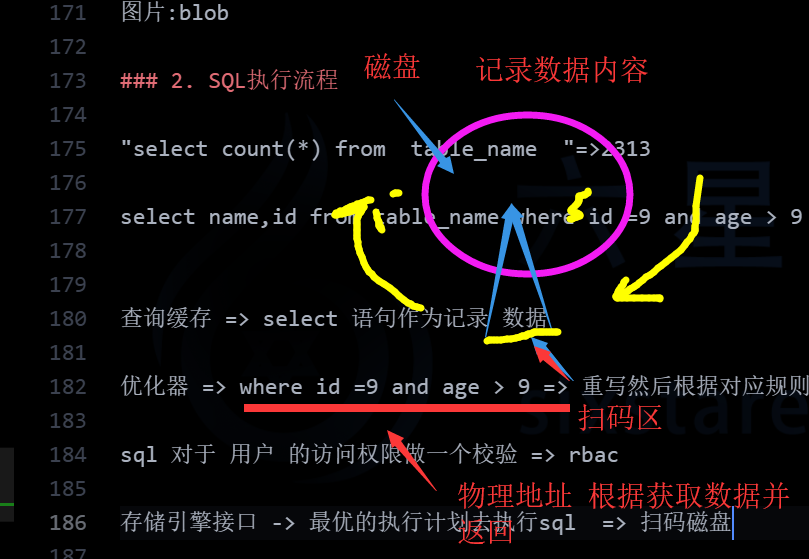
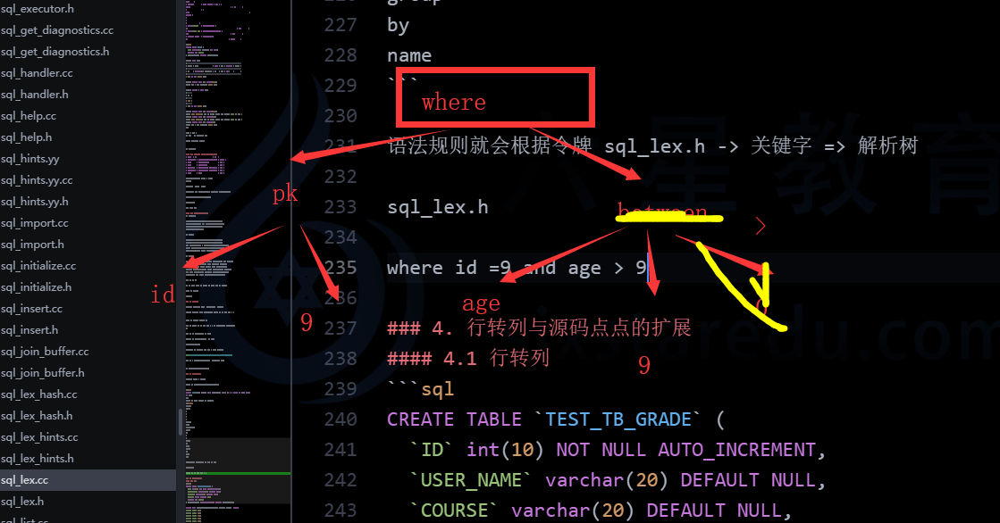

# 数据表字段选择与SQL执行流程

### 0.课程内容
1. 课程回滚
2. 数据表字段选择
3. SQL执行流程
4. SQL解析器与优化器
5. 行转列与源码点点的扩展

### 1. 数据库的字段选择
在数据表的结构关系确定之后，这个时候就需要去确定相应的数据表的字段类型

#### 1.1 字符串类型字段 char与varchar以及text

char => char(长度) -> 多长
varchar => 根据规定长度变化

数据库中会保存varchar的长度

*在gbk与utf8的编码下char与varchar在设置同等长度的时候的对比*

gbk(1个字符,2个字节)

| 值        | Char(4) | 字节    | varchar(4) | 字节    |
| --------- | ------- | ------- | ---------- | ------- |
| ''        | '  '    | 8个字节 | ''         | 1个字节 |
| 'ab'      | 'ab  '  | 8个字节 | 'ab'       | 5个字节 |
| 'abcd'    | 'abcd'  | 8个字节 | 'abcd'     | 9个字节 |
| 'abcdefg' | 'abcd'  | 8个字节 | 'abcd'     | 9个字节 |

utf8(1个字符,3个字节)

| 值        | Char(4) | 字节    | varchar(4) | 字节    |
| --------- | ------- | ------- | ---------- | ------- |
| ''        | '  '    | 12个字节 | ''         | 1个字节 |
| 'ab'      | 'ab  '  | 12个字节 | 'ab'       | 7个字节 |
| 'abcd'    | 'abcd'  | 12个字节 | 'abcd'     | 13个字节 |
| 'abcdefg' | 'abcd'  | 12个字节 | 'abcd'     | 13个字节 |

vrachar  可变长度
char     固定长度
text 可变长度非unicode 不能有默认值 大的数据类型

text 子段与其他字段一起查询

select text from table_name

5.5 varchar 255 text

varchar 存放内容长度 5000  => text

数据索引效率 char > varchar > text

phone => char  bigint => 精确查询 => 对于其他语言数据类型转化

除了 登入之外

134 5754 9587  like '134%'; => 可以使用到索引

ip 102.120.20.1 => 整数类型 => inet_aton => 十进制

123456 密码 dsfasaddfsafasf  => 原密码

md5 hash => 固定长度的加密

password => char

文章content text blob => 小说,图片

#### 1.2 数字类型的字段 tinyint,smallint,int,bigint

unsigned 无序号

| 数据类型       | 范围                                                                     | 字节         |
| -------------- | ------------------------------------------------------------------------ | ------------ |
| bigint         | -2^63 (-9,223,372,036,854,775,808) 到 2^63-1 (9,223,372,036,854,775,807) | 8 字节       |
|                | 0到18446744073709551615                                                  | 较大整数     |
| int            | -2^31 (-2,147,483,648) 到 2^31-1 (2,147,483,647)                         | 4 个字节     |
|                | 0到4294967295                                                            | 标准整数     |
| smallint       | -2^15 (-32,768) 到 2^15-1 (32,767)                                       | 2 字节       |
|                | 0到65535                                                                 | 较小整数     |
| tinyint        | -2^7 (-128) 到 2^7 - 1 (127)                                             | 1 字节       |
|                | 0到255                                                                   | 非常小的整数 |
|                |                                                                          |              |
| float[(m,d)]   | ±1.175494351e - 38                                                       | 4字节        |
| double[(m, d)] | ±2.2250738585072014e - 308                                               | 8字节        |
| decimal (m,d)  | 可变；其值的范围依赖于m 和d                                              | m+2字节      |

```sql
CREATE TABLE `yyy` (
  `id` tinyint(3) unsigned NOT NULL,
  PRIMARY KEY (`id`)
) ENGINE=InnoDB DEFAULT CHARSET=utf8

mysql> desc yyy;
+-------+---------------------+------+-----+---------+-------+
| Field | Type                | Null | Key | Default | Extra |
+-------+---------------------+------+-----+---------+-------+
| id    | tinyint(3) unsigned | NO   | PRI | NULL    |       |
+-------+---------------------+------+-----+---------+-------+
1 row in set (0.00 sec)

mysql> insert into yyy values(255);
Query OK, 1 row affected (0.06 sec)

mysql> select * from yyy;
+-----+
| id  |
+-----+
| 255 |
+-----+
1 row in set (0.00 sec)

mysql> insert into yyy values(256);
ERROR 1264 (22003): Out of range value for column 'id' at row 1
mysql> insert into yyy values(-1);
ERROR 1264 (22003): Out of range value for column 'id' at row 1
mysql> insert into yyy values(0);
Query OK, 1 row affected (0.09 sec)
```

自动增长 0 步长为 1
主键 :id   => unsigned int

项目比较大 unsigned bigint


年龄 unsigned

#### 1.3 时间类型的字段 Date,Time,Datetime
| 数据类型  | 范围                  | 字节  |
| --------- | --------------------- | ----- |
| date      | '0000-00-00'          | 3字节 |
| time      | '00:00:00'            | 3字节 |
| datetime  | '0000-00-00 00:00:00' | 8字节 |
| timestamp | '0000-00-00 00:00:00' | 4字节 |
| year      | 0000                  | 1字节 |

数据时间超出了mysql规定范围 通常为改为 0 的方式存放
time截取

DATETIME	可以允许为null 手动设计的

TIMESTAMP 不允许 默认"0000-00-00 00:00:0" 时间主要是根据时区一起变化

不做配置;更新一条数据的时候该字段也会随之记录更新的时间

常用datetime

时间戳 char int

#### 1.4 一些不适合放在数据库中的数据类型
1. 二进制多媒体数据

将二进制多媒体数据存放在数据库中，一个问题是数据库空间资源耗用非常严重，另一个问题是这些数据的存储很消耗数据库主机的 CPU 资源。这种数据主要包括图片，音频、视频和其他一些相关的二进制文件。这些数据的处理本不是数据的优势，如果我们硬要将他们塞入数据库，肯定会造成数据库的处理资源消耗严重。

2. 流水队列数据

我们都知道，数据库为了保证事务的安全性（支持事务的存储引擎）以及可恢复性，都是需要记录所有变更的日志信息的。而流水队列数据的用途就决定了存放这种数据的表中的数据会不断的被 INSERT，UPDATE 和 DELETE，而每一个操作都会生成与之对应的日志信息。在 MySQL 中，如果是支持事务的存储引擎，这个日志的产生量更是要翻倍。而如果我们通过一些成熟的第三方队列软件来实现这个 Queue 数据的处理功能，性能将会成倍的提升。

3. 超大文本数据

对于 5.0.3 之前的 MySQL 版本，VARCHAR 类型的数据最长只能存放 255 个字节，如果需要存储更长的文本数据到一个字段，我们就必须使用 TEXT 类型（最大可存放 64KB）的字段，甚至是更大的LONGTEXT 类型（最大 4GB）。而 TEXT 类型数据的处理性能要远比 VARCHAR 类型数据的处理性能低下很多。从 5.0.3 版本开始，VARCHAR 类型的最大长度被调整到 64KB 了，但是当实际数据小于 255Bytes 的时候，实际存储空间和实际的数据长度一样，可一旦长度超过 255 Bytes 之后，所占用的存储空间就是实际数据长度的两倍。

xxx 下载 => 网址

小说 => 根据章节 text => 下载完整版 => 所有内容 txt => 某一个路径下

收费接入 => 根据章节下载

图片:blob

### 2. SQL执行流程

"select count(*) from  table_name  "=>2313

select name,id from table_name where id =9 and age > 9


查询缓存 => select 语句作为记录 数据

优化器 => where id =9 and age > 9 => 重写然后根据对应规则 去选择最优的执行计划 算法

sql 对于 用户 的访问权限做一个校验 => rbac

存储引擎接口 -> 最优的执行计划去执行sql  => 扫码磁盘

执行sql不是立即就可以获取数据

数据查询出来之后 => "select 语句" key , data 数据value



sql 优化 = 磁盘的io操作次数/优化器执行的时间  不是io操作的速度 (充值)


?? 数据库中的数据变了，缓存中的数据会自动更新么？

### 3. SQL解析器与优化器

解析器:两部分 句法扫描器 与 语法规则模块

句法扫描器 => 整个查询语句分解为多个令牌(一些不可以分隔的元素,列名)

```sql
select count(*), status from table_name where id = ? order by sort group by name
```
句法扫描器 => 分解令牌 每一个字节流 => 都会分解为令牌
```shell
select
count
(
*
)
,
status
from
table_name
where
id
=
?
order
by
sort
group
by
name
```

语法规则(sql_yacc.yy)就会根据令牌 sql_lex.h -> 关键字 => 解析树

sql_lex.h

where id =9 and age > 9



优化器:

desc

了解 数据表大体结构

优化器 => 简单内容

1. 选择合适键
2. 针对每个表全局的扫码 结构 有很多记录 数据表过大

寻找合适执行计划

3. (如果是join 选择表单连接顺序)
4. 对于where 进行重写,删除不必要的代码,减少不要计算量,尽可能的限制条件 方便查询有效键执行
4.1 (join)删除不需要的连接的数据表

5. 确定键是否可以用在order group

5.1 (join)合并大的视图

6. 执行执行计划

优化器的算法

存储过程 => 是否经过优化器 => 预编译 =>事先通过 (解析器和优化器编译完的sql语句)

### 4. 行转列与源码点点的扩展
#### 4.1 行转列
```sql
CREATE TABLE `TEST_TB_GRADE` (
  `ID` int(10) NOT NULL AUTO_INCREMENT,
  `USER_NAME` varchar(20) DEFAULT NULL,
  `COURSE` varchar(20) DEFAULT NULL,
  `SCORE` float DEFAULT '0',
  PRIMARY KEY (`ID`)
) ENGINE=InnoDB AUTO_INCREMENT=1 DEFAULT CHARSET=utf8;

insert into TEST_TB_GRADE(USER_NAME, COURSE, SCORE)  values
("张三", "数学", 34),
("张三", "语文", 58),
("张三", "英语", 58),
("李四", "数学", 45),
("李四", "语文", 87),
("李四", "英语", 45),
("王五", "数学", 76),
("王五", "语文", 34),
("王五", "英语", 89);

select * from TEST_TB_GRADE

行转列

SELECT user_name ,
    MAX(CASE course WHEN '数学' THEN score ELSE 0 END ) 数学,
    MAX(CASE course WHEN '语文' THEN score ELSE 0 END ) 语文,
    MAX(CASE course WHEN '英语' THEN score ELSE 0 END ) 英语
FROM test_tb_grade
GROUP BY USER_NAME;

SELECT
    case                   -------------如果
    when sex='1' then '男' -------------sex='1'，则返回值'男'
    when sex='2' then '女' -------------sex='2'，则返回值'女'
    else 0                 -------------其他的返回'其他’
    end                    -------------结束
from sys_user            --------整体理解： 在sys_user表中如果sex='1'，则返回值'男'如果sex='2'，则返回值'女' 否则返回'其他’

Max(列名)，可以用于统计某一列的最大值。
```

#### 4.2 源码
table 结构定义数据库表描述符。当表打开了之后服务器就会创建表描述符，并放入到表缓存中以便以后使用。

分析器、优化器、访问控制和查询缓存在执行SQL的过程中常常会使用到表实例。它以各种方式将各种事物胶合在一起

表的结构主要定义在源码sql/table.h中被定义为 struct ST_SCHEMA_TABLE 以及sql/handler.h 中的typedef给出别名表

table类的成员
