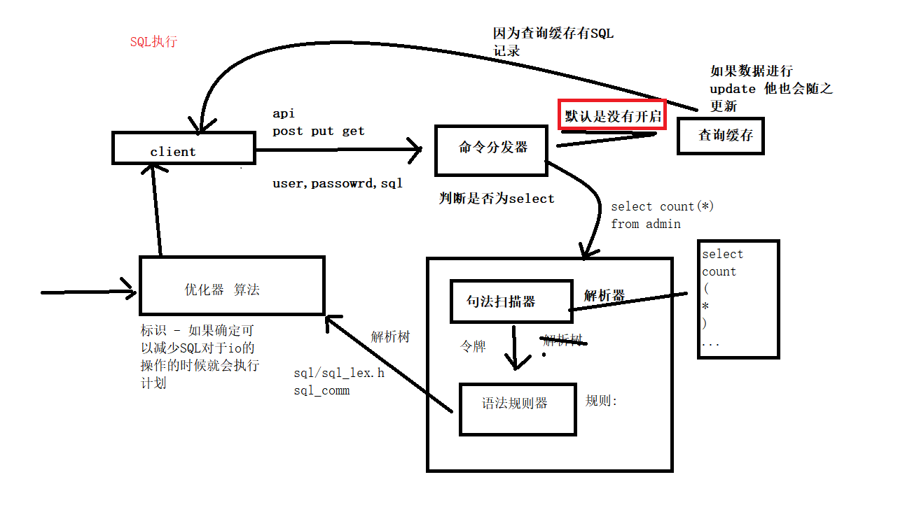

# sql分析

### 0. 课程内容
<pre>
1. 课程回顾
    1.1 字段选择
    1.2 sql的执行流程
2. SQL语句的错误使用--------(注意)
3. 优化SQL的思路-----------(重点)
4. explain分析------------(重点 -- 不算难 -- 就是需要记记)
5. profiling分析----------(重点 -- 不算难 -- 就是需要记记)

</pre>

### 1. sql的执行流程


解析器

MySQL解析器由两部分组成：句法扫描器和语法规则模块。语法扫描器讲整个查询分解为多个令牌（一些不可分割的元素，列如列名称），同时语法规则模块找到一个SQL语法规则组合，该组合产生这一序列，并执行与这些规则相关的代码。最后产生一棵解析树，现在优化器可以使用。

设想服务器收到下列查询：

```sql
select count(*),state from table_name group by state
```

这条SQL语句就会通过句法扫描器检查查询字符流，将其分解为令牌，然后识别每个令牌。如下：

<pre>
select
count
(
*
)
,
state
from
table_name
group
by
state
</pre>
每个令牌都有一个类型，列如一个关键字，一个字符串，一个数字，一个操作符或一个函数名称。语法规则模块安装一系列规则与名片六相应匹配，然后找出正确的规则，而上面的SQL是select 规则（sql/sql_yacc.yy） 他相应地初始化解析树结构。


MySQL会通过sql/gen_lex_hash.cc 生成有效的关键字查询散列，然后通过扫描器sql/sql_lex.cc讲每个名片标记为一个关键字，一个函数名称，大量特定类型或一些在语法规则中具有某种意义的特殊符号,然后这些内容通过解析器根据语法规则创建对应的解析树。

（解析树主要是是lex类型对象代表，在sql/sql_lex.h中有定义 成员很多 比如：enum_sql_command sql_command 它显示我们正在执行的SQL查询类型，是select，update，delete，insert还是其他类型）

优化器

优化器接收到解析器返回的解析树的内容然后会做如下几件事情（因为优化器的内容过多暂时可以先了解做的操作即可）

MySQL优化器具有几个重要功能

* 确定使用哪个键从表中获取记录，并选择最合适该表的建。
* (join)针对每个表确定扫描标识符比读取建更好，如果有很多记录与建值匹配，则建的优点下降，而表扫描速度更快。
* (join)当查询中出现一个以上的表示，确定表的连接顺序
* 重写where从句，以删除死代码，减少不必要的计算，尽可能更改限制条件，以便为键使用开辟道路
* (join)从链接中删除未使用的表
* 确定是否能将键用于order by 和 group by
* (join)是这是用一个内部连接替换一个外部连接
* (join)试着简化子查询，并决定其结果的高速缓存程度
* (join)合并试图（扩大视图引用，使其成为一个宏）

总结:

总的来说当客户端向MySQL请求一条query命令解析器模块完成请求分类，区别出是select并转发给优化器时，优化器会根据相应的规则对于query进行优化，处理掉一些常量表达式的预算，直接换掉常量值。并对query中的查询条件进行简化和转换，如去掉一些无用或显而意见的条件、结构调整等。然后分析query中的Hint(类似于标识)信息,如果有hint就会执行query的计划，没有就会读取设计对象的统计信息，根据query进行写相应的计算分析，然后再得出最后的计划。

优化器是一个数据库软件非常核心的功能，虽然说起来只是简单的几句话，单在MySQL内部，优化器实际上经过了很多复杂的运算分析，才得出的执行计划。对于优化器结合于后面的知··识点涉及讲解。

### 2. SQL语句的错误使用(注意)
学员问题：可不可以多次查询优化查询效率 （针对join 或者 in ）

注意这个问题并没有很直接的正确答案，问题本身是模棱两可的 既可以多次查询也可以一起；

对于SQL的错误使用有两种情况就是过强和过弱 这是常常会可能出现的问题：

比如查询粉丝最多的前十个用户的文章总数

粉丝关注表：user_fans

| Field   | Type    | Null | Key | Default | Extra |
| ------- | ------- | ---- | --- | ------- | ----- |
| id      | int(11) | NO   | PRI | 0       |       |
| user_id | int(11) | NO   |     | MUL     | NULL  |
| fans_id | int(11) | NO   |     | MUL     | NULL  |

查询的方法

方案一、
```sql
select user_id from (
  select
    user_id,count(*) c
  from
    user_fans
  group by
    user_id
  order by c desc limit 0,5
) as fans_count;

然后再通过循环查询出用户的id信息并输出

for (fans_count)

select count(*) from article where user_id = ?
```

方案二、

```sql
select user_id from (
  select
    user_id,count(*) c
  from
    user_fans
  group by
    user_id
  order by c desc limit 0,5
) as fans_count;

如上内容不变

select count(*) from article where user_id in (?) group by user_id;
```

对比：

1. 从MySQL执行的query数量来看第一种为 1 + 10 = 11 条，第二种为 1 + 1 =2
2. 对应的交互数量11 ： 2
3. io操作对比假设一条SQL就是一个IO，第一种最少有11次IO，第二种小余或等于11次IO；如果数据非常离散就是11次；
4. 复杂度：前缀的SQL不管只看第二条SQL；第一种简单一些，第二种就增加了group by
5. 数据库对于结果的返回地中是11次，第二种是2次，但是第二种方法中的第二次结果是第一次的10倍
6. 从应用程序的数据处理来看，第二种比第一种多了一个拼接photo_id的过程

根据上面的点做对比分析：

1. 由于MySQL不管客户端每次调教的query是相同还是不同，都需要进行完全解析这个动作主要消耗的资源师数据库主机的CPU，那么这里第一种方案和第二种方案消耗CPU的比例是11:2. query语句的解析动作在整个query语句执行过程中的整体消耗的CPU比例是比较多的；
2. 网络交互对比：11:2
3. IO比 <= 1:1
4. 在数据量少的情况下分组性能问题不大

所以相对来说第二种会更好一点-》 这个情况就是过度的弱化SQL 或者说数据库的处理能力

但是如果说根据第二种方法把两条SQL合在一起呢？

```sql
select count(*) from article where user_id in (
  select user_id from (
    select
      user_id,count(*) c
    from
      user_fans
    group by
      user_id
    order by c desc limit 0,5
  ) as fans_count;
) group by user_id;
```

当然是可以执行，但是目前的这个SQL复杂度同比之前任何一条SQL都要复杂 还不是一点点的问题.....

从数据库的交互来说 2 ： 1，但是复杂来说不是一点点的大

之前其实有提过SQL语句会通过解析器分解为不同的令牌，任何生成解析树提供给优化器使用并对SQL进行计算和优化，再去执行该计划，但是因为SQL的复杂度增加，对于优化器来说分析的难度也会增加 -- 执行的计算会更多。

粉丝关注及其用户信息统计：user_stat

| Field      | Type    | Null | Key | Default | Extra |
| ---------- | ------- | ---- | --- | ------- | ----- |
| id         | int(11) | NO   | PRI | 0       |       |
| user_id    | int(11) | NO   |     | MUL     | NULL  |
| fans_count | int(11) | NO   |     | MUL     | NULL  |

### 3. 优化SQL的思路(重点)
query 功能的优化 -> 涉及了很多操作 不是一条SQL语句 一定要先找问题分析

优化SQL -> 可能会给我们数据表带来变动 => 建立索引 修改配置 => 配置影响整体

优化不仅仅只是只SQL语句 =>

索引可以提高数据表的查询的速度 => 降低写操作速度 => 索引可能我使用会失效

1. 需要知道更需要去优化的功能 -> 优化更需要优化SQL
2. 定位优化他的性能瓶颈 还可能与数据表有关系, CPU, IO操作次数()
3. 明确目标

   优化不是影响的局部地区,还会影响其他地区;在优化的时候 已经想到优化方案 表写入的时候次数是否频繁

   优化在不影响功能的情况下,会牺牲某一些点,提高整体的体验 => 代码设计需要事先想好的

   支付 =>

索引对于SQL的使用


### 4. explain分析(重点 -- 不算难 -- 就是需要记记)
```sql

查询的是mysql的io操作
show status like 'innodb_data_r%';
show status like 'innodb_data_w%';
show status like 'innodb_log_wrt%';
show status like 'innodb_db';

速度看电脑 10ms 1ms

innodb_data_reads + innodb_data_writes + innodb_dblwr_writes + innodb_log_writes = IO 次数

查询数据表的情况
show create table_name
查询表索引使用的情况
show indexes from table_name
命令查看数据库表的底层大小以及表结构（存储引擎，版本，数据和索引大小，行的平均长度以及行数）
show table status like 'table_name';

desc table_name

定位查看SQL执行
show full processlist;

系统

explain分析 ,profiling 利器
```
explain在前面的内容中已经有所提到会返回mysql优化器的执行计划。可以说explain是在优化query是最直接有效第验证我们想法的工具。

explain 语句的基本语法如下
```sql
explain select select_options;
```

下面看一下再mysql explain功能中展示各种信息的解释：
```yml
id:优化器选定的执行计划中查询的序列号。
select_type:所用的查询类型，主要由以下这集中查询类型。
  . DEPENDENT UNION:子查询中的UNION，且为UNION中从第二个SELECT开始的后面所有SELECT，同样依赖于外部查询的结果集。

  . SIMPLE:厨子查询或UNION之外的其他查询。
    》explain select * from admin_user where user_id = 1 \G;

  . PRIMARY:子查询中最外层查询，注意并不是主键查询。
  . SUBQUERY: 子查询内层查询的第一个SELECT，结果不依赖与外部查询结果集。
    》explain select * from role where id = (select role_id from admin_user where user_id = 1) \G;

  . UNCACHEABLE SUBQUERY:结果集无法缓存的子查询

  . UNION:UNION 语句中第二个SELECT开始后面的所有SELECT,第一个SELECT为PRIMARY。

  . UNION RESULT:UNION 中的合并结果。

table：显示这一步所访问的数据库中的表的名称。
type：告诉我们对标使用的访问方式，主要包含如下几种类型。
  . all： 全表扫描。
  . const: 读常量，最多只会有一条记录匹配，由于是常量，实际上只需要读一次。
  . eq_ref：最多只会有一条匹配结果，一般是通过主键或唯一键索引来访问
  . fulltext：进行全文索引检索
  . index：全索引扫描
  . index_merge：查询中同时使用两个（或更多）索引，然后对索引结果进行和并，在读取表数据。
  . index_subquery：子查询中的返回结果字段组合是一个索引（或索引组合），但不是一个主键或唯一索引。
  . rang：索引范围扫描。
  . ref：join语句中被驱动表索引引用的查询。
  . ref_or_null：与ref的唯一区别就是使用索引引用的查询之外再增加一个空值的查询。
  . system：系统表，表中只有一行数据：
  . unique_subqery：子查询中的返回结果字段组合式主键或唯一约束。
Possible_keys：该查询可以利用的索引。如果没有任何索引可以使用，就会显示程null，这项内容对优化索引时的调整非常重要。
key：优化器从possible_keys中选择使用的索引。
key_len：被选中使用索引的索引建长度。
ref：列出是通过常量，还是某个字段的某个字段来过滤的
rows：优化其通过系统手机的统计信息估算出来的结果集记录条数
extra：查询中每一步实现的额外细节信息。
  . using index : 出现这个说明mysql使用了覆盖索引，避免访问了表的数据行，效率不错。
  . using where ：这说明服务器在存储引擎收到行后讲进行过滤。
  . using temporary ：这意味着mysql对查询结果进行排序的时候使用了一张临时表
  . using filesort ：这个说明mysql会对数据使用一个外部的索引排序

注意当出现using temporary 和 using filesort时候说明需要优化操作
```
