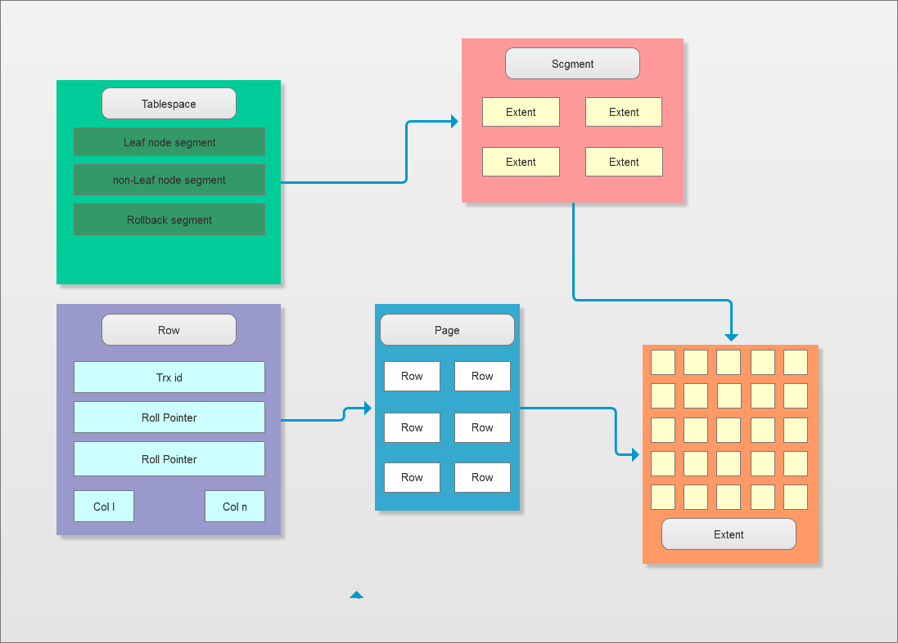
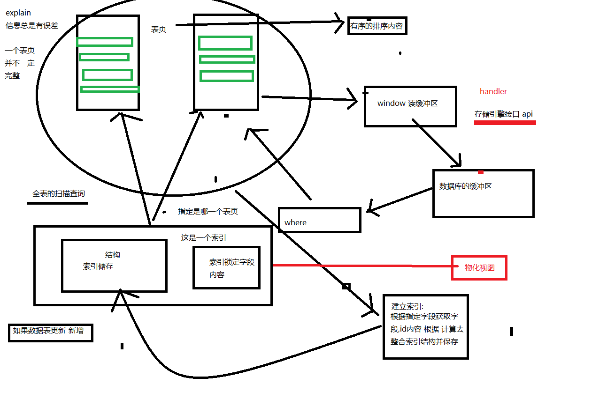

# explain实例与IO操作

### 1. 课程内容
<pre>
1. 课程回顾
   1.1 SQL语句的过强和过弱的使用
   1.2 优化SQL的思路-----------(重点)
   1.3 explain分析------------(重点 -- 不算难 -- 就是需要记记)
2. explain分析简单实例
3. profiling分析
4. MySQL数据磁盘IO操作
5. Btree结构
</pre>

### 2. explain分析简单实例

以及MySQL5.7的order与group的问题

题目 =》 其余题目当做作业吧


```sql
  单表
  CREATE TABLE `customers1` (
      -- 身份证
      `id` char(20) NOT NULL,
      -- 姓名
      `name` varchar(20) NOT NULL,
      -- 城市名
      `city` varchar(10) NOT NULL,
      -- 性别：M（男），G（女）
      `gender` tinyint(4) NOT NULL,
      -- 出生日期
      `birthdate` date NOT NULL,
      -- 手机号
      `mobile` char(11) DEFAULT NULL,
      -- 照片
      `photo` varchar(20) DEFAULT NULL,
      -- 月薪
      `monthsalary` decimal(10,2) NOT NULL,
      -- 年奖金额
      `yearbonus` decimal(10,0) DEFAULT NULL,
      PRIMARY KEY (`id`)
  ) ENGINE=InnoDB DEFAULT CHARSET=utf8
  分表
  CREATE TABLE `customers` (
    `id` char(20) NOT NULL,
    `name` varchar(20) NOT NULL,
    `city` varchar(10) NOT NULL,
    `gender` tinyint(4) NOT NULL,
    `birthdate` date NOT NULL,
    `mobile` char(11) DEFAULT NULL,
    `photo` varchar(20) DEFAULT NULL,
    PRIMARY KEY (`id`)
  ) ENGINE=InnoDB DEFAULT CHARSET=utf8

  CREATE TABLE `salary` (
    `id` char(20) NOT NULL,
    `monthsalary` decimal(10,2) NOT NULL,
    `yearbonus` decimal(10,0) DEFAULT NULL,
    PRIMARY KEY (`id`)
  ) ENGINE=InnoDB DEFAULT CHARSET=utf8

  测试数据用自己写的批量添加测试数据的方法添加吧，在此不提供哟
```

1. 女性客户数量和平均月薪
```sql
show indexes from customers;
show indexes from customers1;
show indexes from salary;


alter table salary drop index city_monthsalary
alter table customers add index city_monthsalary(city);

单表操作 customers1
select count(*),avg(monthsalary)  from customers1 where gender = 0;

select count(*),avg(salary.monthsalary) from customers left join  salary on customers.id = salary.id where customers.gender = 0 ;

两表操作；
mysql> explain select count(*),avg(salary.monthsalary) from customers left join  salary on customers.id = salary.id where customers.gender = 0 ;
+----+-------------+-----------+------------+--------+---------------+---------+---------+----------------------+-------+----------+-------------+
| id | select_type | table     | partitions | type   | possible_keys | key     | key_len | ref                  | rows  | filtered | Extra       |
+----+-------------+-----------+------------+--------+---------------+---------+---------+----------------------+-------+----------+-------------+
|  1 | SIMPLE      | customers | NULL       | ALL    | NULL          | NULL    | NULL    | NULL                 | 19638 |    10.00 | Using where |

|  1 | SIMPLE      | salary    | NULL       | eq_ref | PRIMARY       | PRIMARY | 60      | mysql12.customers.id |     1 |   100.00 | NULL        |
+----+-------------+-----------+------------+--------+---------------+---------+---------+----------------------+-------+----------+-------------+
2 rows in set, 1 warning (0.00 sec)
```

优化操作：
```sql
1、单表：
mysql> explain select count(*),avg(monthsalary)  from customers1 where gender = 0;
+----+-------------+------------+------------+------+---------------+------+---------+------+--------+----------+-------------+
| id | select_type | table      | partitions | type | possible_keys | key  | key_len | ref  | rows   | filtered | Extra       |
+----+-------------+------------+------------+------+---------------+------+---------+------+--------+----------+-------------+
|  1 | SIMPLE      | customers1 | NULL       | ALL  | NULL          | NULL | NULL    | NULL | 948806 |    10.00 | Using where |
+----+-------------+------------+------------+------+---------------+------+---------+------+--------+----------+-------------+
1 row in set, 1 warning (0.00 sec)


首先要做的就是分析结构；通过explain去分析；

从explain分析 type 可以看出来这个时候的SQL是进行了全表的扫描；key(查询实际用到的索引)与possible_keys(指出使用那个索引)key_len(索引的长度) 而extra为useing where

简单来说就是这个查询就是对于整个数据表进行了全表的扫描，没有使用到索引过滤；而主要的过滤条件就是where 也就是gender = 0;

这个时候我们可以建立索引尝试着去优化，对于索引的建立有很多的规则；之后再去细细解释；

根据索引的建立的规则-》把SQL分解

索引应该创建在搜索、排序、归组等操作所涉及的数据列上，旨在输出报告里出现的数据列不是好的候选。 简单点就是在where字句、关联检索中的from字句、order 与 group 字句中出现的数据列最适合用来创建索引。只在select关键字后面输出列清单例出现过的数据列并不是好的候选

select
  count(*),avg(monthsalary) -- 考虑一下
from
  customers1
where
  gender = 0                -- 这个不错

其他规则....过过过 之后细细分解

所以这个时候那么这个时候最合适创建索引的字段就是gender，执行alter

alter table customers1 add index gender(gender);

执行之后这个时候还是需要通过 explain分析一下数据的情况
mysql> explain select count(*),avg(monthsalary)  from customers1 where gender = 0;
+----+-------------+------------+------------+------+---------------+--------+---------+-------+--------+----------+-------+
| id | select_type | table      | partitions | type | possible_keys | key    | key_len | ref   | rows   | filtered | Extra |
+----+-------------+------------+------------+------+---------------+--------+---------+-------+--------+----------+-------+
|  1 | SIMPLE      | customers1 | NULL       | ref  | gender        | gender | 1       | const | 652605 |   100.00 | NULL  |
+----+-------------+------------+------------+------+---------------+--------+---------+-------+--------+----------+-------+
1 row in set, 1 warning (0.00 sec)

从分析的结果来看
type | possible_keys | key    | key_len | ref   | rows
ref  | gender        | gender | 1       | const | 652605

使用了刚刚创建的索引,长度为1 并且是为常量的方式查找

但是这里的extra为空，注意这个点；为空 ？？？先不纠结测试，但是测试的结果很尴尬

mysql> select count(*),avg(monthsalary)  from customers1 where gender = 0;
+----------+------------------+
| count(*) | avg(monthsalary) |
+----------+------------------+
|   651457 |      5004.957393 |
+----------+------------------+
1 row in set (41.58 sec)

并没有起到很好地效果？？？？？？？？ 为什么???? 其实这里的话就设计到了索引的设计以及查找的情况，主要的问题在于 索引回表（之后解释）了导致时间增长，那这个时候怎么优化呢？？

思路的话可以分解select 对于count(*),avg(monthsalary)进行单独测试看看效果；找出是那个部分的因素引起的

注意：单独对于select count(*) from customers1 测试一下

mysql> explain select count(*) from customers1 where gender = 0;
+----+-------------+------------+------------+------+---------------+--------+---------+-------+--------+----------+-------------+
| id | select_type | table      | partitions | type | possible_keys | key    | key_len | ref   | rows   | filtered | Extra       |
+----+-------------+------------+------------+------+---------------+--------+---------+-------+--------+----------+-------------+
|  1 | SIMPLE      | customers1 | NULL       | ref  | gender        | gender | 1       | const | 652605 |   100.00 | Using index |
+----+-------------+------------+------------+------+---------------+--------+---------+-------+--------+----------+-------------+
1 row in set, 1 warning (0.00 sec)

mysql> explain select avg(monthsalary) from customers1 where gender = 0;
+----+-------------+------------+------------+------+---------------+--------+---------+-------+--------+----------+-------+
| id | select_type | table      | partitions | type | possible_keys | key    | key_len | ref   | rows   | filtered | Extra |
+----+-------------+------------+------------+------+---------------+--------+---------+-------+--------+----------+-------+
|  1 | SIMPLE      | customers1 | NULL       | ref  | gender        | gender | 1       | const | 652605 |   100.00 | NULL  |
+----+-------------+------------+------------+------+---------------+--------+---------+-------+--------+----------+-------+
1 row in set, 1 warning (0.00 sec)

可以看出来是avg(monthsalary)引起的，也就是说我们只需要把 select avg(monthsalary) from customers1 where gender = 0; 这个优化好了那么就可以了其实avg与count一样在MySQL操作的时候也会自动的匹配一个合适的索引，而count的默认匹配索引是主键，但是在我们上面的操作环节中因为给customers1创建了一个索引gender 这个时候count(*)在操作的时候就会以gender作为辅助索引使用。

而在上面的语句中仅仅只是根据 where gender = 0 过滤了查找的内容，但是在进行数据avg的时候这个时候就是需要去进行IO获取数据具体的数据，MySQL在辅助索引操作的时候如果无法从辅助索引中获取数据这个时候就会再去查询一级索引主键根据主键获取数据再做计算；所以为了与更好的进行monthsalary 的avg操作我们应该要给monthsalary建立一个索引

alter table customers1 add index monthsalary(monthsalary);

mysql> explain select avg(monthsalary)  from customers1 ;
+----+-------------+------------+------------+-------+---------------+-------------+---------+------+---------+----------+-------------+
| id | select_type | table      | partitions | type  | possible_keys | key         | key_len | ref  | rows    | filtered | Extra       |
+----+-------------+------------+------------+-------+---------------+-------------+---------+------+---------+----------+-------------+
|  1 | SIMPLE      | customers1 | NULL       | index | NULL          | monthsalary | 5       | NULL | 1305211 |   100.00 | Using index |
+----+-------------+------------+------------+-------+---------------+-------------+---------+------+---------+----------+-------------+
1 row in set, 1 warning (0.00 sec)

mysql> explain select avg(monthsalary)  from customers1 where gender = 0;
+----+-------------+------------+------------+------+---------------+--------+---------+-------+--------+----------+-------+
| id | select_type | table      | partitions | type | possible_keys | key    | key_len | ref   | rows   | filtered | Extra |
+----+-------------+------------+------------+------+---------------+--------+---------+-------+--------+----------+-------+
|  1 | SIMPLE      | customers1 | NULL       | ref  | gender        | gender | 1       | const | 652605 |   100.00 | NULL  |
+----+-------------+------------+------------+------+---------------+--------+---------+-------+--------+----------+-------+
1 row in set, 1 warning (0.00 sec)

o(▼皿▼メ;)o怎么还是使用了gender索引 (⊙_⊙)? 其实这就是MySQL对于一个表的索引的选择的关系，MySQL只会选择与最合适的哪一个索引而不是使用所有的索引，在上面的查询中最为合适的就是 gender

这里最好的处理就是建立一个 gender 与 monthsalary的联合索引； 删除之前的索引

alter table customers1 drop index monthsalary;
alter table customers1 drop index gender;

alter table customers1 add index gender_monthsalary(gender, monthsalary); => 注意顺序，gender在前

然后测试

mysql> explain select count(*),avg(monthsalary)  from customers1 where gender = 0;
+----+-------------+------------+------------+------+--------------------+--------------------+---------+-------+--------+----------+-------------+
| id | select_type | table      | partitions | type | possible_keys      | key                | key_len | ref   | rows   | filtered | Extra       |
+----+-------------+------------+------------+------+--------------------+--------------------+---------+-------+--------+----------+-------------+
|  1 | SIMPLE      | customers1 | NULL       | ref  | gender_monthsalary | gender_monthsalary | 1       | const | 652605 |   100.00 | Using index |
+----+-------------+------------+------------+------+--------------------+--------------------+---------+-------+--------+----------+-------------+
1 row in set, 1 warning (0.00 sec)

实际执行

mysql> select count(*),avg(monthsalary)  from customers1 where gender = 0;
+----------+------------------+
| count(*) | avg(monthsalary) |
+----------+------------------+
|   651457 |      5004.957393 |
+----------+------------------+
1 row in set (0.17 sec)

explain 优化指标
systme>const>eq_ref>ref>fulltext>ref_or_null>index_merge>unique_subquery>index_subquery>range>index>all

1.const
如果是根据主键或唯一索引 只取出确定的一行数据。是最快的一种。
2.range
索引或主键，在某个范围内时
3.index
仅仅只有索引被扫描
4.all
全表扫描，最令人心痛

```

### 3. profiling分析
要想有画一条query，就需要清楚这条query的性能瓶颈到底在哪里，mysql的profiler是一个使用非常方便的查询诊断分析工具，通过该工具可以获取一条查询在整个执行过程中多种资源的消耗情况，例如内存消耗、I/O消耗和CPU消耗等。

profile的语法规则如下：
```sql
show profile [type [, type] ...]
[for query n]
[limit row_count [offset offset]]
```

其中type参数的可选项含义如下：

* all：显示所有的信息
* block io：限时输入输出操作阻塞的数量
* context switches：显示自动或非自动context switches的数量
* cpu：显示系统和用户cpu使用的时间
* ipc：显示信息发送和接受的数量
* memory：内存的信息
* page faults：显示主要的page faults数量
* source：显示函数的名称，并且系那是函数所在文件的名字和行数
* swaps：显示swap数量

开启profile
```sql
MariaDB [community]> set profiling = 1;
Query OK, 0 rows affected (0.00 sec)
```

在开启了query profiler功能之后，mysql就会自动记录所有执行的query的profile信息。下面执行query
```sql
select count(*) from admin_user_copy
select count(*) from purchase_order
```

通过执行 ``show profile`` 命令获取当前系统中保存的多个query的profile的概要信息。

```sql
MariaDB [community]> show profiles;
+----------+------------+--------------------------------------+
| Query_ID | Duration   | Query                                |
+----------+------------+--------------------------------------+
|        1 | 1.43076000 | select count(*) from admin_user_copy |
|        2 | 0.35574100 | select count(*) from purchase_order  |
+----------+------------+--------------------------------------+
2 rows in set (0.00 sec)
```

*针对单个query获取详细的profile的信息*

在获取概要信息之后就可以根据概要信息中的query_id来获取某一个query在执行过程中的profile信息了
```sql
MariaDB [community]> show profile for query 1;
+----------------------+----------+
| Status               | Duration |
+----------------------+----------+
| starting             | 0.000069 |
| checking permissions | 0.000019 |
| Opening tables       | 0.000035 |
| After opening tables | 0.000007 |
| System lock          | 0.000005 |
| Table lock           | 0.000014 |
| init                 | 0.000015 |
| optimizing           | 0.000010 |
| statistics           | 0.000019 |
| preparing            | 0.000021 |
| executing            | 0.000006 |
| Sending data         | 1.430456 |
| end                  | 0.000020 |
| query end            | 0.000010 |
| closing tables       | 0.000003 |
| Unlocking tables     | 0.000013 |
| freeing items        | 0.000006 |
| updating status      | 0.000027 |
| cleaning up          | 0.000005 |
+----------------------+----------+

MariaDB [community]> show profile cpu,block io for query 1;
+----------------------+----------+----------+------------+--------------+---------------+
| Status               | Duration | CPU_user | CPU_system | Block_ops_in | Block_ops_out |
+----------------------+----------+----------+------------+--------------+---------------+
| starting             | 0.000069 | 0.000058 |   0.000011 |            0 |             0 |
| checking permissions | 0.000019 | 0.000007 |   0.000011 |            0 |             0 |
| Opening tables       | 0.000035 | 0.000033 |   0.000002 |            0 |             0 |
| After opening tables | 0.000007 | 0.000005 |   0.000002 |            0 |             0 |
| System lock          | 0.000005 | 0.000004 |   0.000001 |            0 |             0 |
| Table lock           | 0.000014 | 0.000008 |   0.000006 |            0 |             0 |
| init                 | 0.000015 | 0.000014 |   0.000002 |            0 |             0 |
| optimizing           | 0.000010 | 0.000007 |   0.000001 |            0 |             0 |
| statistics           | 0.000019 | 0.000018 |   0.000001 |            0 |             0 |
| preparing            | 0.000021 | 0.000019 |   0.000002 |            0 |             0 |
| executing            | 0.000006 | 0.000006 |   0.000002 |            0 |             0 |
| Sending data         | 1.430456 | 1.928391 |   0.113126 |            0 |             0 |
| end                  | 0.000020 | 0.000008 |   0.000013 |            0 |             0 |
| query end            | 0.000010 | 0.000008 |   0.000001 |            0 |             0 |
| closing tables       | 0.000003 | 0.000002 |   0.000002 |            0 |             0 |
| Unlocking tables     | 0.000013 | 0.000012 |   0.000001 |            0 |             0 |
| freeing items        | 0.000006 | 0.000005 |   0.000001 |            0 |             0 |
| updating status      | 0.000027 | 0.000007 |   0.000020 |            0 |             0 |
| cleaning up          | 0.000005 | 0.000003 |   0.000001 |            0 |             0 |
+----------------------+----------+----------+------------+--------------+---------------+
```
### 4. MySQL -sql - IO的操作
#### 4.1 innodb - 磁盘的关系
对于MySQL来说数据是存在于磁盘中的，SQL主要就是通过MySQL的存储引擎的接口handler(sql/handler.cc)类进行数据的获取和操作。

它提供了一些可实现基本操作的方法，如打开和关闭表，连续扫描记录、按照兼职检索记录、存储记录及删除记录。每个存储引擎都执行处理的一个子类以实现接口方法，一边将处理器操作转化为特定存储引擎的低层次存储/检索API调用。

Innodb 存储引擎用于管理数据的最小磁盘单位。常见的页类型有数据页、Undo 页、系统页、事务数据页等，本文主要分析的是数据页。默认的页大小为 16KB，每个页中至少存储有 2 条或以上的行记录

innodb存储引擎对于数据表结构 表空间(Tablespace) -》分片段(Segment) -》盘区(Extents) -》 页(page)



*表空间：*

表空间分为了两种，这里简单的概括一下：

  1. 独立表空间：每一个表都将会生成以独立的文件方式来进行存储，每一个表都有一个.frm表描述文件，还有一个.ibd文件。 其中这个文件包括了单独一个表的数据内容以及索引内容，默认情况下它的存储位置也是在表的位置之中。
  2. 共享表空间： Innodb的所有数据保存在一个单独的表空间里面，而这个表空间可以由很多个文件组成，一个表可以跨多个文件存在，所以其大小限制不再是文件大小的限制，而是其自身的限制。从Innodb的官方文档中可以看到，其表空间的最大限制为64TB，也就是说，Innodb的单表限制基本上也在64TB左右了，当然这个大小是包括这个表的所有索引等其他相关数据。

InnoDB把数据保存在表空间内，表空间可以看作是InnoDB存储引擎逻辑结构的最高层。本质上是一个由一个或多个磁盘文件组成的虚拟文件系统。InnoDB用表空间并不只是存储表和索引，还保存了回滚段、双写缓冲区等。

*分片段(Segment)*

段是表空间文件中的主要组织结构，它是一个逻辑概念，用来管理物理文件，是构成索引、表、回滚段的基本元素。

创建一个索引（B+树）时会同时创建两个段，分别是内节点段和叶子段，内节点段用来管理（存储）B+树非叶子（页面）的数据，叶子段用来管理（存储）B+树叶子节点的数据；也就是说，在索引数据量一直增长的过程中，所有新的存储空间的申请，都是从“段”这个概念中申请的。

*盘区(Extents) -》 过*

*页(page)*

页是InnoDB磁盘管理的最小单位 对于innodb来说就是 16KB 不过如果是oracle 或者SQLserver就是4kb的大小。

常见的页类型有：
- 数据页（B-tree Node）。
- Undo页（Undo Log Page
- 事务数据页（Transaction system Page）。
- 索引行



------------------------------------------------------------------------------------------------


如果想深入理解的 建议阅读文章 MySQL · 引擎特性 · InnoDB 文件系统之文件物理结构:https://blog.csdn.net/mysql_lover/article/details/54612876
