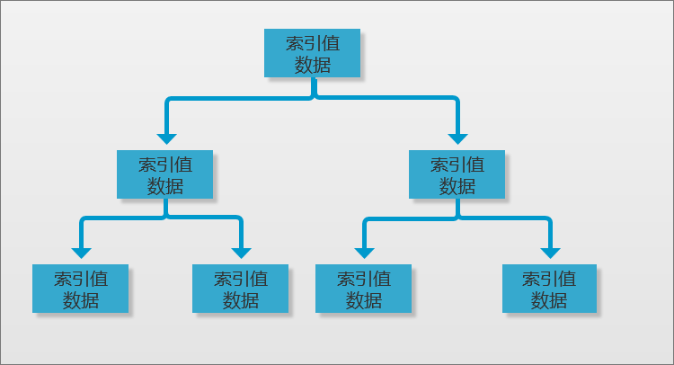
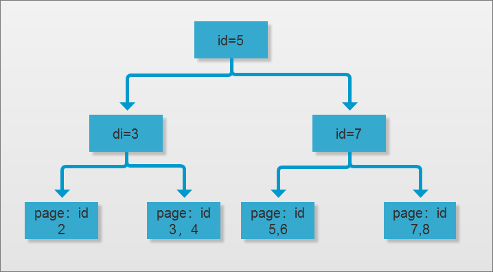
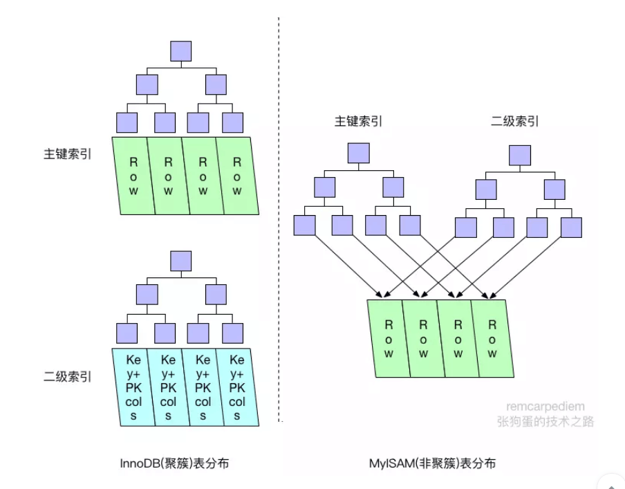
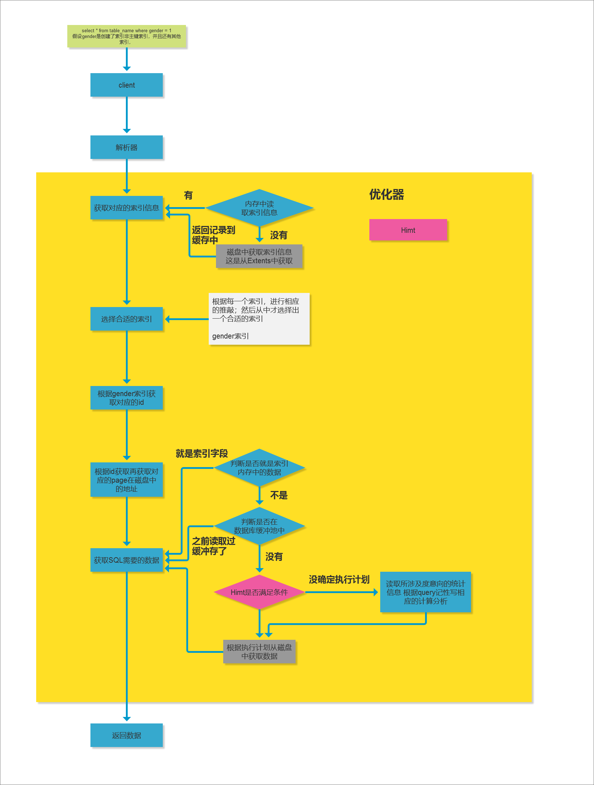

# SQL执行IO操作及索引基础

https://www.cnblogs.com/drizzle-xu/p/9869406.html

### 1.课程内容
<pre>
1. 课程回顾
  1.1. explain分析简单实例
  1.2. profiling分析
2. SQL-IO-索引-执行流程
3. 索引介绍
4. 二叉树算法
</pre>

### 2. 索引介绍
#### 2.1 认识索引
索引优化，可以说是数据库相关优化，尤其是query优化中最常用的优化手段之一。对于大都数人来说只是知道索引可以加快query执行的更快，但并不知道为什么会很快，以及它的实现原理、村粗方式，以及不同索引之间的区别等就更不清楚了。

在MySQL中，主要有4中类型的索引0，分别为：B-Tree索引，Hash索引、Fulltext索引和R-Tree索引。

索引功能包括：

* 保持数据完整性
* 优化数据访问性能
* 改进表的连接（join）操作
* 对结构进行排序
* 简化聚合数据操作


#### 2.2 数据完整性

数据完整性分为四类：实体完整性（Entity Integrity）、域完整性（Domain Integrity）、参照完整性（Referential Integrity）、用户自定义完整性（User-definedIntegrity）。

①实体完整性--主键-非空

规定表中的一行在表中是唯一的实体，一般是通过定义主键的形式来实现的。实体完整性要求每一个表中的主键字段都不能为空或者重复的值。实体完整性指表中行的完整性。要求表中的所有行都有唯一的标识符，称为 主关键字。主关键字是否可以修改，或整个列是否可以被删除，取决于主关键字与其他表之间要求的完整性。

②域完整性--数据类型

指数据库表的列（即字段）必须符合某种特定的数据类型或约束。域完整性是针对某一具体关系数据库的约束条件。它保证表中某些列不能输入无效的值。

NOT NULL：不能为空
UNIQUE：必须唯一

③参照完整性（多表设计）

当更新、删除、插入一个表中的数据时，通过参照引用相互关联的另一个表中的数据，来检查对表的数据操作是否正确，简单的说就是表间主键外键的关系。

#### 2.3 索引术语
| 类型     | 描述                                                                                                                                                                                                     |
| -------- | -------------------------------------------------------------------------------------------------------------------------------------------------------------------------------------------------------- |
| 索引技术 | 这个词是关于不同数据结构如何用不同的方法访问底层信息的理<br>论。这些技术包含B-树、B+树、R-树以及散列。每一种技术都采<br>用不同的概念来实现一种特定目标或数据结构的优势。                                 |
| 索引实现 | 这个词是关于MySQL及各种存储引擎实现不同的数据结构技术的<br>方法。例如，myisam引擎实现B-树的方法和innodb实现的方法就<br>有所不同                                                                          |
| 索引类型 | 索引类型包含主键，唯一建，非主码索引，全文本索引以及空间<br>类型。每种类型支持在单一列、多列（也叫做混合列）或者列的<br>一部分上定义的索引类型。最后，这些索列类型中的一个或多个<br>会成为所谓的覆盖索引 |

### 3. 索引类型-Btree介绍
B-tree索引是MySQL数据库中使用最为频繁的索引类型，特别是在innodb中经常使用;在其他数据库中b-tree索引也同样是作为最主要的索引类型的，这主要是因为b-tree索引的存储结构在数据库的数据检索中有着非常优异的表现。

如上就是tree的基本结构对于这种结构来说到任何一个节点的最大路径的长度都是完全相同的，但是对于数据库来说常用的主要是B-tree索引，这种索引的特点就是会把实际需要的数据都存放与tree的节点中，也就是说每一个节点中保存了索引的数值又加上了实际所以对应的数据(其实就是地址)



而innodb中的b-tree也就是这种结构，不过在这个基础上还是做了一点的额外的操作并称之为b+tree，主要的操作点，在节点处不再存放数据，多放在了树的根处，而且同时还存放了到其他位置的地址。



在innodb存储引擎中，存在两种不同形式的索引，一种是Cluster形式的主键索引，另外的一种则是和其他存储引擎存放形式基本相同的普通B-tree索引，这种索引在innodb存储引擎中被称为Secondary index（二级索引）。

两种索引类型的关系：他们两者的区别主要是在于他们存储的数据不一样，主键索引在leaf nodes 存放的是page页地址，而二级索引存放的是对应的主键id，在结构上没太多的区别

图示：



所以在innodb中如果通过主键来访问数据效率是非常高的，而如果是通过secondary index 来访问数据的话，会先根据二级Btree获取到id再根据id查询数据（这个过程也可以称之为回表）

### 3. SQL-IO-索引-执行流程


1. 首先就是用户发送一条SQL通过客户端接收之后，交由解析器解析SQL创建对应的解析树之后
2. 然后优化获取对应的数据表的信息-结构
3. 获取表中对应的数据表，首先就会去缓存中读取索引的如果没有就会通过IO读取在磁盘中记录索引的信息并返回
4. 选择合适的索引：因为一个表会有很多的索引，MySQL会对于每一个索引进行相应的算法推敲然后再做相应的删选留下最为合适的索引，所以如果说索引的数量多的话会给查询优化器带来一定的负担。
5. 因为在当前的索引为二级索引所以这个时候就会根据二级索引的btree获取到对应的id
6. 读取到所对应的id之后再通过回表查询
7. 根据主键索引获取到对应的数据的页在磁盘中的位置
8. 在获取数据之前会判断索引缓存的数据是否满足查询，然后再判断数据库缓冲池以及读缓冲区中是否有缓冲，如果有就返回。没有就会去执行对应的执行计划，从磁盘中获取数据信息

Hint：可以理解为SQL中的一个优化标识，在优化器中如果对于一条语句分析完了之后达到了优化的指标之后就会Hint记录，在执行SQL计划的时候就会去判断这个值，没有就会读取所涉及度意向的统计信息 根据query记性写相应的计算分析

### 4. 理解btree - 二叉树算法
#### 4.1 二分查找算法与平衡二分查找法
innodb存储引擎支持的哈希索引是自适应的，innodb存储引擎会根据标的使用情况自动为表生成哈希索引，不能认为干预是否在一张表中生成哈希索引。

b+树索引就是传统意义上的索引，这是目前关系型数据库系统中查找最为常用和最为有效的索引。B+树结构构造类似于二叉树

二分查找法也称为折半查找法，用来查找一组有序的记录数组中的某一记录，器基本思想是：将记录按有序化排列，在查找过程中采用跳跃式方式查找，既先以有序数列的中点位置为比较对象，如果要找的元素直销与该重点元素，则讲待查序列缩小为左半部分，否则为右半部分。

比如：如下的数据

5,10,19,22,33,44,48,55,60,68

-- 5, 10, 19, 22, 33, 44, 41, 55, 7, 51 --

现在打算查找60所在的位置。如果说我们通过顺序查找法的话，那么我们可能就需要查找9次也就是一个个去匹配的方式查找。那么二分法则是3次查找方式如下
<pre>
会先从 5,10,19,22,33,44,48,55,60,68 这个数组中查找中间件值取整数也就是 （10 - 1） / 2 = 4.5 =》4

然后用60与 33 对比发现比33大这个时候需要去查找的区间就在 44,48,55,60,68 这一范围内；取中间件值（5 - 1）/ 2 = 2.5 =》 2

也就是与55进行对比；然后发现还是大于，那么继续往右找 （2 - 1） / 2 = 0.5 =》 0

然后匹配到了，这个时候总共执行了3次；
</pre>

用PHP代码演示一下
```php
<?php
//二分查找法
function binSearch($arr, $search)
{
    $height = count($arr)-1;$low = 0;
    while ($low <= $height) {
        $mid = floor(($low + $height) / 2);//获取中间数
        if ($arr[$mid] == $search) {
            return $mid;//返回
        } elseif ($arr[$mid] < $search) {//当中间值小于所查值时，则$mid左边的值都小于$search，此时要将$mid赋值给$low
            $low = $mid + 1;
        } elseif ($arr[$mid] > $search) {//中间值大于所查值,则$mid右边的所有值都大于$search,此时要将$mid赋值给$height
            $height = $mid-1;
        }
    }
    return "查找失败";
}
//顺序查找
function seqSearch($arr, $k)
{
    foreach ($arr as $key => $val) {
        if ($val == $k) {
            return $key;
        }
    }
    return -1;
}
// 测试
$arr=array(5,10,19,22,33,44,48,55,60,68);

// echo binSearch($arr,44).'<br/>';
// echo seqSearch($arr,44).'<br/>';
?>
```

我们可以通过PHP代码来模拟二分查找；找出位置以及执行次数的对比作为测试

但是这个方式如果对于非规则数据就不好使比如：5, 10, 19, 22, 33, 44, 41, 55, 7, 51 从中找出7所在的位置，这个时候就会发现找不到数据。所以就需要根据对应的规则建立对应的树。

那么根据我们目前的这个数组返回的树的结构就是


-
