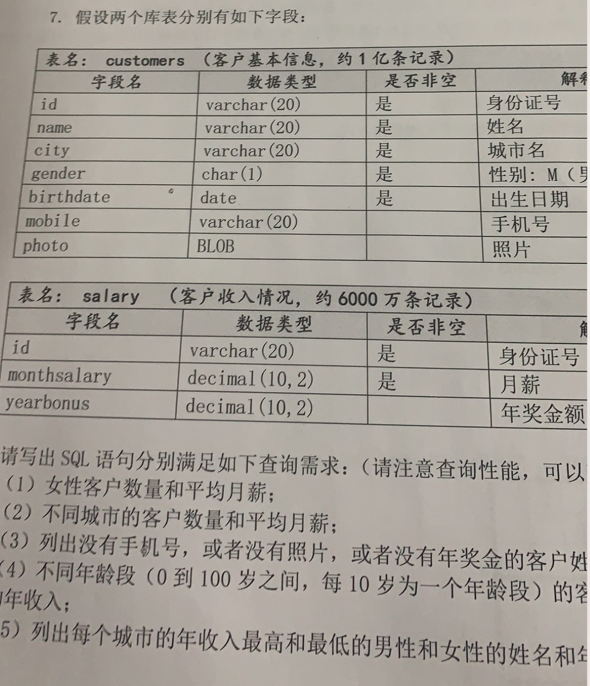

# SQL优化案例实践
MySQL5.7 中文文档 https://www.docs4dev.com/docs/zh/mysql/5.7/reference/group-by-handling.html



```sql
  根据数据表的一些建立的规则稍加调整一下数据表中的字段

  单表
  CREATE TABLE `customers1` (
      -- 身份证
      `id` char(20) NOT NULL,
      -- 姓名
      `name` varchar(20) NOT NULL,
      -- 城市名
      `city` varchar(10) NOT NULL,
      -- 性别：M（男），G（女）
      `gender` tinyint(4) NOT NULL,
      -- 出生日期
      `birthdate` date  NOT NULL,
      -- 手机号
      `mobile` char(11) DEFAULT 0 NOT NULL,
      -- 照片
      `photo` varchar(20) DEFAULT 0 NOT NULL,
      -- 月薪
      `monthsalary` decimal(10,2) NOT NULL,
      -- 年奖金额
      `yearbonus` decimal(10,0) DEFAULT 0 NOT NULL,
      PRIMARY KEY (`id`)
  ) ENGINE=InnoDB DEFAULT CHARSET=utf8
  分表
  CREATE TABLE `customers` (
    `id` char(20) NOT NULL,
    `name` varchar(20) NOT NULL,
    `city` varchar(10) NOT NULL,
    `gender` tinyint(4) NOT NULL,
    `birthdate` date NOT NULL,
    `mobile` char(11) DEFAULT 0 NOT NULL,
    `photo` varchar(20) DEFAULT 0 NOT NULL,
    PRIMARY KEY (`id`)
  ) ENGINE=InnoDB DEFAULT CHARSET=utf8

  CREATE TABLE `salary` (
    `id` char(20) NOT NULL,
    `monthsalary` decimal(10,2) NOT NULL,
    `yearbonus` decimal(10,0) DEFAULT 0 NOT NULL,
    PRIMARY KEY (`id`)
  ) ENGINE=InnoDB DEFAULT CHARSET=utf8

  select * from table force index(PRI) limit 2;(强制使用主键)
  select * from table ignore index(PRI) limit 2;(禁止使用主键)
```

### 1. 没有主键的表的问题
没有主键索引的情况：https://www.jianshu.com/p/6c70402993eb
大家可以看看这个链接吧,相对来说更加的详细

### 2. 列出没有手机号码，或者没有照片，或者没有年奖金的客户姓名
对于数据表调整，把一些允许为空的字段修改为 0 或其他特殊字符代替，这里我们把一些字段改为默认值为0表示null：解释

尽量避免NULL很多表都包含可为NULL（空值）的列，即使应用程序并不需要保存NULL也是如此，这是因为可为NULL是列的默认属性。通常情况下最好指定列为NOTNULL，除非真的需要存储NULL值。

如果查询中包含可为NULL的列，对MySQL来说更难优化，因为可为NULL的列使得索引、索引统计和值比较都更复杂。可为NULL的列会使用更多的存储空间，在MySQL里也需要特殊处理。当可为NULL的列被索引时，每个索引记录需要一个额外的字节，在MyISAM里甚至还可能导致固定大小的索引（例如只有一个整数列的索引）变成可变大小的索引。

通常把可为NULL的列改为NOT NULL带来的性能提升比较小，所以（调优时）没有必要首先在现有schema中查找并修改掉这种情况，除非确定这会导致问题。但是，如果计划在列上建索引，就应该尽量避免设计成可为NULL的列。

```sql
update customers1 set yearbonus  = 0 where yearbonus  is null
update customers1 set mobile = 0 where mobile is null
update customers1 set photo  = 0 wher e photo  is null

select name,photo,mobile,yearbonus from customers1 where photo = 0 or mobile = 0 or yearbonus = 0;
```
如上便是我们所需要执行的SQL语句，也就是说实际上我们所进行的优化就是针对于or的请下的优化

通过explain分析一下上面的SQL

```sql
mysql> explain select name,photo,mobile,yearbonus from customers1 where photo = 0 or mobile = 0 or yearbonus = 0;
+----+-------------+------------+------------+------+---------------+------+---------+------+---------+----------+-------------+
| id | select_type | table      | partitions | type | possible_keys | key  | key_len | ref  | rows    | filtered | Extra       |
+----+-------------+------------+------------+------+---------------+------+---------+------+---------+----------+-------------+
|  1 | SIMPLE      | customers1 | NULL       | ALL  | NULL          | NULL | NULL    | NULL | 1310946 |    27.10 | Using where |
+----+-------------+------------+------------+------+---------------+------+---------+------+---------+----------+-------------+
1 row in set, 1 warning (0.04 sec)

mysql>show index from table_name
+------------+------------+-----------------------------+--------------+-------------+-----------+-------------+------------+
| Table      | Non_unique | Key_name                    | Seq_in_index | Column_name | Collation | Cardinality | Index_type |
+------------+------------+-----------------------------+--------------+-------------+-----------+-------------+------------+
| customers1 |          0 | PRIMARY                     |            1 | id          | A         |     1310881 | BTREE      |
| customers1 |          1 | idx_gender_city_monthsalary |            1 | gender      | A         |           1 | BTREE      |
| customers1 |          1 | idx_gender_city_monthsalary |            2 | city        | A         |          21 | BTREE      |
| customers1 |          1 | idx_gender_city_monthsalary |            3 | monthsalary | A         |     1310946 | BTREE      |
+------------+------------+-----------------------------+--------------+-------------+-----------+-------------+------------+
4 rows in set (0.00 sec)
```
分别对于上面三个条件定义单独的索引

```sql
alter table customers1 add index idx_photo(photo);
alter table customers1 add index idx_mobile(mobile);
alter table customers1 add index idx_yearbonus(yearbonus);

mysql> show index from customers1;
+------------+------------+-----------------------------+--------------+-------------+-----------+-------------+------------+
| Table      | Non_unique | Key_name                    | Seq_in_index | Column_name | Collation | Cardinality | Index_type |
+------------+------------+-----------------------------+--------------+-------------+-----------+-------------+------------+
| customers1 |          0 | PRIMARY                     |            1 | id          | A         |     1310881 | BTREE      |
| customers1 |          1 | idx_gender_city_monthsalary |            1 | gender      | A         |           1 | BTREE      |
| customers1 |          1 | idx_gender_city_monthsalary |            2 | city        | A         |          21 | BTREE      |
| customers1 |          1 | idx_gender_city_monthsalary |            3 | monthsalary | A         |     1310946 | BTREE      |
| customers1 |          1 | idx_photo                   |            1 | photo       | A         |           1 | BTREE      |
| customers1 |          1 | idx_mobile                  |            1 | mobile      | A         |      697873 | BTREE      |
| customers1 |          1 | idx_yearbonus               |            1 | yearbonus   | A         |        9996 | BTREE      |
+------------+------------+-----------------------------+--------------+-------------+-----------+-------------+------------+
7 rows in set (0.00 sec)

然后再通过分析
mysql> explain select name,photo,mobile,yearbonus from customers1 where photo = 0 or mobile = 0 or yearbonus = 0 \G;
*************************** 1. row ***************************
           id: 1
  select_type: SIMPLE
        table: customers1
   partitions: NULL
         type: ALL
possible_keys: idx_photo,idx_mobile,idx_yearbonus
          key: NULL
      key_len: NULL
          ref: NULL
         rows: 1310946
     filtered: 27.10
        Extra: Using where
1 row in set, 4 warnings (0.00 sec)
```
发现并没有使用到所以定一点的索引，主要是因为出现多个索引做联合操作是（多个OR条件），对结果的合并、排序等操作需要费大量的CPU和内存资源，特别是当其中的某些索引的选择性不高，需要返回合并大量数据时，查询成本更高。所以这种情况下还不如走全表扫描。

官方对于OR的解释 https://dev.mysql.com/doc/refman/5.7/en/index-merge-optimization.html

可以通过union all / union 进行优化，union all 主要是将两个select语句的结果作为一个整体显示出来

union和union all的区别是,union会自动压缩多个结果集合中的重复结果，而union all则将所有的结果全部显示出来，不管是不是重复。

```sql
通过explain分析
explain
select name from customers1 where photo = 0
union all
select name from customers1 where mobile = 0
union all
select name from customers1 where yearbonus = 0;

+----+-------------+------------+------+---------------+---------------+---------+-------+--------+----------+-------------+
| id | select_type | table      | type | possible_keys | key           | key_len | ref   | rows   | filtered | Extra       |
+----+-------------+------------+------+---------------+---------------+---------+-------+--------+----------+-------------+
|  1 | PRIMARY     | customers1 | ALL  | idx_photo     | NULL          | NULL    | NULL  | 577859 |    10.00 | Using where |
|  2 | UNION       | customers1 | ALL  | idx_mobile    | NULL          | NULL    | NULL  | 577859 |    10.00 | Using where |
|  3 | UNION       | customers1 | ref  | idx_yearbonus | idx_yearbonus | 5       | const | 288929 |   100.00 | NULL        |
+----+-------------+------------+------+---------------+---------------+---------+-------+--------+----------+-------------+
```

索引使用注意：<font color=red>1. 字符串字段索引值不加引号会失效</font>

当前的所建立的索引实际上并不是特别的好因为会引起回表，为了与更好的效果因此先重新定义索引，根据三条SQL创建对应的SQL

```sql
alter table customers1 drop index idx_photo;
alter table customers1 drop index idx_mobile;
alter table customers1 drop index idx_yearbonus;

alter table customers1 add index idx_yearbonus_name(yearbonus,name);-- 1
alter table customers1 add index idx_moblie_name(mobile,name);      -- 2
alter table customers1 add index idx_name_photo(name,photo);        -- 3
```
如上1,2创建的索引问题不大,3相信很多的疑问，因为这有违背之前所讲的索引挑选的原则，就是优先选择与where 之后的字段作为索引以及最左侧的索引，但是现在选择name为最左侧；这其实在建立的时候我们需要思考当前的这个索引在建立之后可重复用的情况，实际项目操作中我们很少有单独的根据图片去查询用户的信息，更多的时候我们会选择根据用户的某一些信息来查询用户的图片所以在3建立的时候我们需要选择与name作为最左侧查询；

```sql
mysql> explain select name from customers1 where photo = 0;
+----+-------------+------------+-------+---------------+----------------+---------+--------+----------+--------------------------+
| id | select_type | table      | type  | possible_keys | key            | key_len | rows   | filtered | Extra                    |
+----+-------------+------------+-------+---------------+----------------+---------+--------+----------+--------------------------+
|  1 | SIMPLE      | customers1 | index | NULL          | idx_name_photo | 124     | 577859 |    10.00 | Using where; Using index |
+----+-------------+------------+-------+---------------+----------------+---------+--------+----------+--------------------------+
1 row in set, 1 warning (0.00 sec)

别忘了在对于做出分析

explain
select name from customers1 where photo = 0
union all
select name from customers1 where mobile = 0
union all
select name from customers1 where yearbonus = 0;
```

### 4. 覆盖索引
对于上面的3SQLmysql的操作
```sql
explain select name from customers1 where photo = '0' and gender = 0 ;
explain select * from customers1 where photo = '0' ;
```
a. 查询哪些索引满足where 字段的最左匹配的字段
b. 查询获取的字段是否都在某一些索引中
c. 根据b找到索引再去匹配where 中的字段是否也包含

辅助索引:子节点 => 主键id, 它自己的索引值, 联合索引的其他字段值

### 5. 区间分组统计查询
这个地方需要使用elt,interval,在查询中有些时候我们是需要进行区间分组
```sql
先用一个小表演示一下操作
CREATE TABLE `class` (
  `id` int(255) NOT NULL AUTO_INCREMENT,
  `score` int(11) DEFAULT NULL,
  PRIMARY KEY (`id`)
) ENGINE=InnoDB AUTO_INCREMENT=21 DEFAULT CHARSET=utf8
```
数据自己添加，统计个分数区间数据
比如现在统计<50,<50、50-60、60-70、70-80、80-90、90-100、>=100分数区间的人数
利用 INTERVAL 划出7个区间；再利用 elt 函数将7个区间分别返回一个列名，如下SQL：

```sql
SELECT elt(
  INTERVAL(score, 0, 50, 60, 70, 80, 90, 100),
  '<50', '50-60', '60-70', '70-80', '80-90', '90-100', '>=100') as score_level,
  count(*) as counts
FROM class
GROUP BY elt(
  INTERVAL(score, 0, 50, 60, 70, 80, 90, 100),
  '<50', '50-60', '60-70', '70-80', '80-90', '90-100', '>=100'
);
+-------------+--------+
| score_level | counts |
+-------------+--------+
| 50-60       |      4 |
| 60-70       |      1 |
| 70-80       |      2 |
| 80-90       |      2 |
| <50         |     11 |
+-------------+--------+

自定义排序：
SELECT elt(
  INTERVAL(score, 0, 50, 60, 70, 80, 90, 100),
'1/<50', '2/50-60', '3/60-70', '4/70-80', '5/80-90', '6/90-100', '7/>=100') as score_level,
  count(*) as counts
FROM class
GROUP BY elt(
  INTERVAL(score, 0, 50, 60, 70, 80, 90, 100),
  '1/<50', '2/50-60', '3/60-70', '4/70-80', '5/80-90', '6/90-100', '7/>=100'
);
```
### 6. 不同年龄段(0到100岁之间，每10岁为一个年龄段)的客户平均年收入

> 创建索引从上可以得知我们可以通过给birthdate, monthsalary, yearbonus 这三个字段定义索引就可以起到很好地效果，但是如何定义，索引字段顺序如何选择？

通常来说对于联合索引的选择最好是要选择与区分度比较高的作为索引的第一例，不过这并不一定是最好的选择只能说是大部分很实用；在实际中你还需要根据查询的频繁度去考虑这个前后的关系；__当不需要考虑排序和分组时，讲选择性最高的列放在前面通常是很好的__ 这时候索引作用只是用于优化where条件的查询。在这种情况下，这样设计的索引确实能够最快地过滤出需要的行，对于在WHERE子句中只使用了索引部分前缀列的查询来说选择性也更高。然而，性能不只是依赖于所有索引列的选择性（整体基数），也和查询条件的具体值有关，也就是和值的分布有关。

如上的SQL可通过按经验法则来做，因为经验法则考虑的是全局基数和选择性，而不是某个具体查询：查找方式主要是统计数据对于总数据量的分布范围，选择与常作为条件并且分布相对多的字段

```sql
select
  count(distinct yearbonus)/ count(*) as year_select,
  count(distinct monthsalary)/ count(*) as mon_select,
  count(distinct TIMESTAMPDIFF(YEAR, birthdate, CURDATE())) / count(*) as bir_select,
  count(*) as counts
from customers1;
+-------------+------------+------------+--------+
| year_select | mon_select | bir_select | counts |
+-------------+------------+------------+--------+
|      0.0167 |     0.7515 |     0.0002 | 600000 |
+-------------+------------+------------+--------+

monthsalary的选择性更高，索引答案是将其作为索引列的第一列因此索引的建立就是
alter table customers1 add index idx_monthsalary_yearbonus_birthdate(monthsalary,yearbonus,birthdate);

explain
select
		elt(interval(TIMESTAMPDIFF(YEAR, birthdate, CURDATE()), 0, 10, 20, 30, 40, 50, 60, 70, 80, 90, 100),
		'0-10', '10-20', '20-30', '30-40', '40-50', '50-60', '60-70', '70-80', '80-90', '90-100', '100>'
		) as age_level, avg((monthsalary * 12 + yearbonus)) as income
from customers1
group by
	elt(interval(TIMESTAMPDIFF(YEAR, birthdate, CURDATE()), 0, 10, 20, 30, 40, 50, 60, 70, 80, 90, 100),
		'0-10', '10-20', '20-30', '30-40', '40-50', '50-60', '60-70', '70-80', '80-90', '90-100', '100>'
  ) \G;
*************************** 1. row ***************************
           id: 1
  select_type: SIMPLE
        table: customers1
   partitions: NULL
         type: index
possible_keys: idx_monthsalary_yearbonus_birthdate
          key: idx_monthsalary_yearbonus_birthdate
      key_len: 13
          ref: NULL
         rows: 577859
     filtered: 100.00
        Extra: Using index; Using temporary; Using filesort
1 row in set, 1 warning (0.00 sec)

可以看到使用了索引
```

### 7. mysql5.7函数索引
测试
```sql
ALTER TABLE customers1 DROP INDEX birthdate(birthdate);
explain select * from customers1 where TIMESTAMPDIFF(YEAR, birthdate, CURDATE()) = 0;
```

MySQL5.7 函数索引 https://dev.mysql.com/doc/refman/5.7/en/create-table-generated-columns.html

函数索引：MySQL所谓的函数索引其实在本质上解释还是btree索引，实现的方式主要是通过在数据表中新增一个字段用来存放函数字段列，然后对这个字段定义一个索引。

```sql
创建函数索引
1、添加一个虚拟的字段
alter table class add column scorce_generated int  generated always as (ROUND(score));
2、添加索引
alter table class add key idx_scorce_generated(scorce_generated);

mysql> show index from class;
+-------+------------+----------------------+--------------+------------------+-----------+-------------+------------+---------+---------------+
| Table | Non_unique | Key_name             | Seq_in_index | Column_name      | Collation | Cardinality | Index_type | Comment | Index_comment |
+-------+------------+----------------------+--------------+------------------+-----------+-------------+------------+---------+---------------+
| class |          0 | PRIMARY              |            1 | id               | A         |          20 | BTREE      |         |               |
| class |          1 | idx_scorce_generated |            1 | scorce_generated | A         |          18 | BTREE      |         |               |
+-------+------------+----------------------+--------------+------------------+-----------+-------------+------------+---------+---------------+
2 rows in set (0.00 sec)

官方例子 直接在创建数据表的时候添加这个操作
CREATE TABLE triangle (
  sidea DOUBLE,
  sideb DOUBLE,
  sidec DOUBLE AS (SQRT(sidea * sidea + sideb * sideb))
);
INSERT INTO triangle (sidea, sideb) VALUES(1,1),(3,4),(6,8);

如下是语法
col_name data_type [GENERATED ALWAYS] AS (expr)
  [VIRTUAL | STORED] [NOT NULL | NULL]
  [UNIQUE [KEY]] [[PRIMARY] KEY]
  [COMMENT 'string']
```

#### 8. group问题
```sql
1、MySQL中MAX函数与Group By一起使用的注意事项
条件：同一个user_role
业务：根据权限分组查询user_id最大的数据

MySQL 5.5 版本

mysql> select * from user_role;
+----+---------+---------+
| id | user_id | role_id |
+----+---------+---------+
|  3 |       3 |       3 |
|  4 |       4 |       4 |
|  5 |       0 |       0 |
| 11 |      17 |       1 |
| 13 |      19 |       3 |
| 16 |      22 |       2 |
| 18 |      24 |       2 |
| 19 |      25 |       3 |
| 22 |      31 |       1 |
+----+---------+---------+
9 rows in set (0.00 sec)

如下就是我们平时的SQL写法

mysql> select id,role_id,max(user_id) from user_role group by role_id;
+----+---------+--------------+
| id | role_id | max(user_id) |
+----+---------+--------------+
|  5 |       0 |            0 |
| 11 |       1 |           31 |
| 16 |       2 |           24 |
|  3 |       3 |           25 |
|  4 |       4 |            4 |
+----+---------+--------------+
5 rows in set (0.00 sec)

但是会很容易的发现实际上数据并不对比如我们查询id为11的数据，user_id并不是31

mysql> select * from user_role where id = 11;
+----+---------+---------+
| id | user_id | role_id |
+----+---------+---------+
| 11 |      17 |       1 |
+----+---------+---------+
1 row in set (0.00 sec)

所以这里需要注意一下！！！SQL改为如下方式：
select id,role_id,user_id from (
	select * from user_role order by user_id desc
) as a group by role_id
+----+---------+---------+
| id | role_id | user_id |
+----+---------+---------+
|  5 |       0 |       0 |
| 22 |       1 |      31 |
| 18 |       2 |      24 |
| 19 |       3 |      25 |
|  4 |       4 |       4 |
+----+---------+---------+
5 rows in set (0.00 sec)

测试id = 22 数据

mysql> select * from user_role where id = 22;
+----+---------+---------+
| id | user_id | role_id |
+----+---------+---------+
| 22 |      31 |       1 |
+----+---------+---------+
1 row in set (0.00 sec)

切换为MySQL 5.7 测试 !!!∑(ﾟДﾟノ)ノ 然后发现又是一个坑 （*゜Д゜）σ凸←自爆按钮

mysql> select id,role_id,user_id from (
    -> select * from user_role order by user_id desc
    -> ) as a group by role_id;
+----+---------+---------+
| id | role_id | user_id |
+----+---------+---------+
|  5 |       0 |       0 |
| 11 |       1 |      17 |
| 16 |       2 |      22 |
|  3 |       3 |       3 |
|  4 |       4 |       4 |
+----+---------+---------+
5 rows in set (0.00 sec)

数据不对呀(〃＞皿＜)

实际上MySQL 5.7 对于SQL进行了改写
mysql> explain select id,role_id,user_id from (select * from user_role order by user_id desc ) as a group by role_id;
+----+-------------+-----------+------------+------+------+------+----------+---------------------------------+
| id | select_type | table     | partitions | type | ref  | rows | filtered | Extra                           |
+----+-------------+-----------+------------+------+------+------+----------+---------------------------------+
|  1 | SIMPLE      | user_role | NULL       | ALL  | NULL |    9 |   100.00 | Using temporary; Using filesort |
+----+-------------+-----------+------------+------+------+------+----------+---------------------------------+
1 row in set, 1 warning (0.00 sec)

mysql> show warnings \G;
*************************** 1. row ***************************
  Level: Note
   Code: 1003
Message: /* select#1 */ select `mysql12`.`user_role`.`id` AS `id`,`mysql12`.`user_role`.`role_id` AS `role_id`,`mysql12`.`user_role`.`user_id` AS `user_id` from `mysql12`.`user_role` group by `mysql12`.`user_role`.`role_id`
1 row in set (0.00 sec)

ERROR:
No query specified

官方的解释：https://bugs.mysql.com/bug.php?id=80131

那么可实行的方法：
1、
select u.id,u.role_id,u.user_id from user_role u,
 (select max(user_id) max_user_id,role_id from user_role group by role_id )
as a where a.max_user_id = u.user_id and a.role_id = u.role_id
+----+---------+---------+
| id | role_id | user_id |
+----+---------+---------+
|  4 |       4 |       4 |
|  5 |       0 |       0 |
| 18 |       2 |      24 |
| 19 |       3 |      25 |
| 22 |       1 |      31 |
+----+---------+---------+
5 rows in set (0.00 sec)

2、
select
	u.id,u.role_id,u.user_id
from
	user_role u left join user_role a on u.role_id = a.role_id and u.user_id < a.user_id
where
	a.user_id is null;

推介1把容易理解，相对来说效率高一些

关于MySQL5.7 group 与 order 问题 还有解决方法就是

mysql> select id,role_id,user_id from (select * from user_role order by user_id desc limit 0,100 ) as a group by role_id;
+----+---------+---------+
| id | role_id | user_id |
+----+---------+---------+
|  5 |       0 |       0 |
| 22 |       1 |      31 |
| 18 |       2 |      24 |
| 19 |       3 |      25 |
|  4 |       4 |       4 |
+----+---------+---------+
5 rows in set (0.00 sec)

必须要加上limit 才可以
```
