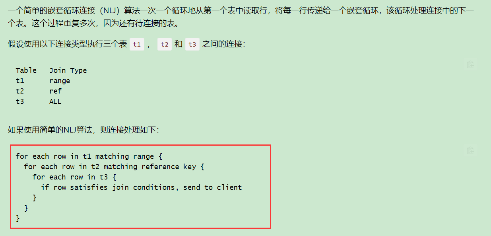
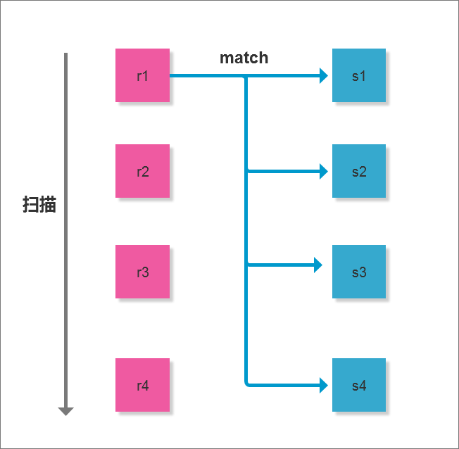
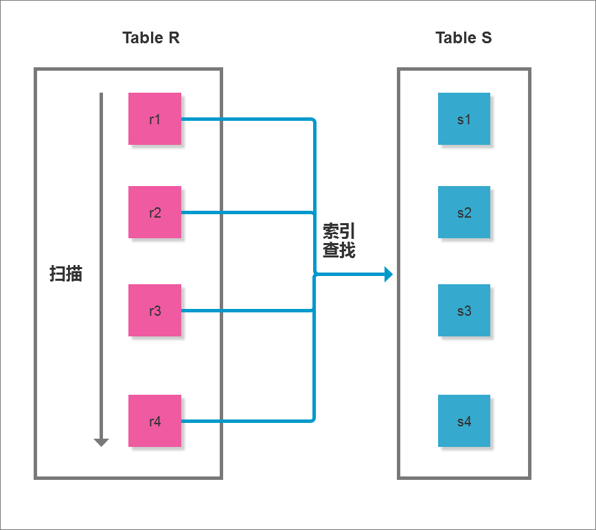
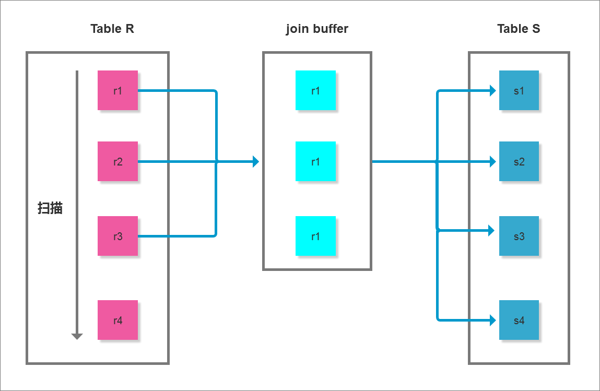

# join 初步

### 0. 课程内容

1. 课程回顾(省略)
2. 第五题
3. 5.5与5.7版本之间子查询的区别
4. 问题解答环境
5. join算法
6. 连接驱动表选择

### 1. 第五题（列出每个城市的年收入最高和最低的男性和女性的姓名和年收入）

还是强调一下关于 MySQL5.7 group 的问题ψ(*｀ー´)ψ

1、MySQL中MAX函数与Group By一起使用的注意事项
条件：同一个user_role
业务：根据权限分组查询user_id最大的数据

```sql
MySQL 5.5 版本
mysql> select * from user_role;
+----+---------+---------+
| id | user_id | role_id |
+----+---------+---------+
|  3 |       3 |       3 |
|  4 |       4 |       4 |
|  5 |       0 |       0 |
| 11 |      17 |       1 |
| 13 |      19 |       3 |
| 16 |      22 |       2 |
| 18 |      24 |       2 |
| 19 |      25 |       3 |
| 22 |      31 |       1 |
+----+---------+---------+
9 rows in set (0.00 sec)

如下就是我们平时的SQL写法

mysql> select id,role_id,max(user_id) from user_role group by role_id;
+----+---------+--------------+
| id | role_id | max(user_id) |
+----+---------+--------------+
|  5 |       0 |            0 |
| 11 |       1 |           31 |
| 16 |       2 |           24 |
|  3 |       3 |           25 |
|  4 |       4 |            4 |
+----+---------+--------------+
5 rows in set (0.00 sec)
```

但是会很容易的发现实际上数据并不对比如我们查询id为11的数据，user_id并不是31

```sql
mysql> select * from user_role where id = 11;
+----+---------+---------+
| id | user_id | role_id |
+----+---------+---------+
| 11 |      17 |       1 |
+----+---------+---------+
1 row in set (0.00 sec)

所以这里需要注意一下！！！SQL改为如下方式：
select id,role_id,user_id from (
    select * from user_role order by user_id desc
) as a group by role_id
+----+---------+---------+
| id | role_id | user_id |
+----+---------+---------+
|  5 |       0 |       0 |
| 22 |       1 |      31 |
| 18 |       2 |      24 |
| 19 |       3 |      25 |
|  4 |       4 |       4 |
+----+---------+---------+
5 rows in set (0.00 sec)

测试id = 22 数据

mysql> select * from user_role where id = 22;
+----+---------+---------+
| id | user_id | role_id |
+----+---------+---------+
| 22 |      31 |       1 |
+----+---------+---------+
1 row in set (0.00 sec)
```

切换为MySQL 5.7 测试 !!!∑(ﾟДﾟノ)ノ 然后发现又是一个坑 （*゜Д゜）σ凸←自爆按钮

```sql
mysql> select id,role_id,user_id from (
    -> select * from user_role order by user_id desc
    -> ) as a group by role_id;
+----+---------+---------+
| id | role_id | user_id |
+----+---------+---------+
|  5 |       0 |       0 |
| 11 |       1 |      17 |
| 16 |       2 |      22 |
|  3 |       3 |       3 |
|  4 |       4 |       4 |
+----+---------+---------+
5 rows in set (0.00 sec)

数据不对呀(〃＞皿＜)

实际上MySQL 5.7 对于SQL进行了改写
mysql> explain select id,role_id,user_id from (select * from user_role order by user_id desc ) as a group by role_id;
+----+-------------+-----------+------------+------+------+------+----------+---------------------------------+
| id | select_type | table     | partitions | type | ref  | rows | filtered | Extra                           |
+----+-------------+-----------+------------+------+------+------+----------+---------------------------------+
|  1 | SIMPLE      | user_role | NULL       | ALL  | NULL |    9 |   100.00 | Using temporary; Using filesort |
+----+-------------+-----------+------------+------+------+------+----------+---------------------------------+
1 row in set, 1 warning (0.00 sec)

mysql> show warnings \G;
*************************** 1. row ***************************
  Level: Note
   Code: 1003
Message: /* select#1 */ select `mysql12`.`user_role`.`id` AS `id`,`mysql12`.`user_role`.`role_id` AS `role_id`,`mysql12`.`user_role`.`user_id` AS `user_id` from `mysql12`.`user_role` group by `mysql12`.`user_role`.`role_id`
1 row in set (0.00 sec)
```

官方的解释：https://bugs.mysql.com/bug.php?id=80131

那么可实行的方法：

```sql
1、
select u.id,u.role_id,u.user_id from user_role u,
 (select max(user_id) max_user_id,role_id from user_role group by role_id )
as a where a.max_user_id = u.user_id and a.role_id = u.role_id
+----+---------+---------+
| id | role_id | user_id |
+----+---------+---------+
|  4 |       4 |       4 |
|  5 |       0 |       0 |
| 18 |       2 |      24 |
| 19 |       3 |      25 |
| 22 |       1 |      31 |
+----+---------+---------+
5 rows in set (0.00 sec)

2、
select
    u.id,u.role_id,u.user_id
from
    user_role u left join user_role a on u.role_id = a.role_id and u.user_id < a.user_id
where
    a.user_id is null;

推介1把容易理解，相对来说效率高一些

关于MySQL5.7 group 与 order 问题 还有解决方法就是

mysql> select id,role_id,user_id from (select * from user_role order by user_id desc limit 0,100 ) as a group by role_id;
+----+---------+---------+
| id | role_id | user_id |
+----+---------+---------+
|  5 |       0 |       0 |
| 22 |       1 |      31 |
| 18 |       2 |      24 |
| 19 |       3 |      25 |
|  4 |       4 |       4 |
+----+---------+---------+
5 rows in set (0.00 sec)

必须要加上limit 才可以
```

回到题目中，根据题目的意思实际上我们需要分为两条SQL 通过 union all 和在一起(这是简单版本的)

```sql
explain
select
    a.name,
    b.income
FROM
    customers1 a,
    (
        select
            city,gender,min(monthsalary * 12 + yearbonus) as income
         from
            customers1 ignore index(idx_gender_city_monthsalary)
         group by city,gender
    ) b
where
    a.city = b.city and
    a.gender = b.gender and
  (a.monthsalary * 12 + a.yearbonus) = b.income

select
      a.name,
      b.income
FROM
    customers1 a,
    (
        select
            city,gender,max(monthsalary * 12 + yearbonus) as income
         from
            customers1 ignore index(idx_gender_city_monthsalary)
         group by city,gender
    ) b
where
    a.city = b.city and
    a.gender = b.gender and
  (a.monthsalary * 12 + a.yearbonus) = b.income

优化的方式很简单可以在之前创建如下索引
alter table customers1 add index idx_gender_city_name_monthsalary_yearbonus(gender, city, name, monthsalary, yearbonus);
alter table customers1 add index idx_gender_city_monthsalary_yearbonus(gender, city, monthsalary, yearbonus);
```

当然有同学可能就会疑惑(*•ω•)，就是这优化就是对于对应的SQL语句然后创建联合索引嘛？

如果从一定要把这条SQL优化来说是那么回事，但是最主要的其实还是我们应该怎么去建立这个索引，这是我们所需要关注的；在整个优化的过程中我们实际上主要都是尽量使用覆盖索引去帮助我们优化SQL;

实际上索引的建立最主要的几个点从我们的案例中诠释的：...等等我还是先再重新声明一下关于MySQL对于索引的选择 ლ(⁰⊖⁰ლ)最近有学员还是不懂呀 ：mysql对于索引的选择主要是看where条件上的字段，它并不会优先考虑你需要获取的是那些字段列

比如：

```sql
show index from customers1;
+------------+------------+---------------------------------------+--------------+-------------+-----------+-------------+------------+
| Table      | Non_unique | Key_name                              | Seq_in_index | Column_name | Collation | Cardinality | Index_type |
+------------+------------+---------------------------------------+--------------+-------------+-----------+-------------+------------+
| customers1 |          0 | PRIMARY                               |            1 | id          | A         |      577859 | BTREE      |
| customers1 |          1 | idx_monthsalary_yearbonus_birthdate   |            1 | monthsalary | A         |      450702 | BTREE      |
| customers1 |          1 | idx_monthsalary_yearbonus_birthdate   |            2 | yearbonus   | A         |      555676 | BTREE      |
| customers1 |          1 | idx_monthsalary_yearbonus_birthdate   |            3 | birthdate   | A         |      577859 | BTREE      |
| customers1 |          1 | idx_gender_city_monthsalary_yearbonus |            1 | gender      | A         |           1 | BTREE      |
| customers1 |          1 | idx_gender_city_monthsalary_yearbonus |            2 | city        | A         |          21 | BTREE      |
| customers1 |          1 | idx_gender_city_monthsalary_yearbonus |            3 | monthsalary | A         |      577859 | BTREE      |
| customers1 |          1 | idx_gender_city_monthsalary_yearbonus |            4 | yearbonus   | A         |      577859 | BTREE      |
+------------+------------+---------------------------------------+--------------+-------------+-----------+-------------+------------+
8 rows in set (0.01 sec)

explain select count(monthsalary) from customers1;
+----+-------------+------------+-------+-------------------------------------+---------+--------+----------+-------------+
| id | select_type | table      | type  | key                                 | key_len | rows   | filtered | Extra       |
+----+-------------+------------+-------+-------------------------------------+---------+--------+----------+-------------+
|  1 | SIMPLE      | customers1 | index | idx_monthsalary_yearbonus_birthdate | 13      | 577859 |   100.00 | Using index |
+----+-------------+------------+-------+-------------------------------------+---------+--------+----------+-------------+
1 row in set, 1 warning (0.00 sec)

explain select count(monthsalary) from customers1 where photo = "xxx";
+----+-------------+------------+------------+------+---------------+------+---------+------+--------+----------+-------------+
| id | select_type | table      | partitions | type | possible_keys | key  | key_len | ref  | rows   | filtered | Extra       |
+----+-------------+------------+------------+------+---------------+------+---------+------+--------+----------+-------------+
|  1 | SIMPLE      | customers1 | NULL       | ALL  | NULL          | NULL | NULL    | NULL | 577859 |    10.00 | Using where |
+----+-------------+------------+------------+------+---------------+------+---------+------+--------+----------+-------------+
1 row in set, 1 warning (0.00 sec)
```

如上的两条SQL，会发现第一条SQL使用到了idx_monthsalary_yearbonus_birthdate索引，但是第二个确没有使用到这个索引仅仅只是加了where条件，因为对于MySQL来说索引的最大作用是用来涮选数据，count(monthsalary) 是需要获取的数据，第二个没有使用到是因为MySQL需要过滤一部分数据就需要根据where过滤，而idx_monthsalary_yearbonus_birthdate中并不包含这个字段所以不能使用

**注意！！！**关于使用idx_gender_city_monthsalary_yearbonus之后的情况

```sql
 explain
 select
  a.name,
  b.income
 FROM
  customers1 a, (
     select
        city,gender,min(monthsalary * 12 + yearbonus) as income
     from
        customers1
     group by gender,city
  ) b
 where
  a.gender = b.gender and
  a.city = b.city and
   (a.monthsalary * 12 + a.yearbonus) = b.income\G;

*************************** 1. row ***************************
          id: 1
 select_type: PRIMARY
       table: a
  partitions: NULL
        type: ALL
possible_keys: idx_gender_city_monthsalary_yearbonus
         key: NULL
     key_len: NULL
         ref: NULL
        rows: 577859
    filtered: 100.00
       Extra: NULL
*************************** 2. row ***************************
          id: 1
 select_type: PRIMARY
       table: <derived2>
  partitions: NULL
        type: ref
possible_keys: <auto_key0>
         key: <auto_key0>
     key_len: 40
         ref: mysql12.a.city,mysql12.a.gender,func
        rows: 10
    filtered: 100.00
       Extra: Using where; Using index
*************************** 3. row ***************************
          id: 2
 select_type: DERIVED
       table: customers1
  partitions: NULL
        type: index
possible_keys: idx_gender_city_monthsalary_yearbonus
         key: idx_gender_city_monthsalary_yearbonus
     key_len: 43
         ref: NULL
        rows: 577859
    filtered: 100.00
       Extra: Using index
3 rows in set, 1 warning (0.04 sec)
```

我们会发现MySQL仅仅只是使用了一次idx_gender_city_monthsalary_yearbonus，但是在外部连接中实际上where上是存在着索引中的这些字段，那应该用的到索引呀？∑(´△｀)？！

注意：这里并不是因为与最后的(a.monthsalary * 12 + a.yearbonus) = b.income 这部分的计算而是另外的原因， 我们可以通过show warnings \G;查看一下MySQL对于我们执行的SQL语句进行分析

```sql
show warnings \G;
*************************** 1. row ***************************
  Level: Note
   Code: 1003
Message: /* select#1 */ select `mysql12`.`a`.`name` AS `name`,`b`.`income` AS `income` from `mysql12`.`customers1` `a` join (/* select#2 */ select `mysql12`.`customers1`.`c
ity` AS `city`,`mysql12`.`customers1`.`gender` AS `gender`,min(((`mysql12`.`customers1`.`monthsalary` * 12) + `mysql12`.`customers1`.`yearbonus`)) AS `income` from `mysql12
`.`customers1` group by `mysql12`.`customers1`.`gender`,`mysql12`.`customers1`.`city`) `b` where ((`b`.`city` = `mysql12`.`a`.`city`) and (`b`.`gender` = `mysql12`.`a`.`gen
der`) and (((`mysql12`.`a`.`monthsalary` * 12) + `mysql12`.`a`.`yearbonus`) = `b`.`income`))
1 row in set (0.01 sec)

ERROR:
No query specified

美化一下ヾ(=･ω･=)o

SELECT
    `mysql12`.`a`.`name` AS `name`,`b`.`income` AS `income`
FROM
    `mysql12`.`customers1` `a`
JOIN (
    SELECT
        `mysql12`.`customers1`.`city` AS `city`,    `mysql12`.`customers1`.`gender` AS `gender`,
        min((`mysql12`.`customers1`.`monthsalary` * 12) + `mysql12`.`customers1`.`yearbonus`) AS `income`
    FROM
        `mysql12`.`customers1`
    GROUP BY
        `mysql12`.`customers1`.`gender`,`mysql12`.`customers1`.`city`
) `b`
WHERE
    `b`.`city` = `mysql12`.`a`.`city` AND `b`.`gender` = `mysql12`.`a`.`gender`
    AND ((`mysql12`.`a`.`monthsalary` * 12) + `mysql12`.`a`.`yearbonus`) = `b`.`income`
```

从上可以看出MySQL对于我们的SQL重写之后，把原本的条件顺序置换了成了一个独立列字段，在MySQL中对于独立字段是不会使用索引的如下例子：

```sql
explain select * from customers1 where gender - 1 = 0;
+----+-------------+------------+------------+------+---------------+------+---------+------+--------+----------+-------------+
| id | select_type | table      | partitions | type | possible_keys | key  | key_len | ref  | rows   | filtered | Extra       |
+----+-------------+------------+------------+------+---------------+------+---------+------+--------+----------+-------------+
|  1 | SIMPLE      | customers1 | NULL       | ALL  | NULL          | NULL | NULL    | NULL | 577859 |   100.00 | Using where |
+----+-------------+------------+------------+------+---------------+------+---------+------+--------+----------+-------------+
1 row in set, 1 warning (0.00 sec)

explain select * from customers1 where gender = 0;
+----+-------------+------------+------+---------------------------------------+---------------------------------------+---------+-------+--------+----------+
| id | select_type | table      | type | possible_keys                         | key                                   | key_len | ref   | rows   | filtered |
+----+-------------+------------+------------+------+---------------------------------------+---------------------------------------+---------+-------+--------+----------+-
------+
|  1 | SIMPLE      | customers1 | ref  | idx_gender_city_monthsalary_yearbonus | idx_gender_city_monthsalary_yearbonus | 1       | const | 288929 |   100.00 |
+----+-------------+------------+------+---------------------------------------+---------------------------------------+---------+-------+--------+----------+
1 row in set, 1 warning (0.00 sec)
```

所以就出现了如上的问题,对于子查询的查询，这是MySQL版本变革之后的处理

### 2. 5.5与5.7版本之间子查询的区别

在MySQL的5.6/5.7的版本中对于子查询做出了相应的优化处理，在MySQL5.5及之前的版本中对于子查询仅仅只是一个功能而已，性能差在开发中尽可能的避免。

因为在5.5之前对于子查询的查询方式是先查询的外层的数据表，然后再去查询内表也就是通过外部表驱动内表，而在5.6以后对于子查询进行了优化MySQL内部的优化器把子查询改写成关联查询。

```sql
测试表
yd_admin_user 数据量 49条
desc yd_admin_user;
+-----------+--------------+------+-----+---------+----------------+
| Field     | Type         | Null | Key | Default | Extra          |
+-----------+--------------+------+-----+---------+----------------+
| user_id   | smallint(5)  | NO   | PRI | NULL    | auto_increment |
| user_name | varchar(60)  | NO   |     |         |                |
| password  | varchar(60)  | NO   |     |         |                |
| role_id   | smallint(5)  | YES  |     | 0       |                |
| real_name | varchar(30)  | YES  |     |         |                |
| mobile    | char(20)     | YES  |     |         |                |
| email     | varchar(100) | YES  |     |         |                |
+-----------+--------------+------+-----+---------+----------------+
7 rows in set (0.00 sec)

role数据量13条
desc role;
+----------------+--------------+------+-----+---------+----------------+
| Field          | Type         | Null | Key | Default | Extra          |
+----------------+--------------+------+-----+---------+----------------+
| id             | smallint(5)  | NO   | PRI | NULL    | auto_increment |
| name           | varchar(20)  | YES  |     |         |                |
| department_ids | varchar(200) | YES  |     |         |                |
| action_list    | text         | YES  |     | NULL    |                |
| do_list        | text         | YES  |     | NULL    |                |
| add_time       | int(10)      | YES  |     | 0       |                |
+----------------+--------------+------+-----+---------+----------------+
6 rows in set (0.00 sec)

不用salary以及customers是因为数据量太多了，导出导入太麻烦(ﾟДﾟ*)ﾉ
```

业务就对于两个表进行联查通过子查询的方式找出有权限的数据

可能查询方面不和理论(ー`´ー)，将就一下；但是还是可以说明问题的(・ω<) ﾃﾍﾍﾟﾛ

在MySQL5.5版本中

```sql
explain select * from yd_admin_user where user_id in (select id from role where id = 1);
+----+--------------------+---------------+-------+---------------+---------+---------+-------+------+-------------+
| id | select_type        | table         | type  | possible_keys | key     | key_len | ref   | rows | Extra       |
+----+--------------------+---------------+-------+---------------+---------+---------+-------+------+-------------+
|  1 | PRIMARY            | yd_admin_user | ALL   | NULL          | NULL    | NULL    | NULL  |   49 | Using where |
|  2 | DEPENDENT SUBQUERY | role          | const | PRIMARY,id    | PRIMARY | 2       | const |    1 | Using index |
+----+--------------------+---------------+-------+---------------+---------+---------+-------+------+-------------+
2 rows in set (0.07 sec)
```

MySQL5.7版本

```sql
explain select * from yd_admin_user where user_id in (select id from role where id = 1);
+----+-------------+---------------+-------+---------------+---------+---------+-------+------+----------+-------------+
| id | select_type | table         | type  | possible_keys | key     | key_len | ref   | rows | filtered | Extra       |
+----+-------------+---------------+-------+---------------+---------+---------+-------+------+----------+-------------+
|  1 | SIMPLE      | yd_admin_user | const | PRIMARY       | PRIMARY | 2       | const |    1 |   100.00 | NULL        |
|  1 | SIMPLE      | role          | const | PRIMARY,id    | PRIMARY | 2       | const |    1 |   100.00 | Using index |
+----+-------------+---------------+-------+---------------+---------+---------+-------+------+----------+-------------+
2 rows in set, 1 warning (0.00 sec)

show warnings \G;
*************************** 1. row ***************************
  Level: Note
   Code: 1003
Message: /* select#1 */ select '1' AS `user_id`,'admin' AS `user_name`,'14e1b600b1fd579f47433b88e8d85291' AS `password`,'1' AS `role_id`,'9' AS `d_id`,'1515330851' AS `last_login`,'127.0.0.1' AS `last_ip`,'Admin' AS `real_name`,'0' AS `add_time`,'0' AS `is_disable`,'13632483323' AS `mobile`,'' AS `email`,'超级管理员' AS `job`,'0' AS `is_responsible` from `mysql12`.`role` join `mysql12`.`yd_admin_user` where 1
1 row in set (0.00 sec)
```

最主要的是你可以看看，在查询的时候MySQL通过explain分析之不同版本对于数据表的查询情况。



在官方网站中有如上内容对于join的解释：我们根据前面的两条SQL也做一个解释

5.5 版本：

| table         | type  |
| ------------- | ----- |
| yd_admin_user | All   |
| role          | const |

```c++
for each row in yd_admin_user{ 循环yd_admin_user
  for each row in role matching const { 循环 role 根据 const 匹配
    if row satisfies join conditions and where id 满足 join条件和where就返回
  }
}
send to client
```

5.7 版本：

| table         | type  |
| ------------- | ----- |
| yd_admin_user | const |
| role          | const |

```c++
role_data
先循环role 获取到where的结果
for each row in role matching const {
  role_data = if row satisfies where id, send to client
}
再去根据结果通过join条件查询yd_admin_user的数据
for each in role_data{
  for each row in yd_admin_user matching const{
    if row satisfies join conditions , send to client
  }
}
```

### 3. 问题解答环境

过....

show warnings 这是MySQL5.7的小操作可以查看explain执行之后优化器重新的SQL

### 4. join算法

SQL中对于join的实现主要是通过Nest额的 Loop join算法处理的，其他数据库可能是使用hash join以及sort merge join。NLJ实际上就是通过驱动表的结构及作为循环基础数据，然后讲该结果集中的数据作为过滤条件一条条第到下一个表中查询数据，最后合并结构。如果还有第三个表参与join，则把前面两个表的join结果集作为循环基础数据，再一次通过循环查询条件到第三个表中查询数据，以此往下推

优化的思路：尽可能减少 Join 语句中的 Nested Loop 的循环总次数； 如何减少 Nested Loop 的循环总次数？最有效的办法只有一个，那就是让驱动表的结果集尽可能的小，这也正是在本章第二节中的优化基本原则之一“永远用小结果集驱动大的结果集”。

1. 优先优化 Nested Loop 的内层循环；
2. 保证 Join 语句中被驱动表上 Join 条件字段已经被索引；
3. 当无法保证被驱动表的 Join 条件字段被索引且内存资源充足的前提下，不要太吝惜 JoinBuffer 的设置；

#### 1.1 Nested-Loop Join算法解释

官网join算法 https://www.docs4dev.com/docs/zh/mysql/5.7/reference/nested-loop-joins.html

> 1. Simple Nested-Loop Join

如下图，r为驱动表，s为匹配表，可以看到从r中分别取出r1、r2、......、rn去匹配s表的左右列，然后再合并数据，对s表进行了rn次访问，对数据库开销大



> 1. Index Nested-Loop Join（索引嵌套）：

这个要求非驱动表（匹配表s）上有索引，可以通过索引来减少比较，加速查询。 在查询时，驱动表（r）会根据关联字段的索引进行查找，挡在索引上找到符合的值，再回表进行查询，也就是只有当匹配到索引以后才会进行回表查询。 如果非驱动表（s）的关联健是主键的话，性能会非常高，如果不是主键，要进行多次回表查询，先关联索引，然后根据二级索引的主键ID进行回表操作，性能上比索引是主键要慢。



> 1. Block Nested-Loop Join：

如果有索引，会选取第二种方式进行join，但如果join列没有索引，就会采用Block Nested-Loop Join。可以看到中间有个join buffer缓冲区，是将驱动表的所有join相关的列都先缓存到join buffer中，然后批量与匹配表进行匹配，将第一种多次比较合并为一次，降低了非驱动表（s）的访问频率。默认情况下join_buffer_size=256K，在查找的时候MySQL会将所有的需要的列缓存到join buffer当中，包括select的列，而不是仅仅只缓存关联列。在一个有N个JOIN关联的SQL当中会在执行时候分配N-1个join buffer。



join_buffer_size 官方解释：https://www.docs4dev.com/docs/zh/mysql/5.7/reference/server-system-variables.html

### 5. 连接驱动表选择

通过来说就是explain分析之后结果的第一个表就是驱动表

选择方式：

1. MySQL会先获取数据表的结构根据结构进行排序小的在为驱动表
2. 然后看连接的顺序
3. 根据where进行判断，看where上是否含有某一个表中的字段