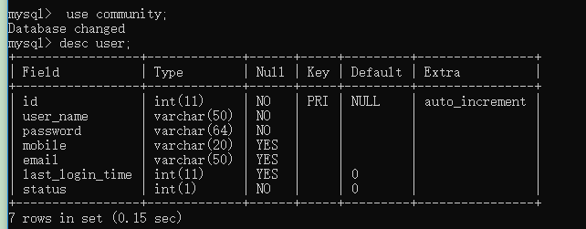
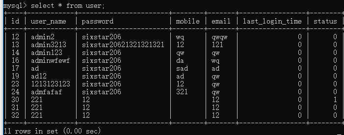
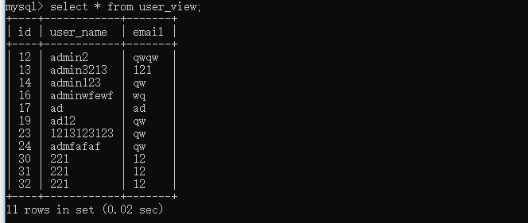
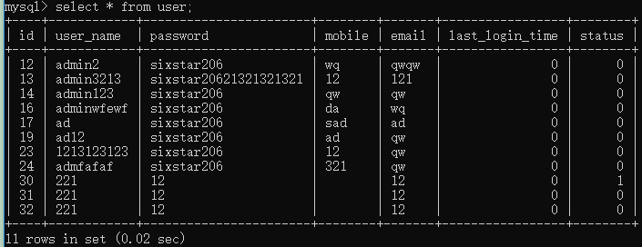
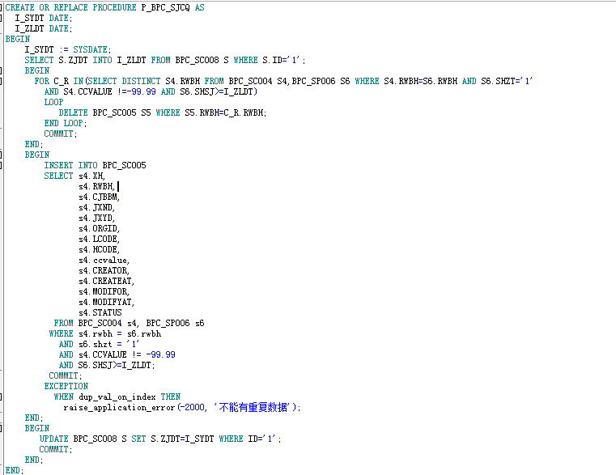

# 视图，存储过程，触发器

#### 面试题

面试你所要知道的: MySQL存储过程 https://blog.csdn.net/u012190514/article/details/80282161

#### 序言

mysql 的CURD的基础内容在这里就跳过，关于select，update，delete，insert的基础使用以及select的复杂查询在本节中将会跳过

#### 课程内容

01. 视图
02. 存储过程
03. 触发器

#### 数据表

结构



数据


## 1. 视图

#### 1.1 概念

01. 视图是 MySQL 在 5.0.1 版本中加入的功能。它可以理解为一个虚表。
02. 之所以被称为虚表，是因为它只是存储了一个结构，并不存储真实的数据。它的数据是在查询过程中动态生成的。
03. 视图并不是真的优化

#### 1.2 创建视图

视图 只是存储了一个结构，并不存储真实的数据。

``` sql
-- 创建视图
create VIEW user_view as select id,user_name,email from `user`;
```

#### 1.3 查看视图

和表一样，我们可以用 desc 视图名; 来查看视图的每一列

``` sql
desc user_view;
-- 查看创建的视图语法
show create view user_view;
-- 查询视图内容
select * from user_view;
```



**>** 注意：视图查询的数据实则来自与源数据中的内容，而它本质是一个存储了一个结构，并不是存储真实的数据。

**>** 比如：如同PHP中的一个查询方法的封装

``` php
<?php
class db
{
    public function select()
    {
        return 'sql: select id,user_name,email from `user`'
    }
}
?>
```

#### 1.4 视图优点

01. 第一个显著优点就是它简化了操作。此时我们完全不用关心视图是怎么处理数据的，我们只需要知道如何使用这个结果集即可，视图相当于一个中间层。

02. 第二个显著优点就是它更加安全。比如我们可以让用户有权去访问某个视图，但是不能访问原表，这样就可以起到保护原表中某些数据的作用。

03. 我们之后会接触到管理权限，权限是无法细致到某一个列的，通过视图，则很容易实现。

04. 第三个显著优点就是降低耦合。假如我们以后要修改原表的结构，那么我们可以通过修改视图的定义即可，而不用修改应用程序，对访问者是不会造成影响的，一般来说，这样代价会更小。

   #### 1.5 视图缺点

05. 表结构修改则需要手动修改视图

#### 1.6 视图IUD

表是可以更新数据的，这里的更新，指的是”增删改”, 但是对于视图来说 *不一定*。

``` sql
update `user` set email = 00 where id = 12;
select * from user_view;
-- 删除视图
DROP VIEW user_view_2;
```

*以下是视图不可更新的情况*

01. 包含聚合函数、distinct、group by、having、union、union all。
02. 常量视图。
03. select 包含子查询。
04. 包含连接操作。
05. from 一个不能更新的视图。
06. where 子句的子查询引用了 from 子句中的表。

自个测试...

*更新视图的注意点*
如下数据


创建一个新的视图

``` sql
create view user_view_2 as select id,user_name,password,email,status from `user` where status = 0;
select * from user_view_2;
```

现在如果给这个视图新增数据 status = 1；

``` sql
insert into user_view_2(id, user_name, password, email, status) values (30, '221', '12', '12', 1);
select * from user_view_2;
select * from `user`;
```

你会发现我们可以向该视图插入数据，它不满足本视图的要求，但是数据可以插入基表了。在前面也有所讲过该操作有点类似于PHP的代码封装的操作。我们把该视图的操作转化为PHP 方法就是如下

``` php
<?php
function select(){
    if ($status == 0) {
        return "sql: select id,user_name,password,email,status from `user` where status = 0";
    }
}?>
```

但是有些时候的我们不希望这种情况的发生，如果不满足视图的条件就不插入，就和PHP方法的条件判断一样

``` php
<?php
if ($status == 0) {
    return 'insert';
}
?>
```

*with check option*

01. 对于上面的表 t2，我们想：是否可以创建一个视图，它只允许修改满足本视图要求的数据，而对于不满足本视图要求的数据操作， 统统拒绝呢？

02. 答案是肯定的。那就需要 with check option 了，不过该修饰符还有更加深一步的权限机制。

03. 首先我们还是利用上一步的 t2，我们创建一个视图 v3，它的创建

   

``` sql
   DROP VIEW user_view_2;
   create view user_view_2 as select id,user_name,password,email,status from `user` where status = 0  with check option;
   insert into user_view_2(id, user_name, password, email, status) values (31, '221', '12', '12', 1);
   ```

错误信息
 `[Err] 1369 - CHECK OPTION failed 'community.user_view_2'`

> 这里可以理解为 with check option 的作用就是多了一个 check 的功能，即检查的功能，也就是说插入的数据必须满足该视图的条件，才允许被操作。

#### 1.7 视图应用&好处

01. 提高了重用性，就像一个函数 如果要频繁获取user的name和goods的name。就应该使用以下sql语言。示例：

   

``` 

    &nbsp; &nbsp; &nbsp; select a.name as username, b.name as goodsname from user as a, goods as b, ug as c where a.id=c.userid and c.goodsid=b.id;<br>
   ```

   但有了视图就不一样了，创建视图other。示例

   

``` 

    &nbsp; &nbsp; &nbsp; create view other as select a.name as username, b.name as goodsname from user as a, goods as b, ug as c where a.id=c.userid and c.goodsid=b.id;<br>
   ```

   创建好视图后，就可以这样获取user的name和goods的name。示例：

   

``` 

    &nbsp; &nbsp; &nbsp; select * from other;<br>
   ```

   以上sql语句，就能获取user的name和goods的name了。

02. 对数据库重构，却不影响程序的运行假如因为某种需求，需要将user拆房表usera和表userb，该两张表的结构如下

      测试表:usera有id，name，age字段
      测试表:userb有id，name，sex字段

   这时如果php端使用sql语句：select * from user; 那就会提示该表不存在，这时该如何解决呢。解决方案：创建视图。以下sql语句创建视图：

      create view user as select a.name,a.age,b.sex from usera as a, userb as b where a.name=b.name; 以上假设name都是唯一的。此时php端使用sql语句：select * from user;就不会报错什么的。这就实现了更改数据库结构，不更改脚本程序的功能了。

03. 提高了安全性能。可以对不同的用户，设定不同的视图。例如：某用户只能获取user表的name和age数据，不能获取sex数据。则可以这样创建视图。示例如下：

      create view other as select a.name, a.age from user as a;

   这样的话，使用sql语句：select * from other; 最多就只能获取name和age的数据，其他的数据就获取不了了。

04. 让数据更加清晰想要什么样的数据，就创建什么样的视图。经过以上三条作用的解析，这条作用应该很容易理解了吧

## 2. 触发器

01. 创建触发器：

``` sql
触发器  类似于 框架 事件
create trigger [触发器名称] [触发器的执行时间] [执行的动作点] on [表名] for each row [函数 或者动作]

触发器的执行时间 :before, after
执行的动作点:insert, update, delete
函数:begin end;
或者动作:update ,insert
```

#### 2.1 案例：

``` sql
create trigger
    login_trigger_before
before insert on
    login
for each row
begin
    update test_trigger set count = count+1 where id =1;
    -- 代码区域
end;

insert into login_view (id,name)values(50,'uuu');
```

## 3. 存储过程

对数据进行计算，分析汇总的时候，尤其是拿到别的公司数据的时候，进行转换为自己系统需要的数据和格式的时候

#### 3.1 概念

存储过程和函数可以理解为一段 SQL 语句的集合，它们被事先编译好并且存储在数据库中。在 Pascal 语言中，是有”过程”和”函数”的区分的，过程可以理解为没有返回值的函数。不过在 C 家族语言中，则没有过程这个概念， 统一为函数。

创建一个存储过程的语法为：

``` sql
create procedure 存储过程名(参数列表)
begin
    存储过程体
end

call 存储过程名(参数列表)
```

如下简单存储过程

``` sql
DROP PROCEDURE user_procedure;
create PROCEDURE user_procedure(in x int) -- in 表示输入
BEGIN
    select * from `user` where id = x;
END
-- 执行
call user_procedure(1);
```

*参数类型*

01. 从上面的过程中我们了解到存储过程有参数类型这种说法，它的类型可以取值有三个：in、out、inout。

02. 其中它们的意义如下：

   (1) in 表示只是用来输入。

   (2) out 表示只是用来输出。

   (3) inout 可以用来输入，也可以用作输出。

   

``` sql
   DROP PROCEDURE user_procedure_out;
   create PROCEDURE user_procedure_out(in x int, out y varchar(10))
   BEGIN
    select user_name into y from `user` where id = x;
   END
   -- 执行
   call user_procedure_out(1, @a);
   select @a
   ```

   #### 3.2 存储过程理解

03. 调用存储过程与直接执行 SQL 语句的效果是相同的，但是存储过程的一个好处是处理逻辑都封装在数据库端。

04. 当我们调用存储过程的时候，我们不需要了解其中的处理逻辑，一旦处理逻辑发生变化，只需要修改存储过程即可，对调用它的程 序完全无影响。

05. 调用存储过程和函数可以简化应用开发人员的很多工作，减少数据在数据库和应用服务器之间的传输，可以提高数据处理的效率

   

``` sql
   show create PROCEDURE user_procedure_out;
   ```

   #### 3.3 变量

06. 存储过程中是可以使用变量的，我们可以通过 declare 来定义一个局部变量，该变量的作用域只是 begin....end 块中。

07. 变量的定义必须写在符合语句的开头，并且在任何其他语句的前面。我们可以一次声明多个相同类型的变量，我们还可以使用default 来赋予默认值。

08. 定义一个变量的语法为： declare 变量名 1 [,变量名 2...] 变量类型 [default 默认值]

09. 上面的变量类型就是 MySQL 支持的类型，而变量名的取值规则也是一个老生常谈的话题了，就不赘述了。

10. 变量可以直接赋值，还可以通过查询赋值。

11. 直接赋值就是使用 set 来进行赋值，它的语法为： set 变量名 1 = 表达式 1 [,变量名 2=表达式 2...]

12. 也可以通过查询来将结果赋值给变量，它需要要求查询返回的结果只有一行，语法范例：`select 列名列表 into 变量列表 from 表名 其他语句；`

``` sql
DROP PROCEDURE user_procedure_2;
create PROCEDURE user_procedure_2(in x int, out y varchar(10))
BEGIN
    declare s varchar(10) ;
    select user_name into s from `user` where id = x;
    set y = s;
END
-- 执行
call user_procedure_2(1, @a);
select @a
```

#### 3.4 存储过程中的数据类型

01. 数值类型：Int,float,double,decimal
02. 日期类型：timestamp,date,year
03. 字符串：char,varchar,text

timestamp: 是使用最多的数据类型-》十位数的时间戳 text：一旦用到text类型的时候就可以考虑分表； 如果部分表的话，该字段的查询不会直接放在一起查询，因为多个字段查询中其中如果有text字段的话，就容易遇到慢查询 所以通常的话，如果需要这个值的时候会根据id单独拿这个text字段

#### 3.5 流程控制语句其他语法

``` sql
if 的语法格式为：
if 条件表达式 then 语句
    [elseif 条件表达式 then 语句] ....
    [else 语句]
end if

case 的语法格式
首先是第一种写法：
case 表达式
    when 值 then 语句
    when 值 then 语句
    ...
    [else 语句]
end case
然后是第二种写法：
case
    when 表达式 then 语句
    when 表达式 then 语句
    ....
    [else 语句]
end case

loop 循环 语法格式为：
[标号:] loop
    循环语句
end loop [标号]

while
while a>100 do
 循环语句
End while

Repeat        //游标
  SQL语句1
  UNTIL 条件表达式
END Repeat;

Loop
  SQL语句
  所有的条件判断和跳出需要自己实现
End loop

leave 语句用来从标注的流程构造中退出，它通常和 begin...end 或循环一起使用
leave 标号;

声明语句结束符，可以自定义:
DELIMITER [符合]
delimiter $$

$$
```

#### 3.6 游标

01. 游标也有的资料上称为光标。
02. 我们可以在存储过程中使用游标来对结果集进行循环的处理。
03. 游标的使用步骤基本分为：声明、打开、取值、关闭。

*语法：*

``` sql
DECLARE test_cursor CURSOR FOR 结果集;    //声明游标
OPEN test_cursor;                        //打开游标
CLOSE test_cursor;                        //关闭游标
DECLARE CONTINUE HANDLER FOR NOT FOUND    //结果集查询不到数据自动跳出
```

*总结：*

01. 游标的声明的语法： declare 游标名称 cursor for 查询语句;
02. 打开光标的语法： open 游标名称;
03. 获取游标数据： fetch 游标名称 into 变量名 1 [,变量名 2 ....]
04. 关闭游标的语法： close 游标名称;
05. 游标的基本使用须知：对某个表按照循环的处理，判断循环结束 的条件是捕获 not found 的条件，当 fetch 光标找不到下一条记录的 时候，就会关闭光标然后退出过程。
06. 可能有过 Pascal 编程经验的朋友们都会知道，声明的顺序也是很 重要的，在 SQL 中，我们使用 declare 定义的顺序是：变量、条件、 游标、应用程序

*操作* 查询出来的数据会放置于临时表中，然后再通过游标去读取数据。

*案例*

``` sql
delimiter $$
create procedure exchange(out count int )
begin
    declare supply_id1 int default 0;
    declare amount1 int default 0;
    -- 游标标识
    declare blag int default 1;
    -- 游标
    declare order_cursor cursor for select supply_id,amount from order_group;
    -- not found  这个异常进行处理
    declare continue handler for not found set blag = 0;
    set count = 0;
    -- 打开游标
    open order_cursor;
    -- 遍历
    read_loop: LOOP
        fetch order_cursor into supply_id1,amount1;
        if blag = 0 then
            leave read_loop;
        end if;

        if supply_id1 = 1 then
            set count = count + amount1;
        end if;
    end loop read_loop;
end;
$$
delimiter ;
call exchange(@count);
select @count;
```

#### 存储过程优点

01. 第一点优势就是执行速度快。因为我们的每个 SQL 语句都需要经 过编译，然后再运行，但是存储过程都是直接编译好了之后，直接 运行即可。
02. 第二点优势就是减少网络流量。我们传输一个存储过程比我们传 输大量的 SQL 语句的开销要小得多。
03. 第三点优势就是提高系统安全性。因为存储过程可以使用权限控 制，而且参数化的存储过程可以有效地防止 SQL 注入攻击。保证了 其安全性。
04. 第四点优势就是耦合性降低。当我们的表结构发生了调整或变动 之后，我们可以修改相应的存储过程，我们的应用程序在一定程度 上需要改动的地方就较小了。 44 / 123
05. 第五点优势就是重用性强。因为我们写好一个存储过程之后，再 次调用它只需要一个名称即可，也就是”一次编写，随处调用”,而且 使用存储过程也可以让程序的模块化加强。

#### 3.7 存储过程的缺点

01. 第一个缺点就是移植性差。因为存储过程是和数据库绑定的，如 果我们要更换数据库之类的操作，可能很多地方需要改动。
02. 第二个缺点就是修改不方便。因为对于存储过程而言，我们并不 能特别有效的调试，它的一些 bug 可能发现的更晚一些，增加了应 用的危险性。
03. 第三个缺点就是优势不明显和赘余功能。对于小型 web 应用来说， 如果我们使用语句缓存，发现编译 SQL 的开销并不大，但是使用存 储过程却需要检查权限一类的开销，这些赘余功能也会在一定程度 上拖累性能。

#### 3.8 php中的应用

``` php
<?php
require_once 'db.php';
// $sql = 'create procedure login_procedure_4 (in id int, out ret varchar(10))
// begin
//     declare y int default 0;
//     select shop_name into ret from shop where uid = id;
//     set ret = "ttt";
//   if y = 0 then
//     set ret = "xxxxx";
//   end if;
// end';
// $db->execute($sql);
// $sql = 'call login_procedure_3(87, @ret)';
// var_dump($db->call($sql, 'select @ret'));
// echo '成功';

// 游标
// 1. 声明
/*
declare xxx

declare 游标名 cursor for 查询语句 [select xx,xx,x,x from table_name];
open 游标名 -- 打开
fetch 游标名 into xxx,

业务处理

close 游标名
 */
 $sql = '
 create procedure login_procedure_5 (in id int, out ret varchar(10))
 begin
     declare id int default 0;
  -- 游标标识
  declare blag int default 1;
  declare name varchar(10) default 0;
     declare shop_cursor cursor for select shop_name,uid from shop;

  -- 异常处理 :注意游标在读取数据的时候,不断读取
  declare continue handler for not found set blag = 0;

  open shop_cursor; -- 打开

  read_loop:loop
    fetch shop_cursor into name,id;
    if blag = 0 then
      leave read_loop;
    end if;

    if id = 63 then
      set ret = name;
    end if;
  end loop read_loop;
 end';

 // $db->execute($sql);
 $sql1 = 'call login_procedure_5(87, @ret)';
 var_dump($db->call($sql1, 'select @ret'));
 echo '成功';
 ?>
```

#### 3.9 小结

01. 存储过程和函数的优势是可以将数据的处理放在数据库服务器上 进行，避免将大量的结果集传输给客户端，减少了数据的传输，因 此也减少了宽带和服务器的压力。
02. 但是在数据库服务器上进行大量的运算也会占用服务器的 CPU， 造成数据库服务器的压力。
03. 一般来说是不建议在存储过程中进行大量的复杂的运算的，它们 不是数据库服务器的强项，我们应该把这些操作让应用服务器去处 理。

#### 3.10 例子



可以尝试用存储过程实现一下不用在以数据量


## 3. 物化视图

物化视图是相对于视图而言的，但是两者实际上并没有什么关系就如java/javaScript一样

首先mysql的视图不是一种物化视图，他相当于一个虚拟表，本身并不存储数据，当sql在操作视图时所有数据都是从其他表中查询出来的。者带来的问题是使用视图并不能将常用数据分离出来，优化查询速度，切操作视图的很多命令和普通标一样，这回导致在业务中无法通过sql区分表和视图，是代码变得复杂。

视图是简化设计，清晰编码的东西，他并不是提高性能的，他的存在只会降低性能（如一个视图7个表关联，另一个视图8个表，程序员不知道，觉得很方便，把两个视图关联再做一个视图，那就惨了），他的存在未了在设计上的方便性

物化视图可以帮助加快严重依赖某些聚合结果的查询。 如果插入速度不是问题，则此功能可以帮助减少系统上的读取负载。

物化视图: 触发器, 存储过程, 变量

创建一个实体的表 物化视图 表 记录: 查询的结果, 

查询 物化视图 表 ==>聚合结果集

数据: 实时性一致性 触发器 INSERT UPDATE DELTE 物化视图

定时 对存储过程

存储过程的应用: OA, ERP 对数据进行计算, 分析汇总, 
