# 索引总结iCP与where提取

### 1. max与min的一个优化技巧(利用索引排序)
这里以salary为例
```sql
select * from details limit 0,5;
+----+--------------------+------+-----+
| id | equipmentMD5       | type | age |
+----+--------------------+------+-----+
|  1 | wQU5bJjXuJsJF1CVEE |    1 | 101 |
|  2 | pp5nK4nsU2RJxY5FHb |    1 |  98 |
|  3 | fI7au1b9Mm9zKK2lQX |    1 |   6 |
|  4 | IKvi21q3wX0x6kRXGj |    1 |  37 |
|  5 | JI3ybbKuyzNIm9HYjN |    1 |   3 |
+----+--------------------+------+-----+
5 rows in set (0.00 sec)
```
如上的数据是最初始的状态，也就是没有进行操作的时候 

```sql
show index from details;
+---------+------------+--------------+--------------+-------------+-----------+-------------+------------+
| Table   | Non_unique | Key_name     | Seq_in_index | Column_name | Collation | Cardinality | Index_type |
+---------+------------+--------------+--------------+-------------+-----------+-------------+------------+
| details |          0 | PRIMARY      |            1 | id          | A         |      997442 | BTREE      |
| details |          1 | idx_age_type |            1 | age         | A         |         121 | BTREE      |
| details |          1 | idx_age_type |            2 | type        | A         |         545 | BTREE      |
| details |          1 | idx_type     |            1 | type        | A         |           3 | BTREE      |
+---------+------------+--------------+--------------+-------------+-----------+-------------+------------+
4 rows in set (0.00 sec)
```
现在我们想要知道age最低和最大的用户
```sql
select id,max(age) from details;
+----+----------+
| id | max(age) |
+----+----------+
| 55 |      119 |
+----+----------+
1 row in set (0.18 sec)

select * from details where id = 55;
+----+--------------------+------+-----+
| id | equipmentMD5       | type | age |
+----+--------------------+------+-----+
| 55 | zwWzo4qtjdEffbMguZ |    1 |   0 |
+----+--------------------+------+-----+
1 row in set (0.00 sec)

select id,age from details where age = (select max(age) from details) limit 0, 1;
+----+-----+
| id | age |
+----+-----+
| 67 | 119 |
+----+-----+
1 row in set (0.00 sec)

-- 数据量太多....

select id,age from details order by age desc limit 0, 1;
+--------+-----+
| id     | age |
+--------+-----+
| 999901 | 119 |
+--------+-----+
1 row in set (0.00 sec)
```
可以看到我们就需要使用第三条SQL的方式，不过我们也可以通过order by排序；不过我们也可以通过使用索引快速获取所需要的数据；比如这里我们使用age索引获取最大和最小

> 最小

```sql
select id,age from details use index(idx_age_type) limit 0,1;
+----+-----+
| id | age |
+----+-----+
| 55 |   0 |
+----+-----+
1 row in set (0.00 sec)
```

> 最大

```sql
select count(*) from details;
+----------+
| count(*) |
+----------+
|  1000000 |
+----------+
1 row in set (0.13 sec)

select id,age from details use index(idx_age_type) limit 999999,1;
+--------+-----+
| id     | age |
+--------+-----+
| 999901 | 119 |
+--------+-----+
1 row in set (0.16 sec)
```

这个策略的话可以了解一下，在一些情况下是会让MySQL扫描尽可能少的记录数。不过这种方式实际上并不是SQL的本意了，但是它也会返回我们所需要的数据信息，之所以可以这么做是因为与income索引本质在建立的时候就会对于数据的结果进行了排序

### 2. 索引总结
在联合索引中：SQL索引联合索引的话通常来说最好是不要超过5个，因为超过了五个在过滤上就没有太大的效果，但是如果说有些时候需要定义10个字段的关联能起到很好地效果的话还是可以去这么做的。如果在目前的SQL中我们不想建立5个索引的话，那么我们可以尝试去优化子查询来提高MySQL的查询效率

在使用索引的同时，还应该了解MySQL中索引存在的限制，以便在索引应用中尽可能地避开限制所带来的问题。下面列出了目前MySQL中与索引使用相关的 __限制__ 。
1. blob和text类型的列只能创建前缀索引
2. MySQL 5.7 对于普通索引不支持函数操作，若要使用可以定义函数索引
3. 使用不等于（！=或者 <>）的时候MySQL无法使用索引；
4. 使用like操作的时候如果 %在前面无法使用索引
5. hash索引不能做范围查询

如下内容出自上期优化课程中的笔记
```sql
10.4、什么情况使用索引
当使用不以通配符开始的like
Select * from table1 where username like 'pack%';
一个索引字段的前缀使用了order by或者group by;
Select * from table2 order by field1;
对索引字段使用了>,=,<,>=,<=,IS NULL和BETWEEN
Select * from table3 where total_fee IS NULL
查找某个字段的最大值和最小值
Select min(score),max(score) from table4 where class_id = 1;
查询的列是后面字段的部分时间
Select time1 from table5 where time2 = '2017-2';

10.5、什么情况不使用索引

以通配符开始的like查询
Select * from table1 where username like '%pack%';

搜索某列，而在另一个列的索引做order by会优先选择与where上的条件
explain select * from customers where mobile = "0" order by city;
+----+-------------+-----------+------+---------------+------------+---------+-------+--------+----------+---------------------------------------+
| id | select_type | table     | type | possible_keys | key        | key_len | ref   | rows   | filtered | Extra                                 |
+----+-------------+-----------+------+---------------+------------+---------+-------+--------+----------+---------------------------------------+
|  1 | SIMPLE      | customers | ref  | idx_mobile    | idx_mobile | 33      | const | 245076 |   100.00 | Using index condition; Using filesort |
+----+-------------+-----------+------+---------------+------------+---------+-------+--------+----------+---------------------------------------+
1 row in set, 1 warning (0.00 sec)


10.6、误区
不是在where条件常用的列都加上索引
Where course = 'php' and number > 50;
在多列建立索引后，查询哪个列，都将发挥作用？
满足左前缀要求。
Index(field1,field2,field3)
Where  field1 = 1						                              生效
Where  field1 = 1 and field2 =2		                        生效
Where  field1 = 1 and field2 =2 and field3 = 3;	          生效
Where  field2 = 2 Where field3 =3                         不生效
Where  field1 = 1 and field3 = 3;	                        field1生效，field3不生效
Where  field1 = 1 and field2 >2 and field3 = 3;	          field1和field2生效，field3不生效
Where  field1 = 1 and field2 like 'pack%' and field3 = 3; field1和field2生效，field3不生效
explain select * from customers1 where gender > 0 ;
+----+-------------+------------+------------+------+--------------------------------------------+------+--------+----------+-------------+
| id | select_type | table      | partitions | type | possible_keys                              | key  | rows   | filtered | Extra       |
+----+-------------+------------+------------+------+--------------------------------------------+------+--------+----------+-------------+
|  1 | SIMPLE      | customers1 | NULL       | ALL  | idx_gender_city_name_monthsalary_yearbonus | NULL | 577859 |    50.00 | Using where |
+----+-------------+------------+------------+------+--------------------------------------------+------+--------+----------+-------------+
1 row in set, 1 warning (0.00 sec)

最左前缀：
选择一个能够淘汰最多纪录的索引；
字段是有序的；

10.7、SQL的优化
Limit分页优化
Select * from table1 order by id asc limit 2200,10;
Select * from table1 where id>=2200 order by id limit 10;

Count(*)   改为辅助索引
Select count(*) from table2;
Select count(*) from table2 where course_id >=0;
聚集索引：主键、没有主键则定位第一个唯一索引（所有行的值非空）、如果上2个条件都不满足则自动产生一个6字节的id聚集索引。
辅助索引：包含键值的书签，会存储书签数据。

Not in子查询优化
select * from customers where id in (select id from salary ); 时间: 9.841s
select * from customers where exists (select id from salary where customers.id = salary.id );时间: 3.780s
select * from customers left join salary on customers.id = salary.id 时间: 2.072s

Or条件优化
Select *  from table1 where a = '123' or b = '456';
Select *  from table1 where a = '123' union all Select *  from table1  b = '456';
```

### 3. 索引ICP
icp是 MySQL 中一个常用的优化，尤其是当 MySQL 需要从一张表里检索数据时。

ICP（index condition pushdown）是 MySQL 利用索引（二级索引）元组和筛字段在索引中的 WHERE 条件从表中提取数据记录的一种优化操作。

ICP 的思想是：存储引擎在访问索引的时候检查筛选字段在索引中的 where 条件，如果索引元组中的数据不满足推送的索引条件，那么就过滤掉该条数据记录。

ICP（优化器）尽可能的把 index condition 的处理从 server 层下推到存储引擎层。

注意：icp是在MySQL5.6才提出来的并且在之后的版本中一直使用的优化的方式

简单来说对于如下SQL
```sql
使用的索引是
idx_gender_city_name_monthsalary_yearbonus(gender,city,name,monthsalary,yearbonus)

SELECT * FROM customers1 ignore index(idx_name_photo) WHERE gender = 0 AND city LIKE "长%" AND name  LIKE "实%" LIMIT 0, 20;
```

| session1                                             | session2                                             |
| ---------------------------------------------------- | ---------------------------------------------------- |
| 设置index_condition_pushdown = off                   |                                                      |
|  |                                                      |
| set profiling = 1;                                   | set profiling = 1;                                   |
| 测试查询                                             |                                                      |
| 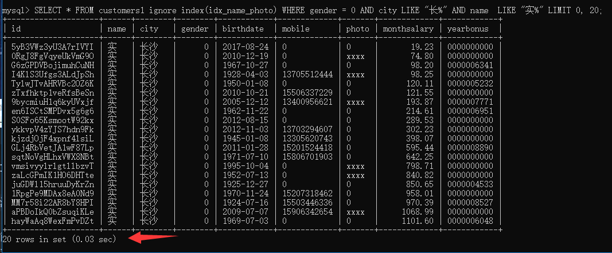  | 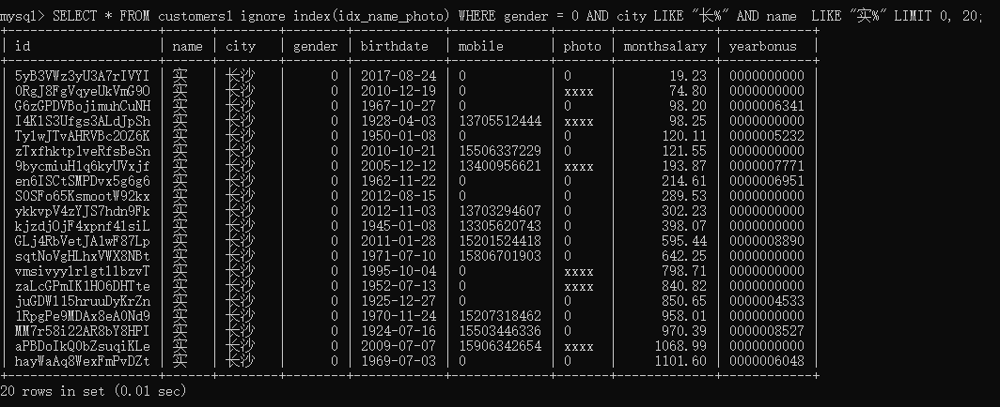 |
| 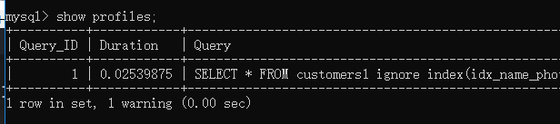 | 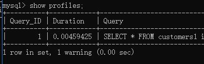 |
| 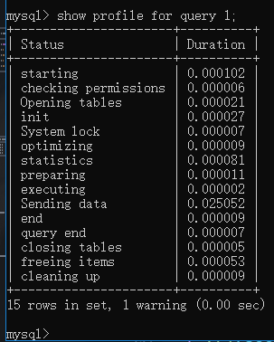 | 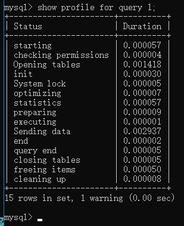 |
| 再通过explain分析                                    |                                                      |
| 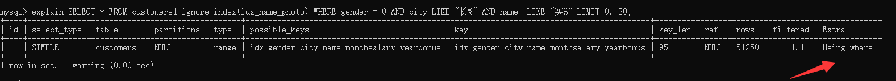 | 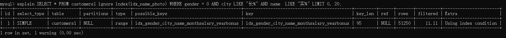 |

也就是说使用了ICP就是MySQL会根据与索引上的信息对于数据进行过滤然后再获取数据返回出来，没有使用的话MySQL会根据gender = 0取出数据然后再去server层中对于后面的条件进行过滤

如下就是流程

没有使用ICP的情况如下图：

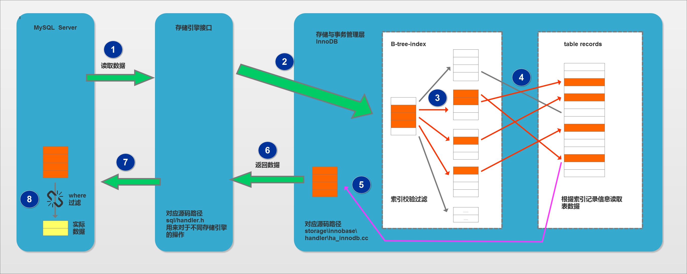

<pre>
如下内容就老师自己理解讲就好了，不用放到笔记中

①：MySQL Server 发出读取数据的命令，调用存储引擎的索引读或全表表读。此处进行的是索引读。
②、③：进入存储引擎，读取索引树，在索引树上查找，把满足条件的（红色的）从表记录中读出（步骤 ④，通常有 IO）。
⑤：从存储引擎返回标识的结果。
以上，不仅要在索引行进行索引读取（通常是内存中，速度快。步骤 ③），还要进行进行步骤 ④，通常有 IO。
⑥：从存储引擎返回查找到的多条数据给 MySQL Server，MySQL Server 在 ⑦ 得到较多的元组。
⑦–⑧：依据 WHERE 子句条件进行过滤，得到满足条件的数据。
注意在 MySQL Server 层得到较多数据，然后才过滤，最终得到的是少量的、符合条件的数据。
</pre>

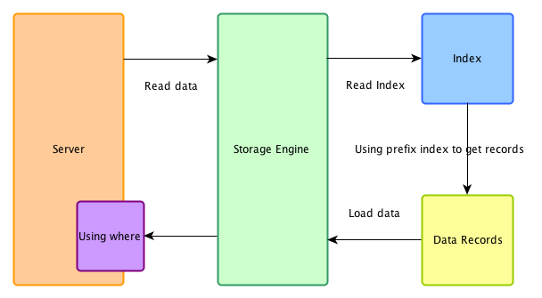

使用ICP的流程

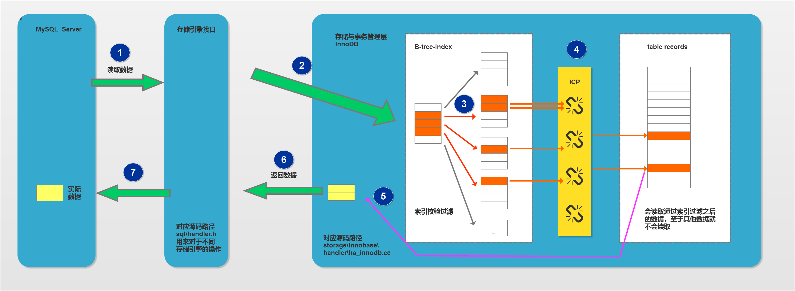

<pre>
如下内容就老师自己理解讲就好了，不用放到笔记中

①：MySQL Server 发出读取数据的命令，过程同图一。
②、③：进入存储引擎，读取索引树，在索引树上查找，把满足已经下推的条件的（红色的）从表记录中读出（步骤 ④，通常有 IO）；
⑤：从存储引擎返回标识的结果。
此处，不仅要在索引行进行索引读取（通常是内存中，速度快。步骤 ③），还要在 ③ 这个阶段依据下推的条件进行进行判断，不满足条件的，不去读取表中的数据，直接在索引树上进行下一个索引项的判断，直到有满足条件的，才进行步骤 ④ ，这样，较没有 ICP 的方式，IO 量减少。
⑥：从存储引擎返回查找到的少量数据给 MySQL Server，MySQL Server 在 ⑦ 得到少量的数据。
因此比较图一无 ICP 的方式，返回给 MySQL Server 层的即是少量的、 符合条件的数据。
</pre>

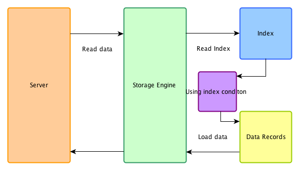


### 4. where条件与索引的解析过程

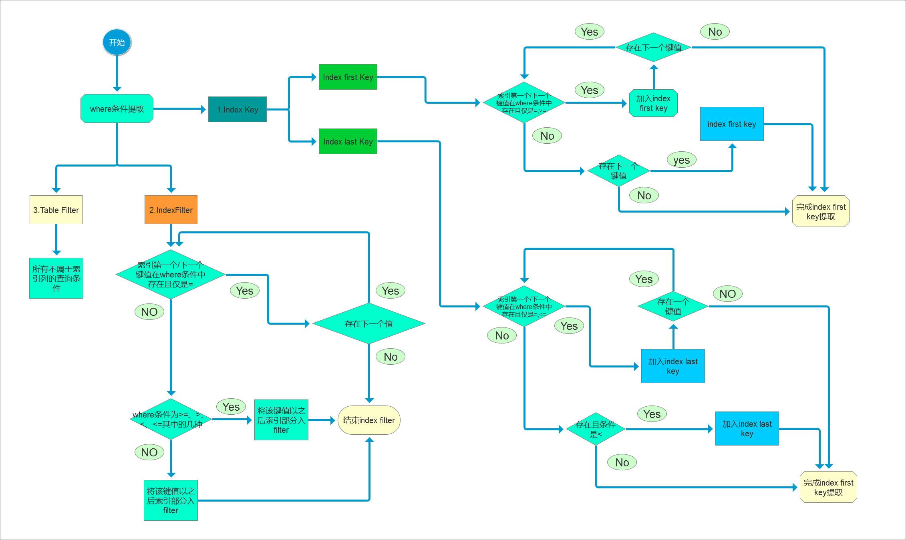

1. Index Key ：MySQL是用来确定扫描的数据范围，实际就是可以利用到的MySQL索引部分，体现在Key Length。
2. Index Filter：MySQL用来确定哪些数据是可以用索引去过滤，在启用ICP后，可以用上索引的部分。
3. Table Filter：MySQL无法用索引过滤，回表取回行数据后，到server层进行数据过滤。
