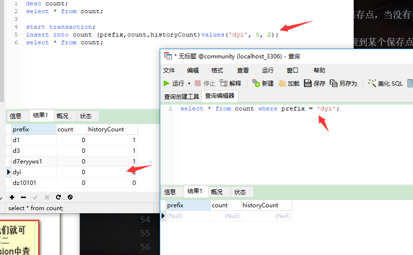
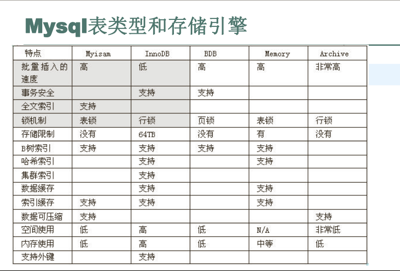

# 物化视图-事务

## 物化视图

物化视图是相对于视图而言的，但是两者实际上并没有什么关系就如java/javaScript一样

首先mysql的视图不是一种物化视图，他相当于一个虚拟表，本身并不存储数据，当sql在操作视图时所有数据都是从其他表中查询出来的。者带来的问题是使用视图并不能将常用数据分离出来，优化查询速度，切操作视图的很多命令和普通标一样，这回导致在业务中无法通过sql区分表和视图，是代码变得复杂。

视图是简化设计，清晰编码的东西，他并不是提高性能的，他的存在只会降低性能（如一个视图7个表关联，另一个视图8个表，程序员不知道，觉得很方便，把两个视图关联再做一个视图，那就惨了），他的存在未了在设计上的方便性

物化视图可以帮助加快严重依赖某些聚合结果的查询。
如果插入速度不是问题，则此功能可以帮助减少系统上的读取负载。

``` sql
select count(*),sum(pro_price), sum(pro_num),avg(pro_price), avg(pro_num) from purchase_order

物化视图 可以理解成 就是单独再创建一张统计表吗

把数据记录 select count(*),sum(pro_price), sum(pro_num),avg(pro_price), avg(pro_num) from purchase_order =>>  purchase_mv

根据项目的需求 (数据实时性)
要定时更新数据, ==>> 存储过程 call
开销小,误差大一点

中间表 使用视图是避免因为 purchase_mv 表的结果修改,而影响到存储过程与触发器的查询sql语句的修改
create view por_view as
	select
			supply_name,
      count(*) pro_count,
			sum(pro_price) pro_price_sum,
			avg(pro_price) pro_price_avg,
			sum(pro_num) pro_num_sum,
			avg(pro_num) pro_num_avg
	from
			purchase_order
	group by
			supply_name;

定时执行这样的sql
insert into purchase_mv select * from por_view;

第一步获取 需要获取原有统计数据 select * from por_view
第二步写入 purchase_mv

DROP PROCEDURE refresh_mv_now;
DELIMITER $$
CREATE PROCEDURE refresh_mv_now ()
BEGIN
  TRUNCATE TABLE purchase_mv;
  INSERT INTO purchase_mv SELECT * FROM por_view;
END;
$$
DELIMITER ;
select * from purchase_mv;

定时执行下面的sql,你可以使用你所会的方法
call refresh_mv_now ();

实时更新数据, ==>> 触发器 使用触发器,是很会影响数据库的写操作的性能
开销大
drop trigger purchase_mv_trigger_ins;
DELIMITER $$
CREATE TRIGGER purchase_mv_trigger_ins AFTER INSERT ON purchase_order FOR EACH ROW
BEGIN
	SET @old_pro_price_sum = 0;
	SET @old_pro_price_avg = 0;
	SET @old_pro_num_sum = 0;
	SET @old_pro_num_avg = 0;
	SET @old_pro_count = 0;
	# 查询出之前的信息然后记录到不同的变量中
	SELECT
		IFNULL(pro_price_sum,0),IFNULL(pro_price_avg,0),
		IFNULL(pro_num_sum,0),IFNULL(pro_num_avg,0),
		IFNULL(pro_count,0)
	FROM
		purchase_mv
	WHERE
		supply_name = NEW.supply_name
	INTO
		@old_pro_price_sum,@old_pro_price_avg,@old_pro_num_sum,@old_pro_num_avg,@old_pro_count;
	# 然后再去计算更新操作之后的内容
	SET @new_pro_count = @old_pro_count + 1;
	SET @new_pro_price_sum = @old_pro_price_sum + NEW.pro_price;
	SET @new_pro_price_avg = @new_pro_price_sum / @new_pro_count;

	SET @new_pro_num_sum = @old_pro_num_sum + NEW.pro_num;
	SET @new_pro_num_avg = @new_pro_num_sum / @new_pro_count;

	REPLACE INTO
		purchase_mv
	VALUES(
		NEW.supply_name, @new_pro_count,
		@new_pro_price_sum, IFNULL(@new_pro_price_avg, 0),
		@new_pro_num_sum, IFNULL(@new_pro_num_avg, 0)
	);
END;
$$
DELIMITER ;

= 表可能会改变
CREATE TABLE purchase_mv(
	supply_name VARCHAR(60)  NOT NULL ,
	pro_count INT NOT NULL,
	pro_price_sum INT  NOT NULL,
	pro_price_avg FLOAT NOT NULL,
	pro_num_sum INT  NOT NULL,
	pro_num_avg FLOAT NOT NULL,
  UNIQUE INDEX supply_name (supply_name)
);

物化视图 -> 存储过程 和 触发器的 综合应用
表的数据大 : 有些内容很频繁查询
```

#### 1.2 存储过程与触发器区别是？

存储过程 => 主动 技能 ( 函数 )
触发器   => 被动 技能 ( 函数 )

## 事务

### MyISAM实现事务

通过表锁实现伪事务

### 事务的概念

事务处理可以确保除非事务性单元内的所有操作都成功完成，否则不会永远更新面向数据的资源。通过将一组相关操作组合为一个要么全部成功要么全部失败的单元，可以简化错误恢复病史应用程序更加可靠。一个逻辑共奏单元要成为事务，必须满足所谓的ACID（原子性、一致性、隔离性和持久性）属性：

1. 原子性（A）
    - 对于数据修改，要么全部都执行，要么全都不执行。
2. 隔离性（C）
    - 在所有的操作没有执行完毕之前，其他会话不能够看到中间改变的过程。
3. 一致性（I）
    - 事务发生前和发生后，根据数据的规则，总额应该匹配。
4. 持久性（D）
    - 事务一旦被提交，其结果就是永久性的，系统崩溃也不会影响

应用场景: 使用场景一般涉及到个人财务信息的时候都会使用到，比如上图的积分计算, 还有订单购物车等

``` sql
start transaction; 开启事务
insert into count (prefix,count,historyCount)values('dyi', 0, 2);
select * from count
commit;
```



### 事务的实现

存储引擎简单瞧瞧后面细讲



因为MySQL5之后通常的默认存储引擎是InnoDB所以，以InnoDB为例讲解实现过程

MySQL在进行事务处理的时候使用的是日志现行的方式来保证事务可快速和持久运行的，也就是在写数据库前，需要先写日志。当开始一个事务时，会记录该事物的一个LSN日志序列号；当执行事务时，会往InnoDB_Log_Buffer 日志缓冲区里插入事务日志（redo log）; 当事务提交时，会将日志缓存区里的事务日志刷入磁盘。这个动作主要是由innodb_flush_log_at_trx_commit这个参数控制的。

1. 发出commit动作时。已经说明过，commit发出后是否刷日志由变量 innodb_flush_log_at_trx_commit 控制。
2. 每秒刷一次。这个刷日志的频率由变量 innodb_flush_log_at_timeout 值决定，默认是1秒。要注意，这个刷日志频率和commit动作无关。
3. 当log buffer中已经使用的内存超过一半时。
4. 当有checkpoint时，checkpoint在一定程度上代表了刷到磁盘时日志所处的LSN位置。

可以通过命令

``` sql
show engine innodb status\G;
```

> Log sequence number 8619676075 (表示当前的LSN日志序列号)<br>
> Log flushed up to   8619676075 (表示刷新到事物日志的LSN日志序列号)<br>
> Last checkpoint at  8619676075 (表示刷新到磁盘的LSN日志序列号)

除了记录事务日志意外，数据库还会记录一定量的撤销日志(undo log)， undo与redo正好相反，在对数据进行修改时，由于某种原因失败了，或者人为执行了rollback回滚语句，就可以利用这些撤销日志将数据回滚到修改之前的样子。redo日志保存在ib_logfile0/1/2里，而undo日志保存在ibdata1里，在MySQL5.6里还可以把undo日志单拆分出去。

### 分布式事务（了解）

资源管理器：管理事务的提交和回滚，向事务提供资源。
事务管理器：和资源管理器通信，协调完成事务的处理。

用于执行分布式事务的过程使用两个阶段；
（1）第一阶段：所有的分支被预备。他们被事务管理器告知要准备提交，每个分支资源管理器记录分支的行动并指示认为的可行性。
（2）第二阶段：事务管理器告知资源管理器是否要提交或者回滚。如果预备分子时，所有的分支指示他们将能够提交，那么所有的分支被告知提交。如果有一个分支出错，那么就全部都要回滚。特殊情况下，只有一个分支的时候，第二阶段则被省略。

分布式事务主要作用在于确保事务的一致性和完整性。他利用分布式的计算环境，将多个事务性的活动合并成一个事务单元，这些事务组合在一起构成原子操作，这些事务的活动要么一起执行并提交事务，要么回滚所有的操作，从而保证了多个活动之间的一致性和完整性。
