# 事务与锁

### 内容

1. 事务
2. innodb_flush_log_at_trx_commit
3. 锁

事务其实就是并发控制的基本单位；相信我们都知道，事务是一个序列操作，其中的操作要么都执行，要么都不执行，它是一个不可分割的工作单位；数据库事务的 ACID 四大特性是事务的基础，了解了 ACID 是如何实现的，我们也就清除了事务的实现，接下来我们将依次介绍数据库是如何实现这四个特性的。

## 1 事务的特性理解

``` sql
-- 查看事务日志 ：
show engine innodb status\G;
-- 查看日志文件设置状态
show variables like 'innodb_%';
```

事务日志文件

innodb_log_files_in_group: DB中设置几组事务日志，默认是2；
innodb_log_group_home_dir: 事务日志存放目录，不设置，ib_logfile0... 存在在数据文件目录下

Innodb存储引擎可将所有数据存放于ibdata*的共享表空间，也可将每张表存放于独立的.ibd文件的独立表空间

注意：在MySQL中对于数据来说，
最为重要的是日志文件

redo log => ib_logfile0

undo log => ibdata

#### 1.2 原子性

通俗的解释就是；一条绳子上的蚂蚱
专业点：事务就是一系列的操作，要么全部都执行，要都不执行

##### 1.2.1 回滚日志

想要保证事务的原子性，就需要在异常发生时，对已经执行的操作进行回滚，而在 MySQL 中，恢复机制是通过回滚日志（undo log）实现的，所有事务进行的修改都会先记录到这个回滚日志中，然后在对数据库中的对应行进行写入。

注意：系统发生崩溃、数据库进程直接被杀死后，当用户再次启动数据库进程时，还能够立刻通过查询回滚日志将之前未完成的事务进行回滚，这也就需要回滚日志必须先于数据持久化到磁盘上，是我们需要先写日志后写数据库的主要原因。

在日志文件中: 在事务中使用的每一条 INSERT 都对应了一条 DELETE，每一条 UPDATE 也都对应一条相反的 UPDATE 语句。

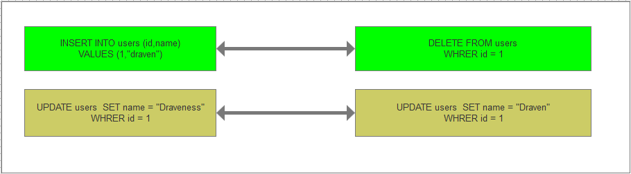

#### 1.3 持久化

事务被提交，数据一定会被写入到数据库中并持久存储起来，通常来说当事务已经被提交之后，就无法再次回滚了。

##### 1.3.1 重做日志

与原子性一样，事务的持久性也是通过日志来实现的，MySQL 使用重做日志（redo log）实现事务的持久性，重做日志由两部分组成，一是内存中的重做日志缓冲区，因为重做日志缓冲区在内存中，所以它是易失的，另一个就是在磁盘上的重做日志文件，它是持久的。

在事务写入过程

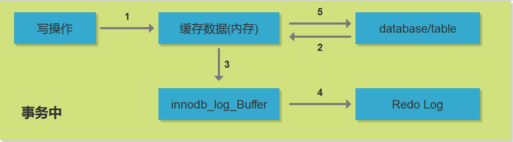

当我们在一个事务中尝试对数据进行写时，它会先将数据从磁盘读入内存，并更新内存中缓存的数据，然后生成一条重做日志并写入重做日志缓存，当事务真正提交时，MySQL 会将重做日志缓存中的内容刷新到重做日志文件，再将内存中的数据更新到磁盘上，图中的第 4、5 步就是在事务提交时执行的。

### 1.4 回滚日志和重做日志

到现在为止我们了解了 MySQL 中的两种日志，回滚日志（undo log）和重做日志（redo log）；在数据库系统中，事务的原子性和持久性是由事务日志（transaction log）保证的，在实现时也就是上面提到的两种日志，前者用于对事务的影响进行撤销，后者在错误处理时对已经提交的事务进行重做，它们能保证两点：

1. 发生错误或者需要回滚的事务能够成功回滚（原子性）；
2. 在事务提交后，数据没来得及写会磁盘就宕机时，在下次重新启动后能够成功恢复数据（持久性）；

在数据库中，这两种日志经常都是一起工作的，我们可以将它们整体看做一条事务日志，其中包含了事务的 ID、修改的行元素以及修改前后的值。


### 1.5 事务日志流程

MySQL的checkpoint https://www.cnblogs.com/lintong/p/4381578.html

checkpoint，即检查点。在undolog中写入检查点，表示在checkpoint前的事务都已经完成commit或者rollback了，也就是检查点前面的事务已经不存在数据一致性的问题了(此处暂时不会深入解释)

Innodb的事务日志是指Redo log，简称Log, 保存在日志文件ib_logfile里面（去mysql数据目录下看下）。Innodb还有另外一个日志Undo log，但Undo log是存放在共享表空间里面的（ibdata*文件，存储的是check point日志序列号）。

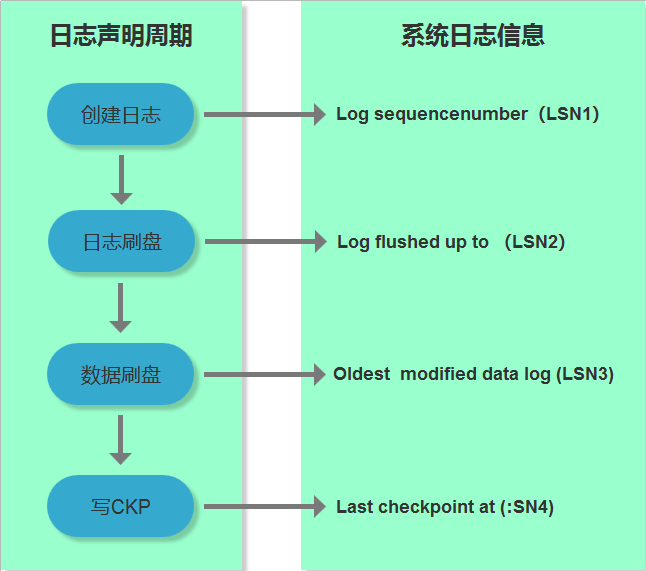

Innodb的一条事务日志共经历4个阶段：

1）创建阶段：事务创建一条日志；<br>
2）日志刷盘：日志写入到磁盘上的日志文件； （ib_logfile*里面）<br>
3）数据刷盘：日志对应的脏页数据写入到磁盘上的数据文件；<br>
4）写CKP：日志被当作Checkpoint写入日志文件；（ib_data*里面）<br>

## 2. innodb_flush_log_at_trx_commit 参数解析

``` sql
-- 查看日志文件设置状态
show variables like 'innodb_%';
-- 更改
set @@global.innodb_flush_log_at_trx_commit = 0; -- 0，1，2
show variables like 'innodb_flush_log_at_trx_commit';
```

#### 2.1 概述

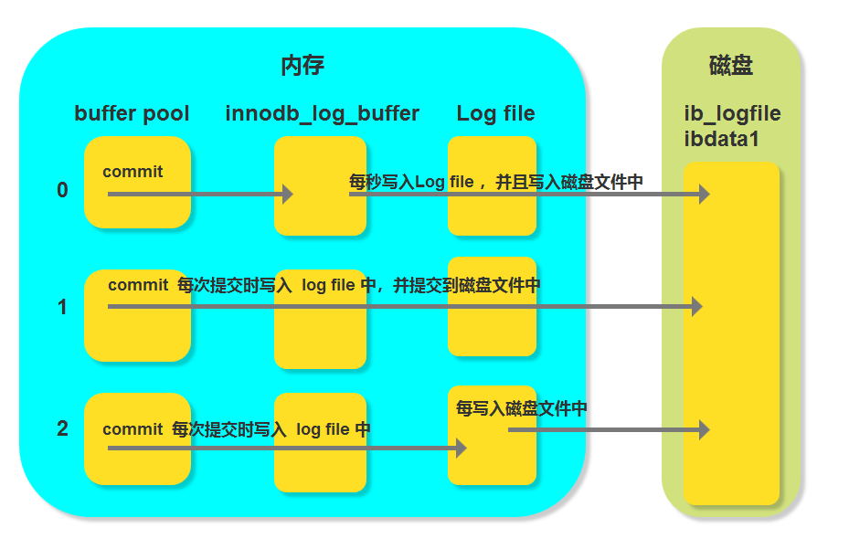

#### 2.2 性能对比

性能的检测办法：

设置innodb_flush_log_at_trx_commit 不同的值，然后对比 所用的时间

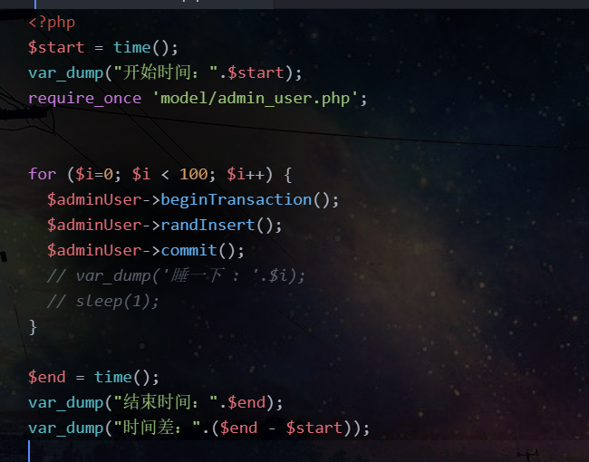

#### 2.3 数据问题对比

因为在实际过程中很难去模拟实际的断点故障的情况，但是你可以尝试通过终止MySQL服务来测试；数据的插入速度是很快的（大量数据除外），为了方便测试这里可以对于数据插入之后睡眠一下，然后再去终止MySQL服务；就可以模拟情况；过程需要自己返回测试

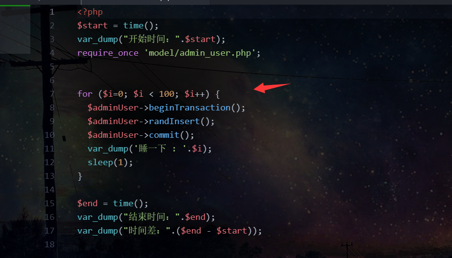

过程 cmd 运行程序 然后 执行数据的过程中终止MySQL服务

## 3. 锁机制

##### 3.0 序

如何保证数据并发访问的一致性和有效性，是所有数据库必须解决的一个问题。另外，所冲突也是影响数据库并发性能的一个重要的因素，应用程序在选择所类型时，需要根据实际运行的需要，选择最佳的所类型。

MySQL的不同存储引擎，支持不同的锁定机制

##### 3.1 锁类型。

1. MyISAM 和 Memory 存储引擎使用的是表级锁,BDB 引擎使用的是页级锁，也支持表级锁。由于 BDB 引擎基本已经成为历史，因此就不再介绍了。
3. InnoDB 存储引擎既支持行级锁，也支持表级锁，默认情况下使用行级锁。
4. 所谓表级锁，它直接锁住的是一个表，开销小，加锁快，不会出现死锁的情况，锁定粒度大，发生锁冲突的概率更高，并发度最低。
5. 所谓行级锁，它直接锁住的是一条记录，开销大，加锁慢，发生锁冲突的概率较低，并发度很高。
6. 所谓页级锁，它是锁住的一个页面，在 InnoDB 中一个页面为16KB，它的开销介于表级锁和行级锁中间，也可能会出现死锁，锁定粒度也介于表级锁和行级锁中间，并发度也介于表级锁和行级锁中间。
7. 仅仅从锁的角度来说，表级锁更加适合于以查询为主的应用，只有少量按照索引条件更新数据的应用
8. 行级锁更适合大量按照索引条件并发更新少量不同的数据，同时还有并发查询的应用

##### 3.2 innoDB行级锁

InnoDB有两种类型的行级锁，两种内部使用的意向锁；

* 共享锁(S): 允许一个事务读一行数据时，阻止其他的事务读取相同数据的排他锁。
* 排他锁(X): 允许获得排他锁的事务更新数据，阻止其他事务取得相同数据的共享锁和排他锁。
* 意向共享锁(IS): 事务打算给数据行加行共享锁。事务在给一个数据行加共享锁前必须先取得该表的IS锁。
* 意向排他锁(IX): 事务打算给数据行加行排他锁。事务在给一个数据行加排他锁前必须先取得该表的IX锁。
* 悲观锁(抽象，不真实存在的锁)
* 乐观锁(抽象，不真实存在的锁)

4种锁的共存逻辑关系表

| 锁模式         | 共享锁(S) | 排他锁(X) | 意向共享锁(IS) | 意向排他锁(IX) |
| -------------- | --------- | --------- | -------------- | -------------- |
| 共享锁(S)      | 兼容      | 冲突      | 兼容           | 冲突           |
| 排他锁(X)      | 冲突      | 冲突      | 冲突           | 冲突           |
| 意向共享锁(IS) | 兼容      | 冲突      | 兼容           | 兼容           |
| 意向排他锁(IX) | 冲突      | 冲突      | 兼容           | 兼容           |

如果一个事务请求的锁模式与当前的所模式兼容，InnoDB就将请求的锁授予该事务，如果两者不兼容，那么该事务就要等待锁释放。

意向锁是InnoDB存储引擎自动加的，对于普通select语句，InnoDB不会加任何锁，对于insert，update，delete语句，InnoDB会自动改涉及的数据加排他锁，InnoDB以通过以下语句显示添加的共享锁和排他锁。

共享锁语句

> select * from table_name lock in share mode; 

排他锁语句

> select * from table_name for update; 

##### 3.3 共享锁-悲观锁实例

应用场景：

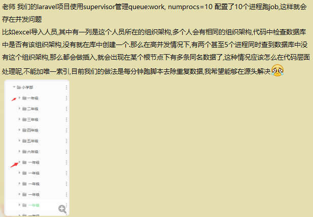<br>附带<br>

共享锁语句s

> select * from table_name lock in share mode; 

注意该操作需要两个窗体一起操作

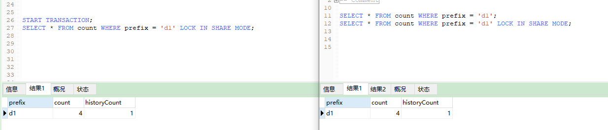<br>
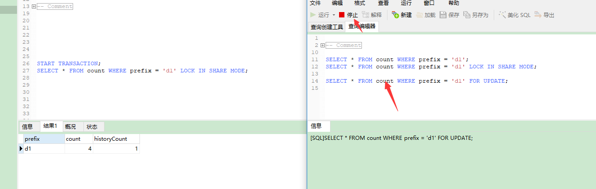<br>
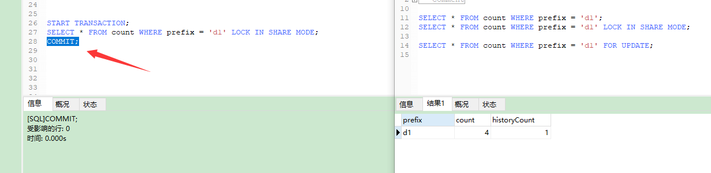<br>
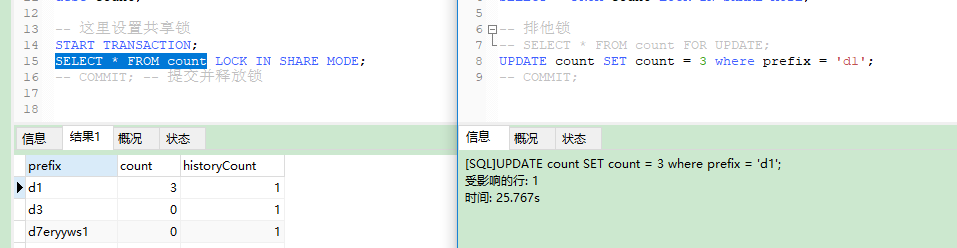

当执行 窗体1 执行commit的时候，窗体二才可以加排他锁

死锁情况：如下在 窗体1 执行共享锁之后，然后在窗体2也执行共享锁

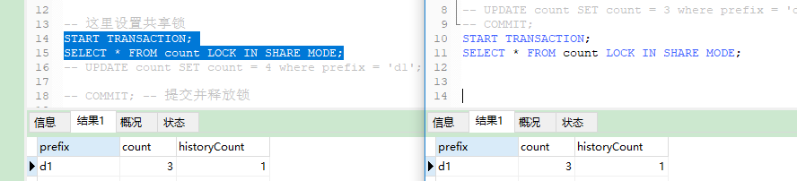

在窗体1中进行数据的修改这个时候修改会等待，同时再去窗体2修改数据报错并释放锁，然后窗体1执行修改（修改成功）

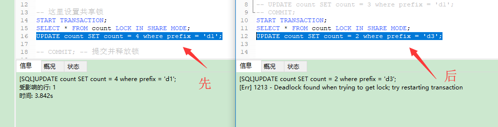

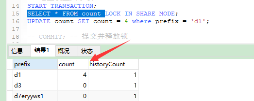

其实在窗体2的时候就是会出现死锁退出，除了死锁也会有因为等待超时而退出的情况

可以通过执行 ` ` select @@innodb_lock_wait_timeout ` ` 查看

``` sql
-- 窗体1代码
-- START TRANSACTION;
-- SELECT * FROM count WHERE prefix = 'd1' LOCK IN SHARE MODE;--
-- UPDATE count SET count = 4 where prefix = 'd1';
-- COMMIT;

-- 窗体2代码
-- SELECT * FROM count WHERE prefix = 'd1';
-- SELECT * FROM count WHERE prefix = 'd1' LOCK IN SHARE MODE;
--
-- -- SELECT * FROM count WHERE prefix = 'd1' FOR UPDATE;
-- UPDATE count SET count = 3 where prefix = 'd1';
-- COMMIT;
```

排他锁语句

> select * from table_name for update; 

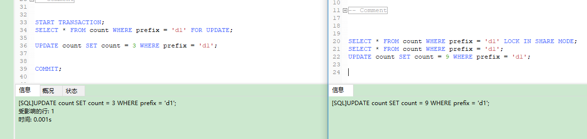

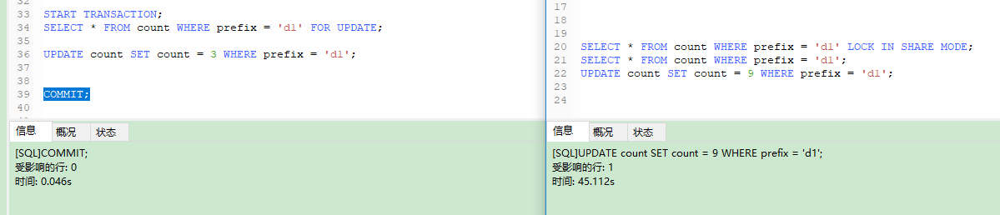

关于意向锁；<br>
意向锁是表级锁，其设计目的主要是为了在一个事务中揭示下一行将要被请求锁的类型。InnoDB 中的两个表锁：

意向共享锁（IS）：表示事务准备给数据行加入共享锁，也就是说一个数据行加共享锁前必须先取得该表的 IS 锁。如果需要对记录 A 加共享锁，那么此时 InnoDB 会先找到这张表，对该表加意向共享锁之后，再对记录 A 添加共享锁

意向排他锁（IX）：类似上面，表示事务准备给数据行加入排他锁，也就是说事务在给一个数据行加排他锁前必须先取得该表的 IX 锁。如果需要对记录 A 加排他锁，那么此时 InnoDB 会先找到这张表，对该表加意向排他锁之后，再对记录 A 添加排他锁
意向锁是 InnoDB 自动加的，不需要用户干预

共享锁和排他锁，系统在特定的条件下会自动添加共享锁或者排他锁，也可以手动添加共享锁或者排他锁。
意向共享锁和意向排他锁都是系统自动添加和自动释放的，整个过程无需人工干预

共享锁和排他锁都是锁的行记录，意向共享锁和意向排他锁锁定的是表
