# 锁机制与数据库结构

### 0. 课程回滚
1. 事务隔离级别
  1.1. 事务异常现象展示与解决（级联回滚与幻读）
  1.2. 事务的隔离级别实现
2. 秒杀-悲观锁与乐观锁

### 1. 事务回滚（不能自动回滚）
人们对事务的解释如下：事务由作为一个单独单元的一个或多个SQL语句组成，如果其中一个语句不能完成，整个单元就会回滚（撤销），所有影响到的数据将返回到事务开始以前的状态。因而，只有事务中的所有语句都成功地执行才能说这个事务被成功地执行。

这句话本身没有什么问题，问题是我给理解错了，我测试中问题描述为如下:
　mysql事务中有两条insert语句，其中第二条语句是错误的，在运行完事务后，第一条仍然插进去了，代码如下。

```sql
//创建表：
CREATE TABLE `test_tab` (
`f1`  int(11) NOT NULL ,
`f2`  varchar(11)  DEFAULT NULL ,
PRIMARY KEY (`f1`)
)
ENGINE=InnoDB

//执行事务：
START TRANSACTION;
INSERT INTO test_tab VALUES    (1, '2');
INSERT INTO test_tab VALUES    (1, '3');
COMMIT;
```
__（错误：这只是我一开始的认为）__ 一开始认为只要把事务写出来，最后用commit提交一下，数据库会自动判断这些语句是否全执行成功，如果成功则把所有的数据插入到数据库，如果有一条失败就自动回滚至原始状态！显然我认为错了。

```error
[SQL]START TRANSACTION;
受影响的行: 0
时间: 0.000s

[SQL]
INSERT INTO test_tab VALUES (1, '2');
受影响的行: 1
时间: 0.001s

[SQL]
INSERT INTO test_tab VALUES (1, '3');
[Err] 1062 - Duplicate entry '1' for key 'PRIMARY'
```
我们看结果可以知道INSERT INTO test_tab VALUES (1, '3');这一句因为主键冲突运行失败，从而这一条下面的commit也没有执行。

需要注意的是：这时已经开启了一个事务，并且已经执行了一条正确的插入语句，虽然没有体现在数据库中，但如果以后在该连接中又执行了一条commit 或begin或start transaction（新开一个事务会将该链接中的其他未提交的事务提交，相当于commit！）你会发现已经将刚才的INSERT INTO test_tab VALUES (1, '2');写进了数据库。

__所以事务的回滚不是这么理解的，正确的理解应该是，如果事务中所有sql语句执行正确则需要自己手动提交commit；否则有任何一条执行错误，需要自己提交一条rollback，这时会回滚所有操作，而不是commit会给你自动判断和回滚。__

### 2. 事务日志文件应对服务器异常终止情况
事务:ACID

服务器挂了，但是还没有 commit,会自动回滚 ？
1. 事务在操作过程中没有进行commit,但是服务器异常终止

如果服务器重启会执行 undo log: 把数据还原为初始状态

2. 务在操作过程中进行commit,但是还没来得及把数据写入到磁盘中 服务器异常终止

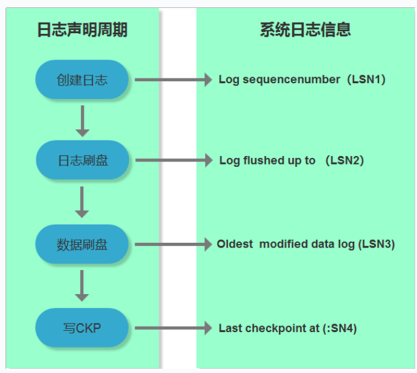


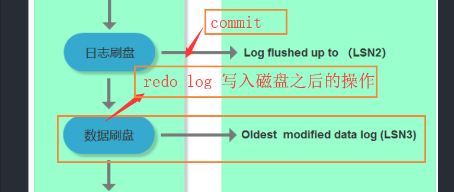

innodb_flush_log_at_trx_commit 设置事务commit之后的日志文件的写入时间和数据写入时间,数值不同可能影响的数据情况不一样

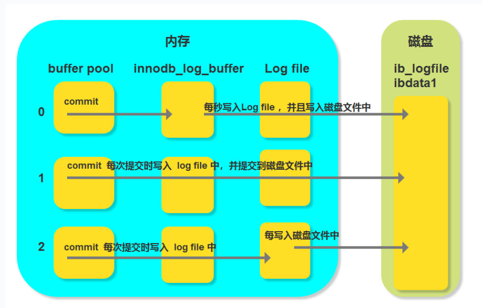


### 3. innodb行锁与表锁的转变与注意
InnoDB 行级锁是通过给索引上的索引项加锁来实现的，InnoDB行级锁只有通过索引条件检索数据，才使用行级锁；否则，InnoDB使用表锁

在不通过索引（主键）条件查询的时候，InnoDB是表锁而不是行锁。

> 通常begin-end用于定义一组语句块

*InnoDB表锁定机制的列子（讲之前去掉prefix的主键设置）*

| session1                                             | session2                                             |
| ---------------------------------------------------- | ---------------------------------------------------- |
| 查看数据表结构                                       |                                                      |
| 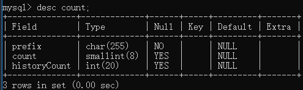 |                                                      |
| begin(begin-end用于定义一组语句块)查询数据           |                                                      |
| 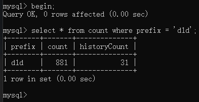 | 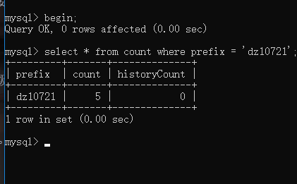 |
| 查询数据并加上锁机制(排他锁?什么是排他锁)            |                                                      |
| 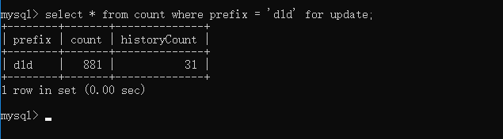 |                                                      |
|                                                      | 查询数据                                             |
|                                                      |  |
| commit                                               | 这个时候就可以显示数据                               |
|                                                      | 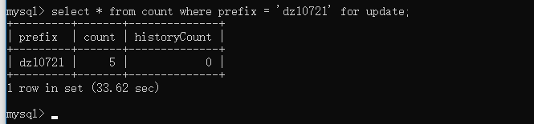 |

总结：就是在没有使用索引的情况下InnoDB就会使用表级锁（共享锁不会有这个情况）

*InnoDB行锁定机制的列子（主键是一个特殊的索引）*

| session1                                             | session2                                             |
| ---------------------------------------------------- | ---------------------------------------------------- |
| 给count中的prefix设置主键                            |                                                      |
|  |                                                      |
| 再次测试                                             |                                                      |
| begin                                                |                                                      |
| 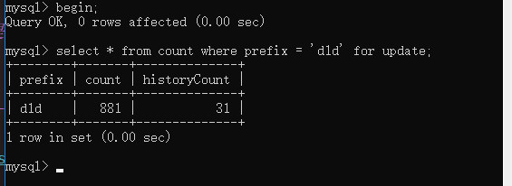 | 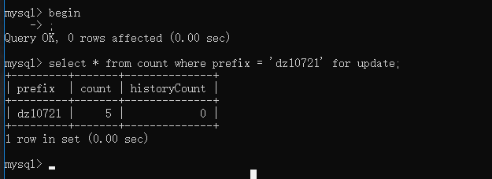 |
|                                                      |  |
| 可以看到目前锁只针对于d1d这条数据有效                |                                                      |
|                                                      |                                                      |
| 事务演示                                             |                                                      |
| 开启事务-新增一条数据                                |                                                      |
| 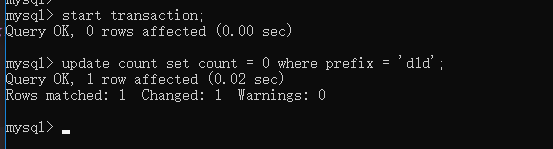 |  |
|                                                      |  |
| commit;                                              |  |

注意：如果查询的条件没有带索引，那么行锁则会转为表锁即时表中字段有主键；所以在查询的时候建议使用索引字段查询

### 4. innodb间隙锁

可以理解为是对于一定范围内的数据进行锁定，如果说这个区间没有这条数据的话也是会锁住的；主要是解决幻读的问题,如果没有添加间隙锁，如果其他事物中添加id在1到100之间的某条记录，此时会发生幻读；另一方面，视为了满足其恢复和赋值的需求。

首先操作之前需要先检查是否开启间隙锁
```sql
--系统默认关闭状态
show variables like 'innodb_locks_unsafe_for_binlog';
```

需要配置my.ini配置文件；
```yml
innodb_locks_unsafe_for_binlog = 1
```

| session1                             | session2           |
| ------------------------------------ | ------------------ |
| start transaction;                   | start transaction; |
| select * from count where count = 4; |                    |
| 查询结果为空                         |                    |
|                                      |                    |

https://dev.mysql.com/doc/refman/5.7/en/innodb-locking.html#innodb-gap-locks

### 5. MySQL对于死锁的处理方式


### 6. MySQL基础结构
