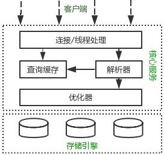
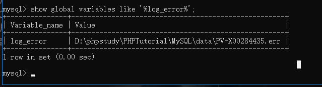
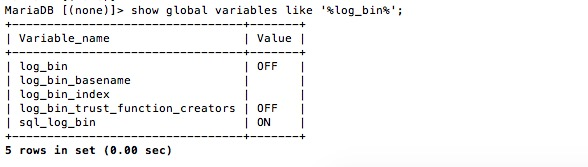
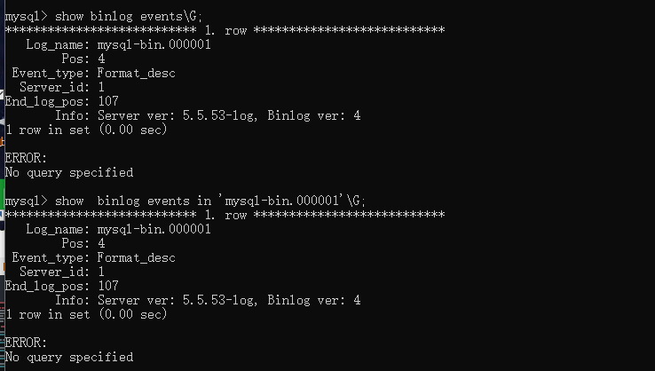
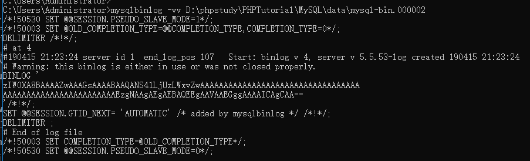
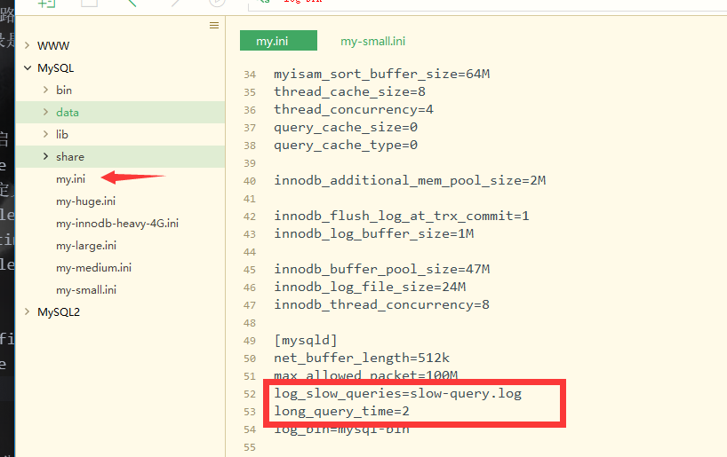
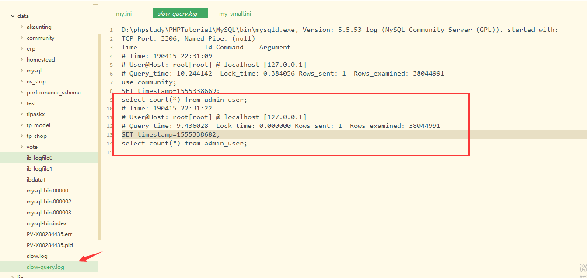
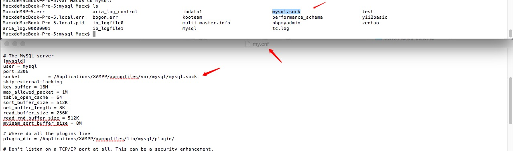

# 数据库结构

### 课程回顾
1. 事务不自动回滚与级联回滚
2. innodb锁机制的行表锁转化注意
3. MySQL对于死锁释放的规则
4. 事务与锁的使用建议
5. MySQL的基础结构

### 1. MySQL基础结构 重点
简单版的结构


<pre>

MySQL = 客户端 + 服务端
    客户端 = Connection(语言连接器例如：PHP-pdo，MySQLi)
    服务端 = SQL层 + 存储引擎层
        SQL层 = 链接/线程处理 + 查询缓存 + 分析器 + 优化器
        存储引擎 = InnoDB + MariaDB + .....

Connection：这一块其实主要是其他语言的连接，并不属于MySQL本身；主要是其他语言对于MySQL的连接操作的工具比如PHP中的：pdo，mysqli或者Navicat for MySQL

SQL层：功能主要包括权限判断，SQL解析功能和查询缓存处理等。

  1. 链接/线程处理：客户端通过 连接/线程层 来连接MySQL数据库，连接/线程层主要用来处理客户端的请求、身份验证和数据库安全性验证等。

  2. 查询缓存和查询分析器是SQL层的核心部分，其中主要涉及查询的解析、优化、缓存、以及所有内置的函数，存储过程，触发器，视图等功能。

  3. 优化器主要负责存储和获取所有存储在MySQL中的数据。
</pre>

### 2. MySQL物理文件类型（笔试题会问你知道的MySQL日志文件类型分别是什么）

#### 2.0 MySQL物理文件类型（笔试题会问你知道的MySQL日志文件类型分别是什么）

日志文件主要包括：
  1. 错误日志(Error Log)、
  2. 二进制日志(Binary Log)、
  3. 事务日志(InnoDB redo Log & undo Log)、
  4. 慢查询日志(Slow Query Log)、、
  5. 查询日志(Query Log)、

数据库文件：
  1. '.frm'文件
  2. '.MYD'文件
  3. '.MYI'文件
  4. '.ibd'文件和'.ibdata'文件

其他配置文件
  1. 系统配置文件（my.ini或者my.cnf）
  2. pid,err文件
  3. socket文件

##### 2.1 日志文件
###### 2.1. 错误日志

在mysql数据库中，错误日志功能是默认开启的。默认情况下，错误日志存储在mysql数据库的数据目录中。错误日志文件通常的名称为hostname.err。其中，hostname表示服务器主机名。

错误日志信息可以自己进行配置的，错误日志所记录的信息是可以通过 __log_error__ 和 __log_warnings__ 来定义的，其中log-error是定义是否启用错误日志的功能和错误日志的存储位置，log-warnings是定义是否将警告信息也定义至错误日志中。

默认情况下错误日志大概记录以下几个方面的信息：
  1. 服务器启动和关闭过程中的信息（未必是错误信息，如mysql如何启动InnoDB的表空间文件的、如何初始化自己的存储引擎的等等）、
  2. 服务器运行过程中的错误信息、事件调度器运行一个事件时产生的信息、在从服务器上启动服务器进程时产生的-信息

```bash
show global variables like '%log_error%';
```


我们可以根据错误日志查找操作过程的异常情况

###### 2. 二进制日志

二进制日志，也就是我们常说的binlog。二进制日志记录了MySQL所有修改数据库的操作，然后以二进制的形式记录日志在日志文件中，其中还包括没调语句所执行的时间和消耗的资源，以及相关的事务信息。

默认情况下二进制日志功能是没有开启的，启动可以配置log-bin[=file_name]开启，



作用：
1. 以二进制形式记录更改数据库的SQL语句（insert，update，delete，create，drop，alter等）。
2. 用于MySQL主从复制。
3. 增量数据备份及恢复

添加配置在my.cnf或者my.ini

因为bug必须添加server-id数值随意指定

```yml
server-id=1
log_bin=mysql-bin
```

启用该选项数据库性能降低1%，但保障数据库完整性，对于重要数据库值得以性能换完整。有些类似于oracle开启归档模式。



命令
```shell
-- 查看所有二进制文件信息
show binary logs;
-- 查看最新二进制文件
show master status;
-- 刷新日志
flush logs;

-- 查看二进制日志信息
语法格式：SHOW BINLOG EVENTS[IN 'log_name'] [FROM pos] [LIMIT [offset,] row_count]

-- show binlog events用于在二进制日志中显示事件。如果未指定'log_name'，则显示第一个二进制日志。
help show binlog events;  --获取帮助信息
show binlog events\G;
show  binlog events in 'mysql-bin.000014'\G;
```

命令行查看：``mysqlbinlog  D:\phpstudy\PHPTutorial\MySQL\data\mysql-bin.000002``



官网二进制文件恢复数据 https://dev.mysql.com/doc/refman/5.7/en/point-in-time-recovery.html

###### 3. 事务日志(InnoDB)

查看存储引擎：```show engines```;

InnoDB引擎在线Redo日志记录了InnoDB所做的所有物理变更和事务信息。通过Redo日志和Undo信息，InnoDB大大地加强了事务的安全性。InnDB在线Redo日志默认存放在data命令下，可通过设置innodb_log_griyo_home_dir选项来更改日志文件存放位置，通过innodb_log_files_in_group选项来说何止日志的数量

使用事务日志，存储引擎在修改表的数据时只需要修改其内存拷贝，再把修改行为记录到持久在硬盘上的事务日志中，而不用每次都将修改的数据本身持久到磁盘。事务日志采用追加的方式，因此写日志的操作是磁盘上一小块区域内的顺序I/O，而不像随机I/O需要在磁盘的多个地方移动磁头，所以采用事务日志的方式相对来说要快得多。事务日志持久以后，内存中被修改的数据在后台可以慢慢的刷回到磁盘。目前大多数的存储引擎都是这样实现的。

###### 4. 慢查询日志

顾名思义，慢查询日志中记录的是执行时间较长的query，也就是我们常说的slowquery。

专业一点：慢查询日志是值所有SQL执行的实际超过long_query_time变量的语句和达到min_examined_row_limit条举例的语句。用户可以针对这部分语句性能调优。慢查询日志通过设置log-slow_queries[=file_name]选项开启后，将记录日志所在的路劲和名称。MySQL系统默认的慢查询日志的文件名是show.log，默认目录是data目录。

命令：
```shell
-- 查看慢查询是否开启
show variables like "log_slow_queries";
-- 查看慢查询日志的定义：
show global variables like  '%slow_query_log%';
-- 查看long_query_time设置时间
show global variables like '%long%';
-- 查看具体信息
-- slow_query_log： off关闭状态  on开启状态
-- slow_query_log_file  慢查询日志存放地点
show variables like "%slow%" ;

```

此处：为测试不做深度分析SQL操作；

开启慢查询：

```yml
slow_query_log
slow_query_log_file=[file_name] 文件地址
long_query_time=2 -- 最大等待时间
```


重启-测试


查询结果



Query_time: 0.000304表示用了0.000304秒<br>
Lock_time: 0.000128表示锁了0.000128秒<br>
Rows_sent: 4表示返回4行<br>
Rows_examined: 4表示一共查了4行<br>
SET timestamp=UNIXTIME; 这是查询实际发生的时间和将其变成一个有用的时间，将 Unix 时间转成一个可读的时间，可以使用 date –d@日志中的时间戳：

##### 2.2 数据文件
MySQL数据库会在data目录下面简历一个以数据库为名的文件夹，用来存储数据库中的表文件数据。不同的数据库引擎，每个表的扩展名也不一样，例如：MyISAM用“.MYD”作为扩展名，Innodb用“.ibd”，Archive 用“.arc”，CSV 用“.csv

###### 2.2.1 ".frm"文件

无论是那种存储引擎，创建表之后就一定会生成一个以表明命名的'.frm'文件。frm文件主要存放与表相关的数据信息，主要包括表结构的定义信息。当数据库崩溃时，用户可以通过frm文件来恢复数据表结构。

###### 2.2.2 ".MYD"

“.MYD”文件是MyISAM存储引擎专用，存放MyISAM表的数据。每一个MyISAM表都会有一个“.MYD”文件与之对应，同样存放于所属数据库的文件夹下，和“.frm”文件在一起。

###### 2.2.3 ".MYI"

“.MYI”文件也是专属于MyISAM存储引擎的，主要存放MyISAM表的索引相关信息。对于MyISAM存储来说，可以被cache 的内容主要就是来源于“.MYI”文件中。每一个MyISAM表对应一个“.MYI”文件，存放于位置和“.frm”以及“.MYD”一样。

###### 2.2.4 “.ibd”文件和ibdata文件

这两种文件都是存放Innodb数据的文件，之所以有两种文件来存放Innodb的数据（包括索引），是因为Innodb的数据存储方式能够通过配置来决定是使用共享表空间存放存储数据，还是独享表空间存放存储数据。独享表空间存储方式使用“.ibd”文件来存放数据，且每个表一个“.ibd”文件，文件存放在和MyISAM数据相同的位置。如果选用共享存储表空间来存放数据，则会使用ibdata文件来存放，所有表共同使用一个（或者多个，可自行配置）ibdata文件。

ibdata文件可以通过innodb_data_home_dir（数据存放目录）和innodb_data_file_path(配置每个文件的名称)两个参数配置组成

innodb_data_file_path中可以一次配置多个ibdata文件```#innodb_data_file_path = ibdata1:2000M;ibdata2:10M:autoextend``` 配置方式

共享表空间以及独占表空间都是针对数据的存储方式而言的。

共享表空间:  某一个数据库的所有的表数据，索引文件全部放在一个文件中。

独占表空间:  每一个表都将会生成以独立的文件方式来进行存储，每一个表都有一个.frm表描述文件，还有一个.ibd文件。其中这个文件包括了单独一个表的数据内容以及索引内容。

__两者对比__

（1.）共享表空间：

优点：<br>
可以放表空间分成多个文件存放到各个磁盘上。数据和文件放在一起方便管理。

缺点：<br>
所有的数据和索引存放到一个文件中，多个表及索引在表空间中混合存储，这样对于一个表做了大量删除操作后表空间中将会有大量的空隙，特别是对于统计分析，日值系统这类应用最不适合用共享表空间。

（2.）独立表空间：<br>
优点:
1. 每个表都有自已独立的表空间。
2. 每个表的数据和索引都会存在自已的表空间中。
3. 可以实现单表在不同的数据库中移动。
4. 空间可以回收<br>
  a)  Drop table操作自动回收表空间，如果对于统计分析或是日值表，删除大量数据后可以通过:altertable TableName engine=innodb;回缩不用的空间。<br>
  b)  对于使用独立表空间的表，不管怎么删除，表空间的碎片不会太严重的影响性能，而且还有机会处理。

缺点：单表增加过大，如超过100个G。

相比较之下，使用独占表空间的效率以及性能会更高一点

__共享表空间和独立表空间之间的转换__

show variables like "innodb_file_per_table"; ON代表独立表空间管理，OFF代表共享表空间管理；<br>

修改数据库的表空间管理方式<br>

修改innodb_file_per_table的参数值即可，但是修改不能影响之前已经使用过的共享表空间和独立表空间；<br>

  innodb_file_per_table=1 为使用独占表空间<br>
  innodb_file_per_table=0 为使用共享表空间<br>


##### 2.3 其他文件

*系统核心配置文件*

linux/mac : etc/my.cnf;windows : mysql/my.ini


MySQL 的系统配置文件一般都是my.cnf，默认存放在"/etc"目录下，my.cnf文件中包含多种参数选项组（group），每一种参数组都通过中括号给定了固定的组名，如“[mysqld]”组中包括了mysqld服务启动时候的初始化参数，“[client]”组中包含着客户端工具程序可以读取的参数。

*socket  file*

MySQL服务器启动后socket文件自动生成，该文件主要用来连接客户端

在有些时候连接MySQL会出现如下的问题：<br>


这个问题的解决主要是sock文件没有找到



通常的解决办法，可以尝试重启一下MySQL的服务器；如果不信就可以去查找mysql.sock，并在my.cnf中指定该文件的位置（移动也可以）。
