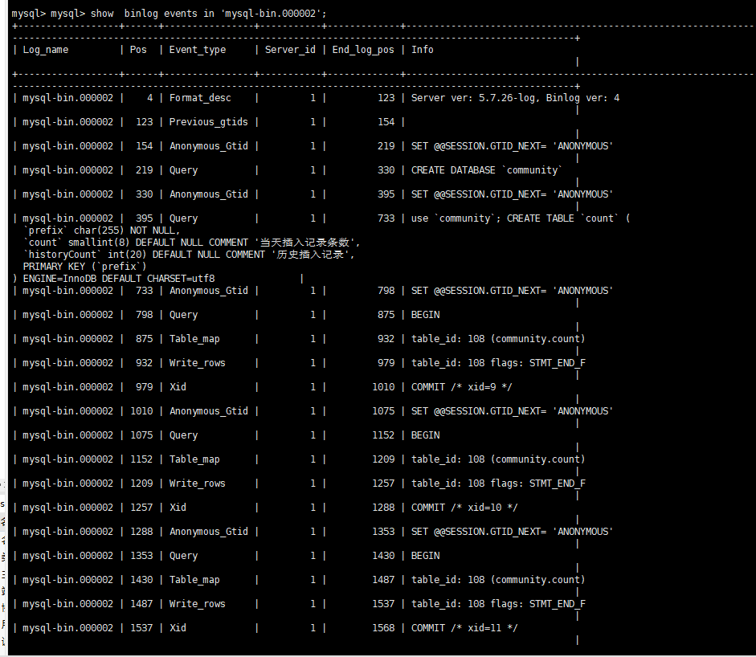
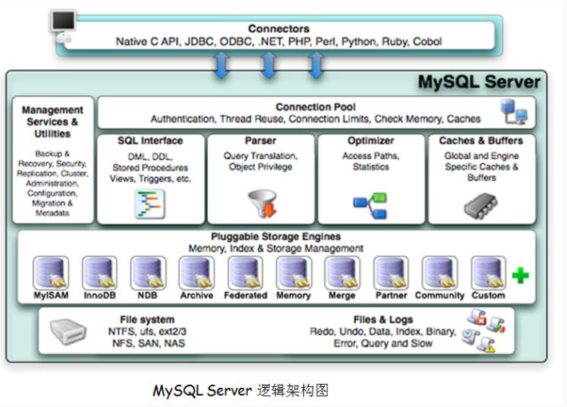
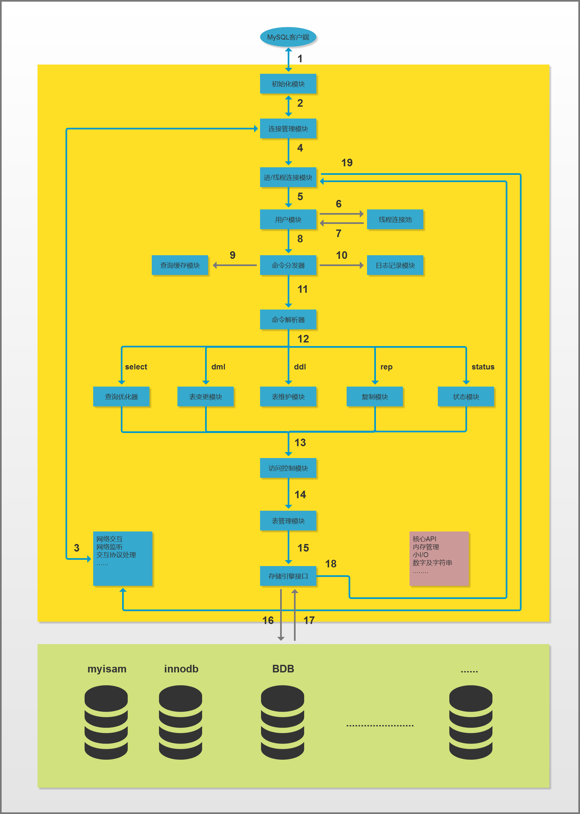
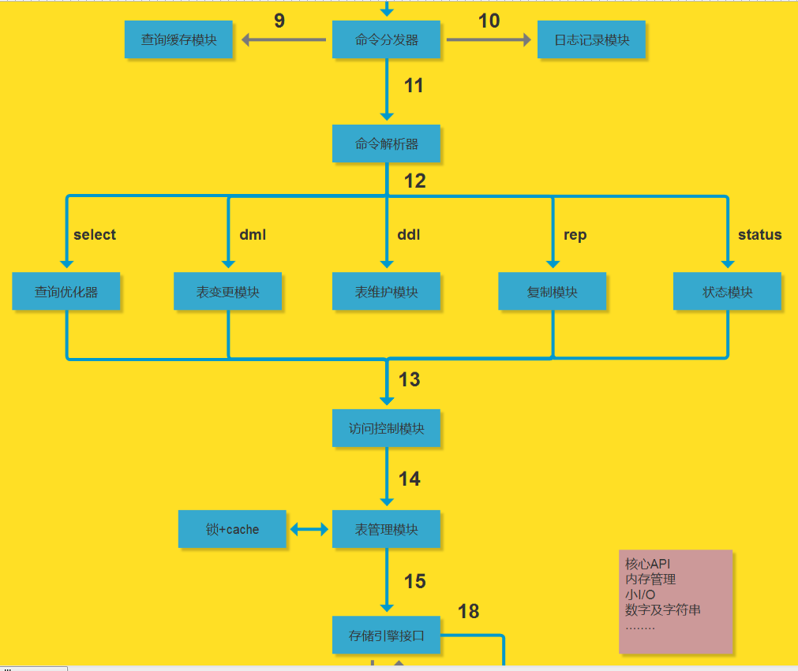
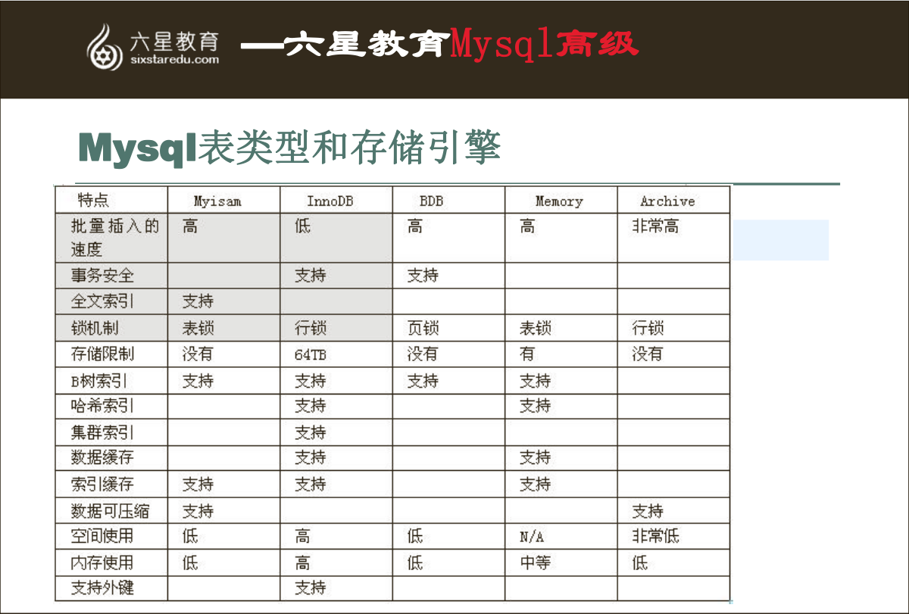

# 数据库结构详解

### 0. 课程内容
1. 课程回顾
2. MySQL结构
3. MySQL运行流程
4. innodb与myisam比较

### 1. 课程回顾
1. 文件介绍
2. 二进制文件

#### 1.1 二进制讲解
```sql
-- 定时情况二进制内容
expire_logs_days=7

-- 二进制刷新时间
sync_binlog = 0,1,N

-- 清空MySQL二进制文件
flush logs;
reset master;
```

操作：

```sql
-- 设置二进制文件是否开启
SET sql_log_bin=OFF

-- 先创建一个数据库做操作：community
CREATE DATABASE `community` ;

USE community;

-- 添加测试的数据表
CREATE TABLE `count` (
  `prefix` char(255) NOT NULL,
  `count` smallint(8) DEFAULT NULL COMMENT '当天插入记录条数',
  `historyCount` int(20) DEFAULT NULL COMMENT '历史插入记录',
  PRIMARY KEY (`prefix`)
) ENGINE=InnoDB DEFAULT CHARSET=utf8;

-- 添加对应的测试数据
insert into count values('dd1', 1, 0);
insert into count values('dd2', 1, 0);
insert into count values('dd3', 1, 0);

-- 查看日志文件列表
SHOW BINARY LOGS;

-- 查看日志文件的具体信息
show binlog events in 'mysql-bin.000001';
```

日志文件的中具体信息



现在对于数据进行备份操作

关于mysqlbinlog的使用参考官网： https://dev.mysql.com/doc/refman/5.7/en/mysqlbinlog.html

```shell
-- 导入到SQL文件中
mysqlbinlog --skip-gtids /usr/local/mysql/data/mysql-bin.000001 > /usr/local/mysql/data/community.sql

运行检测内容

vim /usr/local/mysql/data/community.sql;

mysql57 -u root -p -e "source /usr/local/mysql/data/community.sql"
```

然后可以做一个比较暴力或者直接的操作；把数据表count删除
```sql
drop table `count`;

-- 或者执行

delete from `count`;
```

然后进行数据的还原：
```shell
mysql57 -u root -p -e "source /usr/local/mysql/data/community.sql"
```

关于binlog的写入时间节点：sync_binlog 默认 0

sync_binlog=0: 对于日志刷新到磁盘基本上MySQL是不会自己控制刷新，由文件系统自己控制它的缓存刷新。这时候的性能最好，但是风险也是最大的。因为一旦系统出问题在binlog_cache中的所有binlog信息都会被丢失

sync_binlog=1: 启用在事务提交之前将二进制日志同步到磁盘。这是最安全的设置，但是由于磁盘写操作的增加，可能会对性能产生负面影响。在发生电源故障或操作系统崩溃时，二进制日志中缺少的事务只处于准备状态。这允许自动恢复例程回滚事务，从而确保二进制日志中没有丢失任何事务。

sync_binlog=N：其中N是0或1之外的值:在收集了N个二进制日志提交组之后，将二进制日志同步到磁盘。在发生电源故障或操作系统崩溃时，服务器可能提交了未刷新到二进制日志的事务。由于磁盘写的数量增加，此设置可能对性能产生负面影响。值越大，性能越好，但是数据丢失的风险越大。

### 3. mysql架构详细讲解

详细版的结构


##### 3.1 运行流程

MySQL结构图：



执行流程分析：

###### 3.1.1 启动

1. 通过命令net start mysql(windows) / service mysql start(linux)启动MySQL服务
2. 调用初始模块；初始化模块就是在数据库启动的时候，对整个数据库做的一些初始化操作，比如各种系统环境变量的初始化，各种缓存，存储引擎初始化设置等。

核心api：MySQL数据库核心api主要实现了数据库底层操作的优化功能，其中主要包括IO操作、格式化输出、高性能存储数据结果算法的优化，字符串的处理，其中最重要的是内存管理。

###### 3.1.2 连接

3. 用户发送一条SQL，这个时候会被网络交互模块监听到用户的操作请求，传递给‘连接管理模块’
4. 接收到请求转发到‘进/线程连接模块’
5. 调用‘用户模块’来进行权限检测（访问数据库的权限）
6. 通过检测之后就会去‘连接进/线程模块’从‘线程连接池’中查找空闲的被缓存的连接线程和客户端请求对接，如果失败则创建一个新的连接请求
7. 返回连接线程

网络交互模块：对外提供可以接收和发送数据的api接口，其他模块需要交互的时候，可以通过api接口调用<br>

连接管理模块、进/线程连接模块、线程连接池：连接管理模块负责监听MySQL Server的各种请求，根据不同的请求，然后转发到线程管理模块，每个客户请求都会被数据库自动分配一个独立的线程为其单独服务，而连接线程的主要工作就是负责MySQL Server与客户端通信，线程管理模块负责管理这些生成的线程。

###### 3.1.3 处理



8. 在用户权限校验成功之后，并且获得新的连接池之后就会去‘命令分发器’，判断命令的类型如果是select就会去访问‘查询缓存’，如果没有就会往下执行；
9. 如果是select，并且开启'查询缓存'之后就会去缓存中查询是否有与之相匹配的SQL,如果有就会校验用户访问该数据的权限,通过就返回不通过就会返回错误信息. 如果数据没有就会往下执行
10. 会记录过程中的SQL操作过程到日志文件中
11. 在第8,9步 没有满足相应条件之后往下执行进入 '命令解析器',经过词法分析,语法分析后生成解析树
12. 根据操作转到对应的模块处理(预处理阶段)，根据SQL选择执行的模块
13. 模块收到请求后，通过'访问控制模块'检查所连接的用户是否有访问目标表和目标字段的权限（是指访问这些数据的权限）
14. 有权限'表管理模块'先查看table cache中是否存在，有则直接对应的表和获取锁，负责重新打开表文件
15. 根据表的ENGINE数据，获取表的存储引擎类型等信息
16. 通过接口调用对应的存储引擎处理
17. 返回查询之后数据内容

用户模块：主要功能是用于控制用户登入连接的权限和用户授权管理。

访问控制模块：主要用于监控用户的每一个操作。访问控制模块实现的功能就是根据用户模块中不同的用户授权，以及根据其数据库的各种约束来控制用户对数据的访问。用户模块和访问控制模块结合起来，就组成了MySQL数据库的权限管理功能。

查询优化器：这个模块主要是讲客户端发送的查询请求，在之前算法的基础上分析，计算出一个最优的查询策略，优化之后会提高查询访问的速度，最后根据其最优策略返回查询语句。

表变更管理模块：主要负责完成DML和DDl的查询，列如，insert，update，delete，create table，alter table等语句处理。

表维护模块：主要用于检测表的状态，分析，优化表结构，以及修复表。

复制模块：复制模块分为Master模块和Slave模块两部分。Master模块主要负责复制环境中读取Master端的binary日志，以及Slave端的I/O线程交互等工作。

状态模块：在客户端请求系统状态的时候，系统状态模块主要负责将各种状态的数据返回给用户。最常用的一些查询状态的命令包括show status，show variable是等，都是通过这个模块负责返回的。

表管理模块：主要就是维护系统生成的表文件。列如MyISAM存储引擎就生成frm，myd，myi文件，维护这些文件，江哥哥表结构的信息缓存起来，另外该模块还管理表级别的锁。

存储引擎接口模块：MySQL实现了其数据库底层存储引擎的插件师管理，将各种数据处理高度抽象画。


###### 3.1.4 结果
18. 命令执行完了之后，将结果集返回给'理解进/线程模块'(返回的也可以是相应标识，成功失败)
19. '理解进/线程模块'进行后续的清理工作，并继续等待请求或断开与客户端的连接

### 4 存储引擎



```shell
-- 查看数据库支持的存储引擎
show engines;
```
##### 4.1 存储引擎的优点(myisam, innodb)
###### 4.1.1 myisam
MyISAM 在磁盘上攒簇三个文件，文件名和对应的表名是一致的
* frm文件：存储表的定义数据。
* myd文件：存放表具体记录数据。
* myi文件：存储索引。

MyISAM存储引擎不支持事务，也不支持主键，对数据的存储和批量查询的速度比较快。

在实际应用中，往往对于不需要完整的事务，主要以查询和增加记录为主的应用采用myisam存储引擎（日志）

###### 4.1.2 innodb
innodb是第三方公司开发的，目前应用最广泛的数据存储引擎除了满意三之外就是innodb了，innodb写的处理相对于myisam效率低一些，innodb牺牲了存储和查询的效率，支持事务安全，支持自动增长列，对于输完液安全的支持，这是innodb成为myisam最为流行的存储器引擎之一的重要原因。

外键约束

innodb实现了外键这一数据库重要功能，从数据库性能上讲数据库外键降低了数据库查询的效率，数据库表之间的耦合度更加紧密，但是对于不少用户来讲，采用外键约束可能是低成本的选择方式