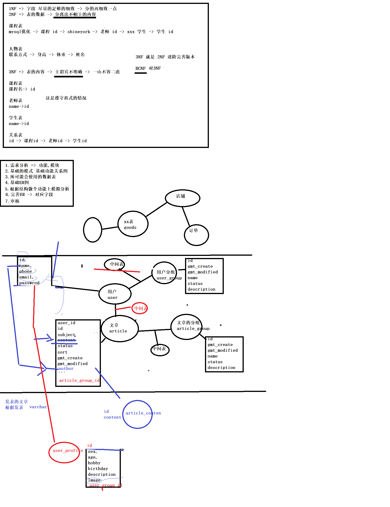

# 数据库基础设计与表设计


### 作业
请完善课堂笔记 - 这节课的完整笔记在放在下一节课中

### -1.影响性能
1. 需求变更( 设计的时候可以多考虑 提高 程序 扩展性)
2. 业务架构-程序代码-!-SQL 分层 服务化 微服务服务
3. SQL语句写
4. 数据库设计问题
   4.1. 数据表关系结构 (三大范式)
   4.2. 数据表本身结构 (三大范式)
   4.3. 数据表字段选择 (事先能够对于业务有预计的一些点)

### 0. 数据库关系数据库
关系数据结构 => 契合与事物实体 => 表实体抽象描述

关系操作 => CURD

完整的约束

### 1. 三大范式 => 六大范式(1~5NF,BCNF)

误区:不是范式越高越就越好  好 => 结构清晰

早期:希望数据可以足够的小 数据量不是问题 主要分问题

现在:希望查询速度越快越好,同时操作越简单越好

1NF 属性能够必须是原子项 最小单位

一句话: 斤斤计较 足够的细致

2NF 你和我没有关系

比如:

3NF


上次面试有一道题是购买网络课程设计订单表 把订单所对应的的课程单独放到另一个表建立两张表好还是生成一个订单号多条记录放在一张订单表中好

### 2. 案例 => 数据表的字段选择

面试 设计一个 登入系统

登入系统 => 发表对应文章表 博客 CSDN

功能

1. 用户可以注册登入
2. 可以发表
3. 有不同的类型用户
4. 根据文章查询某一个用户发表的其他文章
5. 有可能有不同类型的文章

表:

用户表,用户分组,文章,文章分组

系统中:一个户登入之后 自己去浏览自己的个人信息 次数不多吧

用户登入系统之后 -> 阅读文章

因为这个博主文章好,会点击博主的头像 会有哪些文章

根据用户的id 查询用户发表文章 然后 在进行排序

user,article
```sql
select
  u.id,u.name,a.id,a.subject
from
  user u
left join
  article a on a.user_id = u.id
where
  u.id = ? (代表参数)
order by
  gmt_create
desc limit
  20

子查询
```
2000w => 12s
select count(*) from admin_user;

实际上我们上面的查询 用户 只需要提供 用户的名称

违反三大范式 添加多余的一个字段

```sql
select
  id,author,id,subject
from
  article
where
  user_id = ? (代表参数)
```

用户改名了，文章的作者不变啊 => 带来大量修改的问题

分析 show status mysql数据库状态 分析 查询比例
7:10


select 获取内容 from user where 定位;

text 单独查询

有一些表:有一些字段可能实际项目运行中不会过多地关照这个字段

可以分离 出 查询次数较少的字段单独的建立数据表

建议
1. 尽量不要有太多的字段
2. 简单就好
3. 不要有太多的关联
4. 尽量不要有可以 NULL ()

总结:
1. 根据范式去设计数据库
2. 根据项目功能用户操作的比例调节字段(分割)
3. 根据查询业务,选择对应冗余 ( show status )
4. 分离出字段较大字段



### ? 作业 可不可以多次查询优化查询效率

可以执行两个查询，一个查用户表，一个查文章表
做一个数据处理
