# 集群

## 问题

容量不够，redis如何进行扩容？

并发写操作， redis如何分摊？

另外，主从模式，薪火相传模式，主机宕机，导致ip地址发生变化，应用程序中配置需要修改对应的主机地址、端口等信息。

之前通过代理主机来解决，但是redis3.0中提供了解决方案。就是无中心化集群配置。

## 什么是集群

Redis 集群实现了对Redis的水平扩容，即启动N个redis节点，将整个数据库分布存储在这N个节点中，每个节点存储总数据的1/N。

Redis 集群通过分区（partition）来提供一定程度的可用性（availability）： 即使集群中有一部分节点失效或者无法进行通讯， 集群也可以继续处理命令请求。

## 删除持久化数据

将rdb,aof文件都删除掉。

## 制作6个实例，6379,6380,6381,6389,6390,6391

### 配置基本信息

开启daemonize yes

Pid文件名字

指定端口

Log文件名字

Dump.rdb名字

Appendonly 关掉或者换名字

### redis cluster配置修改

cluster-enabled yes  打开集群模式

cluster-config-file nodes-6379.conf 设定节点配置文件名

cluster-node-timeout 15000  设定节点失联时间，超过该时间（毫秒），集群自动进行主从切换。

``` yaml
include /home/bigdata/redis.conf
port 6379
pidfile "/var/run/redis_6379.pid"
dbfilename "dump6379.rdb"
dir "/home/bigdata/redis_cluster"
logfile "/home/bigdata/redis_cluster/redis_err_6379.log"
cluster-enabled yes
cluster-config-file nodes-6379.conf
cluster-node-timeout 15000
```

### 修改好redis6379.conf文件，拷贝多个redis.conf文件

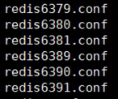

### 使用查找替换修改另外5个文件

例如：:%s/6379/6380  

### 启动6个redis服务

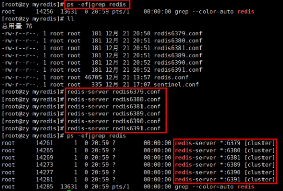

## 将六个节点合成一个集群

组合之前，请确保所有redis实例启动后，nodes-xxxx.conf文件都生成正常。

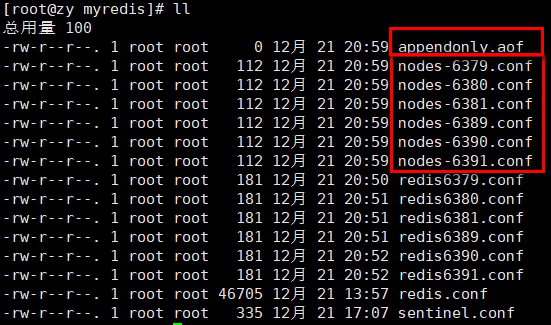

* 合体：

``` sh
cd  /opt/redis-6.2.1/src

redis-cli --cluster create --cluster-replicas 1 192.168.11.101:6379 192.168.11.101:6380 192.168.11.101:6381 192.168.11.101:6389 192.168.11.101:6390 192.168.11.101:6391
```

此处不要用127.0.0.1， 请用真实IP地址

--replicas 1 采用最简单的方式配置集群，一台主机，一台从机，正好三组。

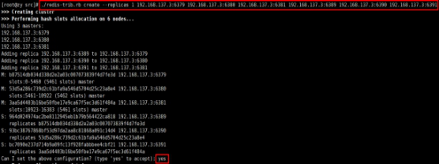

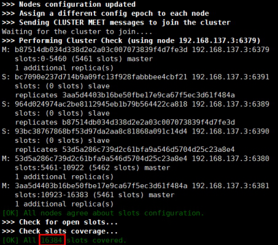

* 普通方式登录

可能直接进入读主机，存储数据时，会出现MOVED重定向操作。所以，应该以集群方式登录。

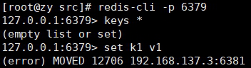

## -c 采用集群策略连接，设置数据会自动切换到相应的写主机

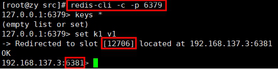

## 通过 cluster nodes 命令查看集群信息

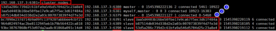

## redis cluster 如何分配这六个节点?

一个集群至少要有三个主节点。

选项 --cluster-replicas 1 表示我们希望为集群中的每个主节点创建一个从节点。

分配原则尽量保证每个主数据库运行在不同的IP地址，每个从库和主库不在一个IP地址上。

## 什么是slots

**[OK] All nodes agree about slots configuration.**

**>>> Check for open slots...**

**>>> Check slots coverage...**

**[OK] All** **16384 slots covered.**

一个 Redis 集群包含 16384 个插槽（hash slot）， 数据库中的每个键都属于这 16384 个插槽的其中一个， 

集群使用公式 CRC16(key) % 16384 来计算键 key 属于哪个槽， 其中 CRC16(key) 语句用于计算键 key 的 CRC16 校验和 。

集群中的每个节点负责处理一部分插槽。 举个例子， 如果一个集群可以有主节点， 其中：

节点 A 负责处理 0 号至 5460 号插槽。

节点 B 负责处理 5461 号至 10922 号插槽。

节点 C 负责处理 10923 号至 16383 号插槽。

## 在集群中录入值

在redis-cli每次录入、查询键值，redis都会计算出该key应该送往的插槽，如果不是该客户端对应服务器的插槽，redis会报错，并告知应前往的redis实例地址和端口。

redis-cli客户端提供了 –c 参数实现自动重定向。

如 redis-cli  -c –p 6379 登入后，再录入、查询键值对可以自动重定向。

不在一个slot下的键值，是不能使用mget,mset等多键操作。

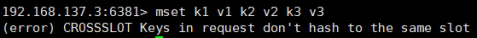

可以通过{}来定义组的概念，从而使key中{}内相同内容的键值对放到一个slot中去。

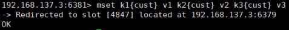

## 查询集群中的值

CLUSTER GETKEYSINSLOT \<slot>\<count> 返回 count 个 slot 槽中的键。

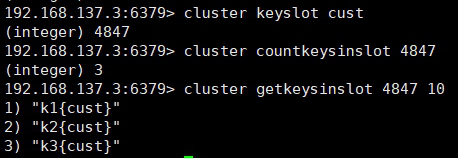

## 故障恢复

如果主节点下线？从节点能否自动升为主节点？注意：***\*15秒超时\****

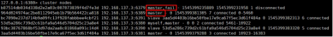

主节点恢复后，主从关系会如何？主节点回来变成从机。

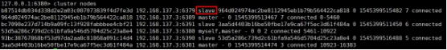 

如果所有某一段插槽的主从节点都宕掉，redis服务是否还能继续?

如果某一段插槽的主从都挂掉，而cluster-require-full-coverage 为yes ，那么 ，整个集群都挂掉

如果某一段插槽的主从都挂掉，而cluster-require-full-coverage 为no ，那么，该插槽数据全都不能使用，也无法存储。

redis.conf中的参数  cluster-require-full-coverage

## 集群的Jedis开发

即使连接的不是主机，集群会自动切换主机存储。主机写，从机读。

无中心化主从集群。无论从哪台主机写的数据，其他主机上都能读到数据。

``` java
public class JedisClusterTest {
  public static void main(String[] args) { 
     Set\<HostAndPort>set =new HashSet\<HostAndPort>();
     set.add(new HostAndPort("192.168.31.211",6379));
     JedisCluster jedisCluster=new JedisCluster(set);
     jedisCluster.set("k1", "v1");
     System.out.println(jedisCluster.get("k1"));
  }
}
```

## Redis 集群提供了以下好处

实现扩容

分摊压力

无中心配置相对简单

## Redis 集群的不足

多键操作是不被支持的 

多键的Redis事务是不被支持的。lua脚本不被支持

由于集群方案出现较晚，很多公司已经采用了其他的集群方案，而代理或者客户端分片的方案想要迁移至redis cluster，需要整体迁移而不是逐步过渡，复杂度较大。