# 安装

* Redis是一个开源的key-value存储系统。

* 和Memcached类似，它支持存储的value类型相对更多，包括string(字符串)、list(链表)、set(集合)、zset(sorted set --有序集合)和hash（哈希类型）。

* 这些数据类型都支持push/pop、add/remove及取交集并集和差集及更丰富的操作，而且这些操作都是原子性的。

* 在此基础上，Redis支持各种不同方式的排序。

* 与memcached一样，为了保证效率，数据都是缓存在内存中。

* 区别的是Redis会周期性的把更新的数据写入磁盘或者把修改操作写入追加的记录文件。

* 并且在此基础上实现了master-slave(主从)同步。

## 应用场景

### 配合关系型数据库做高速缓存

* 高频次，热门访问的数据，降低数据库IO

* 分布式架构，做session共享
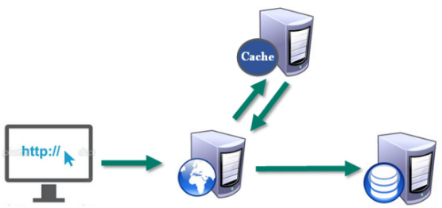

### 多样的数据结构存储持久化数据


| Redis官方网站   | Redis中文官方网站 |
| --------------- | ----------------- |
| http://redis.io | http://redis.cn/  |

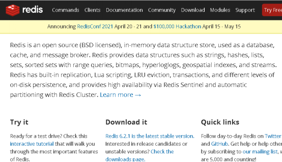

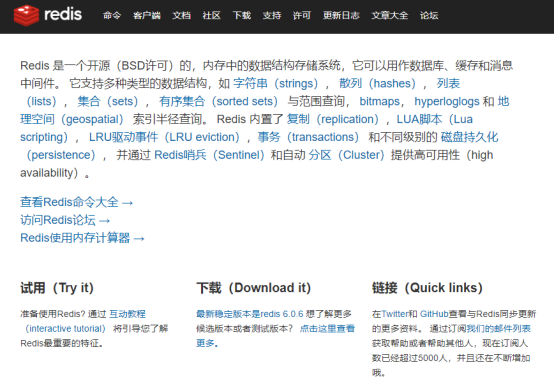

### 安装版本

* 6.2.1 for Linux（redis-6.2.1.tar.gz）

### 安装步骤

#### 准备工作：下载安装最新版的gcc编译器

安装C 语言的编译环境

```sh
yum install centos-release-scl scl-utils-build

yum install -y devtoolset-8-toolchain

systemclt enable devtoolset-8 bash
```

测试gcc版本

```sh
gcc version
```
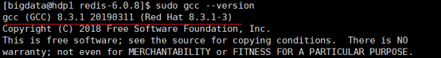

#### 下载redis-6.2.1.tar.gz放/opt目录
#### 解压命令：tar -zxvf redis-6.2.1.tar.gz
#### 解压完成后进入目录：cd redis-6.2.1
#### 在redis-6.2.1目录下再次执行make命令（只是编译好）
#### 如果没有准备好C语言编译环境，make会报错—Jemalloc/jemalloc.h：没有那个文件

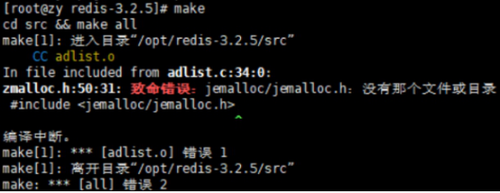

#### 解决方案：运行make distclean
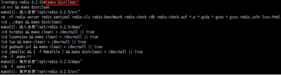

#### 在redis-6.2.1目录下再次执行make命令（只是编译好）
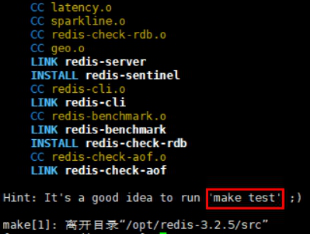

#### 跳过make test 继续执行: make install
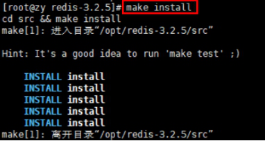

### 安装目录：/usr/local/bin

查看默认安装目录：

redis-benchmark:性能测试工具，可以在自己本子运行，看看自己本子性能如何

redis-check-aof：修复有问题的AOF文件，rdb和aof后面讲

redis-check-dump：修复有问题的dump.rdb文件

redis-sentinel：Redis集群使用

redis-server：Redis服务器启动命令

redis-cli：客户端，操作入口

### 前台启动（不推荐）

前台启动，命令行窗口不能关闭，否则服务器停止

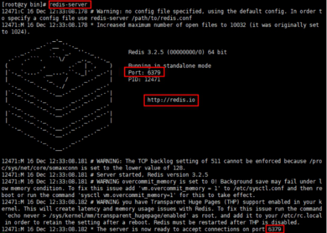

### 后台启动（推荐）

#### 备份redis.conf

拷贝一份redis.conf到其他目录

```sh
cp  /opt/redis-3.2.5/redis.conf  /myredis
```

#### 后台启动设置daemonize no改成yes

修改redis.conf(128行)文件将里面的daemonize no 改成 yes，让服务在后台启动

#### Redis 启动

redis-server/myredis/redis.conf

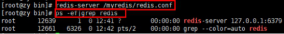

#### 用客户端访问：redis-colin

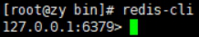

#### 多个端口可以：redis-cli -p 6379

#### 2.2.5.6.测试验证： ping

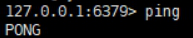

#### Redis关闭

单实例关闭：redis-cli shutdown

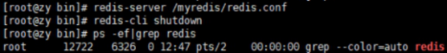

也可以进入终端后再关闭

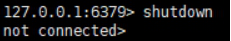

多实例关闭，指定端口关闭：redis-cli -p 6379 shutdown

### Redis介绍相关知识

| 端口6379从何而来Alessia  Merz! | 默认16个数据库，类似数组下标从0开始，初始默认使用0号库使用命令 select  \<dbid\>来切换数据库。如: select 8 统一密码管理，所有库同样密码。dbsize查看当前数据库的key的数量flushdb清空当前库flushall通杀全部库 |
| ------------------------------------------------------------ | ------------------------------------------------------------ |
|                                                              |                                                              |

Redis是单线程+多路IO复用技术

多路复用是指使用一个线程来检查多个文件描述符（Socket）的就绪状态，比如调用select和poll函数，传入多个文件描述符，如果有一个文件描述符就绪，则返回，否则阻塞直到超时。得到就绪状态后进行真正的操作可以在同一个线程里执行，也可以启动线程执行（比如使用线程池）

串行  vs  多线程+锁（memcached） vs  单线程+多路IO复用(Redis)

（与Memcache三点不同: 支持多数据类型，支持持久化，单线程+多路IO复用）  

