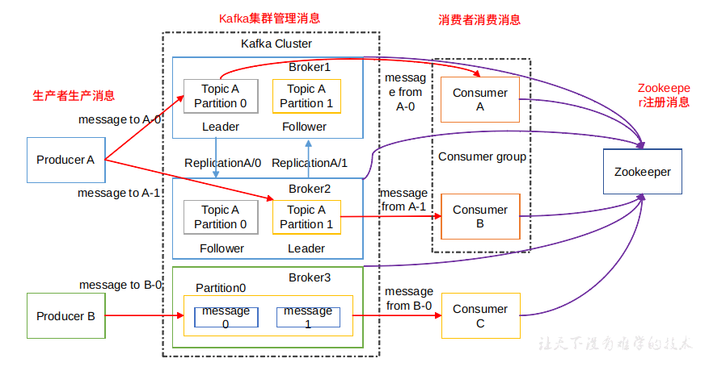
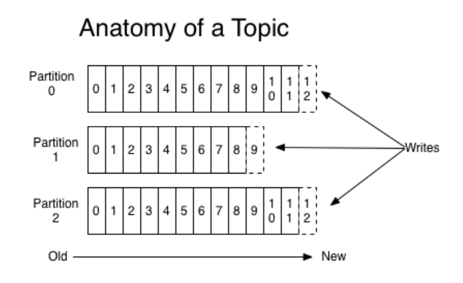
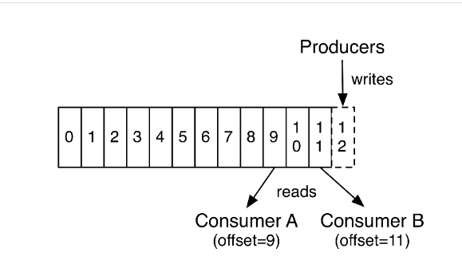
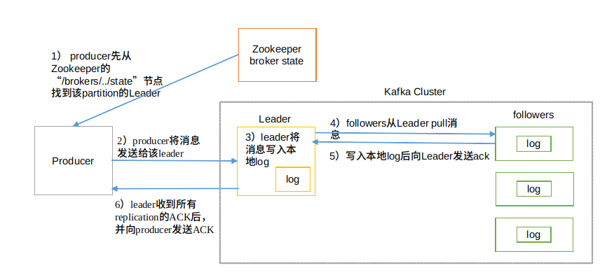
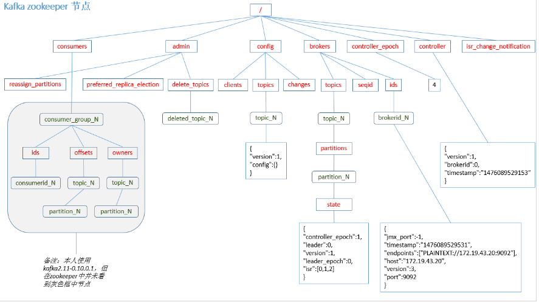
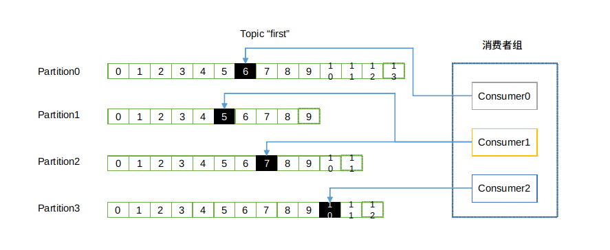

# 工作流程分析



## Kafka生产过程分析

### 写入方式

producer采用推（push）模式将消息发布到broker，每条消息都被追加（append）到分区（patition）中，属于顺序写磁盘（顺序写磁盘效率比随机写内存要高，保障kafka吞吐率）。

### 分区（Partition）

消息发送时都被发送到一个topic，其本质就是一个目录，而topic是由一些Partition Logs(分区日志)组成，其组织结构如下图所示：





我们可以看到，每个Partition中的消息都是有序的，生产的消息被不断追加到Partition log上，其中的每一个消息都被赋予了一个唯一的offset值。

1）分区的原因

（1）方便在集群中扩展，每个Partition可以通过调整以适应它所在的机器，而一个topic又可以有多个Partition组成，因此整个集群就可以适应任意大小的数据了；

（2）可以提高并发，因为可以以Partition为单位读写了。

2）分区的原则

（1）指定了patition，则直接使用；

（2）未指定patition但指定key，通过对key的value进行hash出一个patition；

（3）patition和key都未指定，使用轮询选出一个patition。

```java
DefaultPartitioner类

public int partition(String topic, Object key, byte[] keyBytes, Object value, byte[] valueBytes, Cluster cluster) {

​    List<PartitionInfo> partitions = cluster.partitionsForTopic(topic);

​    int numPartitions = partitions.size();

​    if (keyBytes == null) {

​      int nextValue = nextValue(topic);

​      List<PartitionInfo> availablePartitions = cluster.availablePartitionsForTopic(topic);

​      if (availablePartitions.size() > 0) {

​        int part = Utils.toPositive(nextValue) % availablePartitions.size();

​        return availablePartitions.get(part).partition();

​      } else {

​        // no partitions are available, give a non-available partition

​        return Utils.toPositive(nextValue) % numPartitions;

​      }

​    } else {

​      // hash the keyBytes to choose a partition

​      return Utils.toPositive(Utils.murmur2(keyBytes)) % numPartitions;

​    }

  }
```

### 副本（Replication）

同一个partition可能会有多个replication（对应 server.properties 配置中的 default.replication.factor=N）。没有replication的情况下，一旦broker 宕机，其上所有 patition 的数据都不可被消费，同时producer也不能再将数据存于其上的patition。引入replication之后，同一个partition可能会有多个replication，而这时需要在这些replication之间选出一个leader，producer和consumer只与这个leader交互，其它replication作为follower从leader 中复制数据。

### 写入流程

producer写入消息流程如下：



1）producer先从zookeeper的 "/brokers/.../state"节点找到该partition的leader

2）producer将消息发送给该leader

3）leader将消息写入本地log

4）followers从leader pull消息，写入本地log后向leader发送ACK

5）leader收到所有ISR中的replication的ACK后，增加HW（high watermark，最后commit 的offset）并向producer发送ACK

## Broker 保存消息

### 存储方式

物理上把topic分成一个或多个patition（对应 server.properties 中的num.partitions=3配置），每个patition物理上对应一个文件夹（该文件夹存储该patition的所有消息和索引文件），如下：
```sh
[atguigu@hadoop102 logs]$ ll

drwxrwxr-x. 2 atguigu atguigu  4096 8月  6 14:37 first-0

drwxrwxr-x. 2 atguigu atguigu  4096 8月  6 14:35 first-1

drwxrwxr-x. 2 atguigu atguigu  4096 8月  6 14:37 first-2

[atguigu@hadoop102 logs]$ cd first-0

[atguigu@hadoop102 first-0]$ ll

-rw-rw-r--. 1 atguigu atguigu 10485760 8月  6 14:33 00000000000000000000.index

-rw-rw-r--. 1 atguigu atguigu    219 8月  6 15:07 00000000000000000000.log

-rw-rw-r--. 1 atguigu atguigu 10485756 8月  6 14:33 00000000000000000000.timeindex

-rw-rw-r--. 1 atguigu atguigu     8 8月  6 14:37 leader-epoch-checkpoint

```

### 存储策略

无论消息是否被消费，kafka都会保留所有消息。有两种策略可以删除旧数据：

1）基于时间：log.retention.hours=168

2）基于大小：log.retention.bytes=1073741824

需要注意的是，因为Kafka读取特定消息的时间复杂度为O(1)，即与文件大小无关，所以这里删除过期文件与提高 Kafka 性能无关。

### Zookeeper存储结构



注意：producer不在zk中注册，消费者在zk中注册。

## Kafka消费过程分析

kafka提供了两套consumer API：高级Consumer API和低级Consumer API。

### 高级API

1）高级API优点

高级API 写起来简单

不需要自行去管理offset，系统通过zookeeper自行管理。

不需要管理分区，副本等情况，.系统自动管理。

消费者断线会自动根据上一次记录在zookeeper中的offset去接着获取数据（默认设置1分钟更新一下zookeeper中存的offset）

可以使用group来区分对同一个topic 的不同程序访问分离开来（不同的group记录不同的offset，这样不同程序读取同一个topic才不会因为offset互相影响）

2）高级API缺点

不能自行控制offset（对于某些特殊需求来说）

不能细化控制如分区、副本、zk等

### 低级API

1）低级 API 优点

能够让开发者自己控制offset，想从哪里读取就从哪里读取。

自行控制连接分区，对分区自定义进行负载均衡

对zookeeper的依赖性降低（如：offset不一定非要靠zk存储，自行存储offset即可，比如存在文件或者内存中）

2）低级API缺点

太过复杂，需要自行控制offset，连接哪个分区，找到分区leader 等。

### 消费者组



消费者是以consumer group消费者组的方式工作，由一个或者多个消费者组成一个组，共同消费一个topic。每个分区在同一时间只能由group中的一个消费者读取，但是多个group可以同时消费这个partition。在图中，有一个由三个消费者组成的group，有一个消费者读取主题中的两个分区，另外两个分别读取一个分区。某个消费者读取某个分区，也可以叫做某个消费者是某个分区的拥有者。

在这种情况下，消费者可以通过水平扩展的方式同时读取大量的消息。另外，如果一个消费者失败了，那么其他的group成员会自动负载均衡读取之前失败的消费者读取的分区。

### 消费方式

consumer采用pull（拉）模式从broker中读取数据。

push（推）模式很难适应消费速率不同的消费者，因为消息发送速率是由broker决定的。它的目标是尽可能以最快速度传递消息，但是这样很容易造成consumer来不及处理消息，典型的表现就是拒绝服务以及网络拥塞。而pull模式则可以根据consumer的消费能力以适当的速率消费消息。

对于Kafka而言，pull模式更合适，它可简化broker的设计，consumer可自主控制消费消息的速率，同时consumer可以自己控制消费方式——即可批量消费也可逐条消费，同时还能选择不同的提交方式从而实现不同的传输语义。

pull模式不足之处是，如果kafka没有数据，消费者可能会陷入循环中，一直等待数据到达。为了避免这种情况，我们在我们的拉请求中有参数，允许消费者请求在等待数据到达的“长轮询”中进行阻塞（并且可选地等待到给定的字节数，以确保大的传输大小）。

### 消费者组案例

1）需求：测试同一个消费者组中的消费者，同一时刻只能有一个消费者消费。

2）案例实操

​	（1）在hadoop102、hadoop103上修改/opt/module/kafka/config/consumer.properties配置文件中的group.id属性为任意组名。

```sh
[atguigu@hadoop103 config]$ vi consumer.properties

group.id=atguigu
```

（2）在hadoop102、hadoop103上分别启动消费者

```sh
[atguigu@hadoop102 kafka]$ bin/kafka-console-consumer.sh \

--zookeeper hadoop102:2181 --topic first --consumer.config config/consumer.properties

[atguigu@hadoop103 kafka]$ bin/kafka-console-consumer.sh --zookeeper hadoop102:2181 --topic first --consumer.config config/consumer.properties
```

（3）在hadoop104上启动生产者

```sh
[atguigu@hadoop104 kafka]$ bin/kafka-console-producer.sh \

--broker-list hadoop102:9092 --topic first

\>hello world
```

（4）查看hadoop102和hadoop103的接收者。

​		同一时刻只有一个消费者接收到消息。
