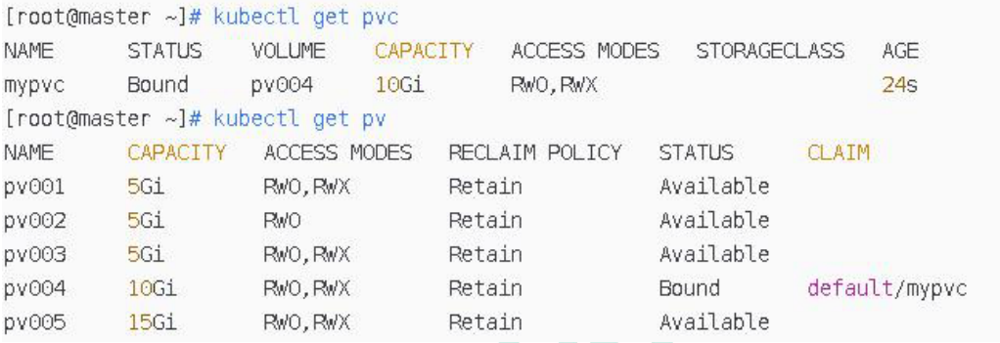

# 核心技术-PVC 和 PV

## 基本概念

管理存储是管理计算的一个明显问题。该 PersistentVolume 子系统为用户和管理员提供了一个 API，用于抽象如何根据消费方式提供存储的详细信息。为此，我们引入了两个新的API 资源：PersistentVolume 和 PersistentVolumeClaim

PersistentVolume（PV）是集群中由管理员配置的一段网络存储。 它是集群中的资源，就像节点是集群资源一样。 PV 是容量插件，如 Volumes，但其生命周期独立于使用 PV 的任何单个 pod。 此 API 对象捕获存储实现的详细信息，包括 NFS，iSCSI 或特定于云提供程序的存储系统。

PersistentVolumeClaim（PVC）是由用户进行存储的请求。 它类似于 pod。 Pod 消耗节点资源，PVC 消耗 PV 资源。Pod 可以请求特定级别的资源（CPU 和内存）。声明可以请求特定的大小和访问模式（例如，可以一次读/写或多次只读）。虽然 PersistentVolumeClaims 允许用户使用抽象存储资源，但是 PersistentVolumes 对于不同的问题，用户通常需要具有不同属性（例如性能）。群集管理员需要能够提供各种PersistentVolumes 不同的方式，而不仅仅是大小和访问模式，而不会让用户了解这些卷的实现方式。对于这些需求，有 StorageClass 资源。

StorageClass 为管理员提供了一种描述他们提供的存储的“类”的方法。 不同的类可能映射到服务质量级别，或备份策略，或者由群集管理员确定的任意策略。 Kubernetes 本身对于什么类别代表是不言而喻的。 这个概念有时在其他存储系统中称为“配置文件”。

PVC 和 PV 是一一对应的。

## 生命周期

PV 是群集中的资源。PVC 是对这些资源的请求，并且还充当对资源的检查。PV 和 PVC 之间的相互作用遵循以下生命周期：

Provisioning ——-> Binding ——–>Using——>Releasing——>Recycling

供应准备 Provisioning---通过集群外的存储系统或者云平台来提供存储持久化支持。

* 静态提供 Static：集群管理员创建多个 PV。 它们携带可供集群用户使用的真实存储的详细信息。 它们存在于 Kubernetes API 中，可用于消费

* 动态提供 Dynamic：当管理员创建的静态 PV 都不匹配用户的 PersistentVolumeClaim时，集群可能会尝试为 PVC 动态配置卷。 此配置基于 StorageClasses：PVC 必须请求一个类，并且管理员必须已创建并配置该类才能进行动态配置。 要求该类的声明有效地为自己禁用动态配置。

绑定 Binding---用户创建 pvc 并指定需要的资源和访问模式。在找到可用 pv 之前，pvc会保持未绑定状态。

使用 Using---用户可在 pod 中像 volume 一样使用 pvc。

释放 Releasing---用户删除 pvc 来回收存储资源，pv 将变成“released”状态。由于还保留着之前的数据，这些数据需要根据不同的策略来处理，否则这些存储资源无法被其他pvc 使用。

回收 Recycling---pv 可以设置三种回收策略：保留（Retain），回收（Recycle）和删除（Delete）。

* 保留策略：允许人工处理保留的数据。

* 删除策略：将删除 pv 和外部关联的存储资源，需要插件支持。

* 回收策略：将执行清除操作，之后可以被新的 pvc 使用，需要插件支持

## PV 类型

GCEPersistentDisk

AWSElasticBlockStore

AzureFile

AzureDisk

FC (Fibre Channel)

Flexvolume

Flocker

NFS

iSCSI

RBD (Ceph Block Device)

CephFS

Cinder (OpenStack block storage)

Glusterfs

VsphereVolume

Quobyte Volumes

HostPath (Single node testing only – local storage is not supported in any

way and WILL NOT WORK in a multi-node cluster)

Portworx Volumes

ScaleIO Volumes

StorageOS

## PV 卷阶段状态

Available – 资源尚未被 claim 使用

Bound – 卷已经被绑定到 claim 了

Released – claim 被删除，卷处于释放状态，但未被集群回收。

Failed – 卷自动回收失败

## 演示：创建 PV

### 第一步：编写 yaml 文件，并创建 pv

创建 5 个 pv，存储大小各不相同，是否可读也不相同

``` yaml

apiVersion: v1

kind: PersistentVolume

metadata:

name: pv001

labels:

name: pv001

spec:

nfs:

path: /data/volumes/v1

server: nfs

accessModes: ["ReadWriteMany", "ReadWriteOnce"]

capacity:

storage: 2Gi

\-\-\-

apiVersion: v1

kind: PersistentVolume

metadata:

name: pv002

labels:

name: pv002

spec:

nfs:

path: /data/volumes/v2

server: nfs

accessModes: ["ReadWriteOnce"]

capacity:

storage: 5Gi

\-\-\-

apiVersion: v1

kind: PersistentVolume

metadata:

name: pv003

labels:

name: pv003

spec:

nfs:

path: /data/volumes/v3

server: nfs

accessModes: ["ReadWriteMany", "ReadWriteOnce"]

capacity:

storage: 20Gi

\-\-\-

apiVersion: v1

kind: PersistentVolume

metadata:

name: pv004

labels:

name: pv004

spec:

nfs:

path: /data/volumes/v4

server: nfs

accessModes: ["ReadWriteMany", "ReadWriteOnce"]

capacity:

storage: 10Gi

\-\-\-

apiVersion: v1

kind: PersistentVolume

metadata:

name: pv005

labels:

name: pv005

spec:

nfs:

path: /data/volumes/v5

server: nfs

accessModes: ["ReadWriteMany", "ReadWriteOnce"]

capacity:

storage: 15Gi

```

### 第二步：执行创建命令

``` bash
kubectl apply -f pv-damo.yaml
```

### 第三步：查询验证

## 演示：创建 PVC，绑定 PV

### 第一步：编写 yaml 文件，并创建 pvc

创建一个 pvc，需要 6G 存储；所以不会匹配 pv001、pv002、pv003

``` yaml
apiVersion: v1

kind: PersistentVolumeClaim

metadata:

name: mypvc

namespace: default

spec:

accessModes: ["ReadWriteMany"]

resources:

requests:

storage: 6Gi

\-\-\-

apiVersion: v1

kind: Pod

metadata:

name: vol-pvc

namespace: default

spec:

volumes:

\- name: html

persistentVolumeClaim:

claimName: mypvc

containers:

\- name: myapp

image: ikubernetes/myapp:v1

volumeMounts:

\- name: html

mountPath: /usr/share/nginx/html/

```

### 第二步：执行命令创建

``` bash
kubectl apply -f vol-pvc-demo.yaml
```

### 第三步：查询验证


## 演示：创建 PVC，绑定 PV

### 第一步：编写 yaml 文件，并创建 pvc

创建一个 pvc，需要 6G 存储；所以不会匹配 pv001、pv002、pv003

``` bash
apiVersion: v1
kind: PersistentVolumeClaim
metadata:
name: mypvc
namespace: default
spec:
accessModes: ["ReadWriteMany"]
resources:
requests:
storage: 6Gi
---
apiVersion: v1
kind: Pod
metadata:
name: vol-pvc
namespace: default
spec:
volumes:

* name: html

persistentVolumeClaim:
claimName: mypvc
containers:

* name: myapp

image: ikubernetes/myapp:v1
volumeMounts:

* name: html

mountPath: /usr/share/nginx/html/
```

### 第二步：执行命令创建

``` 

kubectl apply -f vol-pvc-demo.yaml
```

### 第三步：查询验证



