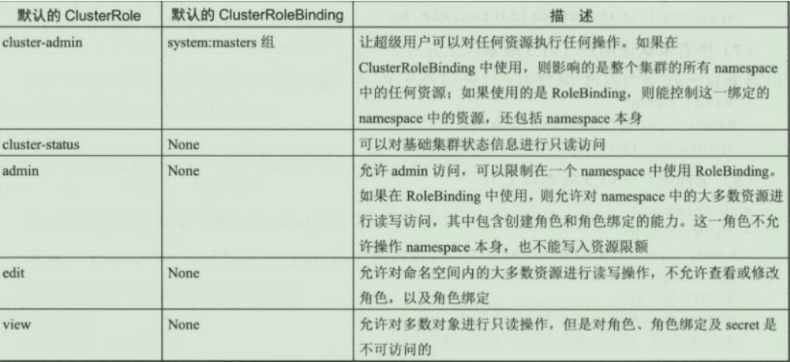

# 核心技术-集群安全机制 RBAC

## 基本概念

RBAC(Role-Based Access Control，基于角色的访问控制)在 k8s v1.5 中引入，在 v1.6 版本时升级为 Beta 版本，并成为 kubeadm 安装方式下的默认选项，相对于其他访问控制方式，新的 RBAC 具有如下优势：

* 对集群中的资源和非资源权限均有完整的覆盖

* 整个 RBAC 完全由几个 API 对象完成，同其他 API 对象一样，可以用 kubectl 或 API进行操作

* 可以在运行时进行调整，无需重启 API Server 要使用 RBAC 授权模式，需要在 API Server 的启动参数中加上--authorization-mode=RBAC

## RBAC 原理和用法

### RBAC 的 API 资源对象说明

RBAC 引入了 4 个新的顶级资源对象：Role、ClusterRole、RoleBinding、ClusterRoleBinding。同其他 API 资源对象一样，用户可以使用 kubectl 或者 API 调用等方式操作这些资源对象。

#### 角色(Role)

一个角色就是一组权限的集合，这里的权限都是许可形式的，不存在拒绝的规则。在一个命名空间中，可以用角色来定义一个角色，如果是集群级别的，就需要使用 ClusterRole了。角色只能对命名空间内的资源进行授权，下面的例子中定义的角色具备读取 Pod 的权限：

``` yaml
kind: Role

apiVersion: rbac.authorization.k8s.io/v1

metadata:

namespace: default

name: pod-reader

rules:

 - apiGroups: [""] # 空字符串表示核心 API 群

resource: ["pods"]

verbs: ["get", "watch", "list"]
```

rules 中的参数说明：

* apiGroup：支持的 API 组列表，例如：APIVersion: batch/v1、APIVersion:extensions:v1、apiVersion:apps/v1 等

* resources：支持的资源对象列表，例如：pods、deployments、jobs 等

* verbs：对资源对象的操作方法列表，例如：get、watch、list、delete、replace 等

#### 集群角色(ClusterRole)

集群角色除了具有和角色一致的命名空间内资源的管理能力，因其集群级别的范围，还可以用于以下特殊元素的授权。

* 集群范围的资源，例如 Node

* 非资源型的路径，例如/healthz

* 包含全部命名空间的资源，例如 pods

下面的集群角色可以让用户有权访问任意一个或所有命名空间的 secrets：

``` yaml
kind: ClusterRole

apiVersion: rbac.authorization.k8s.io/v1

metadata:

\# name: secret-reader

\# ClusterRole 不受限于命名空间，所以省略了 namespace name 的定义

rules:

 - apiGroups: [""]

resources: ["secrets"]

verbs: ["get", "watch", "list"]
```

#### 角色绑定(RoleBinding)和集群角色绑定(ClusterRoleBinding)

角色绑定或集群角色绑定用来把一个角色绑定到一个目标上，绑定目标可以是 User、Group 或者 Service Account。使用 RoleBinding 为某个命名空间授权，ClusterRoleBinding 为集群范围内授权。

RoleBinding 可以引用 Role 进行授权，下例中的 RoleBinding 将在 default 命名空间中把pod-reader 角色授予用户 jane，可以让 jane 用户读取 default 命名空间的 Pod：

``` yaml
kind: RoleBinding

apiVersion: rbac.authorization.k8s.io/v1

metadata:

name: read-pods

namespace: default

subjects:

 - kind: User

name: jane

apiGroup: rbac.authorization.k8s.io

roleRef:

kind: Role

name: pod-reader

apiGroup: rbac.authorization.k8s.io

```

RoleBinding 也可以引用 ClusterRole，对属于同一命名空间内 ClusterRole 定义的资源主体进行授权。一种常见的做法是集群管理员为集群范围预先定义好一组角色(ClusterRole)，然后在多个命名空间中重复使用这些 ClusterRole。

使用 RoleBinding 绑定集群角色 secret-reader，使 dave 只能读取 development 命名空间中的 secret：

``` yaml
kind: RoleBinding

apiVersion: rbac.authorization.k8s.io/v1

metadata:

name: read-secrets

namespace: development

subjects:

 - kind: User

name: dave

apiGroup: rbac.authorization.k8s.io

roleRef:

kind: ClusterRole

name: secret-reader

apiGroup: rbac.authorization.k8s.io
```

集群角色绑定中的角色只能是集群角色，用于进行集群级别或者对所有命名空间都生效授权。允许 manager 组的用户读取任意 namespace 中的 secret

``` yaml
kind: ClusterRoleBinding

apiVersion: rbac.authorization.k8s.io/v1

metadata:

name: read-secrets-global

subjects:

 - kind: Group

name: manager

apiGroup: rbac.authorization.k8s.io

roleRef:

kind: ClusterRole

name: secret-reader

apiGroup: rbac.authorization.k8s.io

```

### 对资源的引用方式

多数资源可以用其名称的字符串来表达，也就是 Endpoint 中的 URL 相对路径，例如 pods。然后，某些 Kubernetes API 包含下级资源，例如 Pod 的日志(logs)。Pod 日志的 Endpoint是 GET /api/v1/namespaces/{namespaces}/pods/{name}/log。Pod 是一个命名空间内的资源，log 就是一个下级资源。要在一个 RBAC 角色中体现，则需要用斜线/来分割资源和下级资源。若想授权让某个主体同时能够读取 Pod 和 Pod log，则可以配置 resources 为一个数组：

``` yaml
kind: Role

apiVersion: rbac.authorization.k8s.io/v1

metadata:

namespace: default

name: pod-and-pod-logs-reader

rules:

 - apiGroups: [""]

resources: ["pods", "pods/log"]

verbs: ["get", "list"]
```

资源还可以通过名字(ResourceName)进行引用。在指定 ResourceName 后，使用 get、delete、update、patch 动词的请求，就会被限制在这个资源实例范围内。例如下面的声明让一个主体只能对一个叫 my-configmap 的 configmap 进行 get 和 update 操作：

``` yaml
kind: Role

apiVersion: rbac.authorization.k8s.io/v1

metadata:

namespace: default

name: configmap-updater

rules:

 - apiGroups: [""]

resources: ["configmap"]

resourceNames: ["my-configmap"]

verbs: ["update", "get"]
```

### 常见的角色(Role)示例

* 允许读取核心 API 组中 Pod 的资源：

``` yaml
rules:

* apiGroups: [""]

resources: ["pods"]

verbs: ["get", "list", "watch"]

```

* 允许读写"extensions"和"apps"两个 API 组中的 deployment 资源

``` yaml
rules:

 - apiGroups: ["extensions", "apps"]

resources: ["deployments"]

verbs: ["get", "list", "watch", "create", "update", "patch", "delete"]

```

* 允许读写 pods 及读写 jobs

``` yaml
rules:

 - apiGroups: [""]

resources: ["pods"]

verbs: ["get", "list", "watch"]

 - apiGroups: ["batch", "extensions"]

resources: ["jobs"]

verbs: ["get", "list", "watch", "create", "update", "patch", "delete"]

```

* 允许读取一个名为 my-config 的 ConfigMap(必须绑定到一个 RoleBinding 来限制到一个 namespace 下的 ConfigMap)：

``` yaml
rules:

 - apiGroups: [""]

resources: ["configmaps"]

resourceNames: ["my-config"]

verbs: ["get"]

```

* 读取核心组的 node 资源(Node 属于集群级别的资源，必须放在 ClusterRole 中，并使用 ClusterRoleBinding 进行绑定)：

``` yaml
rules:

 - apiGroups: [""]

resources: ["nodes"]

verbs: ["get", "list", "watch"]

```

* 允许对非资源端点/healthz 及其所有子路径进行 GET/POST 操作(必须使用ClusterRole 和 ClusterRoleBinding)：

``` yaml
rules:

 - nonResourceURLs: ["/healthz", "/healthz/*"]

verbs: ["get", "post"]
```

### 常用的角色绑定

``` yaml
 - 用户名 Alice@example.com

subjects:

 - kind: User

name: "Alice@example.com"

apiGroup: rbac.authorization.k8s.io

 - 组名 frontend-admins

subjects:

 - kind: Group

name: "frontend-admins"

apiGroup: rbac.authorization.k8s.io

 - kube-system 命名空间中的默认 Service Account

subjects:

 - kind: ServiceAccount

name: default

namespace: kube-system

 - qa 命名空间中的所有 Service Account

subjects:

 - kind: Group

name: system:serviceaccounts:qa

apiGroup: rbac.authorization.k8s.io

 - 所有 Service Account

subjects:

 - kind: Group

name: system:serviceaccounts

apiGroup: rbac.authorization.k8s.io

 - 所有认证用户

subjects:

 - kind: Group

name: system:authentication

apiGroup: rbac.authorization.k8s.io

 - 所有未认证用户

subjects:

 - kind: Group

name: system:unauthentication

apiGroup: rbac.authorization.k8s.io

 - 全部用户

subjects:

 - kind: Group

name: system:authentication

apiGroup: rbac.authorization.k8s.io

 - kind: Group

name: system:unauthentication

apiGroup: rbac.authorization.k8s.io

```

### 默认的角色和角色绑定

API Server 会创建一套默认的 ClusterRole 和 ClusterRoleBinding 对象，其中很多是以 system: 为前缀的，以表明这些资源属于基础架构，对这些对象的改动可能造成集群故障。

所有默认的 ClusterRole 和RoleBinding 都会用标签 kubernetes.io/bootstrapping=rbac-defaults 进行标记。

#### 常见的系统角色如下：


有些默认角色不是以 system: 为前缀的，这部分角色是针对用户的，其中包含超级用户角色 cluster-admin，有的用于集群一级的角色 cluster-status，还有针对 namespace 的角色 admin、edit、view

#### 常见的用户角色如下：



核心 Master 组件角色


### 授权注意事项：预防提权和授权初始化

RBAC API 拒绝用户利用编辑角色或者角色绑定的方式进行提权。这一限制是在 API 层面做出的，因此即使 RBAC 没有启用也仍然有效。

用户只能在拥有一个角色的所有权限，且与该角色的生效范围一致的前提下，才能对角色进行创建和更新。例如用户 user-1 没有列出集群中所有 secret 的权限，就不能创建具有这一权限的集群角色。要让一个用户能够创建或更新角色，需要以下权限：

* 为其授予一个允许创建/更新 Role 或 ClusterRole 资源对象的角色；为用户授予角色，要覆盖该用户所能控制的所有权限范围。用户如果尝试创建超出其自身权限的角色或者集群角色，则该 API 调用会被禁止。如果一个用户的权限包含了一个角色的所有权限，那么就可以为其创建和更新角色绑定；或者如果被授予了针对某个角色的绑定授权，则也有权完成此操作。例如：user1 没有列出集群内所有 secret 的权限，就无法为一个具有这样权限的角色创建集群角色绑定。要使用户能够创建、更新这一角色绑定，则需要有如下做法：

 *      为其授予一个允许创建和更新角色绑定或者集群角色绑定的角色为其授予绑定某一角色的权限，有隐式或显式两种方法

 *              隐式：让其具有所有该角色的权限

 *              显式：让用户授予针对该角色或集群角色绑定操作的权限

让 user-1 有对 user-1-namespace 命名空间中的其他用户授予 admin、edit 及 view 角色

``` yaml
apiVersion: rbac.authorization.k8s.io/v1

kind: ClusterRole

metadata:

name: role-grantor

rules:

 - apiGroups: ["rbac.authorization.k8s.io"]

resources: ["rolebindings"]

verbs: ["create"]

 - apiGroups: ["rbac.authorization.k8s.io"]

resources: ["clusterroles"]

verbs: ["bind"]

resourceNames: ["admin", "edit", "view"]

 - - -

apiVersion: rbac.authorization.k8s.io/v1

kind: RoleBinding

metadata:

name: role-grantor-binding

namespace: user-1-namespace

roleRef:

apiGroup: rbac.authorization.k8s.io

kind: ClusterRole

name: role-grantor

subjects:

 - apiGroup: rbac.authorization.k8s.io

kind: User

name: user-1
```

在进行第一个角色和角色绑定时，必须让初始用户具备其尚未被授予的权限，要进行初始的角色和角色绑定设置，有以下两种方法：

 * 使用属于 system:masters 组的身份，这一群组默认具有 cluster-admin 这一超级角色的绑定。

如果 API Server 以--insecure-port 参数运行，则客户端通过这个非安全端口进行接口调用，这一端口没有认证鉴权的限制。 
