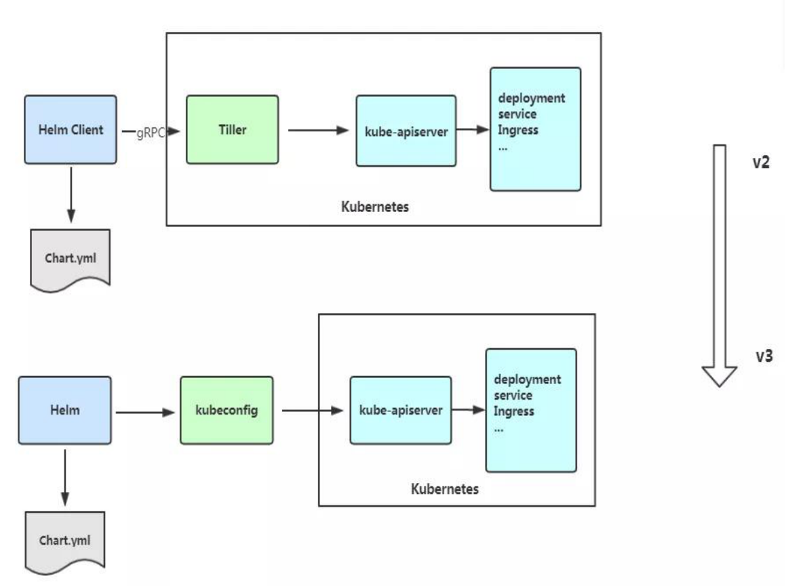
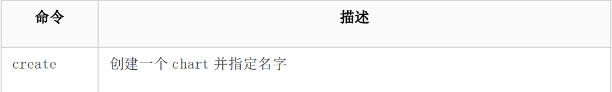
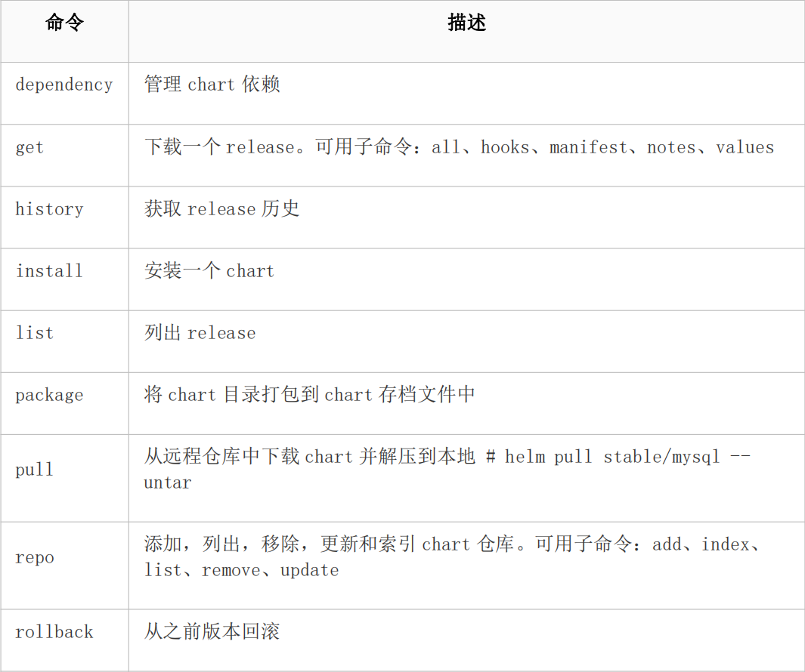
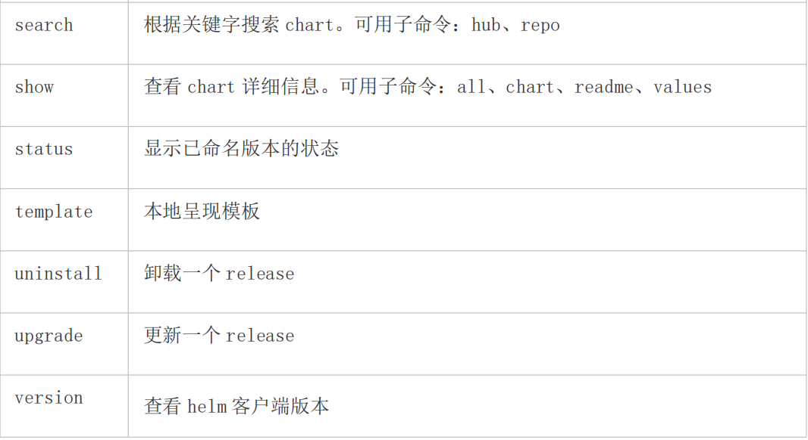

# 核心技术-Helm

## Helm 引入

K8S 上的应用对象，都是由特定的资源描述组成，包括 deployment、service 等。都保存各自文件中或者集中写到一个配置文件。然后 kubectl apply –f 部署。如果应用只由一个或几个这样的服务组成，上面部署方式足够了。而对于一个复杂的应用，会有很多类似上面的资源描述文件，例如微服务架构应用，组成应用的服务可能多达十个，几十个。如果有更新或回滚应用的需求，可能要修改和维护所涉及的大量资源文件，而这种组织和管理应用的方式就显得力不从心了。且由于缺少对发布过的应用版本管理和控制，使Kubernetes 上的应用维护和更新等面临诸多的挑战，主要面临以下问题：

* 如何将这些服务作为一个整体管理
* 这些资源文件如何高效复用 
* 不支持应用级别的版本管理

## Helm 介绍

Helm 是一个 Kubernetes 的包管理工具，就像 Linux 下的包管理器，如 yum/apt 等，可以很方便的将之前打包好的 yaml 文件部署到 kubernetes 上。

Helm 有 3 个重要概念：

* helm：一个命令行客户端工具，主要用于 Kubernetes 应用 chart 的创建、打包、发布和管理。

* Chart：应用描述，一系列用于描述 k8s 资源相关文件的集合。

* Release：基于 Chart 的部署实体，一个 chart 被 Helm 运行后将会生成对应的一个

## Helm v3 变化

2019 年 11 月 13 日， Helm 团队发布 Helm v3 的第一个稳定版本。

该版本主要变化如下：

架构变化：

* 最明显的变化是 Tiller 的删除

* Release 名称可以在不同命名空间重用



* 支持将 Chart 推送至 Docker 镜像仓库中

* 使用 JSONSchema 验证 chart values

* 其他

## Helm 客户端

### 部署 helm 客户端

Helm 客户端下载地址：https://github.com/helm/helm/releases

解压移动到/usr/bin/目录即可。

``` bash
wget https://get.helm.sh/helm-vv3.2.1-linux-amd64.tar.gz

tar zxvf helm-v3.2.1-linux-amd64.tar.gz

mv linux-amd64/helm /usr/bin/
```

helm 常用命令





### 配置国内 chart 仓库

* 微软仓库（http://mirror.azure.cn/kubernetes/charts/）这个仓库推荐，基本上官网有的 chart 这里都有。

* 阿里云仓库（https://kubernetes.oss-cn-hangzhou.aliyuncs.com/charts ）

* 官方仓库（https://hub.kubeapps.com/charts/incubator）官方 chart 仓库，国内有点不好使。

添加存储库

``` bash
helm repo add stable http://mirror.azure.cn/kubernetes/charts

helm repo add aliyun https://kubernetes.oss-cn-hangzhou.aliyuncs.com/charts

helm repo update
```

查看配置的存储库

``` bash
helm repo list

helm search repo stable
```

删除存储库：

``` bash
helm repo remove aliyun
```

## helm 基本使用

主要介绍三个命令：

* chart install

* chart upgrade

* chart rollback

### 使用 chart 部署一个应用

``` bash
#查找 chart

# helm search repo weave

NAME CHART VERSION APP VERSION DESCRIPTION

aliyun/weave-cloud 0.1.2 Weave Cloud is a add-on

to Kubernetes which pro...

aliyun/weave-scope 0.9.21.6.5 A Helm chart for the Weave Scope

cluster visual...

stable/weave-cloud 0.3.71.4.0 Weave Cloud is a add-on to Kubernetes

which pro...

stable/weave-scope 1.1.101.12.0 A Helm chart for the Weave Scope

cluster visual...

#查看 chrt 信息

# helm show chart stable/mysql

#安装包

# helm install ui stable/weave-scope

#查看发布状态

# helm list

NAME NAMESPACE REVISION UPDATED

STATUS CHART APP VERSION

ui default 12020-05-2817:45:01.696109626 +0800 CST deployed

weave-scope-1.1.101.12.0

[root@k8s-master ~]# helm status ui

NAME: ui

LAST DEPLOYED: Thu May 2817:45:012020

NAMESPACE: default

STATUS: deployed

REVISION: 1

NOTES:

You should now be able to access the Scope frontend in your web browser, by

using kubectl port-forward:

kubectl -n default port-forward $(kubectl -n default get endpoints \

ui-weave-scope -o jsonpath='{.subsets[0].addresses[0].targetRef.name}')

8080:4040

then browsing to http://localhost:8080/.

For more details on using Weave Scope, see the Weave Scope documentation:

https://www.weave.works/docs/scope/latest/introducing/

#修改 service Type: NodePort 即可访问 ui

```

### 安装前自定义 chart 配置选项

自定义选项是因为并不是所有的 chart 都能按照默认配置运行成功，可能会需要一些环境依赖，例如 PV。

所以我们需要自定义 chart 配置选项，安装过程中有两种方法可以传递配置数据：

* --values（或-f）：指定带有覆盖的 YAML 文件。这可以多次指定，最右边的文件优先

* --set：在命令行上指定替代。如果两者都用，--set 优先级高

* --values 使用，先将修改的变量写到一个文件中

# helm show values stable/mysql

``` yaml 

# catconfig.yaml

persistence:

enabled: true

storageClass: "managed-nfs-storage"

accessMode: ReadWriteOnce

size: 8Gi

mysqlUser: "k8s"

mysqlPassword: "123456"

mysqlDatabase: "k8s"

# helm install db -f config.yaml stable/mysql

# kubectl get pods

NAME READY STATUS RESTARTS AGE

db-mysql-57485b68dc-4xjhv 1/1 Running 0 8m51s

# kubectl run -it db-client --rm --restart=Never --image=mysql:5.7 -- bash

If you don't see a command prompt, try pressing enter.

root@db-client:/# mysql -hdb-mysql -uk8s -p123456

mysql: [Warning] Using a password on the command line interface can be insecure.

Welcome to the MySQL monitor. Commands end with ; or \\g.

Your MySQL connection id is 36

Server version: 5.7.30 MySQL Community Server (GPL)

Copyright (c) 2000, 2020, Oracle and/or its affiliates. All rights reserved.

Oracle is a registered trademark of Oracle Corporation and/or its

affiliates. Other names may be trademarks of their respective

owners.

Type 'help; ' or '\\h'for help. Type '\\c' to clear the current input statement.

mysql> show databases; 

+--------------------+

| Database |

+--------------------+

| information_schema |

| k8s |

+--------------------+

``` 

以上将创建具有名称的默认 MySQL 用户 k8s，并授予此用户访问新创建的 k8s 数据库的权限，但将接受该图表的所有其余默认值。

命令行替代变量：

``` bash
helm install db --set persistence.storageClass="managed-nfs-storage"
stable/mysql
```

也可以把 chart 包下载下来查看详情：

``` bash
helm pull stable/mysql --untar
```

values yaml 与 set 使用：

该 helm install 命令可以从多个来源安装：

* chart 存储库

* 本地 chart 存档（helm install foo-0.1.1.tgz）

* chart 目录（helm install path/to/foo）

* 完整的 URL（helm install https://example.com/charts/foo-1.2.3.tgz）

## 构建一个 Helm Chart

``` bash
# helm create mychart

Creating mychart

# tree mychart/

mychart/

├── charts

├── Chart.yaml

├── templates

│ ├── deployment.yaml

│ ├── _helpers.tpl

│ ├── ingress.yaml

│ ├── NOTES.txt

│ └── service.yaml

└── values.yaml
```

* Chart.yaml：用于描述这个 Chart 的基本信息，包括名字、描述信息以及版本等。

* values.yaml ：用于存储 templates 目录中模板文件中用到变量的值。

* Templates： 目录里面存放所有 yaml 模板文件。

* charts：目录里存放这个 chart 依赖的所有子 chart。

* NOTES.txt ：用于介绍 Chart 帮助信息， helm install 部署后展示给用户。例如：

如何使用这个 Chart、列出缺省的设置等。

* _helpers.tpl：放置模板助手的地方，可以在整个 chart 中重复使用

创建 Chart 后，接下来就是将其部署：

helm install web mychart/

也可以打包推送的 charts 仓库共享别人使用。

``` bash
# helm package mychart/

mychart-0.1.0.tgz
```

### chart 模板

Helm 最核心的就是模板，即模板化的 K8S manifests 文件。它本质上就是一个 Go 的 template 模板。Helm 在 Go template 模板的基础上，还会增加很多东西。如一些自定义的元数据信息、扩展的库以及一些类似于编程形式的工作流，例如 条件语句、管道等等。这些东西都会使得我们的模板变得更加丰富。有了模板，我们怎么把我们的配置融入进去呢？用的就是这个 values 文件。这两部分内容其实就是 chart 的核心功能。接下来，部署 nginx 应用，熟悉模板使用

``` bash
helm create nginx

vim nginx/Chart.yaml
```

``` yaml
apiVersion: v2

name: nginx

description: A Helm chart for Kubernetes

type: application

version: 0.1.0

appVersion: 1.15

# vim nginx/values.yaml

replicas: 3

image: nginx

tag: 1.15

serviceport: 80

targetport: 80

label: nginx

# vim nginx/templates/NOTES.txt

hello

# vim nginx/templates/deployment.yaml

apiVersion: apps/v1

kind: Deployment

metadata:

labels:

app:  . Values.label 

name:  . Release. Name 

spec:

replicas:  . Values.replicas 

selector:

matchLabels:

app:  . Values.label 

template:

metadata:

labels:

app:  . Values.label 

spec:

containers:

 - image:  . Values.image : . Values.tag 

name: web

# vim nginx/templates/service.yaml

apiVersion: v1

kind: Service

metadata:

labels:

app:  . Values.label 

name:  . Release. Name 

spec:

ports:

 - port:  . Values.serviceport 

protocol: TCP

targetPort:  . Values.targetport 

selector:

app:  . Values.label 

type: NodePort

#查看实际的模板被渲染过后的资源文件

# helm get manifest web

# helm install web nginx/

NAME: web

LAST DEPLOYED: Fri May 2916:09:462020

NAMESPACE: default

STATUS: deployed

REVISION: 1

TEST SUITE: None

NOTES:

hello

```

# helm list

NAME NAMESPACE REVISION UPDATED

STATUS CHART APP VERSION

web default 12020-05-2916:09:46.608457282 +0800 CST deployed

nginx-0.1.01.15

# kubectl get pod

NAME READY STATUS RESTARTS AGE

web-5675686b8-7wtqk 1/1 Running 0 25s

web-5675686b8-f72hk 1/1 Running 0 25s

web-5675686b8-k4kqr 1/1 Running 0 25s

这个 deployment 就是一个 Go template 的模板，这里定义的 Release 模板对象属于 Helm

内置的一种对象，是从 values 文件中读取出来的。这样一来，我们可以将需要变化的地方

都定义变量。

### 调试

Helm 也提供了--dry-run --debug 调试参数，帮助你验证模板正确性。在执行 helm install 时候带上这两个参数就可以把对应的 values 值和渲染的资源清单打印出来，而不会真正的去部署一个 release。

比如我们来调试上面创建的 chart 包：

``` bash
helm install web --dry-run nginx/
```

### 内置对象

刚刚我们使用 . Release. Name将 release 的名称插入到模板中。这里的 Release 就

是 Helm 的内置对象，下面是一些常用的内置对象：

Release. Name release 名称

Release. Name release 名字

Release. Namespace release 命名空间

Release. Service release 服务的名称

Release. Revision release 修订版本号，从 1 开始累加

### Values

Values 对象是为 Chart 模板提供值，这个对象的值有 4 个来源：

* chart 包中的 values.yaml 文件

* 父 chart 包的 values.yaml 文件

* 通过 helm install 或者 helm upgrade 的 -f 或者 --values 参数传入的自定义的 yaml 文件

* 通过 --set 参数传入的值

chart 的 values.yaml 提供的值可以被用户提供的 values 文件覆盖，而该文件同样可以被 --set 提供的参数所覆盖。

``` bash
helm upgrade web --set replicas=5 nginx/
```

Release "web" has been upgraded. Happy Helming!

NAME: web

LAST DEPLOYED: Fri May 2916:34:172020

NAMESPACE: default

STATUS: deployed

REVISION: 2

TEST SUITE: None

NOTES:

hello

``` bash
helm history web
```

REVISION UPDATED STATUS CHART APP

VERSION DESCRIPTION

1 Fri May 2916:33:562020 superseded nginx-0.1.01.15

Install complete

2 Fri May 2916:34:172020 deployed nginx-0.1.01.15

Upgrade complete

``` bash
kubectl get pod
```

NAME READY STATUS RESTARTS AGE

web-5675686b8-7n7bg 1/1 Running 0 54s

web-5675686b8-9vf28 1/1 Running 0 33s

web-5675686b8-9wkgz 1/1 Running 0 54s

web-5675686b8-jdrhr 1/1 Running 0 54s

web-5675686b8-rrrxc 1/1 Running 0 33s

### 升级、回滚和删除

发布新版本的 chart 时，或者当您要更改发布的配置时，可以使用该 helm upgrade 命令。

``` bash
helm upgrade --set imageTag=1.17 web nginx
helm upgrade -f values.yaml web nginx
```

如果在发布后没有达到预期的效果，则可以使用 helm rollback 回滚到之前的版本。

例如将应用回滚到第一个版本：

``` bash
# helm rollback web 1
```

卸载发行版，请使用以下 helm uninstall 命令：

``` bash
# helm uninstall web
```

查看历史版本配置信息

``` bash
# helm get all --revision 1 web
```

### 管道与函数

前面讲的模块，其实就是将值传给模板引擎进行渲染，模板引擎还支持对拿到数据进行二次处理。

例如从. Values 中读取的值变成字符串，可以使用 quote 函数实现：

``` bash
vi templates/deployment.yaml
```

app:  quote . Values.label.app 

``` bash
helm install --dry-run web ../mychart/
```

project: ms

app: "nginx"

quote . Values.label.app 将后面的值作为参数传递给 quote 函数。

模板函数调用语法为：functionName arg1 arg2...

另外还会经常使用一个 default 函数，该函数允许在模板中指定默认值，以防止该值被忽

略掉。

例如忘记定义，执行 helm install 会因为缺少字段无法创建资源，这时就可以定义一个

默认值。

``` bash
# catvalues.yaml

replicas: 2

# cat templates/deployment.yaml

apiVersion: apps/v1

kind: Deployment

metadata:

name:  . Release. Name -deployment

 - name:  . Values.name | default "nginx" 

```

其他函数：

* 缩进： . Values.resources | indent 12 

* 大写： upper . Values.resources 

* 首字母大写： title . Values.resources 

## 流程控制

流程控制是为模板提供了一种能力，满足更复杂的数据逻辑处理。

Helm 模板语言提供以下流程控制语句：

* if/else 条件块

* with 指定范围

* range 循环块

### if

if/else 块是用于在模板中有条件地包含文本块的方法，条件块的基本结构如下：

``` bash
 if PIPELINE 

# Do something

 elseif OTHER PIPELINE 

# Do something else

 else 

# Default case

 end 

示例

# catvalues.yaml

devops: k8

# cat templates/deployment.yaml

...

template:

metadata:

labels:

app: nginx

 if eq . Values.devops "k8s" 

devops: 123

 else 

devops: 456

 end 

在上面条件语句使用了 eq 运算符判断是否相等，除此之外，还支持

ne、 lt、 gt、 and、 or 等运算符。

注意数据类型。

通过模板引擎来渲染一下，会得到如下结果：

# helm install --dry-run web ../mychart/

...

labels:

app: nginx

devops: 456

可以看到渲染出来会有多余的空行，这是因为当模板引擎运行时，会将控制指令删除，所

有之前占的位置也就空白了，需要使用 - if ... 的方式消除此空行：

# cat templates/deploymemt.yaml

...

env:

 - ifeq . Values.env.hello "world" 

 - name: hello

value: 123

 - end 

现在是不是没有多余的空格了，如果使用-需谨慎，比如上面模板文件中：

# cat templates/deploymemt.yaml

...

env:

 - ifeq . Values.env.hello "world" -

 - hello: true

 - end 

这会渲染成：

env:- hello: true

因为-它删除了双方的换行符。

条件判断就是判断条件是否为真，如果值为以下几种情况则为 false：

 一个布尔类型的 false

 一个数字 零

 一个 空的字符串

 一个空的集合（ map、 slice、 tuple、 dict、 array）

除了上面的这些情况外，其他所有条件都为 真。

例如，判断一个空的数组

# catvalues.yaml

resources: {}

# limits:

# cpu: 100m

# memory: 128Mi

# requests:

# cpu: 100m

# memory: 128Mi

# cat templates/deploymemt.yaml

...

spec:

containers:

 - image: nginx:1.16

name: nginx

 - if . Values.resources 

resources:

 toYaml . Values.resources | indent 10 

 - end 

例如，判断一个布尔值

# catvalues.yaml

service:

type: ClusterIP

port: 80

ingress:

enabled: true

host: example.ctnrs.com

# cat templates/ingress.yaml

 - if . Values.ingress.enabled -

apiVersion: networking.k8s.io/v1beta1

kind: Ingress

metadata:

name:  . Release. Name -ingress

spec:

rules:

 - host:  . Values.ingress.host 

http:

paths:

 - path: /

backend:

serviceName:  . Release. Name 

servicePort:  . Values.service.port 

 end 

7.2、range

在 Helm 模板语言中，使用 range 关键字来进行循环操作。

我们在 values.yaml 文件中添加上一个变量列表：

# catvalues.yaml

test:

 - 1

 - 2

 - 3

循环打印该列表：

apiVersion: v1

kind: ConfigMap

metadata:

name:  . Release. Name 

data:

test: |

 - range . Values.test 

 . 

 - end 

循环内部我们使用的是一个 .，这是因为当前的作用域就在当前循环内，这个 . 引用的

当前读取的元素。
```

### with

``` bash
with ：控制变量作用域。

还记得之前我们的 . Release.xxx或者 . Values.xxx吗？其中的 . 就是表示对

当前范围的引用， . Values 就是告诉模板在当前范围中查找 Values 对象的值。

而 with 语句就可以来控制变量的作用域范围，其语法和一个简单的 if 语句比较类似：

 with PIPELINE 

# restricted scope

 end 

with 语句可以允许将当前范围 . 设置为特定的对象，比如我们前面一直使用

的 . Values.label，我们可以使用 with 来将 . 范围指向 . Values.label：

# catvalues.yaml

...

nodeSelector:

team: a

gpu: yes

# cat templates/deployment.yaml

apiVersion: apps/v1

kind: Deployment

metadata:

name:  . Release. Name -deployment

spec:

replicas: 1

selector:

matchLabels:

app: nginx

template:

metadata:

labels:

app: nginx

spec:

 - with . Values.nodeSelector 

nodeSelector:

team:  .team 

gpu:  .gpu 

 - end 

containers:

 - image: nginx:1.16

name: nginx

优化后：

 - with . Values.nodeSelector 

nodeSelector:

 - toYaml . | nindent 8 

 - end 

上面增加了一个 - with . Values.nodeSelector xxx - end 的一个块，这样的话

就可以在当前的块里面直接引用 .team 和 .gpu 了。

with 是一个循环构造。使用. Values.nodeSelector 中的值：将其转换为 Yaml。

toYaml 之后的点是循环中. Values.nodeSelector 的当前值
```

### 变量

变量，在模板中，使用变量的场合不多，但我们将看到如何使用它来简化代码，并更好地

利用 with 和 range。

问题 1：获取数组键值

``` bash
# cat ../values.yaml

env:

NAME: "gateway"

JAVA_OPTS: "-Xmx1G"

# catdeployment.yaml

...

env:

 - range $k, $v := . Values.env 

 - name:  $k 

value:  $v | quote 

 - end 

结果如下

env:

 - name: JAVA_OPTS

value: "-Xmx1G"

 - name: NAME

value: "gateway" 上面在 range 循环中使用 $key 和 $value 两个变量来接收后面列表循环的键和值。

问题 2：with 中不能使用内置对象

with 语句块内不能再 . Release. Name 对象，否则报错。

我们可以将该对象赋值给一个变量可以来解决这个问题：

apiVersion: apps/v1

kind: Deployment

metadata:

name:  . Release. Name -deployment

spec:

replicas:  . Values.replicas 

template:

metadata:

labels:

project:  . Values.label.project 

app:  quote . Values.label.app 

 - with . Values.label 

project:  .project 

app:  .app 

release:  . Release. Name 

 - end 

上面会出错

 - $releaseName := . Release. Name -

 - with . Values.label 

project:  .project 

app:  .app 

release:  $releaseName 

# 或者可以使用$符号, 引入全局命名空间

release:  $. Release. Name 

 - end 

可以看到在 with 语句上面增加了一句 -$releaseName:=. Release. Name-，其

中 $releaseName 就是后面的对象的一个引用变量，它的形式就是 $name，赋值操作使

用 :=，这样 with 语句块内部的 $releaseName 变量仍然指向的是 . Release. Name
```

### 命名模板

需要复用代码的地方用。

命名模板：使用 define 定义，template 引入，在 templates 目录中默认下划线开头的文

件为公共模板(helpers.tpl)

``` bash
# cat _helpers.tpl

 - define "demo.fullname" -

 - . Chart. Name -- . Release. Name 

 - end -

# catdeployment.yaml

apiVersion: apps/v1

kind: Deployment

metadata:

name:  template"demo.fullname" . 

...

template 指令是将一个模板包含在另一个模板中的方法。但是，template 函数不能用于Go 模板管道。为了解决该问题，增加 include 功能。

# cat _helpers.tpl

 - define "demo.labels" -

app:  template"demo.fullname" . 

chart: " . Chart. Name - . Chart. Version "

release: " . Release. Name "

 - end -

# catdeployment.yaml

apiVersion: apps/v1

kind: Deployment

metadata:

name:  include"demo.fullname" . 

labels:

 - include "demo.labels" . | nindent 4 

... 上面包含一个名为 demo.labels 的模板，然后将值 . 传递给模板，最后将该模板的输出传递给 nindent 函数。

```

## 开发自己的 chart

* 先创建模板

* 修改 Chart.yaml，Values.yaml，添加常用的变量

* 在 templates 目录下创建部署镜像所需要的 yaml 文件，并变量引用 yaml 里经常变动的字段
