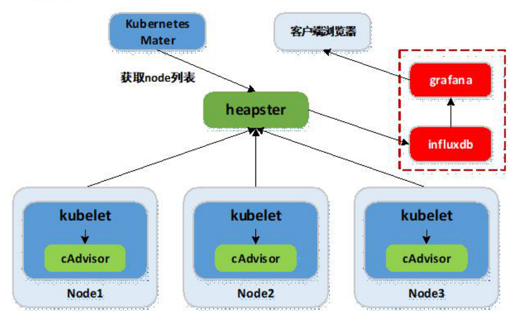
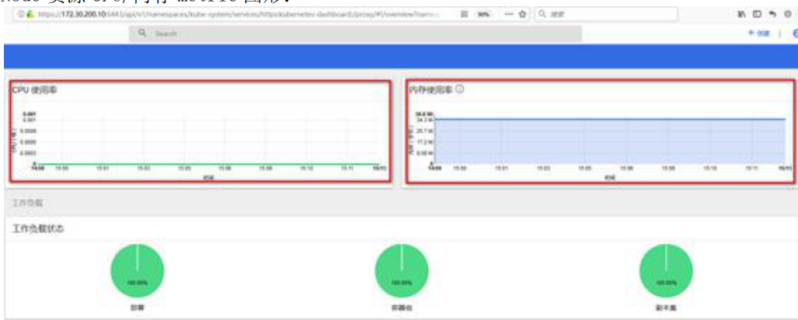
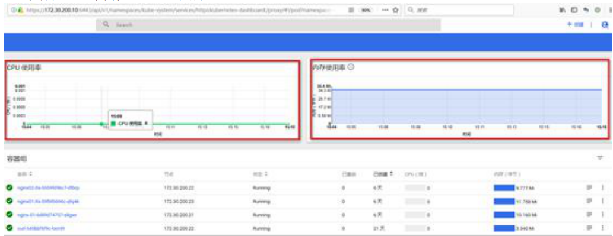
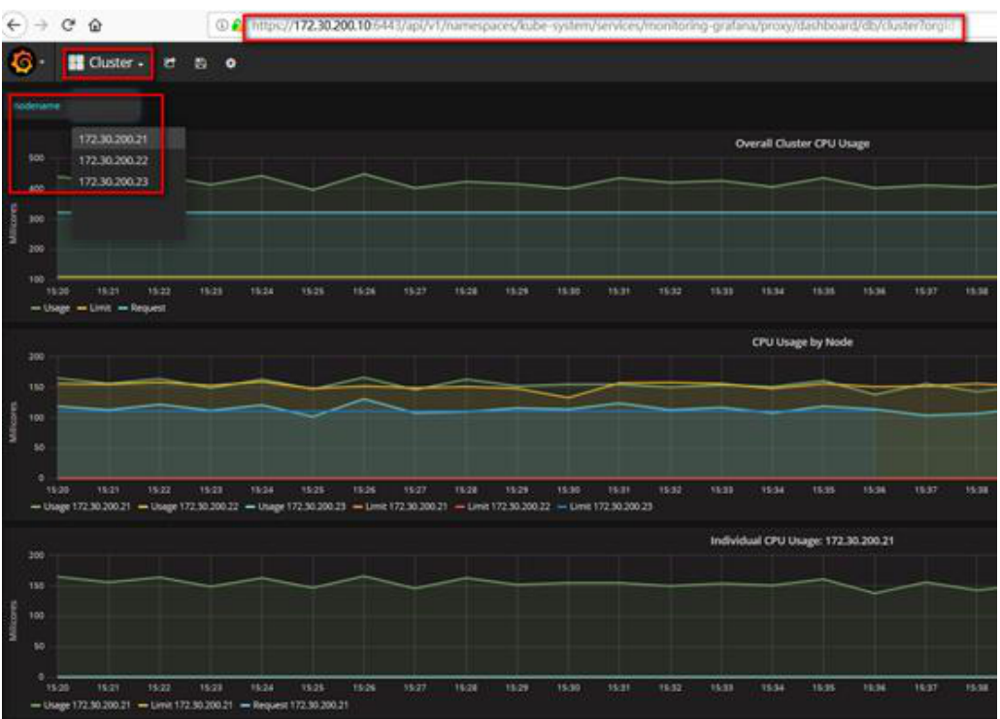
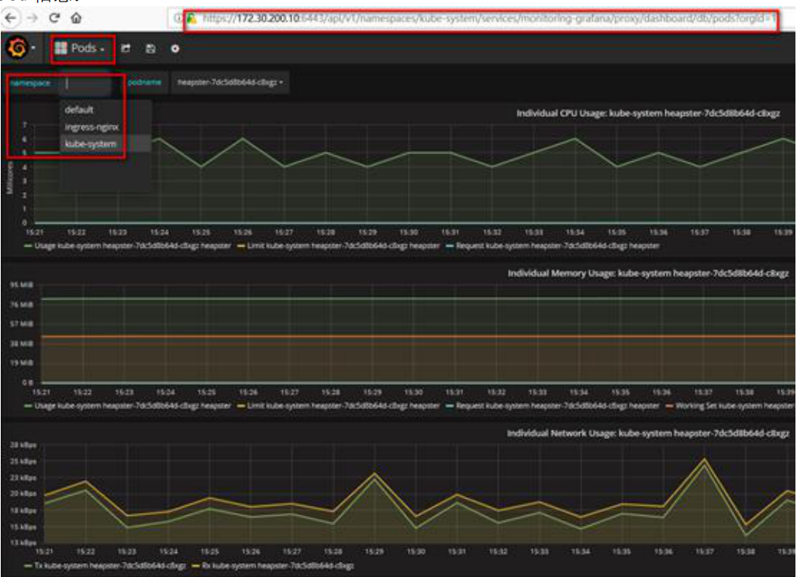

# 部署性能监控平台

## 概述

开源软件 cAdvisor（Container Advisor）用于监控所在节点的容器运行状态，当前已经被默认集成到 kubelet 组件内，默认使用 tcp 4194 端口。在大规模容器集群，一般使用Heapster+Influxdb+Grafana 平台实现集群性能数据的采集，存储与展示。

## 环境准备

### 基础环境

Kubernetes + heapster + Influxdb + grafana

### 原理



Heapster：集群中各 node 节点的 cAdvisor 的数据采集汇聚系统，通过调用 node 上kubelet 的 api，再通过 kubelet 调用 cAdvisor 的 api 来采集所在节点上所有容器的性能数据。Heapster 对性能数据进行聚合，并将结果保存到后端存储系统，heapster 支持多种后端存储系统，如 memory，Influxdb 等。

Influxdb：分布式时序数据库（每条记录有带有时间戳属性），主要用于实时数据采集，时间跟踪记录，存储时间图表，原始数据等。Influxdb 提供 rest api 用于数据的存储与查询。

Grafana：通过 dashboard 将 Influxdb 中的时序数据展现成图表或曲线等形式，便于查看集群运行状态。

Heapster，Influxdb，Grafana 均以 Pod 的形式启动与运行。

## 部署 Kubernetes 集群性能监控

### 准备 images

kubernetes 部署服务时，为避免部署时发生 pull 镜像超时的问题，建议提前将相关镜像pull 到相关所有节点（以下以 kubenode1 为例），或搭建本地镜像系统。

需要从 gcr.io pull 的镜像，已利用 Docker Hub 的"Create Auto-Build GitHub"功能（Docker Hub 利用 GitHub 上的 Dockerfile 文件 build 镜像），在个人的 Docker Hub build 成功，可直接 pull 到本地使用。

``` bash
# heapster

[root@kubenode1 ~]# docker pull netonline/heapster-amd64:v1.5.1

# influxdb

[root@kubenode1 ~]# docker pull netonline/heapster-influxdb-amd64:v1.3.3

# grafana

[root@kubenode1 ~]# docker pull netonline/heapster-grafana-amd64:v4.4.3
```

### 下载 yaml 范本

release 下载页：https://github.com/kubernetes/heapster/releases

release 中的 yaml 范本有时较 https://github.com/kubernetes/heapster/tree/master/deploy/kube-config/influxdb 的 yaml 新，但区别不大

``` bash
[root@kubenode1 ~]# cd /usr/local/src/

[root@kubenode1 src]# wget -O heapster-v1.5.1.tar.gz

https://github.com/kubernetes/heapster/archive/v1.5.1.tar.gz

# yaml 范本在 heapster/deploy/kube-config/influxdb 目录，另有 1 个 heapster?rbac.yaml 在 heapster/deploy/kube-config/rbac 目录，两者目录结构同 github

[root@kubenode1 src]# tar -zxvf heapster-v1.5.1.tar.gz -C /usr/local/

[root@kubenode1 src]# mv /usr/local/heapster-1.5.1 /usr/local/heapster

```

### heapster-rbac.yaml

* heapster 需要向 kubernetes-master 请求 node 列表，需要设置相应权限；

* 默认不需要对 heapster-rbac.yaml 修改，将 kubernetes 集群自带的 ClusterRole ：

system:heapster 做 ClusterRoleBinding，完成授权

``` bash
[root@kubenode1 ~]# cd /usr/local/heapster/deploy/kube-config/rbac/

[root@kubenode1 rbac]# cat heapster-rbac.yaml

```

``` yaml
kind: ClusterRoleBinding

apiVersion: rbac.authorization.k8s.io/v1beta1

metadata:

name: heapster

roleRef:

apiGroup: rbac.authorization.k8s.io

kind: ClusterRole

name: system:heapster

subjects:

* kind: ServiceAccount

name: heapster

namespace: kube-system

```

### heapster.yaml

hepster.yaml 由 3 个模块组成：ServiceAccout，Deployment，Service。

#### ServiceAccount

默认不需要修改 ServiceAccount 部分，设置 ServiceAccount 资源，获取 rbac 中定义的权限。

#### Deployment

* 修改处：第 23 行，变更镜像名；

* --source：配置采集源，使用安全端口调用 kubernetes 集群 api；

* --sink：配置后端存储为 influxdb；地址采用 influxdb 的 service 名，需要集群 dns 正常工作，如果没有配置 dns 服务，可使用 service 的 ClusterIP 地址

``` bash
[root@kubenode1 ~]# cd /usr/local/heapster/deploy/kube-config/influxdb/

[root@kubenode1 influxdb]# sed -i 's|gcr.io/google_containers/heapster?amd64:v1.5.1|netonline/heapster-amd64:v1.5.1|g' heapster.yaml

[root@kubenode1 influxdb]# cat heapster.yaml ……

```

``` yaml
apiVersion: extensions/v1beta1

kind: Deployment

metadata:

name: heapster

namespace: kube-system

spec:

replicas: 1

template:

metadata:

labels:

task: monitoring

k8s-app: heapster

spec:

serviceAccountName: heapster

containers:

* name: heapster

image: netonline/heapster-amd64:v1.5.1

imagePullPolicy: IfNotPresent

command:

* /heapster

* --source=kubernetes:https://kubernetes.default

* --sink=influxdb:http://monitoring-influxdb.kube-system.svc:8086

```

* Service

默认不需要修改 Service 部分。

### influxdb.yaml

influxdb.yaml 由 2 个模块组成：Deployment，Service。

* Deployment

修改处：第 16 行，变更镜像名；

``` bash
[root@kubenode1 influxdb]# sed -i 's|gcr.io/google_containers/heapster?influxdb-amd64:v1.3.3|netonline/heapster-influxdb-amd64:v1.3.3|g'

```

influxdb.yaml

* Service

默认不需要修改 Service 部分，注意 Service 名字的对应即可。

### grafana.yaml

grafana.yaml 由 2 个模块组成：Deployment，Service。

* Deployment

修改处：第 16 行，变更镜像名；

修改处：第 43 行，取消注释；“GF\_SERVER\_ROOT_URL”的 value 值设定后，只能通过 API Server proxy 访问 grafana；

修改处：第 44 行，注释本行；

INFLUXDB_HOST 的 value 值设定为 influxdb 的 service 名，依赖于集群 dns，或者直接

使用 ClusterIP

``` bash
[root@kubenode1 influxdb]# sed -i 's|gcr.io/google_containers/heapster-grafana?amd64:v4.4.3|netonline/heapster-grafana-amd64:v4.4.3|g' grafana.yaml

[root@kubenode1 influxdb]# sed -i '43s|# value:|value:|g' grafana.yaml

[root@kubenode1 influxdb]# sed -i '44s|value:|# value:|g' grafana.yaml

[root@kubenode1 influxdb]# cat grafana.yaml ……

```

``` yaml
apiVersion: extensions/v1beta1

kind: Deployment

metadata:

name: monitoring-grafana

namespace: kube-system

spec:

replicas: 1

template:

metadata:

labels:

task: monitoring

k8s-app: grafana

spec:

containers:

* name: grafana

image: netonline/heapster-grafana-amd64:v4.4.3

ports:

* containerPort: 3000

protocol: TCP

volumeMounts:

* mountPath: /etc/ssl/certs

name: ca-certificates

readOnly: true

* mountPath: /var

name: grafana-storage

env:

* name: INFLUXDB_HOST

value: monitoring-influxdb

* name: GF\_SERVER\_HTTP_PORT

value: "3000"

# The following env variables are required to make Grafana accessible

via

# the kubernetes api-server proxy. On production clusters, we

recommend

# removing these env variables, setup auth for grafana, and expose

the grafana

# service using a LoadBalancer or a public IP.

* name: GF\_AUTH\_BASIC_ENABLED

value: "false"

* name: GF\_AUTH\_ANONYMOUS_ENABLED

value: "true"

* name: GF\_AUTH\_ANONYMOUS\_ORG\_ROLE

value: Admin

* name: GF\_SERVER\_ROOT_URL

# If you're only using the API Server proxy, set this value instead:

value: /api/v1/namespaces/kube-system/services/monitoring?grafana/proxy

# value: /

volumes:

* name: ca-certificates

hostPath:

path: /etc/ssl/certs

* name: grafana-storage

emptyDir: {} ……

```

* Service

默认不需要修改 Service 部分，注意 Service 名字的对应即可。

## 验证

### 启动监控相关服务

将 heapster-rbac.yaml 复制到 influxdb/目录；

``` bash
[root@kubenode1 ~]# cd /usr/local/heapster/deploy/kube-config/influxdb/

[root@kubenode1 influxdb]# cp /usr/local/heapster/deploy/kube?config/rbac/heapster-rbac.yaml .

[root@kubenode1 influxdb]# kubectl create -f .

```

### 查看相关服务

查看 deployment 与 Pod 运行状态

``` bash
[root@kubenode1 ~]# kubectl get deploy -n kube-system | grep -E

'heapster|monitoring'

[root@kubenode1 ~]# kubectl get pods -n kube-system | grep -E

'heapster|monitoring'

# 查看 service 运行状态

[root@kubenode1 ~]# kubectl get svc -n kube-system | grep -E

'heapster|monitoring'

```

### 访问 dashboard

浏览器访问访问 dashboard：https://172.30.200.10:6443/api/v1/namespaces/kube?system/services/https:kubernetes-dashboard:/proxy

注意：Dasheboard 没有配置 hepster 监控平台时，不能展示 node，Pod 资源的 CPU 与内存

等 metric 图形

Node 资源 CPU/内存 metric 图形：



Pod 资源 CPU/内存 metric 图形：



### 访问 grafana

通过 kube-apiserver 访问

``` bash
[root@kubenode1 ~]# kubectl cluster-info

```

浏览器访问访问 dashboard：https://172.30.200.10:6443/api/v1/namespaces/kube?system/services/monitoring-grafana/proxy

集群节点信息：



Pod 信息：


