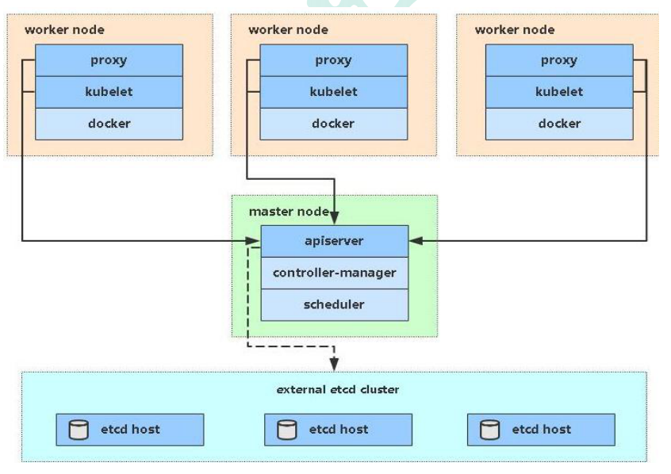

# 集群搭建(kubeadm 方式)

## 前置知识点

目前生产部署 Kubernetes 集群主要有两种方式：

* kubeadm

Kubeadm 是一个 K8s 部署工具，提供 kubeadm init 和 kubeadm join，用于快速部署 Kubernetes 集群。

官方地址：https://kubernetes.io/zh/docs/reference/setup-tools/kubeadm/

* 二进制包

从 github 下载发行版的二进制包，手动部署每个组件，组成 Kubernetes 集群。Kubeadm 降低部署门槛，但屏蔽了很多细节，遇到问题很难排查。如果想更容易可控，推荐使用二进制包部署 Kubernetes 集群，虽然手动部署麻烦点，期间可以学习很多工作原理，也利于后期维护。

## kubeadm 部署方式介绍

kubeadm 是官方社区推出的一个用于快速部署 kubernetes 集群的工具，这个工具能通过两条指令完成一个 kubernetes 集群的部署：

第一、创建一个 Master 节点 kubeadm init

第二， 将 Node 节点加入到当前集群中

``` bash
 kubeadm join <Master 节点的 IP 和端口 >
```

## 安装要求

在开始之前，部署 Kubernetes 集群机器需要满足以下几个条件：

* 一台或多台机器，操作系统 CentOS7.x-86_x64

* 硬件配置：2GB 或更多 RAM，2 个 CPU 或更多 CPU，硬盘 30GB 或更多

* 集群中所有机器之间网络互通

* 可以访问外网，需要拉取镜像

* 禁止 swap 分区

## 最终目标

* 在所有节点上安装 Docker 和 kubeadm

* 部署 Kubernetes Master

* 部署容器网络插件

* 部署 Kubernetes Node，将节点加入 Kubernetes 集群中

* 部署 Dashboard Web 页面，可视化查看 Kubernetes 资源

## 准备环境



* 角色 IP

``` bash
k8s-master 192.168.56.1

k8s-node1 192.168.56.101

k8s-node1 192.168.56.102
```

## 系统初始化

### 关闭防火墙

``` bash
systemctl stop firewalld

systemctl disable firewalld
```

### 关闭 selinux

``` bash
sed -i 's/enforcing/disabled/' /etc/selinux/config # 永久

setenforce 0 # 临时
```

### 关闭 swap

``` bash
swapoff -a # 临时

vim /etc/fstab # 永久
```

PS: 在kubelet启动时添加参数 --fail-swap-on=false 参数，不用关闭swap

### 主机名：

``` bash
hostnamectl set-hostname <hostname>
```

### 在 master 添加 hosts：

``` bash
cat >> /etc/hosts << EOF
192.168.56.1 k8s-master
192.168.56.101 k8s-node1
192.168.56.103 k8s-node2
EOF
```

### 将桥接的 IPv4 流量传递到 iptables 的链

``` bash
cat > /etc/sysctl.d/k8s.conf << EOF
net.bridge.bridge-nf-call-ip6tables = 1
net.bridge.bridge-nf-call-iptables = 1
EOF

sysctl --system # 生效
```

### 时间同步：

``` bash
yum install ntpdate -y

ntpdate time.windows.com
```

## 所有节点安装 containerd/kubeadm/kubelet

* 安装 containerd（容器运行时软件）

``` bash
cat <<EOF | sudo tee /etc/modules-load.d/containerd.conf
overlay
br_netfilter
EOF

sudo modprobe overlay
sudo modprobe br_netfilter

# 设置必需的 sysctl 参数，这些参数在重新启动后仍然存在。
cat <<EOF | sudo tee /etc/sysctl.d/99-kubernetes-cri.conf
net.bridge.bridge-nf-call-iptables  = 1
net.ipv4.ip_forward                 = 1
net.bridge.bridge-nf-call-ip6tables = 1
EOF

# 应用 sysctl 参数而无需重新启动
sudo sysctl --system

yum install -y yum-utils
yum-config-manager \
    --add-repo \
    https://download.docker.com/linux/centos/docker-ce.repo

yum install containerd.io
```

* 安装 kubeadm，kubelet 和 kubectl

``` bash
cat <<EOF > /etc/yum.repos.d/kubernetes.repo
[kubernetes]
name=Kubernetes
baseurl=https://packages.cloud.google.com/yum/repos/kubernetes-el7-x86_64
enabled=1
gpgcheck=1
repo_gpgcheck=1
gpgkey=https://packages.cloud.google.com/yum/doc/yum-key.gpg https://packages.cloud.google.com/yum/doc/rpm-package-key.gpg
EOF

yum install -y kubelet kubeadm kubectl

systemctl enable kubelet
```

``` bash
dnf install -y iproute-tc
```

## 部署 Kubernetes Master

### 在 192.168.56.1（Master）执行

然后接下来在 master 节点配置 kubeadm 初始化文件，可以通过如下命令导出默认的初始化配置：

``` text
kubeadm config print init-defaults > kubeadm.yaml
```

然后根据我们自己的需求修改配置，比如修改 imageRepository 的值，kube-proxy 的模式为 ipvs，需要注意的是由于我们使用的containerd作为运行时，所以在初始化节点的时候需要指定 `cgroupDriver` 为 `systemd`

``` 

apiVersion: kubeadm.k8s.io/v1beta2
bootstrapTokens:

* groups:
  + system:bootstrappers:kubeadm:default-node-token

  token: abcdef.0123456789abcdef
  ttl: 24h0m0s
  usages:

  + signing
  + authentication

kind: InitConfiguration
localAPIEndpoint:
  advertiseAddress: 192.168.56.1
  bindPort: 6443
nodeRegistration:
  criSocket: /run/containerd/containerd.sock 
  name: k8s-master
  taints:

  + effect: NoSchedule

    key: node-role.kubernetes.io/master
---
apiServer:
  timeoutForControlPlane: 4m0s
apiVersion: kubeadm.k8s.io/v1beta2
certificatesDir: /etc/kubernetes/pki
clusterName: kubernetes
controllerManager: {}
dns:
  type: CoreDNS
etcd:
  local:
    dataDir: /var/lib/etcd
imageRepository: k8s.gcr.io
kind: ClusterConfiguration
kubernetesVersion: v1.21.0
networking:
  dnsDomain: cluster.local
  podSubnet: 172.16.0.0/16
  serviceSubnet: 10.96.0.0/12
scheduler: {}
---
apiVersion: kubeproxy.config.k8s.io/v1alpha1
kind: KubeProxyConfiguration
mode: ipvs
---
apiVersion: kubelet.config.k8s.io/v1beta1
kind: KubeletConfiguration
cgroupDriver: systemd
```

由于默认拉取镜像地址 k8s.gcr.io 国内无法访问，这里指定阿里云镜像仓库地址。

然后使用上面的配置文件进行初始化：

``` text
$ kubeadm init --config=kubeadm.yaml

[init] Using Kubernetes version: v1.21.0
[preflight] Running pre-flight checks
[preflight] Pulling images required for setting up a Kubernetes cluster
[preflight] This might take a minute or two, depending on the speed of your internet connection
[preflight] You can also perform this action in beforehand using 'kubeadm config images pull'
[certs] Using certificateDir folder "/etc/kubernetes/pki"
[certs] Generating "ca" certificate and key
[certs] Generating "apiserver" certificate and key
[certs] apiserver serving cert is signed for DNS names [k8s-master kubernetes kubernetes.default kubernetes.default.svc kubernetes.default.svc.cluster.local] and IPs [10.96.0.1 192.168.0.5]
[certs] Generating "apiserver-kubelet-client" certificate and key
[certs] Generating "front-proxy-ca" certificate and key
[certs] Generating "front-proxy-client" certificate and key
[certs] Generating "etcd/ca" certificate and key
[certs] Generating "etcd/server" certificate and key
[certs] etcd/server serving cert is signed for DNS names [k8s-master localhost] and IPs [192.168.0.5 127.0.0.1 ::1]
[certs] Generating "etcd/peer" certificate and key
[certs] etcd/peer serving cert is signed for DNS names [k8s-master localhost] and IPs [192.168.0.5 127.0.0.1 ::1]
[certs] Generating "etcd/healthcheck-client" certificate and key
[certs] Generating "apiserver-etcd-client" certificate and key
[certs] Generating "sa" key and public key
[kubeconfig] Using kubeconfig folder "/etc/kubernetes"
[kubeconfig] Writing "admin.conf" kubeconfig file
[kubeconfig] Writing "kubelet.conf" kubeconfig file
[kubeconfig] Writing "controller-manager.conf" kubeconfig file
[kubeconfig] Writing "scheduler.conf" kubeconfig file
[kubelet-start] Writing kubelet environment file with flags to file "/var/lib/kubelet/kubeadm-flags.env"
[kubelet-start] Writing kubelet configuration to file "/var/lib/kubelet/config.yaml"
[kubelet-start] Starting the kubelet
[control-plane] Using manifest folder "/etc/kubernetes/manifests"
[control-plane] Creating static Pod manifest for "kube-apiserver"
[control-plane] Creating static Pod manifest for "kube-controller-manager"
[control-plane] Creating static Pod manifest for "kube-scheduler"
[etcd] Creating static Pod manifest for local etcd in "/etc/kubernetes/manifests"
[wait-control-plane] Waiting for the kubelet to boot up the control plane as static Pods from directory "/etc/kubernetes/manifests". This can take up to 4m0s
[kubelet-check] Initial timeout of 40s passed.
[apiclient] All control plane components are healthy after 70.001862 seconds
[upload-config] Storing the configuration used in ConfigMap "kubeadm-config" in the "kube-system" Namespace
[kubelet] Creating a ConfigMap "kubelet-config-1.20" in namespace kube-system with the configuration for the kubelets in the cluster
[upload-certs] Skipping phase. Please see --upload-certs
[mark-control-plane] Marking the node k8s-master as control-plane by adding the labels "node-role.kubernetes.io/master=''" and "node-role.kubernetes.io/control-plane='' (deprecated)"
[mark-control-plane] Marking the node k8s-master as control-plane by adding the taints [node-role.kubernetes.io/master:NoSchedule]
[bootstrap-token] Using token: abcdef.0123456789abcdef
[bootstrap-token] Configuring bootstrap tokens, cluster-info ConfigMap, RBAC Roles
[bootstrap-token] configured RBAC rules to allow Node Bootstrap tokens to get nodes
[bootstrap-token] configured RBAC rules to allow Node Bootstrap tokens to post CSRs in order for nodes to get long term certificate credentials
[bootstrap-token] configured RBAC rules to allow the csrapprover controller automatically approve CSRs from a Node Bootstrap Token
[bootstrap-token] configured RBAC rules to allow certificate rotation for all node client certificates in the cluster
[bootstrap-token] Creating the "cluster-info" ConfigMap in the "kube-public" namespace
[kubelet-finalize] Updating "/etc/kubernetes/kubelet.conf" to point to a rotatable kubelet client certificate and key
[addons] Applied essential addon: CoreDNS
[addons] Applied essential addon: kube-proxy

Your Kubernetes control-plane has initialized successfully!

To start using your cluster, you need to run the following as a regular user:

  mkdir -p $HOME/.kube
  sudo cp -i /etc/kubernetes/admin.conf $HOME/.kube/config
  sudo chown $(id -u):$(id -g) $HOME/.kube/config

Alternatively, if you are the root user, you can run:

  export KUBECONFIG=/etc/kubernetes/admin.conf

You should now deploy a pod network to the cluster.
Run "kubectl apply -f [podnetwork].yaml" with one of the options listed at:
  https://kubernetes.io/docs/concepts/cluster-administration/addons/

Then you can join any number of worker nodes by running the following on each as root:

kubeadm join 192.168.56.1:6443 --token abcdef.0123456789abcdef \
  --discovery-token-ca-cert-hash sha256:2e70eac3eddebcd794de4c4d3a7ef03ab41b69ad0795c19a913df7a350f7aaab
```

### 使用 kubectl 工具

``` bash
mkdir -p $HOME/.kube
sudo cp -i /etc/kubernetes/admin.conf $HOME/.kube/config
sudo chown $(id -u):$(id -g) $HOME/.kube/config
kubectl get nodes
```

## 安装 Pod 网络插件（CNI）

``` bash
sudo kubectl apply -f https://raw.githubusercontent.com/coreos/flannel/master/Documentation/kube-flannel.yml
```

确保能够访问到 quay.io 这个 registery。如果 Pod 镜像下载失败，可以改这个镜像地址

## 加入 Kubernetes Node

### 在 192.168.56.101/103（Node）执行

向集群添加新节点，执行在 kubeadm init 输出的 kubeadm join 命令：

``` bash
kubeadm join 192.168.56.1:6443 --token abcdef.0123456789abcdef \
  --discovery-token-ca-cert-hash sha256:2e70eac3eddebcd794de4c4d3a7ef03ab41b69ad0795c19a913df7a350f7aaab
```

## 测试 kubernetes 集群

在 Kubernetes 集群中创建一个 pod，验证是否正常运行：

$ kubectl create deployment nginx --image=nginx

$ kubectl expose deployment nginx --port=80 --type=NodePort

$ kubectl get pod, svc

访问地址：http://NodeIP: Port
