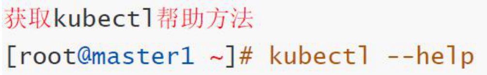
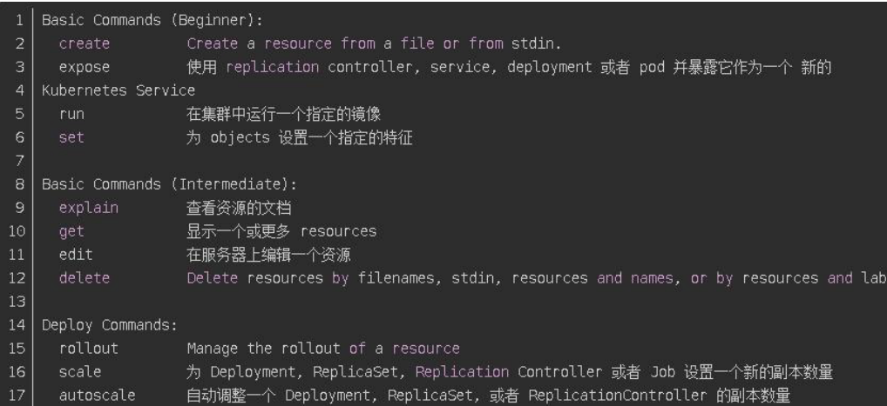
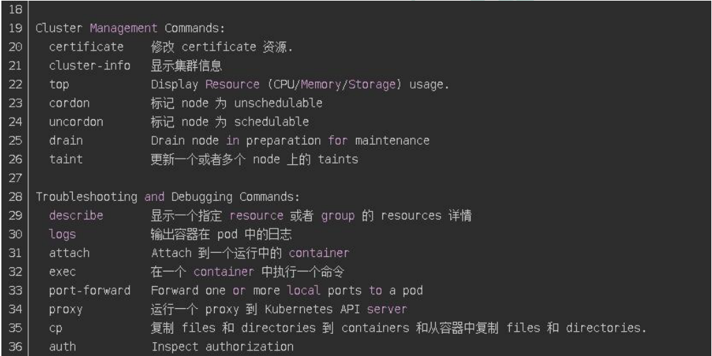
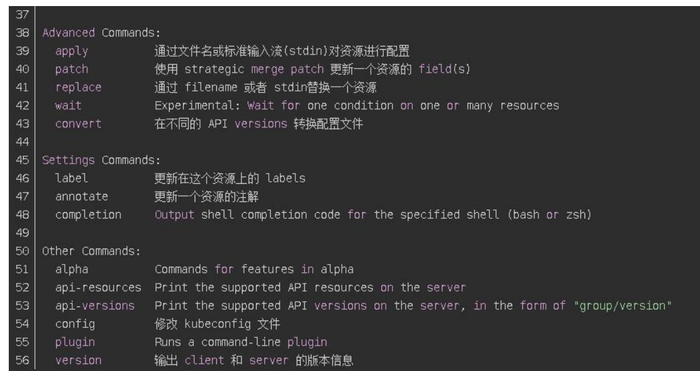
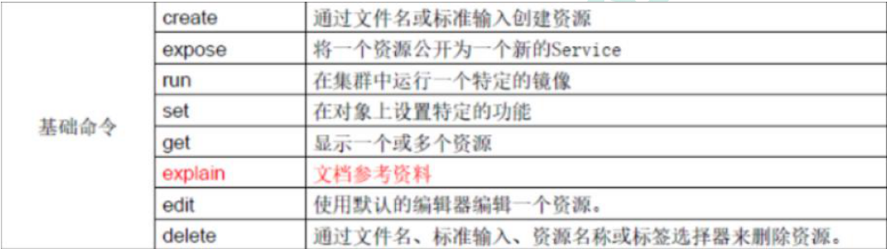
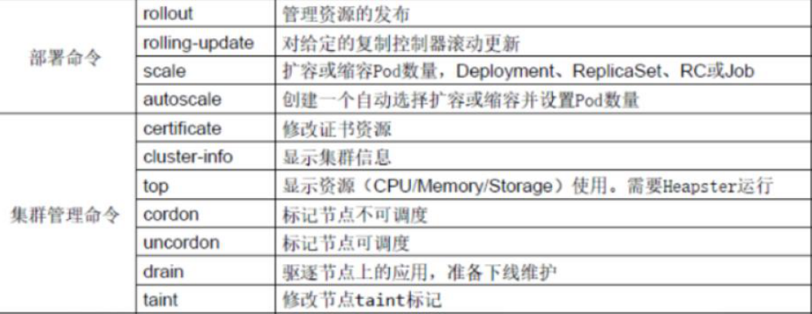
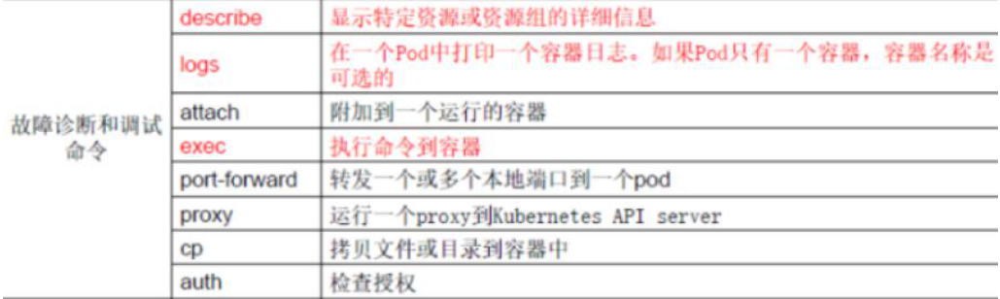
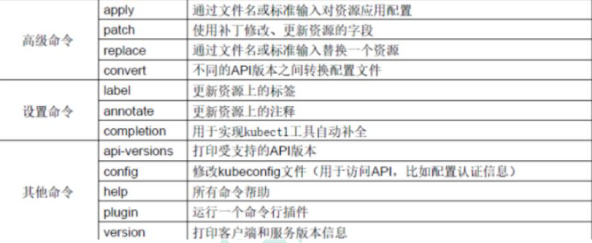

# 集群命令行工具 kubectl

## kubectl 概述

kubectl 是 Kubernetes 集群的命令行工具，通过 kubectl 能够对集群本身进行管理，并能够在集群上进行容器化应用的安装部署。

## kubectl 命令的语法

* comand：指定要对资源执行的操作，例如 create、get、describe 和 delete

* TYPE：指定资源类型，资源类型是大小写敏感的，开发者能够以单数、复数和缩略的形式。例如：

* NAME：指定资源的名称，名称也大小写敏感的。如果省略名称，则会显示所有的资源，

例如:

* flags：指定可选的参数。例如，可用-s 或者–server 参数指定 Kubernetes API server 的地址和端口。

## kubectl help 获取更多信息

## kubectl 子命令使用分类

* 基础命令

* 部署和集群管理命令

* 故障和调试命令

* 其他命令

