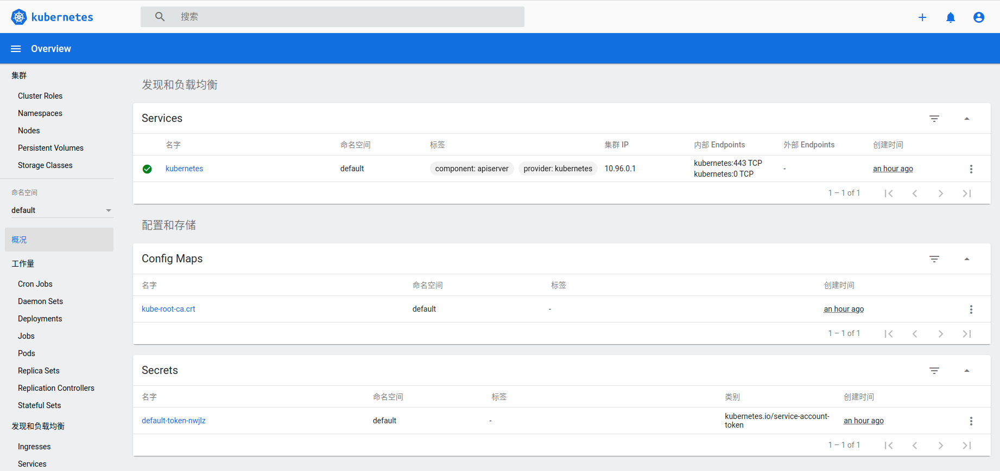
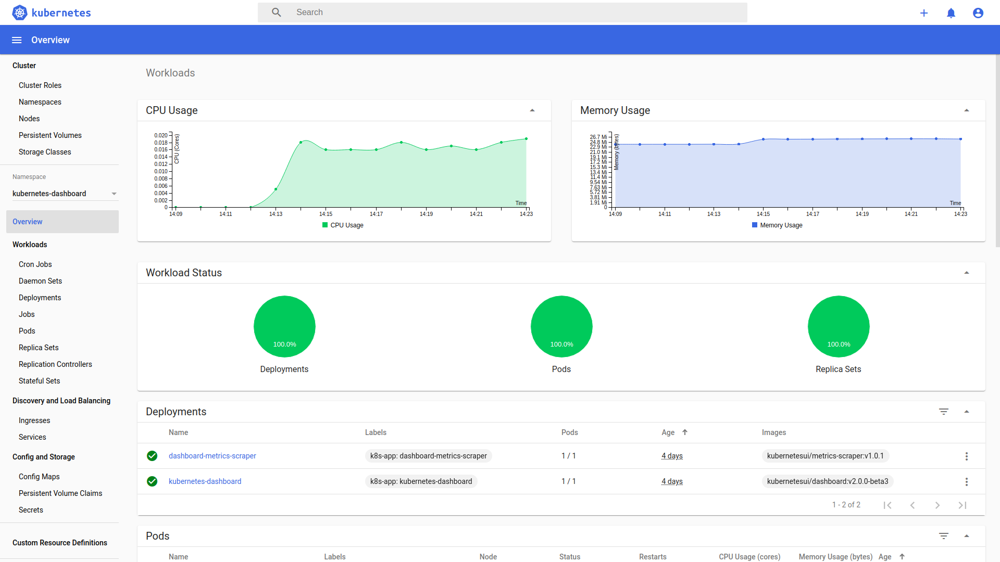

# Web界面Dashboard

Dashboard 是基于网页的 Kubernetes 用户界面。 你可以使用 Dashboard 将容器应用部署到 Kubernetes 集群中，也可以对容器应用排错，还能管理集群资源。 你可以使用 Dashboard 获取运行在集群中的应用的概览信息，也可以创建或者修改 Kubernetes 资源 （如 Deployment，Job，DaemonSet 等等）。 例如，你可以对 Deployment 实现弹性伸缩、发起滚动升级、重启 Pod 或者使用向导创建新的应用。

Dashboard 同时展示了 Kubernetes 集群中的资源状态信息和所有报错信息。




## 部署 Dashboard UI

默认情况下不会部署 Dashboard。可以通过以下命令部署：

``` 

kubectl apply -f https://raw.githubusercontent.com/kubernetes/dashboard/v2.2.0/aio/deploy/recommended.yaml
```

## 访问 Dashboard UI

为了保护你的集群数据，默认情况下，Dashboard 会使用最少的 RBAC 配置进行部署。 当前，Dashboard 仅支持使用 Bearer 令牌登录。 要为此样本演示创建令牌，你可以按照 [创建示例用户](https://github.com/kubernetes/dashboard/wiki/Creating-sample-user) 上的指南进行操作。

> **警告：** 在教程中创建的样本用户将具有管理特权，并且仅用于教育目的。

### 命令行代理

你可以使用 kubectl 命令行工具访问 Dashboard，命令如下：

``` 

kubectl proxy
```

kubectl 会使得 Dashboard 可以通过 http://localhost:8001/api/v1/namespaces/kubernetes-dashboard/services/https:kubernetes-dashboard:/proxy/ 访问。

UI *只能* 通过执行这条命令的机器进行访问。更多选项参见 `kubectl proxy --help` 。

> **说明：** Kubeconfig 身份验证方法不支持外部身份提供程序或基于 x509 证书的身份验证。

## 欢迎界面

当访问空集群的 Dashboard 时，你会看到欢迎界面。 页面包含一个指向此文档的链接，以及一个用于部署第一个应用程序的按钮。 此外，你可以看到在默认情况下有哪些默认系统应用运行在 `kube-system` [名字空间](https://kubernetes.io/zh/docs/tasks/administer-cluster/namespaces/) 中，比如 Dashboard 自己。


## 创建用户

在本指南中，我们将找到如何使用Kubernetes的服务帐户机制创建新用户，授予该用户admin权限以及使用与该用户绑定的承载令牌登录到Dashboard的方法。

**重要信息：**在继续操作之前，请确保您知道自己在做什么。向仪表板的服务帐户授予管理员特权可能会带来安全风险。

对于每个以下片断 `ServiceAccount` 和 `ClusterRoleBinding` ，你应该将它们复制到像新的清单文件 `dashboard-adminuser.yaml` ，并使用 `kubectl apply -f dashboard-adminuser.yaml` 创建它们。

## 创建服务帐户

我们首先要 `admin-user` 在名称空间中创建名称为Service Account的服务 `kubernetes-dashboard` 。

``` 

cat <<EOF | kubectl apply -f -
apiVersion: v1
kind: ServiceAccount
metadata:
  name: admin-user
  namespace: kubernetes-dashboard
EOF
```

## 创建一个ClusterRoleBinding

在供应使用集束后大多数情况下 `kops` ， `kubeadm` 或任何其他流行的工具，在 `ClusterRole`  `cluster-admin` 已经存在的群集。我们可以使用它并仅为 `ClusterRoleBinding` 我们创建 `ServiceAccount` 。如果不存在，则需要首先创建此角色并手动授予所需的特权。

``` 

cat <<EOF | kubectl apply -f -
apiVersion: rbac.authorization.k8s.io/v1
kind: ClusterRoleBinding
metadata:
  name: admin-user
roleRef:
  apiGroup: rbac.authorization.k8s.io
  kind: ClusterRole
  name: cluster-admin
subjects:

* kind: ServiceAccount

  name: admin-user
  namespace: kubernetes-dashboard
EOF
```

## 获取承载令牌

现在我们需要找到可用于登录的令牌。执行以下命令：

``` 

kubectl -n kubernetes-dashboard get secret $(kubectl -n kubernetes-dashboard get sa/admin-user -o jsonpath="{.secrets[0].name}") -o go-template="{{.data.token | base64decode}}"

```

它应该打印如下内容：

``` 

eyJhbGciOiJSUzI1NiIsImtpZCI6IiJ9.eyJpc3MiOiJrdWJlcm5ldGVzL3NlcnZpY2VhY2NvdW50Iiwia3ViZXJuZXRlcy5pby9zZXJ2aWNlYWNjb3VudC9uYW1lc3BhY2UiOiJrdWJlcm5ldGVzLWRhc2hib2FyZCIsImt1YmVybmV0ZXMuaW8vc2VydmljZWFjY291bnQvc2VjcmV0Lm5hbWUiOiJhZG1pbi11c2VyLXRva2VuLXY1N253Iiwia3ViZXJuZXRlcy5pby9zZXJ2aWNlYWNjb3VudC9zZXJ2aWNlLWFjY291bnQubmFtZSI6ImFkbWluLXVzZXIiLCJrdWJlcm5ldGVzLmlvL3NlcnZpY2VhY2NvdW50L3NlcnZpY2UtYWNjb3VudC51aWQiOiIwMzAzMjQzYy00MDQwLTRhNTgtOGE0Ny04NDllZTliYTc5YzEiLCJzdWIiOiJzeXN0ZW06c2VydmljZWFjY291bnQ6a3ViZXJuZXRlcy1kYXNoYm9hcmQ6YWRtaW4tdXNlciJ9.Z2JrQlitASVwWbc-s6deLRFVk5DWD3P_vjUFXsqVSY10pbjFLG4njoZwh8p3tLxnX_VBsr7_6bwxhWSYChp9hwxznemD5x5HLtjb16kI9Z7yFWLtohzkTwuFbqmQaMoget_nYcQBUC5fDmBHRfFvNKePh_vSSb2h_aYXa8GV5AcfPQpY7r461itme1EXHQJqv-SN-zUnguDguCTjD80pFZ_CmnSE1z9QdMHPB8hoB4V68gtswR1VLa6mSYdgPwCHauuOobojALSaMc3RH7MmFUumAgguhqAkX3Omqd3rJbYOMRuMjhANqd08piDC3aIabINX6gP5-Tuuw2svnV6NYQ
```

现在，复制令牌并将其粘贴到 `Enter token` 登录屏幕上的字段中。

[](https://github.com/kubernetes/dashboard/blob/master/docs/images/signin.png)

单击 `Sign in` 按钮，仅此而已。您现在已以管理员身份登录。

[](https://github.com/kubernetes/dashboard/blob/master/docs/images/overview.png)

## 清理和下一步

删除管理员 `ServiceAccount` 和 `ClusterRoleBinding` 。

``` 

kubectl -n kubernetes-dashboard delete serviceaccount admin-user
kubectl -n kubernetes-dashboard delete clusterrolebinding admin-user
```

### 更新

安装后，部署不会自动更新。为了对其进行更新，您需要删除部署的Pod，并等待其重新创建。重新娱乐后，它应该使用最新的图像。

删除所有Dashboard Pod（假设Dashboard已部署在kubernetes-dashboard命名空间中）：

``` 

kubectl -n kubernetes-dashboard delete $(kubectl -n kubernetes-dashboard get pod -o name | grep dashboard)
```

输出类似于以下内容：

``` 

pod "dashboard-metrics-scraper-fb986f88d-gnfnk" deleted
pod "kubernetes-dashboard-7d8b9cc8d-npljm" deleted
```
