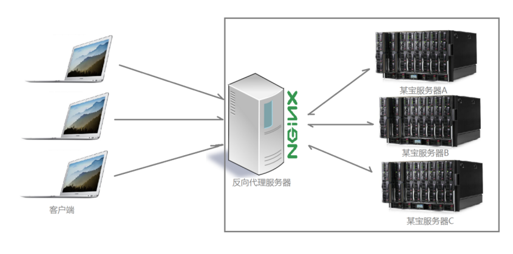
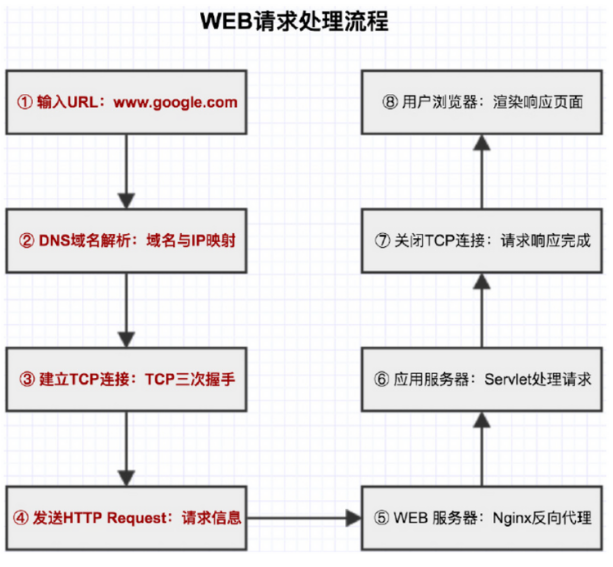
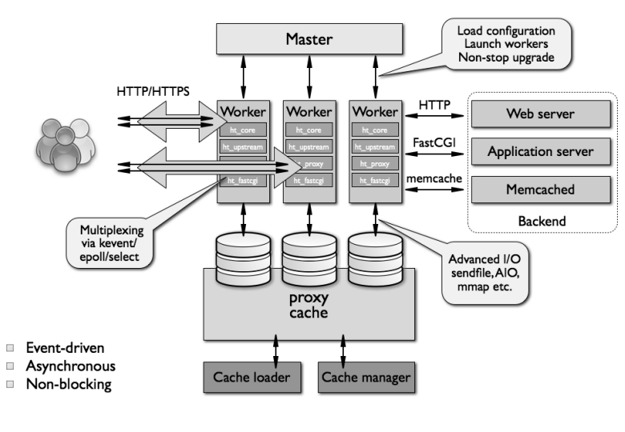
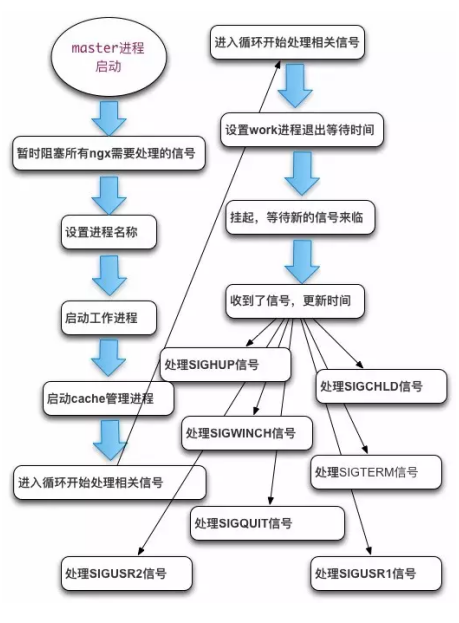

# 概述

## 什么是nginx

Nginx是一款自由的、开源的、高性能的HTTP服务器和反向代理服务器；同时也是一个IMAP、POP3、SMTP代理服务器；Nginx可以作为一个HTTP服务器进行网站的发布处理，另外nginx可以作为反向代理进行负载均衡的实现。

### 正向代理与反向代理

正向代理也是大家最常接触的到的代理模式，我们会从两个方面来说关于正向代理的处理模式，分别从软件方面和生活方面来解释一下什么叫正向代理

比如我们想要访问facebook，但是因为国内的网络环境我们是访问不了的，我们就会去使用一些翻墙工具，帮助我们访问facebook，那么翻墙工具背后实际上就是一个可以访问国外网站的代理服务器，我们将请求发送给代理服务器，代理服务器去访问国外的网站，然后将访问到的数据传递给我们

上述这样的代理模式称为正向代理，正向代理最大的特点是客户端非常明确要访问的服务器地址；服务器只清楚请求来自哪个代理服务器，而不清楚来自哪个具体的客户端；正向代理模式屏蔽或者隐藏了真实客户端信息


#### 反向代理

明白了什么是正向代理，我们继续看关于反向代理的处理方式，举例如某宝网站，每天同时连接到网站的访问人数已经爆表，单个服务器远远不能满足人民日益增长的购买欲望了，此时就出现了一个大家耳熟能详的名词：分布式部署；也就是通过部署多台服务器来解决访问人数限制的问题；某宝网站中大部分功能也是直接使用nginx进行反向代理实现的



多个客户端给服务器发送的请求，Nginx服务器接收到之后，按照一定的规则分发给了后端的业务处理服务器进行处理了。此时~请求的来源也就是客户端是明确的，但是请求具体由哪台服务器处理的并不明确了，Nginx扮演的就是一个反向代理角色

## 为什么选择nginx?

（1）更快

这表现在两个方面：一方面，在正常情况下，单次请求会得到更快的响应；另一方面，在高峰期（如有数以万计的并发请求），Nginx可以比其他Web服务器更快地响应请求。实际上，

（2）高扩展性

Nginx的设计极具扩展性，它完全是由多个不同功能、不同层次、不同类型且耦合度极低的模块组成。因此，当对某一个模块修复Bug或进行升级时，可以专注于模块自身，无须在意其他。而且在HTTP模块中，还设计了HTTP过滤器模块：一个正常的HTTP模块在处理完请求后，会有一串HTTP过滤器模块对请求的结果进行再处理。这样，当我们开发一个新的HTTP模块时，不但可以使用诸如HTTP核心模块、events模块、log模块等不同层次或者不同类型的模块，还可以原封不动地复用大量已有的HTTP过滤器模块。这种低耦合度的优秀设计，造就了Nginx庞大的第三方模块，当然，公开的第三方模块也如官方发布的模块一样容易使用。

Nginx的模块都是嵌入到二进制文件中执行的，无论官方发布的模块还是第三方模块都是如此。这使得第三方模块一样具备极其优秀的性能，充分利用Nginx的高并发特性，因此，许多高流量的网站都倾向于开发符合自己业务特性的定制模块。

（3）高可靠性

高可靠性是我们选择Nginx的最基本条件，因为Nginx的可靠性是大家有目共睹的，很多家高流量网站都在核心服务器上大规模使用Nginx。Nginx的高可靠性来自于其核心框架代码的优秀设计、模块设计的简单性；另外，官方提供的常用模块都非常稳定，每个worker进程相对独立，master进程在1个worker进程出错时可以快速“拉起”新的worker子进程提供服务。

（4）低内存消耗

一般情况下，10000个非活跃的HTTP Keep-Alive连接在Nginx中仅消耗2.5MB的内存，这是Nginx支持高并发连接的基础。

（5）单机支持10万以上的并发连接

这是一个非常重要的特性！随着互联网的迅猛发展和互联网用户数量的成倍增长，各大公司、网站都需要应付海量并发请求，一个能够在峰值期顶住10万以上并发请求的Server，

无疑会得到大家的青睐。理论上，Nginx支持的并发连接上限取决于内存，当然，能够及时地处理更多的并发请求，是与业务特点紧密相关的

（6）热部署

master管理进程与worker工作进程的分离设计，使得Nginx能够提供热部署功能，即可以在7×24小时不间断服务的前提下，升级Nginx的可执行文件。当然，它也支持不停止服务就更新配置项、更换日志文件等功能。

（7）最自由的BSD许可协议

这是Nginx可以快速发展的强大动力。BSD许可协议不只是允许用户免费使用Nginx，它

还允许用户在自己的项目中直接使用或修改Nginx源码，然后发布。这吸引了无数开发者继

续为Nginx贡献自己的智慧。

## Nginx高效的原因及原理解析

前面已经大概了解了nginx，接下来我们要了解下nginx的基本架构。

### web服务器的请求处理机制

web服务器和客户端是一对多的关系，Web服务器必须有能力同时为多个客户端提供服务。一般来说完成并行处理请求工作有三种方式

1、多进程方式

多进程方式指，服务器每当收到一个客户端请求时，就有服务器主进程生成一个子进程出来和客户端建立连接进行交互，直到连接断开该子进程就结束了。

多进程方式的优点是设计简单，各个子进程相对独立，处理客户端请求时彼此不受干扰；缺点是操作系统生成一个子进程需要进行内存复制等操作，在资源和时间上会产生一定的开销；当有大量请求时，会导致系统性能下降；

例如：即时聊天程序，一台服务器可能要维持数十万的连接，那么就要启动数十万的进程来维持。这显然不可能

2、多线程方式

多线程方式指每当服务器接收到一个请求后，会由服务器主进程派生出一个线程出来和客户端进行交互。由于操作系统产生出一个线程的开销远远小于一个进程的开销。故多线程方式在很大程度上减轻了Web服务器对系统资源的要求。

缺点：稳定性！假设某个进程突然关闭会造成整个进程中的所有线程都崩溃。

3、异步方式

使用非阻塞方式处理请求，是三种方式中开销最小的。但异步方式虽然效率高，但要求也高，因为多任务之间的调度如果出现问题，就可能出现整体故障，因此使用异步工作的，一般是一些功能相对简单，但却符合服务器任务调度、且代码中没有影响调度的错误代码存在的程序。

优点：性能最好！一个进程或线程处理多个请求，不需要额外开销，性能最好，资源占用最低。

缺点：稳定性！某个进程或线程出错，可能导致大量请求无法处理，甚至导致整个服务宕机。

了解些概念

### 同步和异步

同步与异步的重点在消息通知的方式上，也就是调用结果通知的方式。

同步：当一个同步调用发出去后，调用者要一直等待调用结果的通知，直到得到调用结果。

异步：当一个异步调用发出去后，调用者不能立即得到调用结果的返回。

异步调用，要想获得结果，一般有两种方式：
1、主动轮询异步调用的结果;

2、被调用方通过callback来通知调用方调用结果。

同步买奶茶： 小明点单交钱，然后等着拿奶茶；
异步买奶茶： 小明点单交钱，店员给小明一个小票，等小明奶茶做好了，再来取。

### web服务器对于请求的处理过程



服务器处理流程：

1、服务器监听传入连接。

2、客户端连接到服务器。

3、服务器接受连接并处理输入。

4、服务器响应客户端。

### nginx的基本架构



1. Nginx启动后，会产生一个主进程，主进程执行一系列的工作后会产生一个或者多个工作进程

2. 在客户端请求动态站点的过程中，Nginx服务器还涉及和后端服务器的通信。Nginx将接收到的Web请求通过代理转发到后端服务器，由后端服务器进行数据处理和组织；

3. Nginx为了提高对请求的响应效率，降低网络压力，采用了缓存机制，将历史应答数据缓存到本地。保障对缓存文件的快速访问master进程主要用来管理worker进程，具体包括以下主要功能：

（1）接收来自外界的信号。

（2）处理配置文件读取。

（3）创建，绑定和关闭套接字

（4）启动，终止和维护配置的工作(worker)进程数

（5）当woker进程退出后（异常情况下），会自动重新启动新的woker进程。



worker进程的主要任务是完成具体的任务逻辑。其主要关注点是与客户端或后端真实服务器（此时nginx作为中间代理）之间的数据可读/可写等I/O交互事件。

（1）接收客户端请求；

（2）将请求一次送入各个功能模块进行过滤处理；

（3）与后端服务器通信，接收后端服务器处理结果；

（4）数据缓存

（5）响应客户端请求

### 案例：实现一个简单的php多进程版本的nginx

1、能够接收http请求

2、能够响应http

3、能够接收多个客户端请求，同步执行，需要安装多进程模块

安装pcntl模块

``` sh
http://cn2.php.net/distributions/php-7.1.14.tar.xz

tar xf php-7.1.14.tar.xz
cd php-7.1.14
cd ext/pcntl
phpize
./configure --with-php-config=/usr/bin/php-config
make
make install
echo "extension=pcntl.so" >> /etc/php.ini
```
从上面的代码当中我们发现，如果是多进程的模式，也就意味着我们需要大量的进程，才能支持更多的连接请求，那么有没有一种技术可以在一个进程内处理所有并发IO呢？答案是有，这就是IO复用技术。
