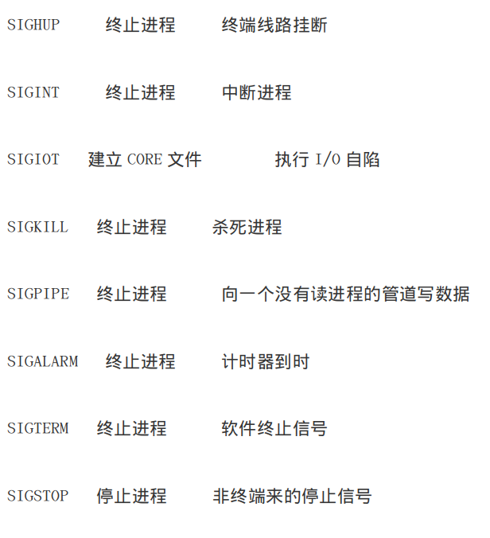
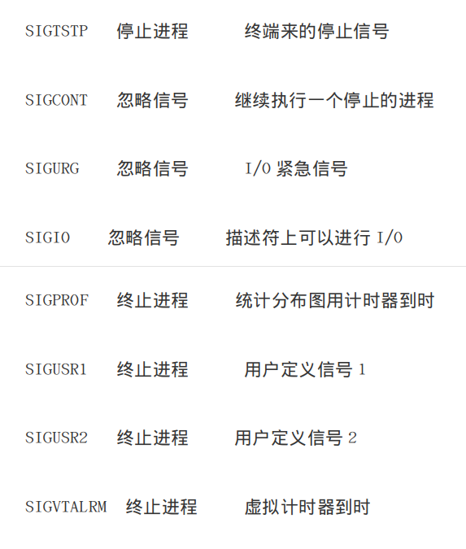

## IO复用/EventLoop

### IO复用是什么？

IO多路复用是指内核一旦发现进程指定的一个或者多个IO条件准备读取，它就通知该进程，目前支持I/O多路复用的系统调用有 select，poll，epoll，I/O多路复用就是通过一种机制，一个进程可以监视多个描述符，一旦某个描述符就绪（一般是读就绪或者写就绪），能够通知程序进行相应的读写操作。

### Select跟poll

Select介绍：

监视并等待多个文件描述符的属性变化（可读、可写或错误异常）。select函数监视的文件描述符分 3 类，分别是writefds、readfds、和 exceptfds。调用后 select会阻塞，直到有描述符就绪（有数据可读、可写、或者有错误异常），或者超时（ timeout 指定等待时间），函数才返回。当 select()函数返回后，可以通过遍历 fdset，来找到就绪的描述符，并且描述符最大不能超过1024

poll 介绍：

poll的机制与select类似，与select在本质上没有多大差别，管理多个描述符也是进行轮询，根据描述符的状态进行处理，但是poll没有最大文件描述符数量的限制。poll和select同样存在一个缺点就是，包含大量文件描述符的数组被整体复制于用户态和内核的地址空间之间，而不论这些文件描述符是否就绪，它的开销随着文件描述符数量的增加而线性增大。

 问题：

select/poll问题很明显，它们需要循环检测连接是否有事件。如果服务器有上百万个连接，在某一时间只有一个连接向服务器发送了数据，select/poll需要做循环100万次，其中只有1次是命中的，剩下的99万9999次都是无效的，白白浪费了CPU资源。

 epoll:

　epoll是在2.6内核中提出的，是之前的select和poll的增强版本。相对于select和poll来说，epoll更加灵活，没有描述符限制,无需轮询。epoll使用一个文件描述符管理多个描述符，将用户关系的文件描述符的事件存放到内核的一个事件表中。

简单点来说就是当连接有I/O流事件产生的时候，epoll就会去告诉进程哪个连接有I/O流事件产生，然后进程就去处理这个进程。

 这里可以多加一个选择nginx的原因，因为Nginx是基于epoll的异步非阻塞的服务器程序。自然，Nginx能够轻松处理百万级的并发连接，也就无可厚非了。

### 实例

​    那么我们也可以基于epoll,实现 IO复用异步非阻塞（eventloop或者叫Reactor），Event 是核心，Loop 是机制，Loop 可以用 select/poll/epoll/中的任意方式，实现。

IO复用异步非阻塞程序使用经典的Reactor模型，Reactor顾名思义就是反应堆的意思，它本身不处理任何数据收发。只是可以监视一个socket(也可以是管道、eventfd、信号)句柄的事件变化。

注:什么是句柄？句柄英文为handler，可以形象的比喻为锅柄、勺柄。也就是资源的唯一标识符、资源的ID。通过这个ID可以操作资源。

Reactor只是一个事件发生器，实际对socket句柄的操作，如connect/accept、send/recv、close是在callback中完成的。

安装libevent依赖:

官网：http://www.monkey.org/~provos/libevent/

下载：http://www.monkey.org/~provos/libevent-2.0.10-stable.tar.gz

``` sh
tar zxvf libevent-2.0.10-stable.tar.gz

cd libevent-2.0.10-stable

  ./configure –prefix=/usr  //安装路径设置

make

make install
```

测试libevent是否安装成功：

``` sh
  ls -al /usr/lib | grep libevent
```

安装event扩展:

``` sh
  cd /usr/local/src

  wget http://pecl.php.net/get/event-2.3.0.tgz

  tar -zxvf event-2.3.0.tgz && cd event-2.3.0

  /usr/local/php/bin/phpize

  ./configure  --with-event-libevent-dir=/usr/local/libevent-2.1.8-stable/   

```
注意 --with-event-libevent-dir  libevent的安装目录

``` sh
  make && make install	
```

在/usr/local/php/etc/ 目录下，复制php.ini 为php-cli.ini 添加下面配置	

extension=event.so

### 信号处理

Workerman提供了重启以及关闭的机制，我们只需要向workerman的主进程发送特定的信号，即可完成对server的重启，我们的web服务如果想实现也可以，大概给个代码思路

### 那什么是信号呢？

信号的名字都以“SIG”开头，比如我们最熟悉的Ctrl+C就是一个名字叫“SIGINT”的信号，意味着“终端中断”。

一部分信号：




### 测试

使用ab压力测试工具简单测试，压测workerman以及我们自己的web

安装压测工具 yum  install httpd-tools

   至此我们已经完成了一个异步非阻塞多进程的简单的web，从而能够了解nginx的原理
