# nginx操作

文档仓考地址：https://wizardforcel.gitbooks.io/nginx-doc/content/Text/1.3_install.html

## nginx快速编译安装

``` sh
yum -y install  pcre pcre-devel zlib zlib-devel openssl  openssl-devel

wget  http://nginx.org/download/nginx-1.14.1.tar.gz   

tar -zxvf nginx-1.14.1.tar.gz

   ./configure --prefix=/usr/local/nginx \

--with-http_stub_status_module \

 --with-http_gzip_static_module  \

 --with-http_realip_module \

--with-http_sub_module\

 --with-http_ssl_module

make  && make install 
```

先加载一些模块，如果需要后期会讲平滑加载模块

```sh
nginx  -V
```

## 配置文件解释

### 快速入门

main（全局设置），main部分设置的指令将影响其它所有部分的设置；

http(http服务器设置)，http标准核心模块，http服务的相应配置

server（主机设置）

接收请求的服务器需要将不同的请求按规则转发到不同的后端服务器上，在 nginx 中我们可以通过构建虚拟主机（server）的概念来将这些不同的服务配置隔离

location（URL匹配特定位置后的设置），location部分用于匹配网页位置（比如，根目录“/”,“/images”,等等）,server 是对应一个域名进行的配置，而 location 是在一个域名下对更精细的路径进行配置.

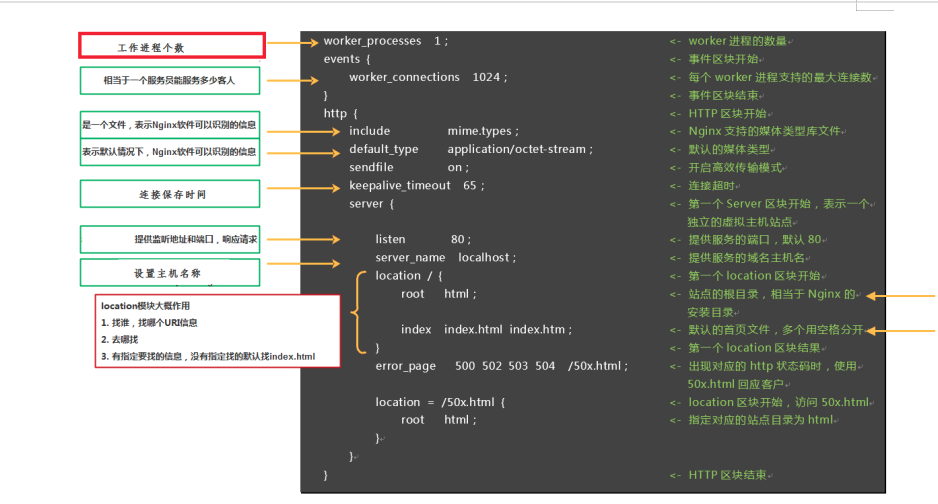

### 详细解析

配置语法说明：

1、配置文件由指令与指令块构成

2、每条指令以;分号结尾，指令与参数间以空格符号分隔

3、配置文件由指令与指令块构成

4、指令块以｛｝大括号将多条指令组织在一起

5、使用#符号添加注释，提高可读性

6、include语句允许组合多个配置文件以提升可维护性

7、使用$符号使用变量

8、部分指令的参数支持正则表达式

Nginx的各种指令以及配置繁多，我们前面会讲些常用配置，后期会讲解一些优化配置，有些配置可以在如下的链接https://tengine.taobao.org/nginx_docs/cn/docs/或者在官方文档上查看

配置块： server

由于IP地址的数量有限，因此经常存在多个主机域名对应着同一个IP地址的情况，这时在nginx.conf中就可以按照server_name（对应用户请求中的主机域名）并通过server块来定义虚拟主机，每个server块就是一个虚拟主机，它只处理与之相对应的主机域名请求。这样，一台服务器上的Nginx就能以不同的方式处理访问不同主机域名的HTTP请求了

语法：

主机名称

语法： server_name name[...];

默认： server_name"";

配置块： server

虚拟主机名可以使用确切的名字，通配符，或者是正则表达式来定义,在开始处理一个HTTP请求时，Nginx会取出header头中的Host，与每个server中的server_name进行匹配，以此决定到底由哪一个server块来处理这个请求。有可能一个Host与多个server块中的server_name都匹配，这时就会根据匹配优先级来选择实际处理的server块。

server_name与Host的匹配优先级如下：

1）首先选择所有字符串完全匹配的server_name，如nginx.2367.com 。

2）其次选择通配符在前面的server_name，如*.2367.com。

3）再次选择通配符在后面的server_name，如nginx.2367.* 。

4）最后选择使用正则表达式才匹配的server_name，如~^\.testweb\.com$如果都不匹配

1、优先选择listen配置项后有default或default_server的

2、找到匹配listen端口的第一个server块

配置块: location

location

语法： location[=|~|~*|^~|@]/uri/{...}

配置块： server

location会尝试根据用户请求中的URI来匹配上面的/uri表达式，如果可以匹配，就选择

location{}块中的配置来处理用户请求。当然，匹配方式是多样的，下面介绍location的匹配

规则。

location表达式类型

~ 表示执行一个正则匹配，区分大小写；

~* 表示执行一个正则匹配，不区分大小写；

^~ 表示普通字符匹配。使用前缀匹配。如果匹配成功，则不再匹配其他location；

= 进行普通字符精确匹配。也就是完全匹配；

@ 它定义一个命名的 location，使用在内部定向时，例如 error_page, try_files

优先级：

等号类型（=）的优先级最高。一旦匹配成功，则不再查找其他匹配项

前缀普通匹配(^~)优先级次之。不支持正则表达式。使用前缀匹配，如果有多个location匹配的话，则使用表达式最长的那个

正则表达式类型（~ ~*）的优先级次之。一旦匹配成功，则不再查找其他匹配项

常规字符串匹配，如果有多个location匹配的话，则使用表达式最长的那个

(location =) > (location 完整路径) > (location ^~ 路径) > (location ~,~* 正则顺序) > (location 部分起始路径)

文件路径的定义：

以root方式设置资源路径

语法： root path;

配置块： http、server、location、if

以alias方式设置资源路径

语法： alias path;

配置块： location

alias也是用来设置文件资源路径的，它与root的不同点主要在于如何解读紧跟location后面的uri参数

 注意： location中使用root指令和alias指令的意义不同  

(a) root，相当于追加在root目录后面 。比如访问的是 xxx/test=>/www/test

(b) alias，相当于对location中的url进行替换，比如访问的是 xxx/test，想要访问到/www/test就必须设置 alias  /www/test

## nginx常用命令

1、查看Nginx的版本号：nginx -V

2、停止 nginx -s stop

3、退出 nginx -s quit

4、重启加载配置 nginx -s reload

5、配置文件启动 nginx  -c </path/to/config> 为 Nginx 指定一个配置文件，来代替缺省的

6、nginx  -t 不运行，而仅仅测试配置文件。nginx 将检查配置文件的语法的正确性，并尝试打开配置文件中所引用到的文件。

### nginx控制信号

再次回过头看看nginx的原理图，我们还可以通过信号，去操作nginx，默认，nginx 将其主进程的 pid 写入到 /usr/local/nginx/nginx.pid 文件中

| TERM, INT | 快速关闭                                                 |
| --------- | -------------------------------------------------------- |
| QUIT      | 从容关闭                                                 |
| HUP       | 重载配置 用新的配置开始新的工作进程 从容关闭旧的工作进程 |
| USR1      | 重新打开日志文件                                         |
| USR2      | 平滑升级可执行程序。                                     |
| WINCH     | 从容关闭工作进程                                         |

nginx停止命令，等所有请求结束后关闭服务

```sh
kill -QUIT  nginx主进程号
```

重新载入配置

```sh
kill -HUP  nginx主进程号
```

可以回过头看看我们之前封装的web，同样可以引入信号机制实现重载

## nginx常用模块了解及使用

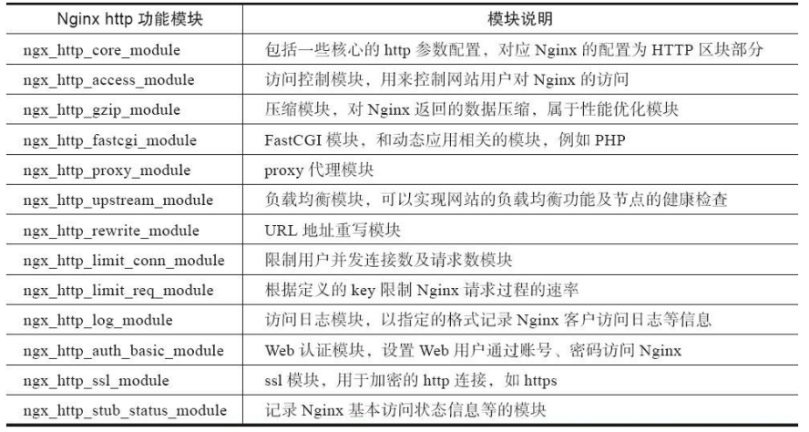

## 访问控制模块

用来对特定IP的进行访问控制
默认是允许所有ip访问，若部分允许需定义deny all

* allow
语法:  allow address | CIDR | unix: | all;
默认值:    —
区块: http, server, location, limit_except

允许某个ip或者一个ip段访问

* deny
语法:    deny address | CIDR | unix: | all;
默认值:    —
区块:    http, server, location, limit_except

allow、deny实例

``` yaml
location / {
  deny 192.168.1.1;
  allow 192.168.1.0/24;

  allow 47.98.147.49;
  deny all;
}
```

比如可以限制某些目录下的某些文件的访问，具体可以自己组合

禁止访问所有目录下的sql|log|txt|jar|sh|py后缀的文件，

``` yaml
location ~.*\.(sql|log|txt|jar|war|sh|py) {

   deny all;

}
```

### ngx_http_log_module

请求在处理结束时，会按请求路径的配置上下文记访问日志,通过访问日志，你可以得到用户地域来源、跳转来源、使用终端、某个URL访问量等相关信息；通过错误日志，你可以得到系统某个服务或server的性能瓶颈等。

默认日志格式：

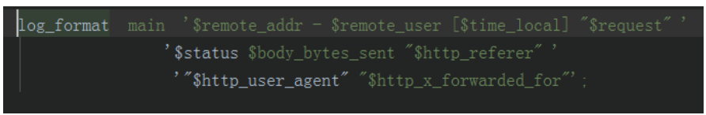

语法:**access_log***path* [*format* [buffer=*size*]];

**access_log** off;

默认值:

access_log logs/access.log combined;

上下文:http, server, location, if in location, limit_except


## 对客户端进行限制相关配置

一般在下面的需求：

秒杀、抢购并发限制

下载带宽限制

防止攻击


[limit_req_zone](http://nginx.org/en/docs/http/ngx_http_limit_req_module.html) 用来限制单位时间内的请求数，即速率限制,采用的漏桶算法

[limit_req_conn](http://nginx.org/en/docs/http/ngx_http_limit_conn_module.html) 用来限制同一时间连接数，即并发限制

### nginx限制连接数ngx_http_limit_conn_module模块

1、用于限制每个已定义键的连接数特别是来自单个IP地址的连接数。并不是所有的连接都被计算在内。只有当服务器处理了一个请求，并且整个请求头已经被读取时，才会计算连接。

语法: limit_conn_zone $binary_remote_addr zone=addr:10m;

默认值: none

配置段: http

例子：limit_conn_zone $binary_remote_addr zone=addr:10m;

说明：区域名称为addr，大小为10m，键值是客户端IP。

如果限制域的存储空间耗尽了，对于后续所有请求，服务器都会返回 503 (Service Temporarily Unavailable)错误。

2、设置允许一个IP同时的连接数。

limit_conn

语法: limit_conn zone number;

默认值: none

配置段:http, server, location

例子：
```yaml
limit_conn_zone $binary_remote_addr  zone=addr:10m;

 server { 

location /video/ { 

if(1){

limit_conn addr 1;

}

}

 }
```

### nginx限制请求数limit_req_zone

语法: limit_req_zone $variable zone=name:size rate=rate;

默认值: none

配置段: http

例子：limit_req_zone $binary_remote_addr zone=one:10m rate=1r/s;

Zone=one  表示设置了名为“one”，大小为10兆字节

rate=10r/s 的意思是允许1秒钟不超过10个请求

使用$binary_remote_addr变量，可以将每条状态记录的大小减少到64个字节，这样1M的内存可以保存大约1万6千个64字节的记录。

如果限制域的存储空间耗尽了，对于后续所有请求，服务器都会返回 503 (Service Temporarily Unavailable)错误。

速度可以设置为每秒处理请求数和每分钟处理请求数，其值必须是整数，所以如果你需要指定每秒处理少于1个的请求，2秒处理一个请求，可以使用 “30r/m”。

可选参数：

rate=10r/s 的意思是允许1秒钟不超过10个请求

burst=5 允许超过频率限制的请求数不多于5个，假设1、2、3、4秒请求为每秒9个，那么第5秒内请求15个是允许的，反之，如果第一秒内请求15个，会将5个请求放到第二秒，第二秒内超过10的请求直接503，类似多秒内平均速率限制。

nodelay 超过的请求不被延迟处理，设置后15个请求在1秒内处理。

limit_rate 限制带宽

## 关于漏桶算法

漏桶(Leaky Bucket)算法思路很简单,水(请求)先进入到漏桶里,漏桶以一定的速度出水(接口有响应速率),当水流入速度过大会直接溢出(访问频率超过接口响应速率),然后就拒绝请求,可以看出漏桶算法能强行限制数据的传输速率.示意图如下:

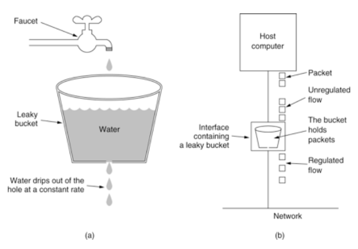

可见这里有两个变量,一个是桶的大小,支持流量突发增多时可以存多少的水(burst),另一个是水桶漏洞的大小(rate)，

## Nginx 白名单设置

连接限制跟请求限制，会对所有的ip进行限制，我们不希望自己的测试的ip,或者搜索引擎蜘蛛受到限制ngx_http_geo_module 模块创建变量，并根据客户端IP地址对变量赋值

| 语法:   | geo [$address] $variable { ... } |
| ------- | -------------------------------- |
| 默认值: | —                                |
| 上下文: | http                             |

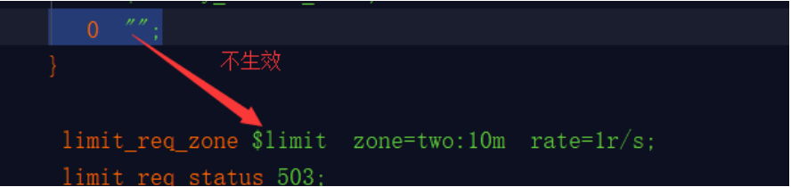

请求失败的结果

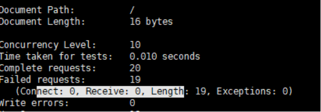

```sh
ab -n20 -c10 http://127.0.0.1/ 
```

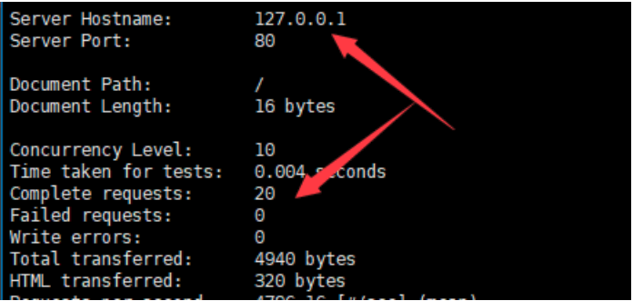

## rewrite模块（ngx_http_rewrite_module）

rewrite的主要功能是实现URL地址的重定向。Nginx的rewrite功能需要PCRE软件的支持，即通过perl兼容正则表达式语句进行规则匹配的。默认参数编译nginx就会支持rewrite的模块，但是也必须要PCRE的支持。

使用场景：

  1、可以调整用户浏览的URL，看起来更规范，合乎开发及产品人员的需求。

 2、为了让搜索引擎搜录网站内容及用户体验更好，企业会将动态URL地址伪装成静态地址提供服务。 

3、网址换新域名后，让旧的访问跳转到新的域名上。例如，访问京东的360buy.com会跳转到jd.com

4、根据特殊变量、目录、客户端的信息进行URL调整等

### if指令

语法：if(condition){…}
区块：[server](https://www.songliguo.com/tag/server)，location

该指令用于检查一个条件是否符合，如果条件符合，则执行大括号内的语句。if指令不支持嵌套，不支持多个条件&&和||处理。

其中，condition中可以包含的判断标识如下

~为区分大小写匹配

~*为不区分大小写匹配

-f和!-f用来判断是否存在文件

-d和!-d用来判断是否存在目录

-e和!-e用来判断是否存在文件或目录

-x和!-x用来判断文件是否可执行

```sh
 if ($http_user_agent~*(mobile|nokia|iphone|ipad|android|samsung|htc|blackberry)) {

   rewrite  ^(.*)   http://peter.23673.com$1 permanent;

 }
```

### return指令

语法：return code [text]
return code URL;
return URL;

区块：server，location，if

该指令用于结束规则的执行并返回状态吗给客户端。

状态码包括：204（No Content）、400（Bad Request）、402（Payment Required）、403（Forbidden）、404（Not Found）、405（Method Not Allowed）、406（Not Acceptable）、408（Request Timeout）、410（Gone）、411（Length Required）、413（Request Entity Too Large）、416（Requested Range Not Satisfiable）、500（Internal Server Error）、501（Not Implemented）、502（Bad Gateway）、503（Service Unavailable）和504（Gateway Timeout）。

例如，示例，如果访问的URL以.sh .bash 结尾，返回状态码403

```sh
location ~ .*\.(sh|bash)?$

{

return  403;

}
```
 

### Rewrite语法

语法:**rewrite** **regex** **replacement** [**flag**];

默认值:—

上下文:server, location, if

 rewrite是实现URL重写的关键指令，根据regex（正则表达式）部分内容，重定向到replacement，结尾是flag标记。

  正则：perl兼容正则表达式语句进行规则匹配

  替代内容：将正则匹配的内容替换成replacement

  flag标记：rewrite支持的flag标记

last标记说明：

last #本条规则匹配完成后，继续向下匹配新的location URI规则

结束当前的请求处理，用替换后的URI重新匹配location；

可理解为重写（rewrite）后，发起了一个新请求，进入server模块，匹配locaton；

如果重新匹配循环的次数超过10次，nginx会返回500错误；

break #本条规则匹配完成即终止，不再匹配后面的任何规则

结束当前的请求处理，使用当前资源，不在执行location里余下的语句

redirect #返回302临时重定向，浏览器地址会显示跳转后的URL地址

permanent #返回301永久重定向，浏览器地址栏会显示跳转后的URL地址

### 案例：Nginx 重写 url实现伪静态

```
# 商品页面
goods-3.html ---->goods.php?id=3

# 栏目页面 
/ecshop/category-2-b1.html -> /ecshop/category.php?id=3&brand=1
```

## nginx防盗链实现

语法:	valid_referers none | blocked | server_names | string ...;

默认值:	—

上下文:	server, location

“Referer”请求头为指定值时，内嵌变量$invalid_referer被设置为空字符串， 否则这个变量会被置成“1”。查找匹配时不区分大小写。

该指令的参数可以为下面的内容：

none

缺少“Referer”请求头；

blocked

“Referer” 请求头存在，但是它的值被防火墙或者代理服务器删除； 这些值都不以“http://” 或者 “https://”字符串作为开头；

server_names

“Referer” 请求头包含某个虚拟主机名；

防止别人直接从你网站引用图片等链接，消耗了你的资源和网络流量，那么我们的 就可以设置防盗链策略下面的方法是直接给予404的错误提示，或者是显示一个图片

``` sh
location ~* ^.+\.(jpg|gif|png|swf|flv|wma|wmv|asf|mp3|mmf|zip|rar)$ {

  valid_referers none blocked  www.23673.com  23673.com;

  if ($invalid_referer) {

​    #return 302  http://nginx.23673.com/img/nolink.jpg;

​    return 404;

​    break;

   }
```

## nginx内置变量说明

Nginx 同 Apache 和 Lighttpd 等其他 Web 服务器的配置记法不太相同，Nginx的配置文件使用语法的就是一门微型的编程语言。可以类似写程序一般编写配置文件，可操作性很大。既然是编程语言，一般也就少不了“变量”这种东西。

所有的 Nginx变量在 Nginx 配置文件中引用时都须带上 $ 前缀在 Nginx 配置中，变量只能存放一种类型的值，有且也只存在一种类型，那就是字符串类型

使用  set 配置指令对变量 $a 进行了赋值操作

``` sh
set $hello "hello world";
```

Nginx 变量一旦创建，其变量名的可见范围就是整个 Nginx 配置，甚至可以跨越不同虚拟主机的 server 配置块

Nginx变量名的可见范围虽然是整个配置，但每个请求都有所有变量的独立副本，或者说都有各变量用来存放值的容器的独立副本，彼此互不干扰

### nginx内置变量

内置变量存放在ngx_http_core_module 模块中

参数名称 注释

$arg_PARAMETER HTTP 请求中某个参数的值，如/index.php?site=www.ttlsa.com，可以用$arg_site取得www.ttlsa.com这个值.

$args HTTP 请求中的完整参数。例如，在请求/index.php?width=400&height=200 中，$args表示字符串width=400&height=200.

$binary_remote_addr 二进制格式的客户端地址。例如：\x0A\xE0B\x0E

$body_bytes_sent 表示在向客户端发送的http响应中，包体部分的字节数

$content_length 表示客户端请求头部中的Content-Length 字段

$content_type 表示客户端请求头部中的Content-Type 字段

$cookie_COOKIE 表示在客户端请求头部中的cookie 字段

$document_root 表示当前请求所使用的root 配置项的值

$uri 表示当前请求的URI，不带任何参数

$document_uri 与$uri 含义相同

$request_uri 表示客户端发来的原始请求URI，带完整的参数。$uri和$document_uri未必是用户的原始请求，在内部重定向后可能是重定向后的URI，而$request_uri 永远不会改变，始终是客户端的原始URI.

$host 表示客户端请求头部中的Host字段。如果Host字段不存在，则以实际处理的server（虚拟主机）名称代替。如果Host字段中带有端口，如IP:PORT，那么$host是去掉端口的，它的值为IP。$host 是全小写的。这些特性与http_HEADER中的http_host不同，http_host只取出Host头部对应的值。

$hostname 表示 Nginx所在机器的名称，与 gethostbyname调用返回的值相同 

$http_HEADER 表示当前 HTTP请求中相应头部的值。HEADER名称全小写。例如，示请求中 Host头部对应的值 用 $http_host表

$sent_http_HEADER 表示返回客户端的 HTTP响应中相应头部的值。HEADER名称全小写。例如，用 $sent_ http_content_type表示响应中 Content-Type头部对应的值 

$is_args 表示请求中的 URI是否带参数，如果带参数，$is_args值为 ?，如果不带参数，则是空字符串 

$limit_rate 表示当前连接的限速是多少，0表示无限速 

$nginx_version 表示当前 Nginx的版本号 

$query_string 请求 URI中的参数，与 $args相同，然而 $query_string是只读的不会改变 

$remote_addr 表示客户端的地址 

$remote_port 表示客户端连接使用的端口 

$remote_user 表示使用 Auth Basic Module时定义的用户名 

$request_filename 表示用户请求中的 URI经过 root或 alias转换后的文件路径 

$request_body 表示 HTTP请求中的包体，该参数只在 proxy_pass或 fastcgi_pass中有意义 

$request_body_file 表示 HTTP请求中的包体存储的临时文件名 

$request_completion 当请求已经全部完成时，其值为 “ok”。若没有完成，就要返回客户端，则其值为空字符串；或者在断点续传等情况下使用 HTTP range访问的并不是文件的最后一块，那么其值也是空字符串。

$request_method 表示 HTTP请求的方法名，如 GET、PUT、POST等 

$scheme 表示 HTTP scheme，如在请求 https:**//nginx.com/中表示 https** 

$server_addr 表示服务器地址 

$server_name 表示服务器名称 

$server_port 表示服务器端口 

$server_protocol 表示服务器向客户端发送响应的协议，如 HTTP/1.1或 HTTP/1.0

## nginx缓存机制

 **什么是缓存？**

 Web缓存是可以自动保存常见文档副本的HTTP 设备。当Web请求抵达缓存时，如果本地有“已缓存的”副本，就可以从本地设备而不是服务器中提取这个文档。

### 为什么使用缓存？

缓存减少了冗余的数据传输，节约了网络费用

缓存缓解了网络瓶颈的问题，对于带宽的要求

缓存降低了对原始服务器的要求，降低服务器压力

缓存加速了页面的展示

  **缓存的分类：**

缓存分为服务端侧（比如 Nginx,redis,memcached）和客户端侧（比如 web browser）。

服务端缓存又分为 代理服务器缓存 和 反向代理服务器缓存（也叫网关缓存，比如 Nginx反向代理就可以设置缓存）

客户端侧缓存一般指的是浏览器缓存、app缓存等等，目的就是加速各种静态资源的访问，降低服务器压力。

简单看看浏览器的缓存规则：

  第一次访问某个网站

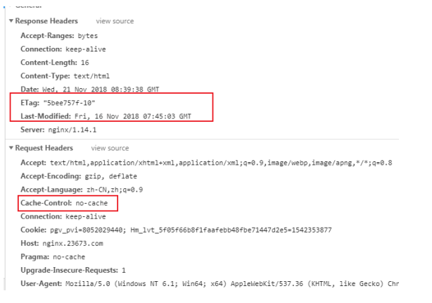

## 第二次访问某个网站

我们发现多了一些字段关于这些字段的详细介绍下面会讲

## HTTP 缓存控制头介绍

HTTP 中最基本的缓存机制，涉及到的 HTTP 头字段，包括 Cache-Control, Last-Modified, If-Modified-Since, Etag, If-None-Match 等

### Last-Modified/If-Modified-Since

Last-Modified：标示这个响应资源的最后修改时间。web服务器在响应请求时，告诉浏览器资源的最后修改时间。

If-Modified-Since：当资源过期时（使用Cache-Control标识的max-age），发现资源具有Last-Modified声明，则再次向web服务器请求时带上头 If-Modified-Since，表示请求时间。web服务器收到请求后发现有头If-Modified-Since 则与被请求资源的最后修改时间进行比对。若最后修改时间较新，说明资源又被改动过，则响应整片资源内容（写在响应消息包体内），HTTP 200；若最后修改时间较旧，说明资源无新修改，则响应HTTP 304 (无需包体，节省浏览)，告知浏览器继续使用所保存的cache。

当我们按下f5刷新的时候，我们看看浏览器发送的请求头：

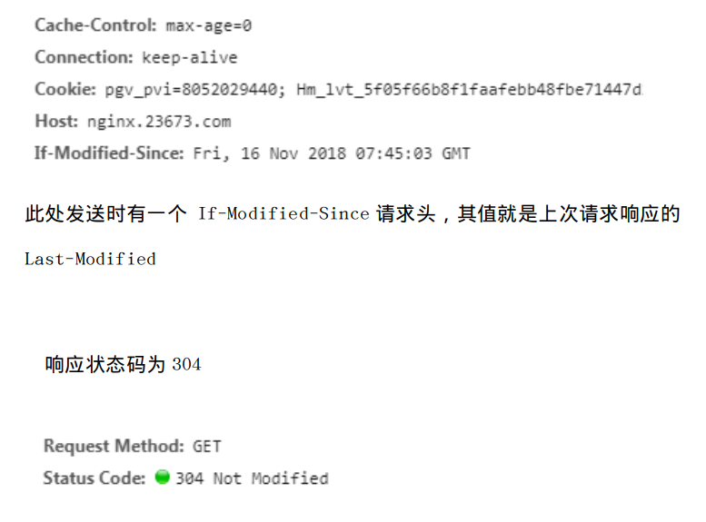

### Ctrl+f5强制刷新

如果你想强制从服务器获取最新的内容，不去对比，那么就可以强制刷新

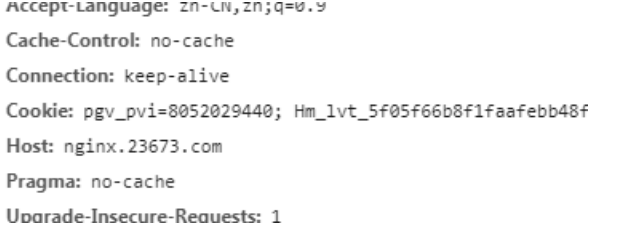

Pragma行是为了兼容HTTP1.0，作用与Cache-Control: no-cache是一样的 Etag/If-None-Match

Etag：web服务器响应请求时，告诉浏览器当前资源在服务器的唯一标识（生成规则由服务器觉得）。

If-None-Match：当资源过期时（使用Cache-Control标识的max-age），发现资源具有Etage声明，则再次向web服务器请求时带上头If-None-Match （Etag的值）。web服务器收到请求后发现有头If-None-Match 则与被请求资源的相应校验串进行比对，决定返回200或304。

 Etag是啥：

Last-Modified标注的最后修改只能精确到秒级，如果某些文件在1秒钟以内，被修改多次的话，它将不能准确标注文件的修改时间

如果某些文件会被定期生成，当有时内容并没有任何变化，但Last-Modified却改变了，导致文件没法使用缓存

有可能存在服务器没有准确获取文件修改时间，或者与代理服务器时间不一致等情形

Etag是服务器自动生成或者由开发者生成的对应资源在服务器端的唯一标识符，能够更加准确的控制缓存。Last-Modified与ETag是可以一起使用的，服务器会优先验证ETag，一致的情况下，才会继续比对Last-Modified，最后才决定是否返回304。

如下所示：

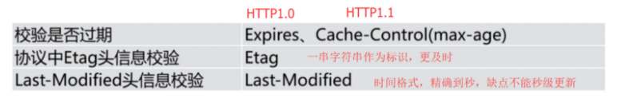

浏览器第一次请求，无缓存状态

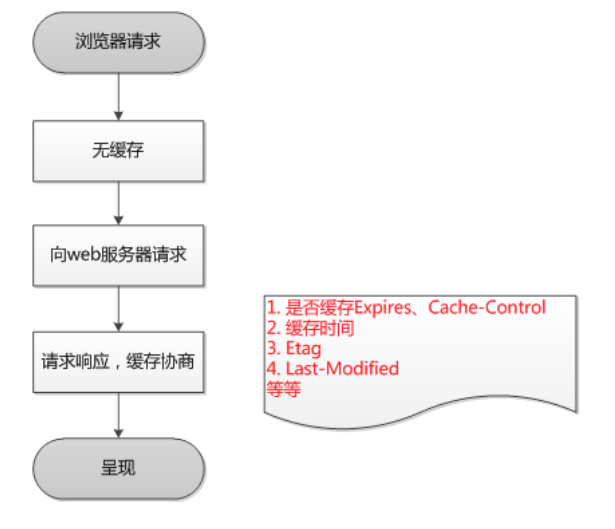

浏览器第二次请求

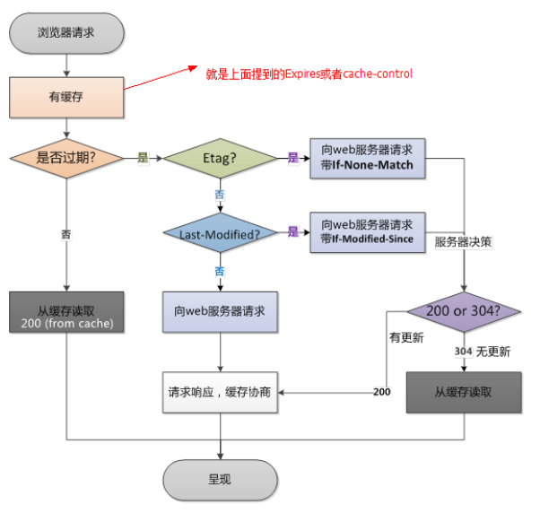

## Nginx  web缓存设置

nginx提供了expires、etag、if-modified-since指令来进行浏览器缓存控制。

## expires

假设我们使用nginx作为静态资源服务器，此时可以使用expires进行缓存控制。

```sh
​    location /img {

​     alias /export/img/;

​     expires 10s;

​    }
```

expires 30s;#30秒 

expires 30m;#30分钟 

expires 2h;#2个小时 

expires 30d;#30天

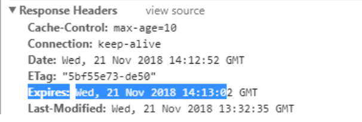

## Gzip指令

   nginx中gzip的主要作用就是用来减轻服务器的带宽问题，经过gzip压缩后的页面大小可以变为原来的30%甚至更小，这样用户浏览页面时的速度会快很多。gzip的压缩页面需要浏览器和服务器双方都支持，实际上就是服务器端压缩，传到浏览器后浏览器解压缩并解析。目前的大多数浏览器都支持解析gzip压缩过的页面。

参数说明：

gzip

语法:gzip on | off;

默认值:gzip off;

作用域:http, server, location, if in location

说明： 

启用或禁用gzip压缩模块，on表示启用，off表示禁用

gzip_min_length

语法:gzip_min_length length;

默认值:gzip_min_length 20;

作用域:http, server, location

说明： 

设置允许压缩的页面最小字节数，页面字节数从header头中的Content-Length中进行获取。因为过小的文件内容压缩之后效果不明显，甚至会比不压缩时更大，所以一般建议长度不小于1000或1k。

响应头响应浏览器使用gzip解压


### gzip_buffers

语法:gzip_buffers number size;

默认值:gzip_buffers 32 4k|16 8k;

作用域:http, server, location

说明： 

设置response响应的缓冲区大小。32 4k代表以4k为单位将响应数据以4k的32倍(128k)的大小申请内存。如果没有设置，缓冲区的大小默认为整个响应页面的大小。

### gzip_comp_level

语法:gzip_comp_level level;

默认值:gzip_comp_level 1;

作用域:http, server, location

说明： 

设置gzip的压缩级别，可接受的范围是从1到9，数字越大压缩率越高，但更消耗CPU，一般设置6即可。

### gzip_types

语法:gzip_types mime-type ...;

默认值:gzip_types text/html;

作用域:http, server, location

说明： 

指定哪些类型的相应才启用gzip压缩，多个用空格分隔。通配符”*”可以匹配任意类型。不管是否指定”text/html”类型，该类型的响应总是启用压缩。一般js、css等文本文件都启用压缩，如application/x-javascript text/css application/xml 等。具体的文件类型对应的mimi-type可以参考conf/mime.types文件。

### gzip_http_version

语法:gzip_http_version 1.0 | 1.1;

默认值:gzip_http_version 1.1;

作用域:http, server, location

说明： 

设置gzip压缩所需要的请求的最小HTTP版本，低于该版本不使用gzip压缩。一般不用修改，默认即可。

### gzip_disable

gzip_disable “MSIE [1-6]\.”

语法:gzip_disable regex ...;

默认值:—

作用域:http, server, location

说明： 

这个指令是在0.6.23版本增加的。 

如果请求的”User-Agent”头信息能被指定的正则表达式匹配，则对响应禁用gzip压缩功能。主要是为了兼容不支持gzip压缩的浏览器，比如IE6，不过IE6早就废弃了

浏览器和服务器进行gzip压缩的请求和处理返回过程

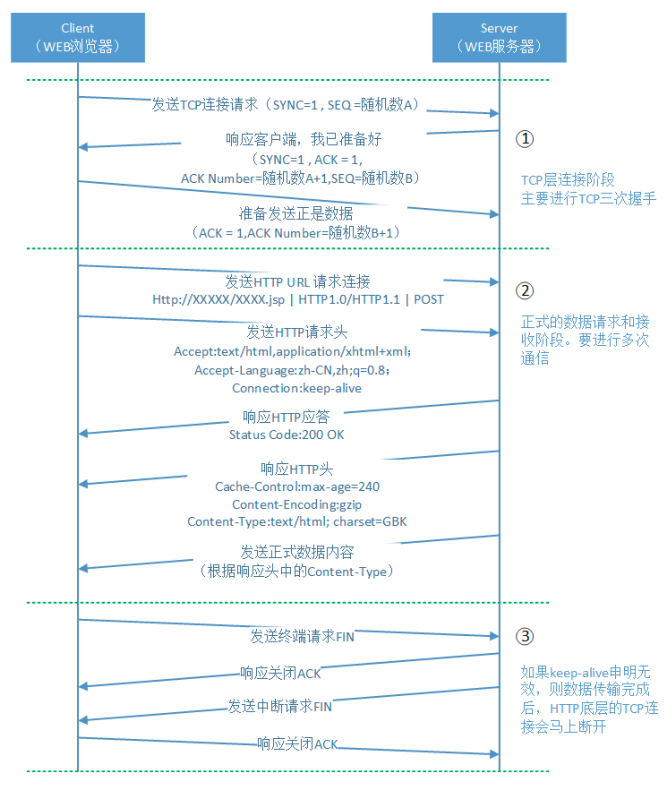

整个请求过程来看，开启gzip和不开启gip功能，其http的请求和返回过程是一致的，不同的是参数。

当开启HTTP的gzip功能时，客户端发出http请求时，会通过headers中的Accept-Encoding属性告诉服务器“我支持gzip解压，解压格式（算法）deflate,sdch为：”。Accept-Encoding:gzip,deflate,sdch

注意，不是request说自己支持解压，Nginx返回response数据的时候就一定会压缩。这还要看本次Nginx返回数据的格式是什么，如果返回数据的原始数据格式，和设置的gzip_types相符合，这时Nginx才会进行压缩。

Nginx返回response headers是，如果数据被压缩了，就会在Content-Encoding属性中标示gzip，表示接下来返回的response 

content是经过压缩的；并且在Content-Type属性中表示数据的原始格式。

最后返回经过压缩的response content给客户端，客户端再进行解压。这里注意一下，在客户端发送的headers里面，有一个deflate,sdch。这是两种压缩算法

**ngx_http_proxy_module**

 Proxy模块，用于把请求后抛给服务器节点或upstream服务器池

  常用配置，具体看手册

请求头传递

```
proxy_redirect off ;

​     proxy_set_header Host $host;

​    proxy_set_header X-Real-IP $remote_addr;

​    proxy_set_header REMOTE-HOST $remote_addr;

​       proxy_set_header X-Forwarded-For $proxy_add_x_forwarded_for;

   client_max_body_size 50m;

   client_body_buffer_size 256k;

​     proxy_connect_timeout 30;

​     proxy_send_timeout 30;

​    proxy_read_timeout 60;

​     proxy_buffer_size 256k;

​     proxy_buffers 4 256k;

​    proxy_busy_buffers_size 256k;

​    proxy_temp_file_write_size 256k;

​    proxy_max_temp_file_size 128m;

​     proxy_pass http://nginx.23673.com;
```

## 缓存细节

  NGINX仅仅默认缓存GET和HEAD客户端请求，在响应头部中Cache-Control被配置为Private，No-Cache，No-Store或者Set-Cookie，NGINX不会进行缓存。

 如果你不想源服务器控制是否缓存，也可以在nginx当中配置忽略利用proxy_ignore_headers Cache-Control 指令实现

下面的指令允许多种请求类型缓存

```yaml
proxy_cache_methods GET HEAD POST;
```

## 缓存设置优化

[proxy_cache_min_uses](http://nginx.org/r/proxy_cache_min_uses?_ga=1.82886422.1235345339.1438303904)设置响应被缓存的最小请求次数。

当缓存不断被填满时，这项设置便十分有用，因为这确保了只有那些被经常访问的内容才会被添加到缓存中。该项默认值为1。

[proxy_cache_lock](#proxy_cache_lock) 开启此功能时，对于相同的请求，同时只允许一个请求发往后端。

只有这些请求中的第一个被允许发送至服务器。其他请求在第一个请求得到满意结果之后在缓存中得到文件。如果不启用proxy_cache_lock，则所有在缓存中找不到文件的请求都会直接与源服务器通信。

有时候，我们也不想所有的请求都被缓存，我们可以指定某些请求不被缓存，比如带有后台后缀的，可以通过一些条件判断决定是否缓存。

语法:	proxy_cache_bypass string ...;

默认值:	—

上下文:	http, server, location

定义nginx不从缓存取响应的条件。如果至少一个字符串条件非空而且非“0”，nginx就不会从缓存中去取响应,而是请求源服务器

## 清除缓存

某些时候我们如果不想等待缓存的过期，想要主动清除缓存，可以采用第三方的缓存清除模块清除缓存nginx_ngx_cache_purge

第三方地址 https://www.nginx.com/resources/wiki/modules/ 

Purge 模块下载地址 http://labs.frickle.com/nginx_ngx_cache_purge/

可以利用平滑升级的方式安装

proxy_cache_purge tmp-test $uri; 

tmp-test：指定的key_zone

$uri：指定的生成key的参数

## 半自动平滑升级

所谓半自动，其实就是在最后迁移的时候使用源码自带的升级命令：make upgrade 来自动完成

1、需要下载对应的需要加载的第三方的扩展，或者是需要附加设置的参数

--add_module=PATH  添加第三方扩展

2、执行make不要执行make install 

3、重命名 nginx 旧版本二进制文件，即 sbin 目录下的 nginx（期间 nginx 并不会停止服务）

4、然后拷贝一份新编译的二进制文件到安装目录

5、在源码目录执行 make upgrade 开始升级：

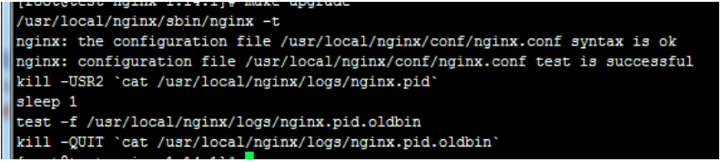

## nginx负载均衡

 当我们的应用单例不能支撑用户请求时，此时就需要扩容，从一台服务器扩容到两台、几十台、几百台，我们需要一个入口，将客户端请求均衡分布在后台的多个服务器上。

负载均衡在服务端开发中算是一个比较重要的特性，nginx提供的负载均衡可以实现上游服务器的负载均衡、故障转移、失败重试、容错、健康检查，当某些上游服务器出现问题时，可以将请求转到其它的上游服务器从而保障高可用。

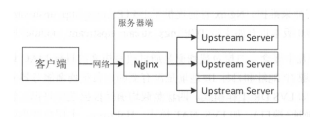

第一步我们需要给nginx配置上游服务器，即负载均衡到真实的处理业务的服务器

通过在http指令下配置upstream即可。

语法:	upstream name { ... }

默认值:	—

上下文:	http

例子：

``` sh
upstream backend {

  server  backend1.example.com    weight=5;

  server  backend2.example.com:8080;

}

server {

  location / {

​    proxy_pass http://backend;

  }

}
```

upstream 指令当中包含server指令

语法:	server address [parameters];

默认值:	—

上下文:	upstream

可以定义下面的参数：

weight=number 设定服务器的权重，默认是1，权重越大被访问机会越大，要根据机器的配置情况来配置

max_fails=number 设定Nginx与服务器通信的尝试失败的次数。在fail_timeout参数定义的时间段内，如果失败的次数达到此值，Nginx就认为服务器不可用。在下一个fail_timeout时间段，服务器不会再被尝试。 失败的尝试次数默认是1。

可以通过指令proxy_next_upstream 和memcached_next_upstream来配置什么是失败的尝试。 默认配置时，http_404状态不被认为是失败的尝试。

fail_timeout=time

统计失败尝试次数的时间段。在这段时间中，服务器失败次数达到指定的尝试次数，服务器就被认为不可用。默认情况下，该超时时间是10秒。

backup

标记为备用服务器。当主服务器不可用以后，请求会被传给这些服务器，配置这个指令可以实现故障转移。

down

标记服务器永久不可用，可以跟[ip_hash](#ip_hash)指令一起使用。

当访问Nginx时，会将请求反向代理到backend配置的upstream server。

## 负载均衡的方法

nginx支持以下负载均衡机制：

1、 轮询

默认轮训方式

每一个来自网络中的请求，轮流分配给内部的服务器，从1到N然后重新开始。此种负载均衡算法适合服务器组内部的服务器都具有相同的配置并且平均服务请求相对均衡的情况。

2、加权轮询

通过weight参数控制权重

根据服务器的不同处理能力，给每个服务器分配不同的权值，使其能够接受相应权值数的服务请求。例如：服务器A的权值被设计成1，B的权值是3，C的权值是6，则服务器A、B、C将分别接受到10%、30％、60％的服务请求。此种均衡算法能确保高性能的服务器得到更多的使用率，避免低性能的服务器负载过重。

4、IP Hash

在upstream当中配置ip_hash;

这种方式通过生成请求源IP的哈希值，并通过这个哈希值来找到正确的真实服务器。这意味着对于同一主机来说他对应的服务器总是相同。使用这种方式，你不需要保存任何源IP。

将客户端会话"沾住"或者"持久化"，以便总是能选择特定服务器，那么可以使用ip-hash负载均衡机制。

使用ip-hash时，客户端IP地址作为hash key使用，用来决策选择服务器集群中的哪个服务器来处理这个客户端的请求。这个方法保证从同一个客户端发起的请求总是定向到同一台服务器，除非服务器不可用。

5、最少连接数

在upstream当中配置least_conn实现最少连接数

客户端的每一次请求服务在服务器停留的时间可能会有较大的差异，随着工作时间加长，如果采用简单的轮循或随机均衡算法，每一台服务器上的连接进程可能会产生极大的不同，并没有达到真正的负载均衡。最少连接数均衡算法对内部中需负载的每一台服务器都有一个数据记录，记录当前该服务器正在处理的连接数量，当有新的服务连接请求时，将把当前请求分配给连接数最少的服务器，使均衡更加符合实际情况，负载更加均衡。

## 失败重试

通过配置上游服务器max_fails和 fail_timeout，指定每个上游服务器，当fail_timeout时间内失败了max_fails次请求，则认为该上游服务器不可用/不存活，然后这段时间将不会访问这台上游服务器，fail_timeout时间后会再次进行重试。

max_fails=2  fail_timeout=30s  这2个一起搭配使用，表示：当失败2次的时候，就停止使30秒

好处：

既可以避免重复请求，不能访问或者暂时不能访问的服务，增大服务器的压力，也可以灵活的做到当服务器可用时再次访问。

## proxy_next_upstream 指令

在nginx的配置文件中，proxy_next_upstream 项定义了什么情况下进行重试

语法: proxy_next_upstream error | timeout | invalid_header | http_500 | http_502 http_503 | http_504 |http_404 | off ...;

默认值: proxy_next_upstream error timeout;

上下文: http, server, location

其中：
error  表示和后端服务器建立连接时，或者向后端服务器发送请求时，或者从后端服务器接收响应头时，出现错误。
timeout  表示和后端服务器建立连接时，或者向后端服务器发送请求时，或者从后端服务器接收响应头时，出现超时。
invalid_header  表示后端服务器返回空响应或者非法响应头
http_500  表示后端服务器返回的响应状态码为500

.............
off  表示停止将请求发送给下一台后端服务器

### 重试不能无限制进行，因此，需要如下两个指令控制重试次数和重试超时时间

​     •proxy_next_upstream_tries  number：设置重试次数，默认0表示不限制，注意此重试次数指的是所有请求次数（包括第一次和之后的重试次数之和）。

​     proxy_next_upstream_timeout time：设置重试最大超时时间，默认0表示不限制。

​    即在proxy_next_upstream_timeout时间内允许proxy_next_upstream_tries次重试。如果超过了其中一个设置，则Nginx也会结束重试并返回客户端响应（可能是错误码）。

proxy_send_timeout   后端服务器数据回传时间(代理发送超时时间)

proxy_read_timeout     连接成功后，后端服务器响应时间(代理接收超时时间)

proxy_connect_timeout   nginx连接后端的超时时间，一般不超过75s

## backup(故障转移)

标记为备用服务器。当主服务器不可用以后，请求会被传给这些服务器。

down

标记服务器永久不可用，可以跟[ip_hash](#ip_hash)指令一起使用。

## 动态负载均衡

[nginx-upsync-module](https://github.com/weibocom/nginx-upsync-module)提供了动态的负载均衡，动态更新上游的服务器不需要reload nginx，它的功能是拉取 consul 的后端 server 的列表，并更新 Nginx 的路由信息。此模块不依赖于任何第三方模块。 consul 作为 Nginx 的 db，利用 consul 的 KV 服务，每个 Nginx work 进程独立的去拉取各个 upstream 的配置，并更新各自的路由。

``` sh
wget  https://github.com/weibocom/nginx-upsync-module/archive/v2.1.0.tar.gz

--add-module=/root/nginx-upsync-module-2.1.0
```

   示例：

```sh
upstream swoole_test {
​    upsync  127.0.0.1:8700/v1/kv/upstreams/swoole_test upsync_timeout=6m upsync_interval=500ms  upsync_type=consul  strong_dependency=off;

​    upsync_dump_path /usr/local/nginx/conf/servers_test.conf;

​    include /usr/local/nginx/conf/servers_test.conf;

  }
```

upsync模块会去consul拉取最新的upstream信息并存到本地的文件中

upsync_timeout 配置从consul拉取上游服务器的超时时间

upsync_interval 配置从consul拉取上游服务器的间隔时间

upsync_type 指定使用配置服务器的类型，当前是consul

strong_dependency 启动时是否强制依赖配置服务器，如果配置为on,则拉取失败，nginx同样会启用失败

upsync_dump_path 指定从consul拉取的上游服务器后持久化到的位置，这样即使

Consul服务器出问题了，本地同样会有备份

添加的时候要注意名称模块的匹配：

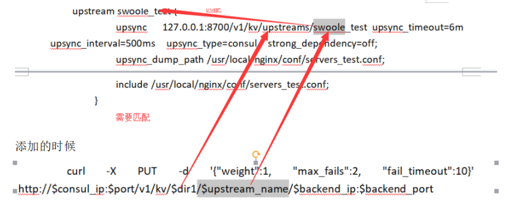

## 安装consul

 对于consul的介绍可以移步到另外的文档，暂时先了解就行，我们可以先通过docker的方式pull一个consul

```sh
  curl -X PUT -d '{"weight":1, "max_fails":2, "fail_timeout":10}' http://$consul_ip:$port/v1/kv/$dir1/$upstream_name/$backend_ip:$backend_port

  curl -X PUT -d '{"weight":1,"max_fails":2,"fail_timeout":10}' http://127.0.0.1:8700/v1/kv/upstreams/swoole_test/127.0.0.1:9501
```

查看所有已经存储的k/v

```sh
curl  http://127.0.0.1:8700/v1/kv/?recurse
```

删除

```sh
 curl  -X  DELETE  http://127.0.0.1:8700/v1/kv/upstreams/swoole_test/127.0.0.1:9501
```